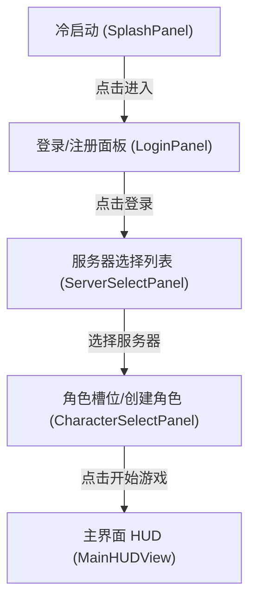

# 施工细则：Phase 12 前端UI骨架P0地基 —— 阶段2：Mock数据驱动与按钮交互实现

> [!NOTE]
> **【施工目标】**：实现 P0 地基期零接线 Mock 数据驱动加载、Tab 分页切换与按钮点击视觉反馈。
> **案卷全局共享上下文**：👉 [KALAR-DEV-2026-ST08-ATT_附件_案卷共享契约与上下文.md](KALAR-DEV-2026-ST08-ATT_附件_案卷共享契约与上下文.md)。
> **对应需求源**：[前端架构需求表1](../../../../前端架构/前端架构需求表1.md) 与 [前端架构需求表2](../../../../前端架构/前端架构需求表2.md)。
> 📍 **卷内快速直达**：[ATT 共享附件](KALAR-DEV-2026-ST08-ATT_附件_案卷共享契约与上下文.md) ｜ [阶段1](KALAR-DEV-2026-ST08-001_阶段1_UI组件与视图契约定义.md) ｜ **阶段2 (当前)** ｜ [阶段3](KALAR-DEV-2026-ST08-003_阶段3_配置驱动与Theme令牌接入.md) ｜ [阶段4](KALAR-DEV-2026-ST08-004_阶段4_表现层单元测试与白模验收矩阵.md)

---

## 📌 第一性原理溯源指针

* **精准上游规范指针**：[前端UI骨架建设路线图 零接线纪律](../../../../前端架构/前端UI骨架建设路线图.md)
* **核心不变量约束断言**：`严格不接入 EventBus，不调用后端 API；每个可交互按钮必须有 pressed 回调并产生可见状态跃迁`。
* **防漂移最高指示**：严禁在视图控制器内直接实例化领域求解器。

---

## 一、 核心交互与 Mock 数据驱动实现 (Mock-Driven Interaction)

```gdscript
# 模块路径: res://frontend/views/account_entry/account_entry_view.gd
class_name AccountEntryView extends Control

var current_tab: int = 0
var mock_server_list: Array = []

func _ready() -> void:
    _setup_mock_data()
    _connect_signals()

func _setup_mock_data() -> void:
    mock_server_list = [
        {"id": "SERVER_01", "name": "卡拉尔王城 (流畅)", "status": "ONLINE"},
        {"id": "SERVER_02", "name": "无尽荒原 (拥挤)", "status": "BUSY"}
    ]

func _connect_signals() -> void:
    # 绑定登录/注册/选服按钮点击反馈
    pass

func _on_login_button_pressed() -> void:
    # 模拟登录成功视觉状态迁移
    current_tab = 3 # 切换至选服/选角面板
```

---

## 二、 交互状态流转 (Interaction Flow)


