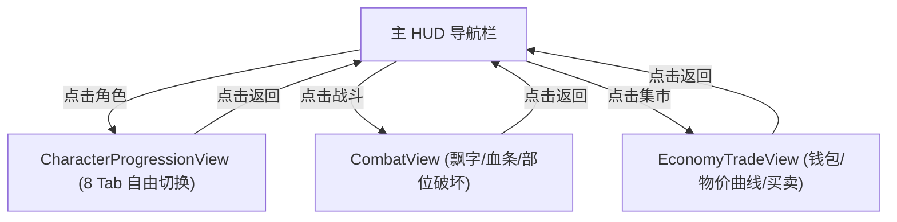

# 施工细则：Phase 13 前端UI骨架P1核心 —— 阶段2：Mock数据驱动与按钮交互实现

> [!NOTE]
> **【施工目标】**：实现角色面板 Tab 切换、战斗飘字与 BOSS 多部位血条、经济交易物价曲线 Mock 数据渲染与点击反馈。
> **案卷全局共享上下文**：👉 [KALAR-DEV-2026-ST09-ATT_附件_案卷共享契约与上下文.md](KALAR-DEV-2026-ST09-ATT_附件_案卷共享契约与上下文.md)。
> **对应需求源**：[前端架构需求表3](../../../../前端架构/前端架构需求表3.md)、[前端架构需求表4](../../../../前端架构/前端架构需求表4.md) 与 [前端架构需求表5](../../../../前端架构/前端架构需求表5.md)。
> 📍 **卷内快速直达**：[ATT 共享附件](KALAR-DEV-2026-ST09-ATT_附件_案卷共享契约与上下文.md) ｜ [阶段1](KALAR-DEV-2026-ST09-001_阶段1_UI组件与视图契约定义.md) ｜ **阶段2 (当前)** ｜ [阶段3](KALAR-DEV-2026-ST09-003_阶段3_配置驱动与Theme令牌接入.md) ｜ [阶段4](KALAR-DEV-2026-ST09-004_阶段4_表现层单元测试与白模验收矩阵.md)

---

## 📌 第一性原理溯源指针

* **精准上游规范指针**：[前端UI骨架建设路线图 P1 施工细则](../../../../前端架构/前端UI骨架建设路线图.md)
* **核心不变量约束断言**：`伤害飘字池采用对象池化循环复用；多面额货币扣减模拟保持总价值不为负`。
* **防漂移最高指示**：严禁在未检查 Mock 数组越界时直接索引数据。

---

## 一、 核心交互与 Mock 渲染实现 (Mock & Interaction)

```gdscript
# 模块路径: res://frontend/views/economy_trade/economy_trade_view.gd
class_name EconomyTradeView extends Control

var wallet_gold: int = 100
var wallet_silver: int = 50
var wallet_copper: int = 200

func _deduct_currency_mock(cost_copper: int) -> bool:
    var total_copper := calculate_total_copper_value()
    if total_copper < cost_copper:
        return false
    # 模拟金银铜降序整额扣减
    var remaining := cost_copper
    var gold_deduct := mini(remaining / 10000, wallet_gold)
    wallet_gold -= gold_deduct
    remaining -= gold_deduct * 10000
    var silver_deduct := mini(remaining / 100, wallet_silver)
    wallet_silver -= silver_deduct
    remaining -= silver_deduct * 100
    if remaining > wallet_copper:
        wallet_gold += gold_deduct
        wallet_silver += silver_deduct
        return false
    wallet_copper -= remaining
    _refresh_wallet_display()
    return true
```

---

## 二、 交互状态流转 (Interaction Flow)


