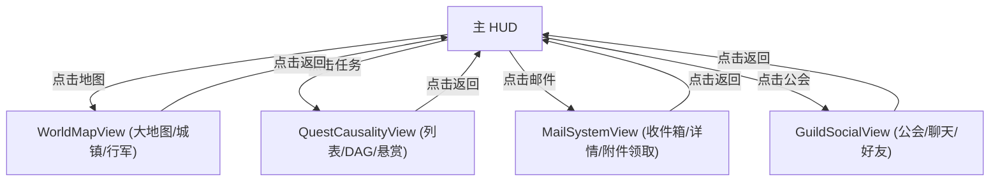

# 施工细则：Phase 14 前端UI骨架P2世界 —— 阶段2：Mock数据驱动与按钮交互实现

> [!NOTE]
> **【施工目标】**：实现大地图缩放点击、任务列表与 DAG 图展开、邮件翻阅与公会 NPC 对话 Mock 数据渲染与点击反馈。
> **案卷全局共享上下文**：👉 [KALAR-DEV-2026-ST10-ATT_附件_案卷共享契约与上下文.md](KALAR-DEV-2026-ST10-ATT_附件_案卷共享契约与上下文.md)。
> **对应需求源**：[前端架构需求表7](../../../../前端架构/前端架构需求表7.md)、[前端架构需求表8](../../../../前端架构/前端架构需求表8.md)、[前端架构需求表9](../../../../前端架构/前端架构需求表9.md) 与 [前端架构需求表10](../../../../前端架构/前端架构需求表10.md)。
> 📍 **卷内快速直达**：[ATT 共享附件](KALAR-DEV-2026-ST10-ATT_附件_案卷共享契约与上下文.md) ｜ [阶段1](KALAR-DEV-2026-ST10-001_阶段1_UI组件与视图契约定义.md) ｜ **阶段2 (当前)** ｜ [阶段3](KALAR-DEV-2026-ST10-003_阶段3_配置驱动与Theme令牌接入.md) ｜ [阶段4](KALAR-DEV-2026-ST10-004_阶段4_表现层单元测试与白模验收矩阵.md)

---

## 📌 第一性原理溯源指针

* **精准上游规范指针**：[前端UI骨架建设路线图 P2 施工细则](../../../../前端架构/前端UI骨架建设路线图.md)
* **核心不变量约束断言**：`任务列表滚动与详情展示联动；公会成员与聊天频道切换状态隔离`。
* **防漂移最高指示**：严禁在邮件界面执行未授权的网络请求。

---

## 一、 核心交互与 Mock 渲染实现 (Mock & Interaction)

```gdscript
# 模块路径: res://frontend/views/mail_system/mail_system_view.gd
class_name MailSystemView extends Control

var mock_mail_list: Array = []
var selected_mail_id: String = ""

func _setup_mock_data() -> void:
    mock_mail_list = [
        {"id": "MAIL_01", "sender": "卡拉尔市政厅", "title": "新手冒险者津贴", "is_read": false, "attachments": ["item.potion_minor_hp"]},
        {"id": "MAIL_02", "sender": "铁匠托比", "title": "定制长剑已就绪", "is_read": true, "attachments": []}
    ]

func _select_mail(mail_id: String) -> void:
    selected_mail_id = mail_id
    for mail in mock_mail_list:
        if mail.get("id") == mail_id:
            mail["is_read"] = true
            _render_mail_detail(mail)
            break
```

---

## 二、 交互状态流转 (Interaction Flow)


