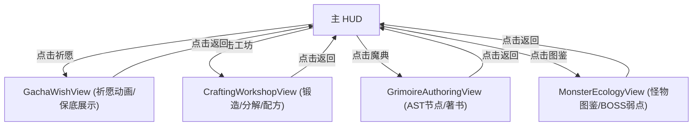

# 施工细则：Phase 15 前端UI骨架P3深度 —— 阶段2：Mock数据驱动与按钮交互实现

> [!NOTE]
> **【施工目标】**：实现抽卡保底进度、工坊锻造预览、魔典 AST 节点拖拽桩与怪物图鉴翻页 Mock 渲染与点击反馈。
> **案卷全局共享上下文**：👉 [KALAR-DEV-2026-ST11-ATT_附件_案卷共享契约与上下文.md](KALAR-DEV-2026-ST11-ATT_附件_案卷共享契约与上下文.md)。
> **对应需求源**：[前端架构需求表6](../../../../前端架构/前端架构需求表6.md)、[前端架构需求表11](../../../../前端架构/前端架构需求表11.md)、[前端架构需求表12](../../../../前端架构/前端架构需求表12.md) 与 [前端架构需求表13](../../../../前端架构/前端架构需求表13.md)。
> 📍 **卷内快速直达**：[ATT 共享附件](KALAR-DEV-2026-ST11-ATT_附件_案卷共享契约与上下文.md) ｜ [阶段1](KALAR-DEV-2026-ST11-001_阶段1_UI组件与视图契约定义.md) ｜ **阶段2 (当前)** ｜ [阶段3](KALAR-DEV-2026-ST11-003_阶段3_配置驱动与Theme令牌接入.md) ｜ [阶段4](KALAR-DEV-2026-ST11-004_阶段4_表现层单元测试与白模验收矩阵.md)

---

## 📌 第一性原理溯源指针

* **精准上游规范指针**：[前端UI骨架建设路线图 P3 施工细则](../../../../前端架构/前端UI骨架建设路线图.md)
* **核心不变量约束断言**：`AST 编辑器节点连线符合图语法约束；锻造材料消耗与成功率预览实时响应`。
* **防漂移最高指示**：严禁在骨架阶段引入真实 AST 代码编译生成。

---

## 一、 核心交互与 Mock 渲染实现 (Mock & Interaction)

```gdscript
# 模块路径: res://frontend/views/gacha_wish/gacha_wish_view.gd
class_name GachaWishView extends Control

var pity_counter: int = 10
var mock_wish_result: Array = []

func _on_single_pull_pressed() -> void:
    pity_counter += 1
    mock_wish_result = [
        {"item_name": "精炼秘银剑", "tier": 4, "is_new": true}
    ]
    _render_pull_result()

func _render_pull_result() -> void:
    # 模拟抽卡结果展示与保底计数器更新
    pass
```

---

## 二、 交互状态流转 (Interaction Flow)


