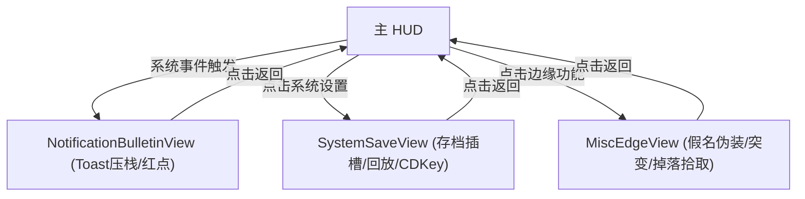

# 施工细则：Phase 16 前端UI骨架P4闭环 —— 阶段2：Mock数据驱动与按钮交互实现

> [!NOTE]
> **【施工目标】**：实现 Toast 压栈冒泡、红点树状态刷新、存档多插槽切换与身份假名伪装 Mock 渲染与点击反馈。
> **案卷全局共享上下文**：👉 [KALAR-DEV-2026-ST12-ATT_附件_案卷共享契约与上下文.md](KALAR-DEV-2026-ST12-ATT_附件_案卷共享契约与上下文.md)。
> **对应需求源**：[前端架构需求表14](../../../../前端架构/前端架构需求表14.md)、[前端架构需求表16](../../../../前端架构/前端架构需求表16.md) 与 [前端架构需求表17](../../../../前端架构/前端架构需求表17.md)。
> 📍 **卷内快速直达**：[ATT 共享附件](KALAR-DEV-2026-ST12-ATT_附件_案卷共享契约与上下文.md) ｜ [阶段1](KALAR-DEV-2026-ST12-001_阶段1_UI组件与视图契约定义.md) ｜ **阶段2 (当前)** ｜ [阶段3](KALAR-DEV-2026-ST12-003_阶段3_配置驱动与Theme令牌接入.md) ｜ [阶段4](KALAR-DEV-2026-ST12-004_阶段4_表现层单元测试与白模验收矩阵.md)

---

## 📌 第一性原理溯源指针

* **精准上游规范指针**：[前端UI骨架建设路线图 P4 施工细则](../../../../前端架构/前端UI骨架建设路线图.md)
* **核心不变量约束断言**：`Toast 队列按最大容积自动淘汰；死斗存档红标展示；假名伪装即时更新头顶预览`。
* **防漂移最高指示**：严禁在视图层擅自删除未过期的存档数据。

---

## 一、 核心交互与 Mock 渲染实现 (Mock & Interaction)

```gdscript
# 模块路径: res://frontend/views/misc_edge/misc_edge_view.gd
class_name MiscEdgeView extends Control

var current_disguise_name: String = "暗影行者"
var mock_disguise_list: Array = []

func _setup_mock_data() -> void:
    mock_disguise_list = [
        {"id": "DISGUISE_01", "name": "无名商贩", "tier": "ORDINARY"},
        {"id": "DISGUISE_02", "name": "流浪法师", "tier": "ADVANCED"}
    ]

func _apply_disguise(disguise_id: String) -> void:
    for item in mock_disguise_list:
        if item.get("id") == disguise_id:
            current_disguise_name = item.get("name", "")
            _refresh_header_preview()
            break
```

---

## 二、 交互状态流转 (Interaction Flow)


