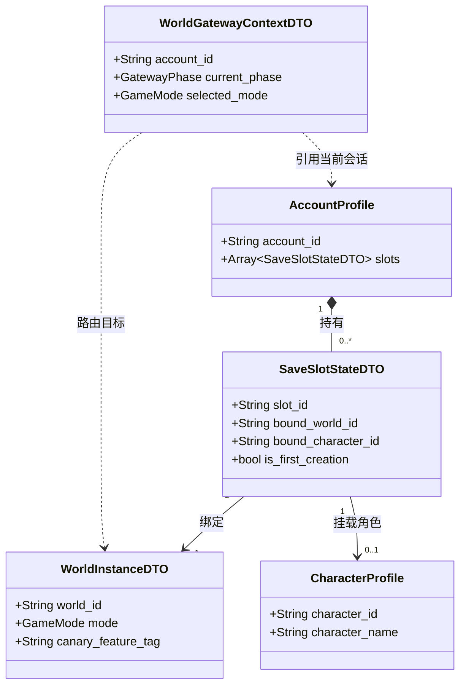

# 施工细则：Phase 47 登录后世界入口模式隔离与状态架构完善 —— 阶段1：世界栏网关与五层状态模型设计

> 📍 **卷内快速直达**：[ATT 共享附件](KALAR-DEV-2026-ST43-ATT_附件_案卷共享契约与上下文.md) ｜ **阶段1 (当前)** ｜ [阶段2](KALAR-DEV-2026-ST43-002_阶段2_单联机模式隔离与档位世界路由实现.md) ｜ [阶段3](KALAR-DEV-2026-ST43-003_阶段3_灰度开关集成与网关状态机工程化.md) ｜ [阶段4](KALAR-DEV-2026-ST43-004_阶段4_模式隔离与状态流转验收测试矩阵.md)

> 施工开始日期: 2026-09-03 下午
> 责任人: 卡拉尔世界引擎架构组
> 状态: ✅ 已施工完毕（两轮施工全生命周期闭环，全量单测与 17 项门禁 100% PASS）

---

## 📌 第一性原理溯源指针

* **精准上游规范指针**：
  * [backend/domains/account/account_profile.gd](../../../../../backend/domains/account/account_profile.gd)（既有账号实体 `AccountProfile`，包含 `account_id`、认证凭据与角色插槽清单）
  * [backend/domains/account/save_slot_dto.gd](../../../../../backend/domains/account/save_slot_dto.gd)（既有档位契约 `SaveSlotSummaryDTO` 与角色档案关联）
  * [backend/domains/feature_toggle_canary/canary_rollout_solver.gd](../../../../../backend/domains/feature_toggle_canary/canary_rollout_solver.gd)（既有灰度分流与策略判定求解器 `CanaryRolloutSolver`）
  * [backend/infrastructure/event_bus/event_bus_core.gd](../../../../../backend/infrastructure/event_bus/event_bus_core.gd)（全域事件总线 `EventBusCore`，提供 `DOMAIN_EVENT_GENERIC` 广播解耦通道）
* **核心不变量约束断言**：
  1. **世界栏网关统一入口不变量**：用户登录/注册成功后，严禁绕过网关直入任何具体世界实例，必须首先进入 `World Gateway` 网关上下文，完成模式、档位与世界前置解析；
  2. **五层状态正交解耦不变量**：严格遵守五个正交状态独立性：
     $$\text{Account (身份状态)} \neq \text{SaveSlot (档位状态)} \neq \text{World (世界状态)} \neq \text{Character (角色状态)} \neq \text{MultiplayerSession (联机状态)}$$
     严禁任何两个状态层级产生隐式共用或混淆依赖；
  3. **单机模式单档单世界边界不变量**：单机模式当前首期严格约束为 `1 个 SaveSlot + 1 个 World`，拓扑严格遵从 `Account → SaveSlot → World → Character`，同时结构设计上必须为未来多档多世界保留无损扩展能力；
  4. **灰度系统可控性不变量**：未来多档扩展、多世界切换、联机模式入口及跨世界影响架构等预留能力，必须全部接入既有 `feature_toggle_canary` 灰度控制系统，未获灰度授权或未配置启用时严格在网关层隔离阻断。
* **防漂移最高指示**：后端仅负责状态机流转、模式隔离校验与数据完备性，通过 `EventBus` 暴露当前状态与可选项；严禁在后端介入前端 UI 布局与页面渲染逻辑。

---

## 一、 数据结构设计与代码契约 (Data Structures & Code Contracts)

### 1.1 游戏运行模式与网关生命周期枚举

```gdscript
# 模块路径: res://backend/domains/world_gateway/world_gateway_model.gd
class_name WorldGatewayModel
extends RefCounted

## 游戏运行模式（严格隔离，不得混用状态）
enum GameMode {
	UNSELECTED,       ## 未选定
	SINGLE_PLAYER,   ## 单机模式（当前首期：单档+单世界）
	MULTIPLAYER      ## 联机模式（预留灰度控制，严格隔离房间/公网世界）
}

## 网关生命周期状态
enum GatewayPhase {
	AUTHENTICATED,            ## 1. 已登录，等待进入世界栏
	GATEWAY_ENTERED,          ## 2. 已处于世界栏，展示模式选项
	MODE_SELECTED,            ## 3. 模式已选定，展示档位/世界列表
	SLOT_WORLD_RESOLVED,      ## 4. 档位与世界已选定，解析角色状态
	CHARACTER_PENDING,        ## 5. 待创建角色（首次开档）或待选择角色
	WORLD_ENTRY_PERMITTED,    ## 6. 准许进入世界（触发开局或正常入界）
	IN_WORLD                  ## 7. 已在世界中运行
}
```

### 1.2 世界实例契约 (`WorldInstanceDTO`)

```gdscript
# 模块路径: res://backend/domains/world_gateway/world_instance_dto.gd
class_name WorldInstanceDTO
extends RefCounted

var world_id: String = ""              # 世界唯一标识（如 "WORLD_DEFAULT_SP_01"）
var world_name: String = ""            # 世界展示名称（读配置/本地化名称键）
var mode: WorldGatewayModel.GameMode = WorldGatewayModel.GameMode.SINGLE_PLAYER
var seed_value: int = 0                # 世界确定性种子
var world_version: String = "1.0.0"    # 世界数据版本
var is_active: bool = true             # 是否开放
var max_concurrent_players: int = 1    # 单机为 1，联机由房间配置决定
var canary_feature_tag: String = ""    # 关联灰度标签（若为空则无限制）

func to_dto() -> Dictionary:
	return {
		"world_id": world_id,
		"world_name": world_name,
		"mode": mode,
		"seed_value": seed_value,
		"world_version": world_version,
		"is_active": is_active,
		"max_concurrent_players": max_concurrent_players,
		"canary_feature_tag": canary_feature_tag
	}

static func from_dto(d: Dictionary) -> WorldInstanceDTO:
	var inst := WorldInstanceDTO.new()
	if d == null:
		return inst
	inst.world_id = str(d.get("world_id", ""))
	inst.world_name = str(d.get("world_name", ""))
	inst.mode = int(d.get("mode", WorldGatewayModel.GameMode.SINGLE_PLAYER))
	inst.seed_value = int(d.get("seed_value", 0))
	inst.world_version = str(d.get("world_version", "1.0.0"))
	inst.is_active = bool(d.get("is_active", true))
	inst.max_concurrent_players = int(d.get("max_concurrent_players", 1))
	inst.canary_feature_tag = str(d.get("canary_feature_tag", ""))
	return inst
```

### 1.3 档位状态与层级关联契约 (`SaveSlotStateDTO`)

```gdscript
# 模块路径: res://backend/domains/world_gateway/save_slot_state_dto.gd
class_name SaveSlotStateDTO
extends RefCounted

var slot_id: String = ""               # 档位 ID（单机默认 "SLOT_SP_01"）
var account_id: String = ""            # 归属账号 ID
var bound_world_id: String = ""        # 绑定世界 ID
var bound_character_id: String = ""    # 绑定角色 ID（未创建时为空）
var is_occupied: bool = false          # 档位是否已被占用（已有角色）
var is_first_creation: bool = true     # 是否首次创建角色（开档）
var created_timestamp_utc: int = 0     # 创档时间
var last_played_timestamp_utc: int = 0 # 最近游玩时间

func to_dto() -> Dictionary:
	return {
		"slot_id": slot_id,
		"account_id": account_id,
		"bound_world_id": bound_world_id,
		"bound_character_id": bound_character_id,
		"is_occupied": is_occupied,
		"is_first_creation": is_first_creation,
		"created_timestamp_utc": created_timestamp_utc,
		"last_played_timestamp_utc": last_played_timestamp_utc
	}

static func from_dto(d: Dictionary) -> SaveSlotStateDTO:
	var dto := SaveSlotStateDTO.new()
	if d == null:
		return dto
	dto.slot_id = str(d.get("slot_id", ""))
	dto.account_id = str(d.get("account_id", ""))
	dto.bound_world_id = str(d.get("bound_world_id", ""))
	dto.bound_character_id = str(d.get("bound_character_id", ""))
	dto.is_occupied = bool(d.get("is_occupied", false))
	dto.is_first_creation = bool(d.get("is_first_creation", true))
	dto.created_timestamp_utc = int(d.get("created_timestamp_utc", 0))
	dto.last_played_timestamp_utc = int(d.get("last_played_timestamp_utc", 0))
	return dto
```

### 1.4 世界栏网关会话上下文 (`WorldGatewayContextDTO`)

```gdscript
# 模块路径: res://backend/domains/world_gateway/world_gateway_context_dto.gd
class_name WorldGatewayContextDTO
extends RefCounted

var account_id: String = ""                                 # 当前身份
var current_phase: WorldGatewayModel.GatewayPhase = WorldGatewayModel.GatewayPhase.AUTHENTICATED
var selected_mode: WorldGatewayModel.GameMode = WorldGatewayModel.GameMode.UNSELECTED
var selected_slot_id: String = ""                          # 当前档位
var selected_world_id: String = ""                         # 当前世界
var active_character_id: String = ""                       # 当前就绪角色
var is_first_time_creation: bool = false                   # 是否首次开创标记

# 灰度环境生效状态快照（只读遥测）
var active_canary_features: Array[String] = []

func to_dto() -> Dictionary:
	return {
		"account_id": account_id,
		"current_phase": current_phase,
		"selected_mode": selected_mode,
		"selected_slot_id": selected_slot_id,
		"selected_world_id": selected_world_id,
		"active_character_id": active_character_id,
		"is_first_time_creation": is_first_time_creation,
		"active_canary_features": active_canary_features.duplicate()
	}
```

---

## 二、 业务模型与架构解耦图



---

## 三、 本阶段交付清单

1. **实体定义文件**：
   - `backend/domains/world_gateway/world_gateway_model.gd`（网关模式与阶段枚举）
   - `backend/domains/world_gateway/world_instance_dto.gd`（世界实例契约）
   - `backend/domains/world_gateway/save_slot_state_dto.gd`（档位状态与层级关联契约）
   - `backend/domains/world_gateway/world_gateway_context_dto.gd`（网关会话上下文）
2. **五层状态边界保证**：
   - 彻底将 `Account`、`SaveSlot`、`World`、`Character` 与 `MultiplayerSession` 划分为独立字段；
   - 严禁在全局对象中保留无隔离的共享静态状态。
