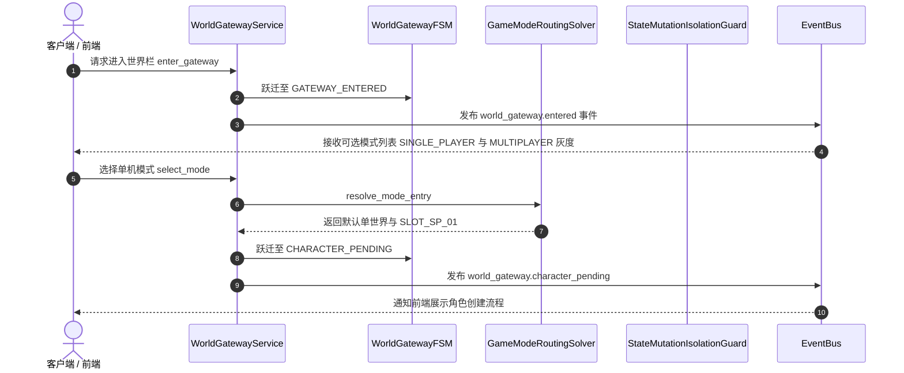

# 施工细则：Phase 47 登录后世界入口模式隔离与状态架构完善 —— 阶段2：单联机模式隔离与档位世界路由实现

> 📍 **卷内快速直达**：[ATT 共享附件](KALAR-DEV-2026-ST43-ATT_附件_案卷共享契约与上下文.md) ｜ [阶段1](KALAR-DEV-2026-ST43-001_阶段1_世界栏网关与五层状态模型设计.md) ｜ **阶段2 (当前)** ｜ [阶段3](KALAR-DEV-2026-ST43-003_阶段3_灰度开关集成与网关状态机工程化.md) ｜ [阶段4](KALAR-DEV-2026-ST43-004_阶段4_模式隔离与状态流转验收测试矩阵.md)

> 施工开始日期: 2026-09-03 下午
> 责任人: 卡拉尔世界引擎架构组
> 状态: ✅ 已施工完毕（两轮施工全生命周期闭环，全量单测与 17 项门禁 100% PASS）

---

## 📌 第一性原理溯源指针

* **精准上游规范指针**：
  * [阶段1_世界栏网关与五层状态模型设计.md](KALAR-DEV-2026-ST43-001_阶段1_世界栏网关与五层状态模型设计.md)（五层状态正交定义与 `WorldGatewayContextDTO`）
  * [backend/domains/feature_toggle_canary/canary_rollout_solver.gd](../../../../../backend/domains/feature_toggle_canary/canary_rollout_solver.gd)（`CanaryRolloutSolver` 灰度判定引擎）
  * [backend/infrastructure/game_config.gd](../../../../../backend/infrastructure/game_config.gd)（配置驱动真源）
* **核心不变量约束断言**：
  1. **单机与联机状态写隔离不变量**：单机模式下的任何世界修改、存档保存，严禁写入联机世界池；反之亦然。跨模式状态写入由 `StateMutationIsolationGuard` 权威拦截；
  2. **单机单档单世界不变量**：单机首期仅解析并开放 1 个 Save Slot 与 1 个 World，未获灰度授权（`FEATURE_MULTI_SLOT`）时严禁创建或切换第二档；
  3. **空角色开档流转不变量**：当解析档位发现 `bound_character_id` 为空且 `is_first_creation == true` 时，网关必须向前端指示 `CHARACTER_CREATION_REQUIRED`，阻断直接入界操作；
  4. **失败关闭与错误码统一原则**：遇到模式非法、档位损坏或越权写入时，立刻返回结构化错误 DTO 并安全回滚至网关安全初始态。

---

## 一、 核心求解器与隔离守卫算法实现

### 2.1 游戏模式路由求解器 (`GameModeRoutingSolver`)

```gdscript
# 模块路径: res://backend/domains/world_gateway/game_mode_routing_solver.gd
class_name GameModeRoutingSolver
extends RefCounted

class RoutingResultDTO extends RefCounted:
	var success: bool = false
	var error_code: String = ""
	var message: String = ""
	var resolved_world: WorldInstanceDTO = null
	var available_slots: Array[SaveSlotStateDTO] = []
	var requires_character_creation: bool = false

## 解析指定模式下的世界与档位
static func resolve_mode_entry(
	account_id: String,
	mode: WorldGatewayModel.GameMode,
	all_worlds: Dictionary,
	account_slots: Array[SaveSlotStateDTO],
	canary_flags: Dictionary
) -> RoutingResultDTO:
	var res := RoutingResultDTO.new()

	if mode == WorldGatewayModel.GameMode.UNSELECTED:
		res.success = false
		res.error_code = "GATEWAY_ERR_NO_MODE_SELECTED"
		res.message = "未选择任何游戏模式"
		return res

	# 联机模式入口灰度守卫
	if mode == WorldGatewayModel.GameMode.MULTIPLAYER:
		var mp_flag = canary_flags.get("FEATURE_MULTIPLAYER_GATEWAY", null)
		var is_enabled: bool = CanaryRolloutSolver.is_feature_enabled_for_account(mp_flag, account_id)
		if not is_enabled:
			res.success = false
			res.error_code = "GATEWAY_ERR_MULTIPLAYER_DISABLED"
			res.message = "联机模式当前处于灰度维护状态，未对当前账号开放"
			return res

	# 单机模式路由解析（单档 + 单世界首期）
	if mode == WorldGatewayModel.GameMode.SINGLE_PLAYER:
		var default_world_id: String = GameConfig.get_string("domains.world_gateway", "single_player/default_world_id", "WORLD_DEFAULT_SP_01")
		var world_dto: WorldInstanceDTO = all_worlds.get(default_world_id, null)
		if world_dto == null:
			res.success = false
			res.error_code = "GATEWAY_ERR_DEFAULT_WORLD_NOT_FOUND"
			res.message = "单机默认世界数据缺失: %s" % default_world_id
			return res

		res.resolved_world = world_dto

		# 多档位灰度检测：未开启时仅取首个有效档位或新建单档
		var multislot_flag = canary_flags.get("FEATURE_MULTI_SLOT", null)
		var can_multislot: bool = CanaryRolloutSolver.is_feature_enabled_for_account(multislot_flag, account_id)

		var effective_slots: Array[SaveSlotStateDTO] = []
		if account_slots.is_empty():
			# 首次开档：自动初始化单机主档
			var default_slot := SaveSlotStateDTO.new()
			default_slot.slot_id = "SLOT_SP_01"
			default_slot.account_id = account_id
			default_slot.bound_world_id = default_world_id
			default_slot.bound_character_id = ""
			default_slot.is_occupied = false
			default_slot.is_first_creation = true
			default_slot.created_timestamp_utc = int(Time.get_unix_time_from_system())
			effective_slots.append(default_slot)
			res.requires_character_creation = true
		else:
			if can_multislot:
				effective_slots.append_array(account_slots)
			else:
				# 仅开放首档
				effective_slots.append(account_slots[0])

			var primary_slot: SaveSlotStateDTO = effective_slots[0]
			res.requires_character_creation = (primary_slot.bound_character_id.is_empty() or primary_slot.is_first_creation)

		res.available_slots = effective_slots
		res.success = true
		return res

	res.success = false
	res.error_code = "GATEWAY_ERR_UNKNOWN_MODE"
	res.message = "未知的游戏模式枚举"
	return res
```

### 2.2 状态写入隔离守卫 (`StateMutationIsolationGuard`)

```gdscript
# 模块路径: res://backend/domains/world_gateway/state_mutation_isolation_guard.gd
class_name StateMutationIsolationGuard
extends RefCounted

## 校验状态写入操作是否符合当前会话模式与世界归属
static func validate_mutation_permission(
	context: WorldGatewayContextDTO,
	target_mode: WorldGatewayModel.GameMode,
	target_world_id: String,
	target_slot_id: String
) -> Dictionary:
	if context == null:
		return { "allowed": false, "error_code": "GUARD_ERR_NULL_CONTEXT" }

	# 1. 运行模式匹配性检查（严禁单机向联机写，反之亦然）
	if context.selected_mode != target_mode:
		return {
			"allowed": false,
			"error_code": "GUARD_ERR_CROSS_MODE_MUTATION",
			"message": "跨模式状态写入被拦截: 会话模式 %d, 目标模式 %d" % [context.selected_mode, target_mode]
		}

	# 2. 世界 ID 绑定校验
	if context.selected_world_id != target_world_id:
		return {
			"allowed": false,
			"error_code": "GUARD_ERR_WORLD_MISMATCH",
			"message": "写入世界目标与当前会话世界不一致"
		}

	# 3. 档位 ID 绑定校验
	if context.selected_slot_id != target_slot_id:
		return {
			"allowed": false,
			"error_code": "GUARD_ERR_SLOT_MISMATCH",
			"message": "写入档位目标与当前会话档位不一致"
		}

	return { "allowed": true, "error_code": "" }
```

---

## 二、 交互流序时图 (Single Player Entry Flow)



---

## 三、 本阶段交付清单

1. **业务实现脚本**：
   - `backend/domains/world_gateway/game_mode_routing_solver.gd`（模式路由与档位初始化求解器）
   - `backend/domains/world_gateway/state_mutation_isolation_guard.gd`（状态写入物理隔离守卫）
2. **逻辑闭环保证**：
   - 单机与联机状态路径彻底隔离；
   - 首次开档正确识别 `is_first_creation == true` 并引流至角色创建。
