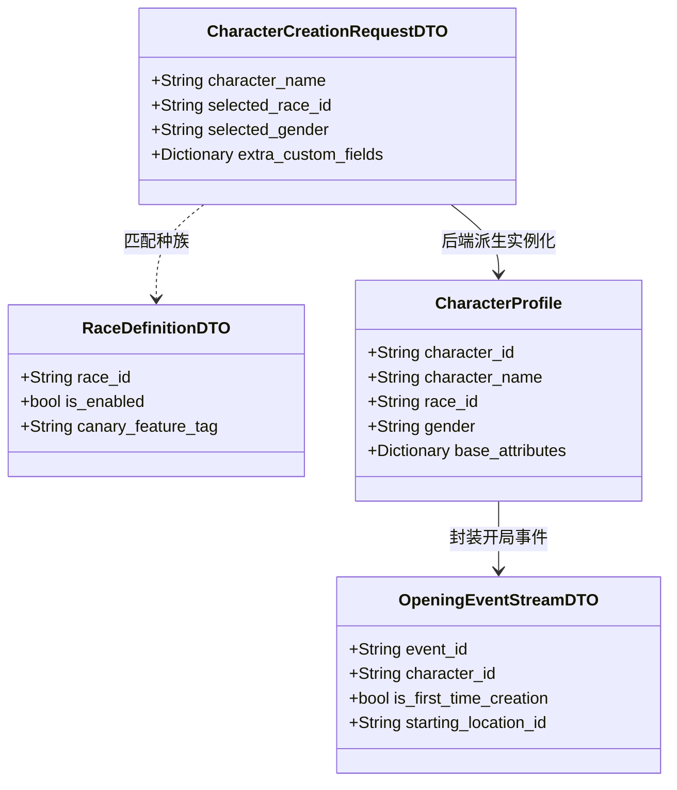

# 施工细则：Phase 48 配置驱动角色创建系统升级与开局事件流接入 —— 阶段1：配置驱动角色定义与开局事件契约设计

> 📍 **卷内快速直达**：[ATT 共享附件](KALAR-DEV-2026-ST44-ATT_附件_案卷共享契约与上下文.md) ｜ **阶段1 (当前)** ｜ [阶段2](KALAR-DEV-2026-ST44-002_阶段2_角色创建状态机与后端属性生成算法实现.md) ｜ [阶段3](KALAR-DEV-2026-ST44-003_阶段3_灰度扩展校验与事件总线发布工程化.md) ｜ [阶段4](KALAR-DEV-2026-ST44-004_阶段4_角色创建生命周期与防伪验收测试矩阵.md)

> 施工开始日期: 2026-09-03 下午
> 责任人: 卡拉尔世界引擎架构组
> 状态: ✅ 已施工完毕（两轮施工全生命周期闭环，全量单测与 17 项门禁 100% PASS）

---

## 📌 第一性原理溯源指针

* **精准上游规范指针**：
  * [Phase 47 阶段1：世界栏网关与五层状态模型设计](../Phase_47_登录后世界入口模式隔离与状态架构完善/KALAR-DEV-2026-ST43-001_阶段1_世界栏网关与五层状态模型设计.md)（前序网关上下文与 `SaveSlotStateDTO`）
  * [config/domains/character_creation.json](../../../../../config/domains/character_creation.json)（既有创角配置表）
  * [backend/domains/account/character_profile.gd](../../../../../backend/domains/account/character_profile.gd)（既有角色档案实体）
  * [backend/infrastructure/event_bus/event_bus_core.gd](../../../../../backend/infrastructure/event_bus/event_bus_core.gd)（全域事件总线 `EventBusCore`）
* **核心不变量约束断言**：
  1. **展示名与角色名全局唯一源头不变量**：游戏内角色名即为玩家昵称与展示名源头（`character_name == display_name`），严禁形成两个独立导致不一致的名称体系；
  2. **种族结构可扩展性不变量**：首期仅开放人族（`HUMAN`），但必须设计并预留 `RaceDefinition`、`RaceID` 与 `RaceConfiguration` 实体结构，禁止在核心逻辑中把“人类”写死为硬编码分支；
  3. **属性生成后端绝对权威不变量**：角色创建阶段不向前端展示或编辑角色战斗基础属性；基础属性一律由后端在创建提交后根据种族、职业与规则确定性派生，客户端任何尝试提交计算后属性的行为均视为非法伪造并予以拦截；
  4. **开局事件流接驳不变量**：首次角色创建成功后，必须自动向 `EventBus` 发布结构化开局事件 `OpeningEventStreamDTO`（包含账号、档位、世界、角色、首次标记与开局上下文），不允许由前端自行决定是否开始剧情。

---

## 一、 数据结构设计与契约定义 (Data Structures & Code Contracts)

### 1.1 种族定义与元数据契约 (`RaceDefinitionDTO`)

```gdscript
# 模块路径: res://backend/domains/character_creation/race_definition_dto.gd
class_name RaceDefinitionDTO
extends RefCounted

var race_id: String = "HUMAN"                 # 种族唯一标识（如 "HUMAN", "ELF", "DWARF"）
var canonical_name_key: String = ""           # 种族本地化名称键
var is_enabled: bool = true                   # 是否当前启用的可用种族
var canary_feature_tag: String = ""           # 关联灰度标签（扩展种族可配置灰度开启）
var base_stat_modifiers: Dictionary = {}      # 基础属性修正系数表
var innate_traits: Array[String] = []         # 默认先天特质
var allowed_genders: Array[String] = ["MALE", "FEMALE"] # 可选性别枚举

func to_dto() -> Dictionary:
	return {
		"race_id": race_id,
		"canonical_name_key": canonical_name_key,
		"is_enabled": is_enabled,
		"canary_feature_tag": canary_feature_tag,
		"base_stat_modifiers": base_stat_modifiers.duplicate(true),
		"innate_traits": innate_traits.duplicate(),
		"allowed_genders": allowed_genders.duplicate()
	}

static func from_dto(d: Dictionary) -> RaceDefinitionDTO:
	var dto := RaceDefinitionDTO.new()
	if d == null:
		return dto
	dto.race_id = str(d.get("race_id", "HUMAN"))
	dto.canonical_name_key = str(d.get("canonical_name_key", "race.human.name"))
	dto.is_enabled = bool(d.get("is_enabled", true))
	dto.canary_feature_tag = str(d.get("canary_feature_tag", ""))
	dto.base_stat_modifiers = (d.get("base_stat_modifiers", {}) as Dictionary).duplicate(true)
	dto.innate_traits = (d.get("innate_traits", []) as Array).duplicate()
	dto.allowed_genders = (d.get("allowed_genders", ["MALE", "FEMALE"]) as Array).duplicate()
	return dto
```

### 1.2 角色创建请求参数契约 (`CharacterCreationRequestDTO`)

```gdscript
# 模块路径: res://backend/domains/character_creation/character_creation_request_dto.gd
class_name CharacterCreationRequestDTO
extends RefCounted

var account_id: String = ""                   # 账号 ID
var slot_id: String = ""                      # 目标档位 ID
var world_id: String = ""                     # 目标世界 ID
var character_name: String = ""               # 玩家输入角色名（兼作游戏内展示名）
var selected_race_id: String = "HUMAN"        # 选择种族（首期校验仅限 HUMAN）
var selected_gender: String = "MALE"          # 选择性别（MALE / FEMALE / 其他配置扩展）
var extra_custom_fields: Dictionary = {}      # 未来可扩展字段（发型、身世背景等配置化键值对）

# 严禁包含战斗属性字段！若前端传入 stats/attributes 则由后端安全守卫自动丢弃并告警
```

### 1.3 开局事件流数据契约 (`OpeningEventStreamDTO`)

```gdscript
# 模块路径: res://backend/domains/character_creation/opening_event_stream_dto.gd
class_name OpeningEventStreamDTO
extends RefCounted

var event_id: String = ""                     # 事件全局唯一 ID
var account_id: String = ""                   # 归属用户
var slot_id: String = ""                      # 档位标识
var world_id: String = ""                     # 世界标识
var character_id: String = ""                 # 角色唯一标识
var character_name: String = ""               # 角色姓名
var is_first_time_creation: bool = true       # 是否首次开档创建
var starting_location_id: String = ""         # 起始地点 ID
var opening_quest_line_id: String = ""        # 起始主线剧本引导 ID
var timestamp_utc: int = 0                    # 触发时间戳
var narrative_context: Dictionary = {}        # 开局文案上下文参数

func to_dto() -> Dictionary:
	return {
		"event_id": event_id,
		"account_id": account_id,
		"slot_id": slot_id,
		"world_id": world_id,
		"character_id": character_id,
		"character_name": character_name,
		"is_first_time_creation": is_first_time_creation,
		"starting_location_id": starting_location_id,
		"opening_quest_line_id": opening_quest_line_id,
		"timestamp_utc": timestamp_utc,
		"narrative_context": narrative_context.duplicate(true)
	}
```

---

## 二、 创角至开局架构图



---

## 三、 本阶段交付清单

1. **实体定义文件**：
   - `backend/domains/character_creation/race_definition_dto.gd`（种族定义元数据）
   - `backend/domains/character_creation/character_creation_request_dto.gd`（创角请求契约）
   - `backend/domains/character_creation/opening_event_stream_dto.gd`（开局事件流契约）
2. **契约不变量保证**：
   - 彻底封死前端提交伪造属性的入口；
   - 确立 `character_name` 为唯一的角色昵称源头。
