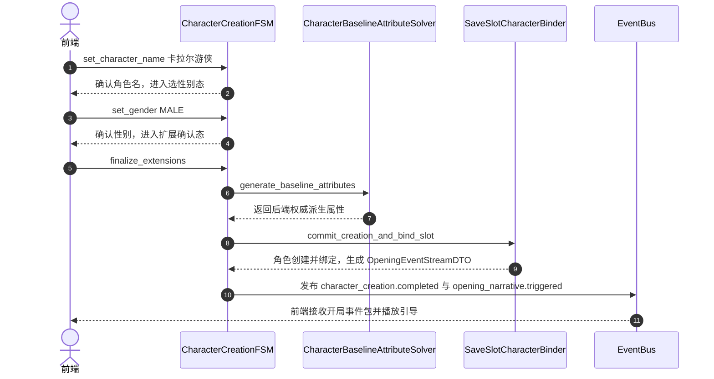

# 施工细则：Phase 48 配置驱动角色创建系统升级与开局事件流接入 —— 阶段2：角色创建状态机与后端属性生成算法实现

> 📍 **卷内快速直达**：[ATT 共享附件](KALAR-DEV-2026-ST44-ATT_附件_案卷共享契约与上下文.md) ｜ [阶段1](KALAR-DEV-2026-ST44-001_阶段1_配置驱动角色定义与开局事件契约设计.md) ｜ **阶段2 (当前)** ｜ [阶段3](KALAR-DEV-2026-ST44-003_阶段3_灰度扩展校验与事件总线发布工程化.md) ｜ [阶段4](KALAR-DEV-2026-ST44-004_阶段4_角色创建生命周期与防伪验收测试矩阵.md)

> 施工开始日期: 2026-09-03 下午
> 责任人: 卡拉尔世界引擎架构组
> 状态: ✅ 已施工完毕（两轮施工全生命周期闭环，全量单测与 17 项门禁 100% PASS）

---

## 📌 第一性原理溯源指针

* **精准上游规范指针**：
  * [阶段1_配置驱动角色定义与开局事件契约设计.md](KALAR-DEV-2026-ST44-001_阶段1_配置驱动角色定义与开局事件契约设计.md)（创角与开局数据契约）
  * [backend/domains/character_creation/attribute_init_solver.gd](../../../../../backend/domains/character_creation/attribute_init_solver.gd)（既有基础属性购点与掷骰映射逻辑）
  * [backend/domains/account/character_profile.gd](../../../../../backend/domains/account/character_profile.gd)（角色数据实体）
* **核心不变量约束断言**：
  1. **创角顺序不可逆不变量**：创角必须严格遵循 `角色名录入 → 性别选定 → 扩展参数确认 → 后端属性生成` 顺序，前序未完成时禁止跃迁至后续状态；
  2. **角色名合法性校验不变量**：角色名长度必须满足 $[2, 16]$ 个字符，禁止包含非法控制字符、全空格或纯符号；重名检测经由账号角色库权威判定；
  3. **后端派生属性封闭性不变量**：基础战斗属性（如 STR, CON, INT, AGI, SPR, VIT）在创建阶段完全由 `CharacterBaselineAttributeSolver` 按照种族基础系数封闭派生，严禁信任前端传入的任何初始属性值；
  4. **首创原子性不变量**：首次创建角色、档位绑定与开局事件生成必须作为一个原子操作完成，出现任何持久化失败必须全链路回滚。

---

## 一、 角色创生状态机与后端属性派生引擎

### 2.1 创角流程状态机 (`CharacterCreationFSM`)

```gdscript
# 模块路径: res://backend/domains/character_creation/character_creation_fsm.gd
class_name CharacterCreationFSM
extends RefCounted

enum CreationStep {
	IDLE,                    # 未开始
	NAME_INPUT_PENDING,      # 1. 待录入角色名
	GENDER_SELECT_PENDING,   # 2. 待选择性别
	EXTENSIONS_PENDING,      # 3. 待确认其他启用参数
	SUBMITTED_VALIDATING,    # 4. 提交校验中
	PERSISTED_COMPLETED,     # 5. 持久化完成
	OPENING_EVENT_TRIGGERED  # 6. 开局事件已激活
}

var current_step: CreationStep = CreationStep.IDLE
var draft_request: CharacterCreationRequestDTO = null

func start_creation(account_id: String, slot_id: String, world_id: String) -> Dictionary:
	draft_request = CharacterCreationRequestDTO.new()
	draft_request.account_id = account_id
	draft_request.slot_id = slot_id
	draft_request.world_id = world_id
	current_step = CreationStep.NAME_INPUT_PENDING
	return { "success": true, "step": current_step }

## 1. 设定角色名
func set_character_name(c_name: String) -> Dictionary:
	if current_step != CreationStep.NAME_INPUT_PENDING:
		return { "success": false, "error_code": "STEP_MISMATCH", "message": "当前不可设置角色名" }

	var trimmed := c_name.strip_edges()
	var min_len: int = GameConfig.get_int("domains.character_creation", "rules/min_name_length", 2)
	var max_len: int = GameConfig.get_int("domains.character_creation", "rules/max_name_length", 16)

	if trimmed.length() < min_len or trimmed.length() > max_len:
		return {
			"success": false,
			"error_code": "INVALID_NAME_LENGTH",
			"message": "角色名长度须在 %d 至 %d 字符之间" % [min_len, max_len]
		}

	draft_request.character_name = trimmed
	current_step = CreationStep.GENDER_SELECT_PENDING
	return { "success": true, "step": current_step, "name": trimmed }

## 2. 设定性别
func set_gender(gender_str: String, race_def: RaceDefinitionDTO) -> Dictionary:
	if current_step != CreationStep.GENDER_SELECT_PENDING:
		return { "success": false, "error_code": "STEP_MISMATCH", "message": "当前不可选择性别" }

	var g_upper := gender_str.to_upper()
	if not race_def.allowed_genders.has(g_upper):
		return { "success": false, "error_code": "GENDER_NOT_ALLOWED", "message": "该种族不支持所选性别" }

	draft_request.selected_gender = g_upper
	current_step = CreationStep.EXTENSIONS_PENDING
	return { "success": true, "step": current_step, "gender": g_upper }

## 3. 提交扩展参数并锁定
func finalize_extensions(extra_fields: Dictionary) -> Dictionary:
	if current_step != CreationStep.EXTENSIONS_PENDING:
		return { "success": false, "error_code": "STEP_MISMATCH", "message": "当前不可提交扩展参数" }

	draft_request.extra_custom_fields = extra_fields.duplicate(true)
	current_step = CreationStep.SUBMITTED_VALIDATING
	return { "success": true, "step": current_step }
```

### 2.2 后端权威属性派生求解器 (`CharacterBaselineAttributeSolver`)

```gdscript
# 模块路径: res://backend/domains/character_creation/character_baseline_attribute_solver.gd
class_name CharacterBaselineAttributeSolver
extends RefCounted

## 由后端根据种族定义与初始规则确定性生成基础属性
static func generate_baseline_attributes(race_def: RaceDefinitionDTO) -> Dictionary:
	var base_levels := {
		"STR": 3,
		"CON": 3,
		"INT": 3,
		"AGI": 3,
		"SPR": 3,
		"VIT": 3
	}

	# 叠加种族修正（如人类全维平衡，未来兽族偏力体、精灵偏敏智等）
	if race_def and not race_def.base_stat_modifiers.is_empty():
		for stat_k in race_def.base_stat_modifiers.keys():
			var mod_val = int(race_def.base_stat_modifiers[stat_k])
			base_levels[stat_k] = clampi(int(base_levels.get(stat_k, 3)) + mod_val, 1, 6)

	return {
		"attribute_levels": base_levels,
		"derived_max_hp": int(base_levels.get("CON", 3)) * 30 + 100,
		"derived_max_mp": int(base_levels.get("INT", 3)) * 25 + 50,
		"derived_stamina": int(base_levels.get("VIT", 3)) * 20 + 80
	}
```

### 2.3 档位绑定与开局事件触发器 (`SaveSlotCharacterBinder`)

```gdscript
# 模块路径: res://backend/domains/character_creation/save_slot_character_binder.gd
class_name SaveSlotCharacterBinder
extends RefCounted

class CreationResultDTO extends RefCounted:
	var success: bool = false
	var error_code: String = ""
	var message: String = ""
	var created_character_profile: CharacterProfile = null
	var opening_event: OpeningEventStreamDTO = null

static func commit_creation_and_bind_slot(
	request: CharacterCreationRequestDTO,
	slot: SaveSlotStateDTO,
	race_def: RaceDefinitionDTO
) -> CreationResultDTO:
	var res := CreationResultDTO.new()

	if slot.is_occupied and not slot.bound_character_id.is_empty():
		res.success = false
		res.error_code = "SLOT_ALREADY_OCCUPIED"
		res.message = "目标档位已存在角色，禁止覆盖创建"
		return res

	# 1. 派生唯一角色 ID
	var new_char_id := "CHAR_" + str(Time.get_unix_time_from_system()) + "_" + str(randi() % 1000)

	# 2. 后端权威生成属性
	var baseline_stats := CharacterBaselineAttributeSolver.generate_baseline_attributes(race_def)

	# 3. 构造角色实体
	var profile := CharacterProfile.new()
	profile.character_id = new_char_id
	profile.character_name = request.character_name # 唯一名字来源
	profile.account_id = request.account_id
	profile.race_id = request.selected_race_id
	profile.gender = request.selected_gender
	profile.attribute_levels = baseline_stats["attribute_levels"]

	# 4. 绑定档位
	slot.bound_character_id = new_char_id
	slot.is_occupied = true
	var was_first_creation := slot.is_first_creation
	slot.is_first_creation = false
	slot.last_played_timestamp_utc = int(Time.get_unix_time_from_system())

	# 5. 生成开局事件包
	var opening := OpeningEventStreamDTO.new()
	opening.event_id = "EVT_OPENING_" + new_char_id
	opening.account_id = request.account_id
	opening.slot_id = slot.slot_id
	opening.world_id = slot.bound_world_id
	opening.character_id = new_char_id
	opening.character_name = request.character_name
	opening.is_first_time_creation = was_first_creation
	opening.starting_location_id = GameConfig.get_string("domains.character_creation", "defaults/starting_location", "CENTRAL_CITY_PLAZA")
	opening.opening_quest_line_id = GameConfig.get_string("domains.character_creation", "defaults/initial_quest_line", "QUEST_PROLOGUE_01")
	opening.timestamp_utc = int(Time.get_unix_time_from_system())
	opening.narrative_context = {
		"welcome_message": "欢迎来到卡拉尔世界，冒险者 %s！" % request.character_name
	}

	res.success = true
	res.created_character_profile = profile
	res.opening_event = opening
	return res
```

---

## 二、 创角至开局时序流



---

## 三、 本阶段交付清单

1. **核心算法与状态机**：
   - `backend/domains/character_creation/character_creation_fsm.gd`
   - `backend/domains/character_creation/character_baseline_attribute_solver.gd`
   - `backend/domains/character_creation/save_slot_character_binder.gd`
2. **安全防伪闭环**：
   - 彻底阻断前端属性注入通道；
   - 保证档位与角色的原子绑定。
