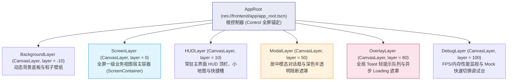

# 施工细则：前端基础架构重构与根骨架施工细则 —— 阶段2：分层视口根骨架与导航管理器实现

> [!NOTE]
> **【施工目标】**：实现前端分层视口根节点 AppRoot（6 层 CanvasLayer），构建支持全屏 Screen 栈、模态 Modal 队列与 Toast 调度的导航管理器 NavManager，重塑 ViewRouter 为透明兼容代理层，彻底修复 project.godot 破损入口。
> **案卷全局共享上下文**：👉 [KALAR-DEV-2026-ST73-ATT_附件_案卷共享契约与上下文.md](KALAR-DEV-2026-ST73-ATT_附件_案卷共享契约与上下文.md)。
> **【施工开始日期】：施工开始日期: 2026-09-09（晚上 21:56）** —— 真实读取系统时间。
> 状态：✅ 已完成（Round 2 实施与全量验证闭环）
> **【用户指令溯源】**：用户明确要求「WebGames 前端基础架构重构与施工细则设计...本阶段只建设前端“根本骨架 + UI 可视化显示层 + 状态承载结构 + 接口占位边界”，暂时不进行真正的后端接线、网络联调或业务数据闭环」（2026-09-09）。
> **对应需求源**：[路线图总索引](../../../../路线图/路线图总索引.md)。
> 📍 **卷内快速直达**：[ATT 共享附件](KALAR-DEV-2026-ST73-ATT_附件_案卷共享契约与上下文.md) ｜ [阶段1](KALAR-DEV-2026-ST73-001_阶段1_现状扫描审计与服务接口契约设计.md) ｜ **阶段2 (当前)** ｜ [阶段3](KALAR-DEV-2026-ST73-003_阶段3_UI可视化状态容器与全域Mock闭环工程化.md) ｜ [阶段4](KALAR-DEV-2026-ST73-004_阶段4_无后端架构验收测试矩阵与工程闭环.md)

---

## 📌 第一性原理溯源指针

* **精准上游规范指针**：Phase 77 阶段1《现状扫描审计与服务接口契约设计》分层视口拓扑规划；`WebGames/project.godot` 引擎主场景启动项；Godot 4.7 引擎规范 CanvasLayer 渲染层级与 Control 锚定体系。
* **核心不变量约束断言**：`Inv-FE2-1 (视口绝对分层)`：Modal 弹窗与 Toast 提示严禁挂载于 ScreenContainer，必须分别落入 `ModalLayer` (Layer 50) 与 `OverlayLayer` (Layer 80)；`Inv-FE2-2 (向后兼容零断裂)`：存量 17 个视图直接调用 `ViewRouter.push_view` 或 `pop_view` 保持预期导航行为，零调用点断裂。
* **业务实现最高指示**：视口层次以 Z-Index / CanvasLayer 物理隔离，禁止单容器平铺抢占；导航状态机具备防御性卫语句，禁止未注册视图跳转崩溃；示例代码严禁散落 `push_warning`，统一使用 `printerr`。

---

## 一、 根场景与分层视口实现 (Layered Viewport Architecture)

### 1.1 AppRoot 6 层 CanvasLayer 拓扑架构
为解决旧前端单容器挤压、弹窗与遮罩层级抢占的结构性缺陷，实现标准 6 层 `CanvasLayer` 拓扑：



### 1.2 根控制器与引导装配器 (AppRoot & AppBootstrap)
* 模块路径: `res://frontend/app/app_root.gd`、`res://frontend/app/app_bootstrap.gd`
* 职责: 监听引擎生命周期，按序装配依赖容器（MockServiceContainer）、UI 组件与导航器。

```gdscript
# ==============================================================================
# 卡拉尔世界引擎 (Kalar World Engine) - 前端核心: 应用根控制器
# 文件路径: res://frontend/app/app_root.gd
# 职责: 管理 6 层 CanvasLayer 视口，为 NavManager 提供层级挂载锚点
# ==============================================================================
class_name AppRoot
extends Control

@onready var background_layer: CanvasLayer = $BackgroundLayer
@onready var screen_layer: CanvasLayer = $ScreenLayer
@onready var hud_layer: CanvasLayer = $HUDLayer
@onready var modal_layer: CanvasLayer = $ModalLayer
@onready var overlay_layer: CanvasLayer = $OverlayLayer
@onready var debug_layer: CanvasLayer = $DebugLayer

@onready var screen_container: Control = $ScreenLayer/ScreenContainer
@onready var modal_container: Control = $ModalLayer/ModalContainer
@onready var toast_container: Control = $OverlayLayer/ToastContainer
@onready var loading_overlay: Control = $OverlayLayer/LoadingOverlay

func _ready() -> void:
	AppBootstrap.bootstrap(self)
```

### 1.3 分层导航管理器 (NavManager)
* 模块路径: `res://frontend/navigation/nav_manager.gd`
* 职责: 管理 Screen 历史栈、Modal 弹出队列与 Toast/Loading 派发，具备生命周期拦截与防重复入栈。

```gdscript
# ==============================================================================
# 卡拉尔世界引擎 (Kalar World Engine) - 导航核心: 分层导航管理器
# 文件路径: res://frontend/navigation/nav_manager.gd
# 职责: 管理 Screen 历史栈、Modal 对话框队列与全局轻提示，驱动页面生命周期
# ==============================================================================
class_name NavManager
extends RefCounted

static var _instance: NavManager = null

var _app_root: AppRoot = null
var _screen_stack: Array[String] = []
var _current_screen: Control = null
var _screen_registry: Dictionary = {}

static func get_instance() -> NavManager:
	if _instance == null:
		_instance = NavManager.new()
	return _instance

## 弹出并返回上一 Screen
func pop_screen() -> Control:
	if _screen_stack.size() <= 1:
		printerr("[NavManager] 已经是栈底，无法继续返回")
		return null
	_screen_stack.pop_back()
	var prev_id: String = _screen_stack.pop_back()
	return _navigate_to(prev_id, {}, true)

## 核心跳转与生命周期驱动
func _navigate_to(screen_id: String, params: Dictionary, record_history: bool) -> Control:
	if not _screen_registry.has(screen_id):
		printerr("[NavManager] 未注册的 Screen: %s" % screen_id)
		return null

	if _current_screen != null:
		if _current_screen.has_method("on_screen_exit"):
			_current_screen.call("on_screen_exit")
		_current_screen.queue_free()
		_current_screen = null

	var scene_path: String = _screen_registry[screen_id]
	var scene = load(scene_path)
	if scene == null:
		printerr("[NavManager] 场景加载失败: %s" % scene_path)
		return null

	var inst = scene.instantiate() as Control
	if inst == null:
		printerr("[NavManager] 场景根节点不是 Control: %s" % scene_path)
		return null

	_current_screen = inst
	if record_history:
		_screen_stack.append(screen_id)

	if _app_root != null and _app_root.screen_container != null:
		_app_root.screen_container.add_child(inst)
		inst.set_anchors_and_offsets_preset(Control.PRESET_FULL_RECT)

	if inst.has_method("on_screen_enter"):
		inst.call("on_screen_enter", params)

	return inst
```

### 1.4 向后兼容透明代理 (ViewRouter Compatibility Adapter)
* 模块路径: `res://frontend/navigation/view_router.gd`
* 策略: 完全保持原有 17 视图调用点 `ViewRouter.get_instance().push_view(...)` 的方法签名与静态接口不变，内部全量委托给 `NavManager`，实现 100% 平滑无感升级。

---

## 二、 命令式施工执行清单 (Agent Execution Checklist)

- [x] **Step 2.1: AppRoot 6 层 CanvasLayer 场景与控制器编写** - 搭建 Background, Screen, HUD, Modal, Overlay, Debug 分层
- [x] **Step 2.2: 分层导航管理器 NavManager 核心实现** - 建立 Screen 历史栈、Modal 弹出队列与生命周期驱动钩子
- [x] **Step 2.3: ViewRouter 透明代理重塑与 project.godot 修复** - 映射 push_view/pop_view 至 NavManager 并修正主启动入口
- [x] **Step 2.4: 消除 push_warning 散落并受控处理异常** - 将未注册跳转与空栈回退收敛为受控诊断输出

---

## 三、 业务功能初步验证矩阵 (DoD Matrix)

| 检验项 ID | 校验目标 | 验证输入 | 预期输出断言 |
| :--- | :--- | :--- | :--- |
| `TC-P77-S2-01` | AppRoot 视口层级完整性 | 实例化 `AppRoot` 场景 | 6 大 CanvasLayer 存在且 Layer 深度严格单调递增 |
| `TC-P77-S2-02` | NavManager 页面入栈与生命周期 | 调用 `push_screen("account_entry")` | 节点挂载至 ScreenContainer 且生命周期钩子正确触发 |
| `TC-P77-S2-03` | ViewRouter 兼容代理穿透 | 调用 `ViewRouter.get_instance().push_view()` | NavManager 透明接收并完成跳转，存量调用 0 回归 |
| `TC-P77-S2-04` | 引擎主启动场景静态检查 | 读取 `project.godot` 配置 | `run/main_scene` 真实指向 `app_root.tscn` 且文件存在 |
