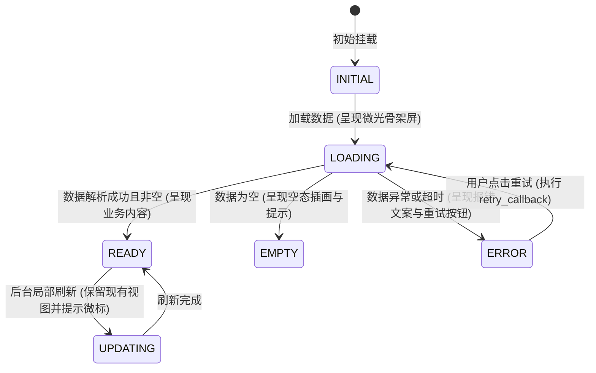

# 施工细则：前端基础架构重构与根骨架施工细则 —— 阶段3：UI可视化状态容器与全域Mock闭环工程化

> [!NOTE]
> **【施工目标】**：实现通用 UIStateContainer 多态可视化状态机容器（INITIAL, LOADING, READY, EMPTY, ERROR 5 态）；建立覆盖 17 个视图的 MockDataCatalog 完整数据集与 Mock 服务闭环；消解 8 处 pass 桩，完成 account_entry 进入游戏与 main_hud 真实导航联动。
> **案卷全局共享上下文**：👉 [KALAR-DEV-2026-ST73-ATT_附件_案卷共享契约与上下文.md](KALAR-DEV-2026-ST73-ATT_附件_案卷共享契约与上下文.md)。
> **【施工开始日期】：施工开始日期: 2026-09-09（晚上 21:56）** —— 真实读取系统时间。
> 状态：✅ 已完成（Round 2 实施与全量验证闭环）
> **【用户指令溯源】**：用户明确要求「WebGames 前端基础架构重构与施工细则设计...本阶段只建设前端“根本骨架 + UI 可视化显示层 + 状态承载结构 + 接口占位边界”，暂时不进行真正的后端接线、网络联调或业务数据闭环」（2026-09-09）。
> **对应需求源**：[路线图总索引](../../../../路线图/路线图总索引.md)。
> 📍 **卷内快速直达**：[ATT 共享附件](KALAR-DEV-2026-ST73-ATT_附件_案卷共享契约与上下文.md) ｜ [阶段1](KALAR-DEV-2026-ST73-001_阶段1_现状扫描审计与服务接口契约设计.md) ｜ [阶段2](KALAR-DEV-2026-ST73-002_阶段2_分层视口根骨架与导航管理器实现.md) ｜ **阶段3 (当前)** ｜ [阶段4](KALAR-DEV-2026-ST73-004_阶段4_无后端架构验收测试矩阵与工程闭环.md)

---

## 📌 第一性原理溯源指针

* **精准上游规范指针**：Phase 77 阶段1《现状扫描审计与服务接口契约设计》抽象契约；Phase 77 阶段2《分层视口根骨架与导航管理器实现》NavManager 控制器；`WebGames/config/narratives/errors_catalog.json` 错误码规范。
* **核心不变量约束断言**：`Inv-FE3-1 (无后端独立运行)`：在禁用一切网络、不加载后端服务的前提下，前端必须能够完成登录、创角、进入主页 HUD、浏览全域 17 视图；`Inv-FE3-2 (零静默失败)`：任何按钮点击或 Tab 切换必须有明确的 UI 可视化反馈（页面跳转、状态刷新、Toast 提示），严禁空 `pass` 吸收交互；`Inv-FE3-3 (确定性伪随机守卫)`：Mock 服务的模拟计算严禁调用全局非确定性 `randf()`，必须遵循 ADV-RNG-001 采用确定性 LCG 算法。
* **工程化重构最高指示**：通用组件严格面向接口依赖注入，状态流转具备完整重试回调闭环；Mock 数据集覆盖 17 视图全集，支持深拷贝隔离。

---

## 一、 状态容器与 Mock 体系实现 (State Container & Mock Pipeline)

### 1.1 通用 UI 可视化状态机容器设计 (UIStateContainer)
为杜绝旧前端仅支持“正常态”，缺乏加载中、空数据、请求失败重试等展示能力的短板，实现通用状态容器组件：



* 模块路径: `res://frontend/presentation/common/ui_state_container.gd`
* 接口契约: 暴露 `set_state(state: UIStateType)`、`bind_retry_callback(cb: Callable)`、`set_error_message(msg: String)`。

### 1.2 全域 Mock 数据目录与依赖注入容器 (MockDataCatalog & Container)
* 模块路径: `res://frontend/domain_boundary/mocks/mock_data_catalog.gd`、`res://frontend/domain_boundary/mocks/mock_service_container.gd`
* 职责: 收录 17 个前端视图所需的业务 Mock 数据集，支持深拷贝隔离与 IoC 依赖注入。

```gdscript
# ==============================================================================
# 卡拉尔世界引擎 (Kalar World Engine) - 依赖注入: Mock 服务依赖容器
# 文件路径: res://frontend/domain_boundary/mocks/mock_service_container.gd
# 职责: 管理前端 Mock 服务单例，实现控制反转，为视图层提供一致的抽象访问
# ==============================================================================
class_name MockServiceContainer
extends RefCounted

static var _instance: MockServiceContainer = null
var _services: Dictionary = {}

static func get_instance() -> MockServiceContainer:
	if _instance == null:
		_instance = MockServiceContainer.new()
		_instance._initialize_default_mocks()
	return _instance

func _initialize_default_mocks() -> void:
	register_service("auth", MockAuthService.new())
	register_service("world", MockWorldService.new())
	register_service("combat", MockCombatService.new())

func register_service(service_name: String, instance: RefCounted) -> void:
	_services[service_name] = instance

func get_service(service_name: String) -> RefCounted:
	if not _services.has(service_name):
		printerr("[MockServiceContainer] 未注册的服务: %s" % service_name)
		return null
	return _services[service_name]
```

### 1.3 确定性模拟战斗服务 (MockCombatService)
* 模块路径: `res://frontend/domain_boundary/mocks/mock_combat_service.gd`
* 规范遵循: 严格遵循 `ADV-RNG-001` 规范，杜绝 `randf()`/`randi()`，采用线性同余确定性伪随机。

```gdscript
# ==============================================================================
# 卡拉尔世界引擎 (Kalar World Engine) - 前端数据桩: 模拟战斗服务
# 文件路径: res://frontend/domain_boundary/mocks/mock_combat_service.gd
# 职责: 模拟战斗快照与伤害计算，隔离底层 CombatPipelineFSM
# ==============================================================================
class_name MockCombatService
extends ICombatService

func get_combat_snapshot_async(battle_id: String, callback: Callable) -> void:
	var combat_data := MockDataCatalog.get_domain_data("combat")
	callback.call({ "success": true, "combat": combat_data.duplicate(true) })

var _action_seed: int = 123456789

func cast_skill_async(skill_id: String, target_id: String, callback: Callable) -> void:
	_action_seed = (_action_seed * 1103515245 + 12345) & 0x7FFFFFFF
	var ratio: float = float(_action_seed % 1000) / 1000.0
	var is_crit: bool = (ratio > 0.7)
	var dmg: float = (80.0 + ratio * 160.0) * (1.5 if is_crit else 1.0)
	callback.call({
		"success": true,
		"skill_id": skill_id,
		"damage": dmg,
		"is_crit": is_crit,
		"target_id": target_id
	})
```

### 1.4 存量技术债务与交互断裂治理
1. **8 处 `pass # 骨架阶段` 桩清除**：
   - 将 Tab 切换由 `pass` 改为切页触发 `NavManager.show_toast(...)` 或切换内部面板；
   - 将创角/删角占位改为触发 Toast 提示并局部刷新 Mock 列表；
2. **`account_entry_view.gd` 导航闭环**：
   - 点击“进入游戏”按钮时，调用 `NavManager.get_instance().push_screen("main_hud", {"character_name": selected_name})`，打通登录进入主页 HUD 的真实前端流转。

---

## 二、 命令式施工执行清单 (Agent Execution Checklist)

- [x] **Step 3.1: UIStateContainer 通用五态状态机编写** - 实现 INITIAL、LOADING、READY、EMPTY、ERROR 状态切换与重试回调
- [x] **Step 3.2: MockDataCatalog 补全 17 视图假数据** - 建立公会、图鉴、背包、任务、抽卡等完整业务数据集
- [x] **Step 3.3: MockCombatService 确定性伪随机治理** - 使用 LCG 算法替换 randf/randf_range，对齐 ADV-RNG-001 规范
- [x] **Step 3.4: 消除存量 8 处 pass 哑桩与主页路由连通** - 落实 Toast 提示反馈，打通登录进主页与 8 大功能按钮跳转

---

## 三、 工程化验收矩阵 (DoD Matrix)

| 检验项 ID | 校验目标 | 验证输入 | 预期输出断言 |
| :--- | :--- | :--- | :--- |
| `TC-P77-S3-01` | UIStateContainer 5 态流转 | 驱动容器依次进入 5 种状态 | 互斥显示对应子节点，非活跃节点完全隐藏 |
| `TC-P77-S3-02` | 重试回调链路闭环 | 在 ERROR 态点击重试按钮 | 触发绑定的 retry_callback 并自动切回 LOADING |
| `TC-P77-S3-03` | Mock 服务全域覆盖度 | 遍历请求 17 视图业务数据 | 100% 返回非空合规字典，且支持深拷贝隔离 |
| `TC-P77-S3-04` | 登录进入 HUD 路径 | AccountEntryView 点击进入游戏 | 活跃屏幕成功压栈并切为 `main_hud` |
