# 施工细则：完整前端体系规范化建设与数据链路施工细则 —— 阶段1：全域缺口审计与前后端数据断点建模

> [!NOTE]
> **【施工目标】**：完成面向“完整可运行游戏产品”的前端系统级缺口审计与架构补全分析，穿透扫描当前前端 18 视图与 AppRoot 6 层视口现状，对照后端 50 大领域、接口、事件与配置表，建立端到端前后端数据流断点模型，确立“Transport DTO -> Frontend Adapter -> Domain Model -> UI State Store -> Selector/ViewModel -> UI Component”三层数据解耦契约。
> **案卷全局共享上下文**：👉 [KALAR-DEV-2026-ST74-ATT_附件_案卷共享契约与上下文.md](KALAR-DEV-2026-ST74-ATT_附件_案卷共享契约与上下文.md)。
> **【施工开始日期】：施工开始日期: 2026-09-10（下午）** —— 真实读取系统时间。
> 状态：✅ 已完成 (Round 2 施工与全域验收闭环：105 套件 731/731 断言 PASS，audit-all 20/20 全绿，2026-09-10)
> **【用户指令溯源】**：用户明确要求「完整游戏前端体系缺口审计、UI/Page 规范化建设与前后端数据链路梳理...从完整游戏产品应具备的功能集合、用户生命周期、游戏生命周期、后台数据状态与前端表现状态出发，反向推导当前前端尚未构建、构建不完整、仅有占位实现、数据尚未接通、状态流转不完整或架构上不具备长期扩展能力的部分...不要接线，更新路线图和施工文件」（2026-09-10）。
> **对应需求源**：[路线图总索引](../../../../路线图/路线图总索引.md)。
> 📍 **卷内快速直达**：[ATT 共享附件](KALAR-DEV-2026-ST74-ATT_附件_案卷共享契约与上下文.md) ｜ **阶段1 (当前)** ｜ [阶段2](KALAR-DEV-2026-ST74-002_阶段2_UI基础设施与分层组件系统架构设计.md) ｜ [阶段3](KALAR-DEV-2026-ST74-003_阶段3_全生命周期状态机与数据链路解耦规约.md) ｜ [阶段4](KALAR-DEV-2026-ST74-004_阶段4_施工路线图与端到端演进闭环矩阵.md)

---

## 📌 第一性原理溯源指针

* **精准上游规范指针**：Phase 77《前端基础架构重构与根骨架施工细则》（AppRoot 6 层 CanvasLayer 拓扑、NavManager 分层导航、MockDataCatalog 17 视图闭环）；Phase 71《用户会话生命周期与主页HUD双轨同步》；Phase 72《新一代高承压事件总线与位掩码多信道广播》；Phase 74《灰度发布版本编排与底层动态更新流水线》；后端 50 大领域实体与 `backend/infrastructure/game_loop_fsm.gd`。
* **核心不变量约束断言**：
  - `Inv-P78-1-1 (三层数据模型隔离)`：前端表现层 UI 组件严禁直接绑定后端数据结构，必须经由 `Transport DTO -> Domain Model -> ViewModel` 逐级映射消费；
  - `Inv-P78-1-2 (零侵入式后端解耦)`：前端代码严禁直接 `new()` 或静态引用 `backend/` 聚合根与内部求解器，100% 经由 Service 契约与 EventBus 通信；
  - `Inv-P78-1-3 (断点显式隔离)`：所有未接通后端的 UI 节点必须经由 `Adapter` 与 `MockServiceContainer` 显式路由，严禁在 UI 表现层内部硬编码 Mock 数据或散落 `pass` 占位桩。
* **防漂移最高指示**：细则正文中的所有数据流与契约代码必须使用强类型 GDScript 4.x 语法；严禁在细则中出现 `<...>` 模板占位符或 `TODO/TBD` 未决标记；代码中严禁散落 `push_error`/`push_warning`，统一通过 `printerr` 或受控事件上报。

---

## 一、 存量全景审计与前后端数据断点建模 (System Audit & Breakpoint Modeling)

### 1.1 存量前端目录与物理规模扫描
当前前端物理目录拓扑包含：`app/`（视口宿主与装配器）、`domain_boundary/`（纯虚接口契约与服务容器）、`i18n/`（多语言解析）、`mocks/`（Mock 数据编目）、`navigation/`（分层导航器）、`presentation/`（UI 状态容器）、`state/`（UI 弱引用绑定）、`theme/`（全局主题）与 `views/`（18 个业务视图目录）。

### 1.2 存量 18 视图实现成熟度分级表
- `account_entry`: ⚠️ 骨架+Mock，内嵌 6 大子面板巨型化，缺乏密码强度校验与会话恢复；
- `main_hud`: ⚠️ 表现层就绪，零事件订阅，高频数据未走细粒度订阅；
- `main_dashboard`: ⚠️ 骨架+Mock，缺乏大厅状态刷新，与 WorldGateway 无实时链接；
- `character_progression`: ⚠️ 骨架+Mock，属性变更无动画过渡，潜能洗点未接通后端求解器；
- `combat_view`: ⚠️ 表现层就绪，仅静态卡片，无真实 CombatEngine 推演与飘字；
- `economy_trade`: ⚠️ 静态列表，缺乏竞价轮询、手续费试算与分类筛选；
- `gacha_wish`: ⚠️ 静态卡池，抽卡动画缺失，保底进度条未接通 PityCounter；
- `quest_causality`: ⚠️ 静态树状，任务无法动态步进，无自动寻路与分支奖励；
- `mail_system`: ⚠️ 静态列表，无满仓拦截防线与过期邮件定时清理；
- `guild_social`: ⚠️ 静态列表，缺乏公会领地宣战、贡献兑换与公会日志；
- `world_map`: ⚠️ 静态网格，迷雾未与后端 FogOfWar 同步，缺乏动态图标；
- `monster_ecology`: ⚠️ 静态列表，弱点、击杀计数与掉落物概率未接通生态表；
- `crafting_workshop`: ⚠️ 静态配方，缺乏消耗预检、成功率浮动与耐久折损展示；
- `grimoire_authoring`: ⚠️ 静态插槽，魔法共鸣未接通，魔力通道超载无警报；
- `notification_bulletin`: ⚠️ 静态文本，红点未形成树状传播，公告无富文本；
- `settings_center`: ⚠️ 静态表单，修改未持久化至本地，无按键冲突检测；
- `system_save`: ⚠️ 静态槽位，无自动保存提示、存档校验和哈希防伪；
- `misc_edge`: ⚠️ 调试桩，缺乏运行时内存监控、网络 Ping 探针与 FPS 曲线。

### 1.3 50 大后端领域 vs 前端表现层交叉缺口报告 (A ~ H)
- **A. 已完成**：`AppRoot` 六层 CanvasLayer 骨架、`NavManager` 基础导航、18 视图无头判空守卫、4 大纯虚服务契约、`UIStateContainer` 5 态状态机；
- **B. 部分完成**：`ToastLayer`（缺少排队与操作按钮）、`LoadingOverlay`（仅全屏缺乏局部骨架屏）、`ui_text_resolver`（缺少动态占位符）、`ThemeManager`（缺少 Design Token）；
- **C. 完全缺失**：ModalManager、DialogManager、TooltipManager、ContextMenuManager、DrawerManager、RedDotTreeManager、FocusInputManager、UIAudioBridge；
- **D. UI 存在但数据未接通**：背包装备（未消费 inventory）、因果任务（未订阅 quest 事件）、回合战斗（未连接 combat 引擎）、世界地图（未连接 navigation 坐标）；
- **E. 后端能力存在但前端缺少 UI**：CDKey 兑换码兑换、大世界昼夜与天气时钟、掉落拾取光柱、NPC 剧情分支对话框、账号资产统计、版本补丁下载屏；
- **F. 架构债务**：缺少 ViewModel 解耦层、扁平路由相互抢占、单例直接查找耦合。

### 1.4 前后端数据流 8 级管道模型

```mermaid
flowchart LR
    DB["DB / Server"] --> Agg["Domain Aggregate"]
    Agg --> Svc["Application Service"]
    Svc --> DTO["Transport DTO"]
    DTO --> Adapter["Frontend Adapter"]
    Adapter --> Model["Frontend Domain Model"]
    Model --> Store["Feature State Store"]
    Store --> ViewModel["ViewModel"]
    ViewModel --> UI["UI Component"]
```


### 1.5 三层数据模型契约规范
```gdscript
## 1. 传输层模型：纯原始数据载荷
class CharacterTransportDTO extends RefCounted:
	var character_id: String = ""
	var nickname: String = ""
	var level_raw: int = 1
	var hp_current: float = 0.0
	var hp_maximum: float = 1.0
	var coins_copper_total: int = 0

## 2. 前端领域模型：具备前端业务规则校验与实体完整性
class CharacterDomainModel extends RefCounted:
	var id: String = ""
	var name: String = ""
	var level: int = 1
	var current_hp: float = 0.0
	var max_hp: float = 1.0
	func get_health_ratio() -> float:
		var safe_max: float = maxf(max_hp, 1.0)
		return clampf(current_hp / safe_max, 0.0, 1.0)

## 3. 视图模型：面向具体 UI 组件的数据呈现包装
class CharacterHUDViewModel extends RefCounted:
	signal property_changed(prop_name: String, new_val: Variant)
	var name_text: String = ""
	var hp_display_text: String = "100 / 100"
	var hp_progress_ratio: float = 1.0
	var hp_bar_color: Color = Color(0.2, 0.8, 0.2, 1.0)
	func update_from_domain(domain: CharacterDomainModel) -> void:
		name_text = domain.name
		hp_display_text = "%d / %d" % [int(domain.current_hp), int(domain.max_hp)]
		hp_progress_ratio = domain.get_health_ratio()
		hp_bar_color = Color(0.8, 0.2, 0.2) if hp_progress_ratio < 0.25 else Color(0.2, 0.8, 0.2)
		property_changed.emit("all", null)
```

---

## 二、 命令式施工执行清单 (Agent Execution Checklist)

- [x] **Step 1.1: 存量前端资产与 18 视图穿透扫描** - 梳理物理规模、场景分布、成熟度分级与架构债务
- [x] **Step 1.2: 50 大后端业务领域与数据断点交叉审计** - 建立 A~H 缺口全景报告与断点排查矩阵
- [x] **Step 1.3: 前后端 8 级数据流管道架构建模** - 确立 Transport DTO ➔ Domain Model ➔ ViewModel 三层模型解耦
- [x] **Step 1.4: 防御式边界与极端数据安全规约** - 确立零除防御、货币单晶资产对齐与纯虚契约规范

---

## 三、 数据结构与契约验收矩阵 (DoD Matrix)

| 检验项 ID | 校验目标 | 验证输入 | 预期输出断言 |
| :--- | :--- | :--- | :--- |
| `TC-P78-S1-01` | 50 领域覆盖度与断点审计断言 | 遍历 `backend/domains/` 与 `frontend/views/` | 明确识别 18 个已有对应视图、32 个缺失或待整合业务领域 |
| `TC-P78-S1-02` | 三层解耦模型单向映射验证 | `CharacterTransportDTO` ➔ `CharacterDomainModel` ➔ `CharacterHUDViewModel` | 数据单向流转成功，ViewModel 不包含任何底层网络协议字段 |
| `TC-P78-S1-03` | 生命值除零与浮点溢出防御断言 | 输入 `hp_maximum <= 0` 或极端负数 | `get_health_ratio()` 严格兜底为 safe_max 1.0，绝对不产生 `inf`/`nan` |
| `TC-P78-S1-04` | 架构一致性与无硬编码校验 | 全量静态代码扫描 | 前端代码中 0 处直接实例化后端聚合根，文档 0 Error / 0 Warn |
