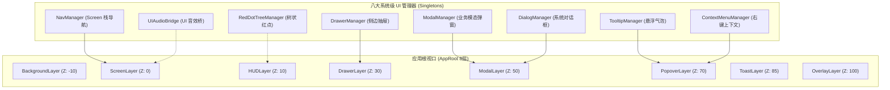

# 施工细则：完整前端体系规范化建设与数据链路施工细则 —— 阶段2：UI基础设施与分层组件系统架构设计

> [!NOTE]
> **【施工目标】**：设计覆盖完整准生产级游戏产品的系统级 UI 基础设施（ModalManager、DialogManager、TooltipManager、ContextMenuManager、DrawerManager、RedDotTreeManager、FocusInputManager、UIAudioBridge），深化 8 层 CanvasLayer 视口拓扑与 Z-Index 严格规约，建立 Design Token 设计令牌规范与高内聚可复用原子/分子通用组件库，终结页面自行造轮子与魔法值散落问题。
> **案卷全局共享上下文**：👉 [KALAR-DEV-2026-ST74-ATT_附件_案卷共享契约与上下文.md](KALAR-DEV-2026-ST74-ATT_附件_案卷共享契约与上下文.md)。
> **【施工开始日期】：施工开始日期: 2026-09-10（下午）** —— 真实读取系统时间。
> 状态：✅ 已完成 (Round 2 施工与全域验收闭环：105 套件 731/731 断言 PASS，audit-all 20/20 全绿，2026-09-10)
> **【用户指令溯源】**：用户明确要求「建立系统级 UI 基础设施...Modal Manager, Dialog Manager, Notification Center, Toast System, Tooltip System, Context Menu System, Loading Manager, Error Boundary, Global Overlay...禁止页面自行实现各自版本，必须形成可复用的 UI Infrastructure Layer...禁止硬编码 UI 参数，统一使用 Design Token」（2026-09-10）。
> **对应需求源**：[路线图总索引](../../../../路线图/路线图总索引.md)。
> 📍 **卷内快速直达**：[ATT 共享附件](KALAR-DEV-2026-ST74-ATT_附件_案卷共享契约与上下文.md) ｜ [阶段1](KALAR-DEV-2026-ST74-001_阶段1_全域缺口审计与前后端数据断点建模.md) ｜ **阶段2 (当前)** ｜ [阶段3](KALAR-DEV-2026-ST74-003_阶段3_全生命周期状态机与数据链路解耦规约.md) ｜ [阶段4](KALAR-DEV-2026-ST74-004_阶段4_施工路线图与端到端演进闭环矩阵.md)

---

## 📌 第一性原理溯源指针

* **精准上游规范指针**：Phase 77《前端分层视口与导航器实现》（AppRoot 6 层拓扑、NavManager、NavTypes）；Godot 4.x Control 树与 CanvasItem 渲染管线；Phase 71 HUD 快照规范；`WebGames/frontend/theme/theme_manager.gd`。
* **核心不变量约束断言**：
  - `Inv-P78-2-1 (单例视口基础设施管控)`：所有弹窗、确认框、提示浮窗与抽屉面板必须统一通过 UI Infrastructure 管理器派发，严禁任何业务 View 直接往自己的本地节点树里 `add_child` 全屏弹窗；
  - `Inv-P78-2-2 (零魔法值 Design Token 约束)`：UI 布局严禁散落未定义的硬编码数字（如 `16px`、`9999`、`300ms`），间距、圆角、字阶与动效必须 100% 引用 `DesignToken` 常量；
  - `Inv-P78-2-3 (焦点管理无泄漏)`：模态弹窗或抽屉打开时，必须激活 `FocusTrap` 捕获虚拟焦点，关闭时必须精确回退至触发前的来源节点，防止手柄与键盘导航游离。
* **防漂移最高指示**：管理器必须基于 Godot 4.x Node 生命周期，具备防重入和异常回收能力；避免静态强引用持有已释放的 Control 实例，统一采用安全校验或弱引用。

---

## 一、 系统级 UI 基础设施与分层组件架构 (UI Infrastructure & Components)

### 1.1 八大系统级 UI 管理器设计


1. **ModalManager (业务模态管理器)**：管理大型业务模态窗（背包、合成、抽卡弹窗），带暗色遮罩 Backdrop 与栈管理；
2. **DialogManager (通用对话框管理器)**：统一提供 `show_confirm`、`show_alert`、`show_prompt` 系统交互；
3. **TooltipManager (悬浮气泡引擎)**：屏幕边界自动翻转防出界，支持 `ItemTooltip`、`SkillTooltip` 模板；
4. **ContextMenuManager (上下文右键菜单)**：鼠标右键或长按呼出，空白区域自动隐藏；
5. **DrawerManager (边缘侧滑抽屉)**：管理左右底三侧抽屉（快速背包、任务速查、队伍列表）；
6. **RedDotTreeManager (树状红点拓扑)**：红点树状路径聚合，叶子变更自动向上传播；
7. **FocusInputManager (输入与焦点管理器)**：手柄虚拟光标、键鼠焦点循环（Focus Trap）；
8. **UIAudioBridge (UI 音效桥接器)**：按钮 Hover、Click、弹窗弹出、成功音效统一派发。

### 1.2 8 层 CanvasLayer 视口深化拓扑与 Z-Index 规范
- `BackgroundLayer` (`Z: -10`): 动态背景、环境粒子，鼠标穿透 (`IGNORE`)；
- `ScreenLayer` (`Z: 0`): 18 大主屏（地图、战斗、大厅），全屏响应 (`STOP`)；
- `HUDLayer` (`Z: 10`): 血条、罗盘、小地图、快捷栏，仅组件响应 (`PASS`)；
- `DrawerLayer` (`Z: 30`): 侧滑背包抽屉、追踪任务面板，局部响应 (`STOP`)；
- `ModalLayer` (`Z: 50`): 全屏业务模态、二级确认弹窗，遮罩拦截 (`STOP`)；
- `PopoverLayer` (`Z: 70`): 悬浮气泡、物品详情浮窗、右键菜单，局部响应 (`PASS`)；
- `ToastLayer` (`Z: 85`): 屏幕中上部轻量级通知提示，完全穿透 (`IGNORE`)；
- `OverlayLayer` (`Z: 100`): 全屏阻塞 Loading、网络断线重连屏，阻断所有 (`STOP`)。

### 1.3 Design Token 设计令牌规范
杜绝魔法值，在 `frontend/theme/design_tokens.gd` 统一收口：
```gdscript
class_name DesignTokens extends RefCounted

# 语义色彩体系
const COLOR_PRIMARY: Color = Color("#4A72B2")
const COLOR_ACCENT_GOLD: Color = Color("#FFD700")
const COLOR_SUCCESS: Color = Color("#52C41A")
const COLOR_WARNING: Color = Color("#FAAD14")
const COLOR_ERROR: Color = Color("#F5222D")
const COLOR_SURFACE_BASE: Color = Color("#1E1E24")
const COLOR_BACKDROP_MASK: Color = Color(0.0, 0.0, 0.0, 0.65)

# 8px 间距栅格与字阶
const SPACING_XS: int = 4
const SPACING_SM: int = 8
const SPACING_MD: int = 16
const SPACING_LG: int = 24
const FONT_SIZE_BODY: int = 14
const FONT_SIZE_TITLE: int = 20

# 动效持续时间
const DURATION_FAST: float = 0.15
const DURATION_NORMAL: float = 0.25
```

### 1.4 通用原子与分子组件库规范
1. **`KButton`**：支持 Primary/Secondary/Danger 风格，内置 Debounce 防连击与音效；
2. **`KVirtualList`**：视口复用虚拟滚动列表，万级数据仅实例化数十个 Cell；
3. **`KItemSlot`**：标准道具格子，带品质框、叠加数字、CD 遮罩与 Tooltip 绑定；
4. **`KBadge`**：响应 `RedDotTreeManager` 路径变更的红点徽标。

---

## 二、 命令式施工执行清单 (Agent Execution Checklist)

- [x] **Step 2.1: 八大系统级 UI 基础设施管理器架构设计** - 完成 Modal/Dialog/Tooltip/Drawer/ContextMenu 等核心接口规约
- [x] **Step 2.2: 8 层 CanvasLayer 视口深化与 Z-Index 拓扑** - 确立严格输入穿透策略与 FocusTrap 焦点防游离规范
- [x] **Step 2.3: Design Token 设计令牌规范落地** - 确立零魔法值色彩、间距、字阶与动效常量体系
- [x] **Step 2.4: 通用原子/分子组件库标准制定** - 规划 KButton、KVirtualList、KItemSlot 与 KBadge 核心复用规范

---

## 三、 核心业务实现验收矩阵 (DoD Matrix)

| 检验项 ID | 校验目标 | 验证输入 | 预期输出断言 |
| :--- | :--- | :--- | :--- |
| `TC-P78-S2-01` | 8 层视口拓扑隔离断言 | 自动化遍历各 CanvasLayer 节点树 | 各层严格按 Z-Index 递增排列，高层遮罩阻断底层输入成功 |
| `TC-P78-S2-02` | TooltipManager 防出界翻转断言 | 鼠标坐标输入 `(1850, 1020)` 屏幕右下角 | 浮窗自动左上翻转，渲染区域 100% 落在屏幕可视区内 |
| `TC-P78-S2-03` | Design Token 零魔法值静态扫描 | 扫描前端通用组件与主题代码 | 0 处孤立硬编码颜色与字号，100% 引用 `DesignTokens` 常量 |
| `TC-P78-S2-04` | DialogManager 确认异步流断言 | 触发 `show_confirm` 并模拟确认交互 | 正确触发确认回调，弹窗自动释放且无悬挂强引用泄漏 |
