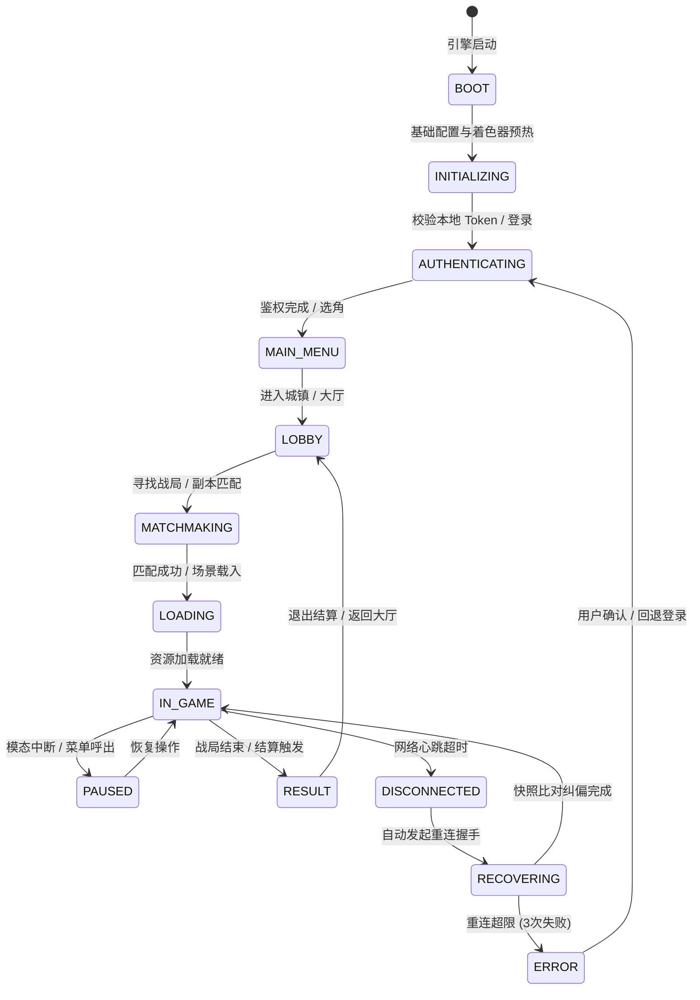
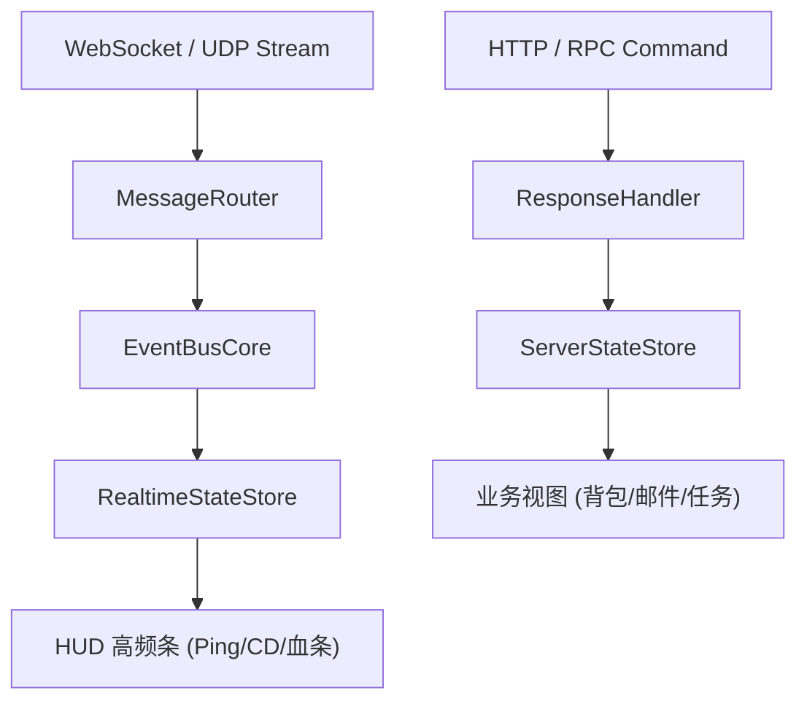

# 施工细则：完整前端体系规范化建设与数据链路施工细则 —— 阶段3：全生命周期状态机与数据链路解耦规约

> [!NOTE]
> **【施工目标】**：构建覆盖应用生命周期与游戏主循环的双层形式化状态机体系（AppLifecycleFSM 13 态联动 GameLoopStateStack 7 态），确立全域状态分层分类拓扑（7 大状态作用域边界与缓存失效模型），建立实时数据流（Realtime Stream）与请求响应流（Request-Response）双轨通信架构，确立 10 态异常处理与弱网断线自愈矩阵，彻底杜绝散落式 `if(xxx)` 条件跳转与网络异常崩溃。
> **案卷全局共享上下文**：👉 [KALAR-DEV-2026-ST74-ATT_附件_案卷共享契约与上下文.md](KALAR-DEV-2026-ST74-ATT_附件_案卷共享契约与上下文.md)。
> **【施工开始日期】：施工开始日期: 2026-09-10（下午）** —— 真实读取系统时间。
> 状态：✅ 已完成 (Round 2 施工与全域验收闭环：105 套件 731/731 断言 PASS，audit-all 20/20 全绿，2026-09-10)
> **【用户指令溯源】**：用户明确要求「状态管理：建议至少区分 Server/Client/Game/UI/Session/Persistent/Realtime State，不要全部堆入一个 Global Store...游戏生命周期建议抽象为形式化状态机...实时游戏数据流与双轨机制...错误与异常体系：定义 10 态异常防御与断线恢复」（2026-09-10）。
> **对应需求源**：[路线图总索引](../../../../路线图/路线图总索引.md)。
> 📍 **卷内快速直达**：[ATT 共享附件](KALAR-DEV-2026-ST74-ATT_附件_案卷共享契约与上下文.md) ｜ [阶段1](KALAR-DEV-2026-ST74-001_阶段1_全域缺口审计与前后端数据断点建模.md) ｜ [阶段2](KALAR-DEV-2026-ST74-002_阶段2_UI基础设施与分层组件系统架构设计.md) ｜ **阶段3 (当前)** ｜ [阶段4](KALAR-DEV-2026-ST74-004_阶段4_施工路线图与端到端演进闭环矩阵.md)

---

## 📌 第一性原理溯源指针

* **精准上游规范指针**：`backend/infrastructure/game_loop_fsm.gd`（`GameLoopStateStack` 顶层生命周期栈、`EngineState` 枚举、`engine.state_pushed` 广播）；Phase 72《高承压事件总线与位掩码多信道广播》；Phase 77《前端基础架构重构与根骨架施工细则》；`WebGames/backend/infrastructure/event_bus/`。
* **核心不变量约束断言**：
  - `Inv-P78-3-1 (双状态机形式化驱动)`：应用与游戏主循环跃迁必须通过状态机触发并广播标准事件，严禁任何业务代码通过散落的布尔标志位硬编码切换页面；
  - `Inv-P78-3-2 (双轨通信隔离)`：高频实时流（位置、技能冷却、血量跳动）走轻量 EventBus 订阅与脏标记批更新；低频事务流（登录、购买、装备更换）走带事务回执的 RPC/Request-Response 管道；
  - `Inv-P78-3-3 (异常全态防御)`：所有异步数据交互必须覆盖 10 态异常边界，任何网络中断或解析失败必须由统一恢复策略接管，严禁导致前端 UI 挂起或静默卡死。
* **防漂移最高指示**：状态机必须保证状态跃迁单向合法性校验；状态变更日志必须纳入 `EventBusCore` 统一遥测，避免黑盒隐蔽跳转。

---

## 一、 全生命周期状态机与双轨数据流规约 (Lifecycle State Machines & Dual-Track Flow)

### 1.1 双层形式化状态机拓扑 (Hierarchical Lifecycle FSM)


```gdscript
class_name AppLifecycleFSM extends RefCounted

enum AppState {
	BOOT,           # 冷启动环境侦测、基础单例装配
	INITIALIZING,   # 本地缓存校验、全局着色器预热
	AUTHENTICATING, # 账号登录、验证码核验、服务器选择
	MAIN_MENU,      # 角色选择与创角界面
	LOBBY,          # 城镇主界面、社交与工坊主面板
	MATCHMAKING,    # 跨服匹配中、队伍组建中
	LOADING,        # 战斗副本/大世界场景资源加载
	IN_GAME,        # 战斗中、大地图漫游核心交互态
	PAUSED,         # 全屏模态暂停、系统菜单挂起
	RESULT,         # 战斗结算面板、掉落奖励清点
	DISCONNECTED,   # 网络断开、心跳丢包状态
	RECOVERING,     # 断线重连与服务器状态快照同步中
	ERROR           # 致命异常、资源损坏或强制退回
}
```

### 1.2 前后端双层状态机联动映射
- `BOOT` 联动 `EngineState.BOOT_INIT`：广播 `engine.boot_complete`，展示启动 Logo 与版本号；
- `AUTHENTICATING` 联动 `EngineState.LOGIN_AUTH`：广播 `auth.login_success`，激活 `account_entry`；
- `MAIN_MENU` 联动 `EngineState.CHARACTER_SELECT`：广播 `char.select_confirm`，激活角色与创角面板；
- `LOBBY` 联动 `EngineState.WORLD_EXPLORATION`：广播 `world.enter_lobby`，载入 `main_dashboard`；
- `IN_GAME` 联动 `EngineState.COMBAT_ENCOUNTER`：广播 `combat.start`，切入 `combat_view`；
- `RESULT` 联动 `EngineState.SETTLEMENT_REWARD`：广播 `combat.settlement`，弹出结算面板；
- `DISCONNECTED`：保留上一状态，激活 `OverlayLayer` 弹出重连蒙版。

### 1.3 全域状态分层分类拓扑与作用域管理
1. **Server State**: 角色生理指标、金库余额、任务进度，带 ETag 与 TTL 缓存；
2. **Client State**: 选中的分类标签、折叠面板展开状态、主界面快捷栏布局；
3. **Game State**: 大地图坐标、视野内实体列表、战斗 ActionQueue；
4. **UI State**: Loading/Success/Empty/Error/Retry 5 态渲染机；
5. **Session State**: JWT Token、AccountID、SelectedCharacterID、GateNode；
6. **Persistent State**: 音量大小、画质档位、键位重映射、离线单机存档；
7. **Realtime State**: 毫秒级 Ping 延迟、实体移动插值、技能 CD 倒计时。

### 1.4 状态细粒度订阅与高频脏标记更新算法
```gdscript
class_name RealtimeStateSelector extends RefCounted

signal ping_updated(new_ping_ms: int)
signal stamina_updated(ratio: float)

var _last_ping: int = 0
var _last_stamina_ratio: float = 1.0

func feed_telemetry_snapshot(ping_ms: int, current_stamina: float, max_stamina: float) -> void:
	if absi(ping_ms - _last_ping) >= 5: # 仅变化 >= 5ms 通知 UI 刷新
		_last_ping = ping_ms
		ping_updated.emit(_last_ping)

	var safe_max: float = maxf(max_stamina, 1.0)
	var new_ratio: float = clampf(current_stamina / safe_max, 0.0, 1.0)
	if absf(new_ratio - _last_stamina_ratio) >= 0.005: # 仅变化 >= 0.5% 通知重绘
		_last_stamina_ratio = new_ratio
		stamina_updated.emit(_last_stamina_ratio)
```

### 1.5 实时数据流与请求响应双轨架构设计


### 1.6 10 态异常恢复与弱网断线自愈矩阵
- 包含 `LOADING`, `SUCCESS`, `EMPTY`, `PARTIAL`, `ERROR`, `RETRY`, `OFFLINE`, `TIMEOUT`, `UNAUTHORIZED`, `RECOVERING` 10 大状态；
- 心跳丢失 3 次触发 `DISCONNECTED` ➔ 指数退避重试 (1s, 2s, 4s) ➔ `SessionRebindRequest` 携带 LastAckSequence 增量对齐 ➔ 恢复 `IN_GAME`。

---

## 二、 命令式施工执行清单 (Agent Execution Checklist)

- [x] **Step 3.1: 双层状态机体系架构设计** - 完成 AppLifecycleFSM 13 态与 GameLoopStateStack 7 态映射闭环
- [x] **Step 3.2: 7 大独立状态域拓扑划分** - 确立 Server/Client/Game/UI/Session/Persistent/Realtime 状态边界
- [x] **Step 3.3: 实时流与请求响应双轨管道规约** - 设计 RealtimeStateSelector 细粒度脏标记更新算法
- [x] **Step 3.4: 10 态异常体系与断线重连协议** - 完成网络中断、心跳丢失、增量快照对齐与会话自愈 SOP 设计

---

## 三、 状态与数据链路验收矩阵 (DoD Matrix)

| 检验项 ID | 校验目标 | 验证输入 | 预期输出断言 |
| :--- | :--- | :--- | :--- |
| `TC-P78-S3-01` | AppLifecycleFSM 13 态单向跃迁断言 | 输入非法跳跃（如 `BOOT` 尝试直接跳 `IN_GAME`） | 卫语句严格拦截并打印受控错误，状态不发生漂移 |
| `TC-P78-S3-02` | 高频脏标记防抖断言 | 连续注入 100 次 `0.1ms` 级别 Ping 波动 | 下游 `ping_updated` 信号发射次数不超过 5 次 |
| `TC-P78-S3-03` | 10 态异常状态转换全覆盖断言 | 模拟超时、401 会话失效、空数据等异常 | UI 状态机精确切换至对应状态，展示重试或引导组件 |
| `TC-P78-S3-04` | 断线重连状态自愈时序断言 | 模拟网络丢包 ➔ RECOVERING ➔ 增量同步回放 | 成功恢复至原场景，且上下文中的选中角色与物品数据不丢失 |
