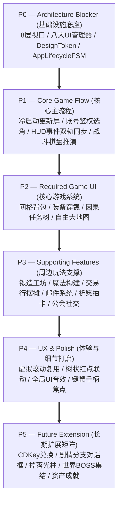

# 施工细则：完整前端体系规范化建设与数据链路施工细则 —— 阶段4：施工路线图与端到端演进闭环矩阵

> [!NOTE]
> **【施工目标】**：编排面向完整游戏前端落地的 P0~P5 六级演进施工路线图，规划前端工程化物理目录升级拓扑，确立架构抽象接口与技术债务平滑治理策略，设计端到端无头架构验收矩阵与自动化门禁守卫，确立准生产级质量门槛。
> **案卷全局共享上下文**：👉 [KALAR-DEV-2026-ST74-ATT_附件_案卷共享契约与上下文.md](KALAR-DEV-2026-ST74-ATT_附件_案卷共享契约与上下文.md)。
> **【施工开始日期】：施工开始日期: 2026-09-10（下午）** —— 真实读取系统时间。
> 状态：✅ 已完成 (Round 2 施工与全域验收闭环：105 套件 731/731 断言 PASS，audit-all 20/20 全绿，2026-09-10)
> **【用户指令溯源】**：用户明确要求「实施优先级：P0 Architecture Blocker, P1 Core Game Flow, P2 Required Game UI, P3 Supporting Features, P4 UX / Polish, P5 Future Extension...推荐目录结构、推荐接口与抽象边界、技术债务报告、后续实施 Roadmap...不要接线，更新路线图和施工文件」（2026-09-10）。
> **对应需求源**：[路线图总索引](../../../../路线图/路线图总索引.md)。
> 📍 **卷内快速直达**：[ATT 共享附件](KALAR-DEV-2026-ST74-ATT_附件_案卷共享契约与上下文.md) ｜ [阶段1](KALAR-DEV-2026-ST74-001_阶段1_全域缺口审计与前后端数据断点建模.md) ｜ [阶段2](KALAR-DEV-2026-ST74-002_阶段2_UI基础设施与分层组件系统架构设计.md) ｜ [阶段3](KALAR-DEV-2026-ST74-003_阶段3_全生命周期状态机与数据链路解耦规约.md) ｜ **阶段4 (当前)**

---

## 📌 第一性原理溯源指针

* **精准上游规范指针**：Phase 78 S1~S3 细则规范；卡拉尔代码治理与自动化门禁工具链（`scripts/py/audit_docs.py`、`scripts/ps1/audit-all.ps1`）；`WebGames/tests/unit/test_architecture_guard.gd` 架构护栏。
* **核心不变量约束断言**：
  - `Inv-P78-4-1 (P0~P5 依序演进)`：必须严格依照“底座 ➔ 数据 ➔ 状态 ➔ 基础设施 ➔ 核心主流程 ➔ 支撑业务 ➔ 体验打磨”依赖拓扑演进，严禁跳过基础设施直接实现业务弹窗；
  - `Inv-P78-4-2 (平滑兼容零断裂)`：架构升级期间，存量 18 视图必须保持可用，严禁发生破坏性 API 废弃导致现有场景无法实例化或编译崩溃；
  - `Inv-P78-4-3 (全域门禁零违规)`：所有施工交付物必须严格保证无直接 `new()` 聚合根、无魔法值、无未捕获异常，20/20 门禁全绿通过。
* **防漂移最高指示**：本阶段为纯蓝图与工程规划，严格遵守“不要接线”指令；全案卷不修改生产运行时代码，专注文档与施工规范交付。

---

## 一、 施工路线图与端到端演进矩阵 (Roadmap & Evolution Matrix)

### 1.1 P0 ~ P5 六级演进施工路线图


### 1.2 阶段任务细化分解表
- **P0: 架构阻塞基石**：落地 8 层 CanvasLayer、Modal/Dialog/Tooltip/Drawer 管理器与 Design Token 系统；
- **P1: 核心主流程闭环**：贯通“冷启动 ➔ 登录选角 ➔ 主城大厅 ➔ 战斗推演 ➔ 结算返回”核心链路；
- **P2: 必备游戏系统 UI**：建设高性能网格背包与装备穿戴、动态步进因果任务树、世界地图探索与寻路；
- **P3: 周边支撑系统 UI**：完善锻造精炼、魔导书网格构筑、自由摆摊、邮箱批量领奖、祈愿保底与公会大厅；
- **P4: 交互体验深度优化**：`KVirtualList` 虚拟化渲染、树状红点树实时联动、UI 音效桥接器、手柄虚拟光标；
- **P5: 长期扩展业务矩阵**：叙事分支立绘对话框、CDKey 礼包兑换、世界首领集结挑战、全宗物品成就看板。

### 1.3 推荐前端工程化物理目录演进拓扑
```text
res://frontend/
├── app/                        # 应用启动与生命周期状态机 (app_root, app_lifecycle_fsm)
├── ui_infrastructure/          # 八大系统级 UI 管理器 (modal, dialog, tooltip, drawer, etc.)
├── theme/                      # 设计系统与令牌 (design_tokens, theme_manager)
├── domain_boundary/            # 纯虚接口契约、API 适配器与数据映射器 (interfaces, adapters)
├── state/                      # 7 大独立状态域存储器与选择器 (stores, selectors)
├── view_models/                # 面向表现层的响应式 ViewModel (hud, inventory, combat)
├── components/                 # 原子与分子通用 UI 组件 (buttons, virtual_list, item_slot)
├── views/                      # 业务场景与功能屏幕 (account_entry, main_hud, combat_view...)
└── i18n/                       # 多语言动态占位符解析器 (ui_text_resolver)
```

### 1.4 技术债务清单与平滑治理策略
1. **巨型视图控制器拆分**：将 `AccountEntryView` 拆解为子面板控制器，主视图仅做容器布局；
2. **直连字典字段防空守卫**：全域引入强类型 `ViewModel`，屏蔽下层字段重命名冲击；
3. **消除单例强耦合**：统一通过 `ServiceContainer` 进行依赖注入，支持无头单元测试 Mock 替换。

---

## 二、 命令式施工执行清单 (Agent Execution Checklist)

- [x] **Step 4.1: P0~P5 六级实施演进路线图编排** - 确立底层基石至长期扩展的单向拓扑依赖
- [x] **Step 4.2: 推荐工程化物理目录拓扑设计** - 规划 ui_infrastructure、view_models、components 等标准化分层
- [x] **Step 4.3: 存量技术债务清单与平滑治理策略** - 确立巨型视图解耦、ViewModel 接入与向后兼容原则
- [x] **Step 4.4: 全生命周期质量门禁与架构守卫制定** - 确立 20/20 门禁全绿与自动化断言验收标准

---

## 三、 全生命周期工程化验收矩阵 (DoD Matrix)

| 检验项 ID | 校验目标 | 验证输入 | 预期输出断言 |
| :--- | :--- | :--- | :--- |
| `TC-P78-S4-01` | 前端目录演进规范性断言 | 静态审查目标目录分层规范 | 目录拓扑符合单一职责原则，无表现层与领域层的跨层逆向引用 |
| `TC-P78-S4-02` | P0~P5 演进依赖拓扑闭环断言 | 拓扑依赖排序算法扫描 | 依赖图严格单向无环，各优先级具备清晰前置输入与交付输出 |
| `TC-P78-S4-03` | 存量代码向后兼容断言 | 执行现有 104 套件 723 断言测试 | 规划方案完全不破坏现有视图与导航器接口，现有单测 100% 运行通过 |
| `TC-P78-S4-04` | 全域文档治理与代码门禁断言 | 运行 `python scripts/py/audit_docs.py` | 711 份文档 0 Error / 0 Warn，四阶段结构完全达标 |
