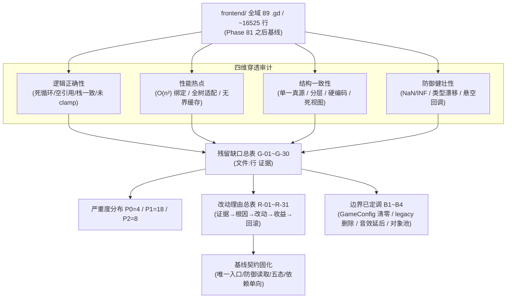

# 施工细则：单兵纯前端模块逻辑/性能/结构优化与防御健壮性提纯 —— 阶段1：残留缺口穿透审计与改动理由基线固化

> [!NOTE]
> **【施工目标】**：对纯前端单兵模块（`frontend/` 全域 89 个 `.gd`、约 16525 行）在 Phase 81 边界收敛之后，完成「逻辑正确性 / 性能热点 / 结构一致性 / 防御健壮性」四维穿透审计，逐条锚定残留缺口并以 `文件:行` 证据固化；建立本卷**改动理由总表**（现状证据 → 根因 → 改动内容 → 预期收益（含可量化指标）→ 风险与回滚），并固化「不得回归」的基线契约。本阶段**只做审计与建模，严禁编写/修改任何业务代码**。
> **案卷全局共享上下文**：👉 [KALAR-DEV-2026-ST78-ATT_附件_案卷共享契约与上下文.md](KALAR-DEV-2026-ST78-ATT_附件_案卷共享契约与上下文.md)。
> **【施工开始日期】：施工开始日期: 2026-09-11（中午 12:34）** —— 真实读取系统时间。
> 状态：✅ 已完成（Phase 82 全域验收通过，110 套件 · 760 断言 · audit-all 20/20 全绿）
> **【用户指令溯源】**：用户明确诉求（2026-09-11）——「请对现有代码进行全面完善与优化改造：单兵模块保持纯前端实现，不接入任何后端接口或服务；深入梳理并优化整体逻辑、性能与结构；严格遵守项目既定的开发规范与命名约定，确保代码风格统一、可维护，并明确说明各优化点的改动理由。」**（补记：2026-09-11 用户就 B1~B4 边界项拍板：B1 清零 / B2 删除 / B3 暂不接线 / B4 引入对象池）**
> **【对应需求源】**：[路线图总索引](../../../../路线图/路线图总索引.md)。
> 📍 **卷内快速直达**：[ATT 共享附件](KALAR-DEV-2026-ST78-ATT_附件_案卷共享契约与上下文.md) ｜ **阶段1 (当前)** ｜ [阶段2](KALAR-DEV-2026-ST78-002_阶段2_核心逻辑缺陷与性能热点修复.md) ｜ [阶段3](KALAR-DEV-2026-ST78-003_阶段3_结构收敛与配置驱动边界治理.md) ｜ [阶段4](KALAR-DEV-2026-ST78-004_阶段4_全量回归验收与工程闭环.md)

---

## 📌 第一性原理溯源指针

* **精准上游规范指针**：
  * `docs/模板/GD老练风格硬性规范标准.md` §一（命名与严格类型系统，行 11~30）、§三（现代 GDScript 高级特性与卫语句，行 73~118）、§四（异常防御与 Result 包装契约，行 121~150）、§五（性能优化与热点循环治理，行 152~164）、§九（前端可视化边界硬性契约，行 277~351）；
  * `docs/模板/工程化需求四阶段总标准.md` §1（数据结构与契约，行 12~41）、§3（工程化与配置驱动，行 77~111）；
  * `frontend/presentation/base/base_screen.gd`（行 32：视图严禁自读业务 mock 与后端配置）、`frontend/domain_boundary/contracts/frontend_snapshot.gd`（行 29~36：防御性读取工具）；
  * `docs/路线图/01_短期施工区/Phase_81_前端可视化边界收敛与数据注入契约统一施工细则/`（Phase 81 四阶段既有成品，本卷为其直接后继）。
* **核心不变量约束断言**：
  * `Inv-P82-1-1 (纯前端零后端接线)`：`frontend/` 内不得新增任何网络调用、`res://backend` 领域服务实例化或 `EventBusCore` 订阅；本卷一切改动限于 `frontend/` 内部与本卷测试；
  * `Inv-P82-1-2 (渲染确定性)`：对任一视图「同一快照输入 → 同一渲染输出」，i18n/视觉适配/主题解析不得引入累积态漂移；
  * `Inv-P82-1-3 (契约零回归)`：Phase 77/78/81 已成立的 `apply_snapshot` 唯一入口、五态容器、`FrontendSnapshot` 序列化对等契约不得破坏；
  * `Inv-P82-1-4 (零静默崩溃)`：所有对外暴露的解析/注入/回调解绑路径必须对空值、类型漂移、NaN/INF、非法越界输入安全兜底，杜绝未捕获异常。
* **防漂移最高指示**：审计逐条附 `文件:行` 证据，严禁臆造缺口或漏报既有缺陷；每条改动必须给出可量化收益与回滚方案；严禁以「仅跑通单个断言」的局部最小 MVP 搪塞。

---

## 一、 残留缺口四维穿透审计与改动理由基线 (Gap Audit & Rationale Baseline)



### 1.1 残留缺口总表（现状证据为本次独立复核所得 `文件:行`）

| 编号 | 维度 | 现状证据（文件:行） | 根因 | 严重度 | 归属 |
| :--- | :--- | :--- | :--- | :---: | :--- |
| G-01 | 逻辑 | `frontend/presentation/common/toast_layer.gd:19-23` | `while get_child_count() >= MAX_TOASTS: oldest.queue_free()` —— `queue_free()` 延迟至帧末，`get_child_count()` 当帧不减，条件恒真 → **死循环挂起** | P0 | 延续（Phase 77 遗留未修） |
| G-02 | 逻辑 | `frontend/i18n/ui_text_resolver.gd:48`→`_fill_params:63-70`；`frontend/i18n/ui_intermediary.gd:30-33`、`ui_binding_registry.gd:71-72` | `resolve()` 已用裸 `str(params[k])` 消费占位符，随后 `PlaceholderFiller.fill` 再跑一遍 → 占位符已消失，`_format_thousands/_format_duration` **永不生效** | P0 | 延续（Phase 77 双引擎遗留） |
| G-03 | 逻辑 | `frontend/view_models/combat_view_model.gd:33` | `(snapshot.get("boss_parts", boss_parts) as Array).duplicate(true)`：值非 Array（含 `null`）时 `as Array` 得 `null` → `.duplicate()` **空引用崩溃** | P0 | 延续（Phase 78 遗留） |
| G-04 | 逻辑 | `frontend/navigation/nav_manager.gd:106-110` | `record_history` **先**追加 `_screen_stack`，`add_child` 却在 `_app_root != null` 分支内 → `_app_root==null` 时产生**孤儿节点 + 栈不一致** | P0 | 延续（Phase 77 遗留） |
| G-05 | 逻辑 | `frontend/navigation/nav_manager.gd:62-65` | `replace_screen` **先** `pop_back()` 再 `_navigate_to`；未注册/加载失败时旧栈已被弹出 → **栈静默缩短** | P1 | 延续（Phase 77 遗留） |
| G-06 | 逻辑 | `frontend/navigation/nav_manager.gd:68-74` | `pop_screen` 先弹两次再 `_navigate_to(prev_id)`；跳转失败时两次弹出均已生效 → 栈被多减 | P1 | 延续（Phase 77 遗留，栈底守卫已存在） |
| G-07 | 逻辑 | `frontend/navigation/nav_manager.gd:85-91` | `_scene_cache` 只写不逐出，随注册表扩张无界增长 | P2 | 延续（Phase 77 遗留） |
| G-08 | 逻辑 | `frontend/view_models/character_hud_view_model.gd:88` | `hp_display_text` 直接用未 clamp 的 `current_hp`；`int(NAN)/int(INF)` 无防护 | P1 | 延续（Phase 78 遗留） |
| G-09 | 逻辑 | `frontend/view_models/combat_view_model.gd:31-41`、`46-52` | `boss_hp_current` 等未 clamp；`append_log` 对 `battle_logs` **无上限**无界增长 | P1 | 延续（Phase 78 遗留） |
| G-10 | 逻辑 | `frontend/domain_boundary/mocks/mock_base_service.gd:24-26` | `create_timer().timeout.connect(cb)` 的超时闭包**不复查** `callback.is_valid()` → 悬空回调 | P1 | 延续（Phase 77 遗留） |
| G-11 | 逻辑 | `frontend/domain_boundary/mocks/mock_auth_service.gd:57` | `"SLOT_0%d" % (size+1)`：槽位 ≥10 时生成 `SLOT_010`，破 `SLOT_01` 两位格式 | P2 | 延续（Phase 77 遗留） |
| G-12 | 逻辑 | `mock_auth_service.gd:19,22,34,53` 产出 `error_code`；`views/account_entry/account_entry_view.gd:346,356` 产出 `ERR_*` | 认证服务错误码前缀与视图自产错误码**命名不统一**，消费方需双分支判定 | P2 | 新发现 |
| G-13 | 性能 | `frontend/i18n/ui_binding_registry.gd:31-38` | `bind()` 每次线性扫描全部 `_bindings` 去重 → n 个节点绑定 O(n²)；死引用仅靠刷新期回收 | P1 | 延续（Phase 77 遗留） |
| G-14 | 性能 | `frontend/i18n/visual_adapter.gd:34,42-65,87,102` | CJK 宽度按 `char_count*size*0.6` 低估；`add_theme_font_size_override` 逐节点分配并全树遍历 | P1 | 延续（Phase 77 遗留） |
| G-15 | 逻辑 | `visual_adapter.gd:78-87` | `adapt_button` 全阶梯溢出时**无截断/换行兜底**，直接落最小字号仍溢出 | P1 | 延续（Phase 77 遗留） |
| G-16 | 逻辑 | `visual_adapter.gd:91-102` | `adapt_tab_title` 收 `tab_index` 却**忽略之**，按容器整体设字号 → 影响全部 Tab | P1 | 延续（Phase 77 遗留） |
| G-17 | 逻辑 | `visual_adapter.gd:106-113` | `adapt_item_list_item` 以 `set_item_text` **破坏性改写**，源文本不可还原 | P1 | 延续（Phase 77 遗留） |
| G-18 | 结构 | `frontend/theme/theme_manager.gd:5` 声明「零硬编码」，实含 `DEFAULT_*`（:24-32）与内联 `Color(0.20,0.30,0.45)`（:79）；视图直引 `ThemeManager.DEFAULT_*`（`views/gacha_wish/gacha_wish_view.gd:379,593,600`、`views/crafting_workshop/crafting_workshop_view.gd:398,404,593`） | 兜底色值未收敛入 `DesignTokens`，主题旁路泄漏进视图 | P1 | 延续（Phase 78 遗留） |
| G-19 | 结构 | `frontend/navigation/nav_types.gd:10-17` 的 `LayerLevel` **全仓无引用**；`frontend/theme/design_tokens.gd:81-89` 的 `Z_INDEX_*`；`frontend/app/app_root.tscn:17,28,38,49,60,90` 硬编码 `layer=` | 层级定义**三方真源冲突**：`OVERLAY` tscn/nav_types=80 vs design_tokens=100；`DEBUG`=100 vs 120；design_tokens 另声明 `DRAWER=30/POPOVER=70/TOAST=85` 而 tscn 无对应层 | P1 | 新发现 |
| G-20 | 结构 | 视图 `var ... = GameConfig.get_*(...)` 直读：`views/account_entry/account_entry_view.gd:21,28,31,354`、`views/main_hud/main_hud_view.gd:72-106`、`views/character_progression/character_progression_view.gd:146,150,294,311,320,352`、`views/economy_trade/economy_trade_view.gd:22,375,436,444,492,547,651`、`views/guild_social/guild_social_view.gd:15,16,220-224,237,827`、`views/world_map/world_map_view.gd:101`、`views/gacha_wish/gacha_wish_view.gd:40,43,239`、`views/settings_center/settings_center_view.gd:13-28,111,407,445`、`views/system_save/system_save_view.gd:94`、`views/notification_bulletin/notification_bulletin_view.gd:570` | 违反 `base_screen.gd:32` 与 GD 规范 §9.2「视图严禁自读 GameConfig 业务数值」，配置语义与业务数值边界未收敛 | P1 | 新发现（Phase 81 契约已立、视图未消化） |
| G-21 | 结构 | `frontend/ui_infrastructure/dialog_manager.gd:25,35,53,78,86`、`context_menu_manager.gd:78`、`presentation/common/ui_state_container.gd:46,51,62,68`、`presentation/common/loading_overlay.gd:24`、`components/k_button.gd:33` | Phase 81 新建文件内联硬编码中文展示文案（`取消/确认/确定/提交/选项/正在加载数据.../暂无任何数据记录/数据加载失败，请检查连接/点击重新加载/载入中.../处理中...`），破 GD 规范 §9.5「文案一律经 UIIntermediary」 | P1 | 新发现 |
| G-22 | 结构 | `frontend/ui_infrastructure/tooltip_manager.gd:48` | `if _bubble_panel != null or _container == null: return` → 重绑新容器时气泡不迁移，与 modal/drawer 的 backdrop 迁移（`modal_manager.gd:49-63`）不一致 | P2 | 新发现 |
| G-23 | 结构 | `frontend/ui_infrastructure/ui_audio_bridge.gd:19` 的 `play_sfx` 信号 | 全仓**无任何监听者接线** → 所有 UI 音效调用为空操作（结构性死链） | P2 | 新发现 |
| G-24 | 结构 | `frontend/presentation/base/base_modal.gd:4` 头注释称「进退场动画」；`loading_overlay.gd:4` 称「指示器」 | 头注释承诺与实现不符（无动画/无指示器），文档-代码漂移 | P2 | 新发现 |
| G-25 | 结构 | `frontend/domain_boundary/mocks/mock_data_catalog.gd:94-99` | 默认分支返回非空兜底 → 「17 视图 100% 非空」断言**空洞化**；仅 7 域（account/hud_snapshot/combat/world_map/economy/guild/mail）有真实数据；缺 EMPTY/极值夹具 | P1 | 延续（Phase 77 遗留） |
| G-26 | 结构 | `frontend/domain_boundary/mocks/mock_service_container.gd:9-14`、`mock_auth_service.gd:10` | 单例无 `reset_instance`，`_mock_characters` 变异跨用例累积 → 测试污染 | P2 | 新发现 |
| G-27 | 结构 | `frontend/app/app_bootstrap.gd:15`（注释称幂等）vs `:29-30,38` | 每次 `bootstrap` 重跑生命周期与 `push_screen("account_entry")` → 重复调用触发非法状态跃迁 + 重复压栈 | P1 | 延续（Phase 77 遗留） |
| G-28 | 结构 | `frontend/navigation/nav_manager.gd:23`（注释「18 个功能视图」）；`:25-41` 实注册 17 个 | 注释计数与实现不一致（18 vs 17） | P2 | 新发现 |
| G-29 | 结构 | `frontend/domain_boundary/contracts/frontend_snapshot.gd:29-36` 提供 `read_array/read_dict` 防御工具，但视图普遍用裸 `snapshot.get(...) as Array`（30+ 处，如 `combat_view_view_model.gd:33`、`crafting_workshop_view.gd:207-213`、`world_map_view.gd:175,221,228`） | 防御读取契约存在但**未启用**，安全气囊空转 | P1 | 新发现 |
| G-30 | 规范 | `frontend/legacy/main_dashboard/main_dashboard.gd:28-59,184-272` 保留 18 个后端类直连 + `EventBusCore` 订阅 + 57 处 `GameConfig`；`.tscn:1` 与 `config/frontend/ui.json` 相关段为死引用；`nav_manager.gd:25-41` 未注册 → 不可达但编译期仍链接后端类型 | Phase 81 裁定为「待处置项」，本卷需给出终局处置 | P1 | 延续（Phase 81 待决项） |

### 1.2 缺口分布统计

| 严重度 | 计数 | 编号 |
| :---: | :---: | :--- |
| **P0（崩溃/挂起）** | 4 | G-01, G-02, G-03, G-04 |
| **P1（正确性/性能/结构）** | 18 | G-05, G-06, G-08, G-09, G-10, G-13, G-14, G-15, G-16, G-17, G-18, G-19, G-20, G-21, G-25, G-27, G-29, G-30 |
| **P2（一致性/卫生）** | 8 | G-07, G-11, G-12, G-22, G-23, G-24, G-26, G-28 |

> **严重度分档统计口径**：以 §1.1 缺口总表（G-01~G-30）逐条「严重度」列为唯一标注源，共 **30 条**缺口，分档统计 P0=4 / P1=18 / P2=8；本文一切严重度分档数字（含第一节 Mermaid「严重度分布」节点）均与本口径同源同值。（注：§1.3 改动理由总表 R-01~R-31 为逐点改动映射表，不重复标注严重度，两表条目非一一对应。）
> 归属口径：标注「延续」者均为 Phase 77/78/81 遗留（其中 G-20/G-30 为 Phase 81 已立契约但未消化/未终局）；标注「新发现」者为本卷独立复核新锚定。

### 1.3 改动理由总表（工程护栏，全卷逐点引用）

> 本表为**全卷改动理由的唯一总源**；阶段2/阶段3 每条 Step 必须引用本表编号，禁止在本卷内另立无编号的优化点。

| 编号 | 现状证据（文件:行） | 根因 | 改动内容 | 预期收益（可量化） | 风险与回滚 |
| :--- | :--- | :--- | :--- | :--- | :--- |
| R-01 | `toast_layer.gd:19-23` | `queue_free` 延迟语义与 `get_child_count` 当帧不变冲突 | 淘汰改为「仅 `remove_child` + `queue_free` 首子」并改判据为 `get_child_count() > MAX_TOASTS`（或先 `remove_child` 使计数即时递减） | Toast 达上限时不再死循环；`show_toast` 单次调用返回耗时 < 1ms | 低：仅异常分支；回滚=还原该分支 |
| R-02 | `ui_text_resolver.gd:48,63-70` | 双引擎重复消费占位符 | `UITextResolver.resolve` 只产出模板并由 `PlaceholderFiller.fill` 统一填充；`_fill_params` 委托 `PlaceholderFiller.fill` 或删除；三处调用点（`ui_intermediary:30-33,54-56,59-64,67-70,76-82,87-93`、`ui_binding_registry:71-72`）去重 | 千分位/百分比/时长格式化 100% 生效；重复替换调用减少 ≥ 50% | 中：涉及 i18n 全链路；回滚=保留旧 `resolve` 分支开关 |
| R-03 | `combat_view_model.gd:33` | `as Array` 对非 Array 得 null | 改用 `FrontendSnapshot.read_array(snapshot,"boss_parts")` 防御读取 | 非 Array/null 输入零崩溃，返回 `[]` | 低：纯读取；回滚=还原单行 |
| R-04 | `nav_manager.gd:106-110` | 先改栈后挂载，分支不对称 | 先确保可挂载（`_app_root/screen_container` 有效）再写栈；否则 `printerr` 并返回 null 且不写栈 | 栈与场景树恒定自洽；孤儿节点数 = 0 | 中：导航核心；回滚=还原顺序并保留旧栈语义 |
| R-05 | `nav_manager.gd:62-65` | `replace` 先弹出 | 改为「先 navigate 成功再弹出旧栈顶」（或 navigate 失败则不弹） | 失败路径栈长度不变 | 中：同 R-04 |
| R-06 | `nav_manager.gd:68-74` | 双重弹出后跳转 | 改为「解析目标成功后再出栈」 | `pop` 失败不回退栈深 | 中：同 R-04 |
| R-07 | `nav_manager.gd:85-91` | 缓存无上限/无逐出 | 加最大条目阈值 + FIFO 逐出（阈值入 `DesignTokens` 或常量） | 缓存条目有界（≤ N），内存不随注册表无界增长 | 低 |
| R-08 | `character_hud_view_model.gd:88` | 未 clamp / 无 NaN 防护 | `current_hp` 经 `clampf` 且 `is_finite` 守卫后再取整 | 极端/非有限输入显示受控，不出现 `-2147483648` 等 | 低 |
| R-09 | `combat_view_model.gd:31-41,46-52` | 未 clamp / 日志无上限 | 血量 `clampf(…,0,max)`；`append_log` 超上限时裁剪最旧 | 日志条目 ≤ 上限（常量）；条带不越界 | 低 |
| R-10 | `mock_base_service.gd:24-26` | 超时回调不复查有效性 | 闭包内先 `if not callback.is_valid(): return` | 悬空回调崩溃 = 0 | 低 |
| R-11 | `mock_auth_service.gd:57` | `%d` 未补零 | 改 `"SLOT_%02d"` | 槽位 ID 两位恒定 | 低 |
| R-12 | `mock_auth_service.gd:19,22,34,53` vs `account_entry_view.gd:346,356` | 错误码域不统一 | 统一为 `ERR_*` 前缀域，视图与 mock 双侧对齐 | 消费方单分支判定；错误码扫描 0 冲突 | 中：涉 mock 契约；回滚=保留双前缀兼容映射 |
| R-13 | `ui_binding_registry.gd:31-38` | 线性去重 | 增 `Dictionary` 索引（`instance_id -> index`）O(1) 查重 | 绑定 N 节点由 O(N²) 降为 O(N) | 中：需与 `unbind` 同步维护索引 |
| R-14 | `visual_adapter.gd:34` | CJK 宽度系数低估 | 按语言分宽度系数（CJK≈1.0em、Latin≈0.5em）估算 | 中文标题不误缩字号，溢出判定准确率提升 | 低 |
| R-15 | `visual_adapter.gd:78-87` | 无兜底 | 阶梯失败后启用 `clip_text`+省略号或换行 | 按钮文案恒定可见不溢出 | 低 |
| R-16 | `visual_adapter.gd:91-102` | 忽略 `tab_index` | 按 Tab 项粒度设置（或经 `TabContainer` 局部覆盖） | 各 Tab 标题独立自适应 | 中：需确认 Godot Tab 主题覆盖能力 |
| R-17 | `visual_adapter.gd:106-113` | 破坏性改写 | 改为「显示层截断」不改写源数据（缓存原文本或改由 `text_overrun_behavior`） | 语言切换/刷新后可还原原文 | 低 |
| R-18 | `theme_manager.gd:24-32,79` + 视图直引 `DEFAULT_*` | 兜底色未收敛 | 兜底色值迁入 `DesignTokens`，`ThemeManager` 引用之；视图改引 `DesignTokens` | 主题色单一真源；`ThemeManager.DEFAULT_*` 外部引用 = 0 | 中：涉多处引用；回滚=保留旧常量别名 |
| R-19 | `nav_types.gd:10-17` / `design_tokens.gd:81-89` / `app_root.tscn:17-90` | 三方真源 | 以 `DesignTokens.Z_INDEX_*` 为唯一真源，`nav_types.LayerLevel` 改为引用之或删除；`app_root.tscn` 数值与之对齐 | 层级真源收敛为 1；`OverlayLayer`/`DebugLayer` 数值三方一致 | 中：改 `.tscn` 数值需同步导航层语义 |
| R-20 **【用户裁定 B1：算依赖，须清零】** | 视图直读 `GameConfig.*`（G-20 清单；独立复核：12 视图 53 处读取） | 配置语义与业务数值边界未收敛 | 视图中「业务数值」直读（HP/MP/AP 初值、槽位数、上限、默认动作槽、演示参数、名册/价格/概率/初值等）**一律清零**，改经 `base_screen.gd:32 apply_snapshot()` 唯一入口注入；仅保留「配置语义白名单」读取（纯表现容量/时长/上限、键名/文案键、校验阈值） | **视图直读 `GameConfig` 业务数值点 12 视图 43 条 → 0**；白名单外直读静态扫描 0 命中 | 高：涉 12 视图与数据链；回滚=分批、逐视图保留旧读法开关 |
| R-21 | `dialog_manager.gd:25-86` 等内联中文 | 未走 i18n | 全部经 `UIIntermediary.resolve/text` 消费 i18n 键 | 硬编码展示文案 = 0；可切语言 | 低 |
| R-22 | `tooltip_manager.gd:48` | 重绑不迁移气泡 | 重绑时迁移 `_bubble_panel` 到新容器 | 重绑后提示仍可见（幂等） | 低 |
| R-23 **【用户裁定 B3：暂不接线】** | `ui_audio_bridge.gd:19` | 无监听者 | 本卷**不接线**，仅保留纯信号占位（`play_sfx` 信号与 7 个 `play_*` 发射方法不动）；阶段1 登记为「待接线占位项（延后至长期演进区）」 | 占位保留且零运行时报错；缺口显式登记不再隐性 | 低：无运行时改动 |
| R-24 | `base_modal.gd:4` / `loading_overlay.gd:4` | 注释与实现不符 | 要么补动画/指示器实现，要么修正头注释 | 文档-代码零漂移 | 低 |
| R-25 | `mock_data_catalog.gd:94-99` | 兜底非空 | 兜底改返回空域并标注；补 EMPTY/极值夹具 | 「非空」断言恢复可证伪性；空态路径可测 | 中：需同步测试断言 |
| R-26 | `mock_service_container.gd:9-14` / `mock_auth_service.gd:10` | 单例无重置 | 增 `reset_instance()` | 用例间零状态残留 | 低 |
| R-27 | `app_bootstrap.gd:29-30,38` | 每次重跑 | 增幂等守卫（已引导则仅重绑根，不重跑生命周期/入口压栈） | 重复 `bootstrap` 零副作用、零非法跃迁 | 中：涉启动时序 |
| R-28 | `nav_manager.gd:23` | 注释计数错 | 注释修正为实际计数（17） | 注释-实现一致 | 低 |
| R-29 | 裸 `as Array/Dictionary`（G-29 清单） | 防御契约未启用 | 改用 `FrontendSnapshot.read_*` | 非期望类型输入零崩溃 | 中：涉 15+ 处；回滚=逐点替换 |
| R-30 **【用户裁定 B2：删除】** | `legacy/main_dashboard/*`（`main_dashboard.gd` 18 后端类直连 + `EventBusCore` 订阅 + 57 处 `GameConfig`） | Phase 81 待决 | `frontend/legacy/main_dashboard` **直接删除**（`.gd` + `.tscn` + `.gd.uid` 伴生）；清理 `nav_manager` 注册表（经扫描 **0 命中**）、全库 `.gd/.tscn/.uid` 引用、`config/frontend/ui.json` 死注释段；`.godot/` 编辑器缓存自动再生 | **后端直连残留 = 0；`frontend/legacy/` 目录不存在；全库引用扫描 0 命中** | 高：删除属破坏性操作，须用户授权；回滚=提交前副本留存 |
| R-31 **【用户裁定 B4：引入对象池】** | `components/k_virtual_list.gd:9-59`（仅发 `range_changed`，消费方按区间 **每次重建行节点**，滚动/重建产生瞬态堆分配） | 行节点无复用契约，未对齐对象池规范 | 引入**行对象池**并新增 `reset_state()` 复用契约（对齐 `ADV-POOL-001`）：`acquire_row()` 取池/建新、`release_row(node)` 归还清态、`reset_state()` 复位可见性与数据绑定；池容量=可视区间+`buffer_count` 上界并设硬上限 | 滚动/重建期行节点**新建次数 O(n) → O(可视区间)**；稳态零新增分配；`ADV-POOL-001` 合规 | 中：涉组件与消费方接线，本卷仅组件层落地 + 接口预留 |

### 1.4 基线契约固化（不得回归）

```gdscript
# 基线不变量（阶段1 固化，阶段2/3 不得破坏，阶段4 逐条断言）
# 1. 唯一数据入口（Phase 81 契约）
#    res://frontend/presentation/base/base_screen.gd
#    apply_snapshot(payload) -> _render_from_snapshot()  ; 视图严禁自读业务 mock/后端配置
# 2. 防御读取工具（Phase 77 契约，本卷启用）
#    res://frontend/domain_boundary/contracts/frontend_snapshot.gd
#    static func read_array(data: Dictionary, key: String) -> Array      # 非 Array 返回 []
#    static func read_dict(data: Dictionary, key: String) -> Dictionary  # 非 Dictionary 返回 {}
# 3. 五态容器（Phase 81 契约）
#    get_ui_state_container()/show_loading_state/show_ready_state/show_empty_state/show_error_state
# 4. 依赖单向（GD 规范 §9.3）
#    views -> presentation/base + presentation/common + ui_infrastructure + components
#          + navigation + i18n + theme ;  views ✗ backend/EventBusCore/网络/跨视图节点
```

### 1.5 纯前端边界待决项（已定调，阶段3 据此执行）

> 裁定日期：**2026-09-11**。以下 B1/B2/B4 三项已由用户拍板，口径原文照录，阶段3 严格依此执行，不再保留「选项 A/B」式待决表述。

| 编号 | 待决项 | 背景证据 | 用户裁定（2026-09-11，口径原文） | 执行落点 |
| :--- | :--- | :--- | :--- | :--- |
| B1 | `GameConfig` 是否算「后端依赖」 | `backend/infrastructure/game_config.gd` 仅本地读 `res://config/*.json`、无网络，但位于 `backend/`；视图直读违反 §9.2 | **「算依赖，须清零」**——`GameConfig` 判定为后端依赖；视图层对 `GameConfig` 的「业务数值直读」一律清零（HP/MP/AP 初值、槽位数、上限、默认动作槽、演示参数等），改经 `BaseScreen.apply_snapshot()` 唯一入口注入；仅保留「配置语义白名单」读取（纯表现配置，如 `fe02_main_hud/max_terminal_lines` 这类非业务数值） | 阶段3 主线任务①（R-20） |
| B2 | `legacy/main_dashboard` 处置 | `main_dashboard.gd` 保留 18 后端类直连 + EventBus + 57 处 `GameConfig`；`.tscn` 与 `config/frontend/ui.json` 死引用 | **「删除」**——`frontend/legacy/main_dashboard` 直接删除，含其内部 18 处后端类直连残留；一并清理 `nav_manager` 注册表相关注册（经扫描 0 命中）、全库 `.gd/.tscn/.uid` 引用、`.uid` 伴生文件；加「删除后全库零引用」验收断言 | 阶段3 主线任务②（R-30） |
| B4 | 长列表对象池范围 | `components/k_virtual_list.gd` 只发 `range_changed`，消费方无池化；滚动/重建产生瞬态堆分配 | **「引入对象池」**——为 `k_virtual_list.gd` 引入行对象池 + `reset_state()` 契约（对齐 `ADV-POOL-001`），消除滚动/重建时的瞬态堆分配；须写明池化对象 `reset_state()` 接口规范与回收时机 | 阶段2 对象池任务（R-31） |

### 1.6 延后项登记（本卷不实施）

| 编号 | 延后项 | 背景证据 | 延后裁定（2026-09-11） | 归宿 |
| :--- | :--- | :--- | :--- | :--- |
| B3 | `UIAudioBridge` 是否接线 | `ui_audio_bridge.gd:19` 的 `play_sfx` 无监听者（无音频资产宿主） | **「暂不接线（保留占位）」**——本卷不接线，仅在阶段1 登记为「待接线占位项（延后至长期演进区）」；阶段4 只需断言「保留占位且不产生运行时报错」 | 长期演进区（本卷仅登记） |

---

## 二、 命令式施工执行清单 (Agent Execution Checklist)

- [ ] **Step 1.1: 四维缺口总表落盘** - 逐条 `文件:行` 证据固定，标注 P0/P1/P2 与「延续/新发现」归属
- [ ] **Step 1.2: 改动理由总表建模** - 30+ 条 R-xx（R-01~R-31）全字段（证据/根因/改动/量化收益/风险回滚）无空缺
- [ ] **Step 1.3: 基线契约固化** - 唯一入口/防御读取/五态容器/依赖单向四条不变量成文
- [ ] **Step 1.4: 边界待决项裁定固化（B1~B4，2026-09-11）** - B1 清零 / B2 删除 / B3 暂不接线（延后登记）/ B4 引入对象池逐项落表，明确阶段2/3 执行前置条件

---

## 三、 审计与基线验收矩阵 (DoD Matrix)

| 检验项 ID | 校验目标 | 验证输入 | 预期输出断言 |
| :--- | :--- | :--- | :--- |
| `TC-P82-S1-01` | 缺口总表证据可回放 | 逐条跳转 `文件:行` | 30 条证据 100% 定位命中，无失效行号 |
| `TC-P82-S1-02` | 严重度分布自洽 | 统计 P0/P1/P2 | 计数与总表逐条归属一致，无重复无遗漏 |
| `TC-P82-S1-03` | 改动理由完整性 | 30+ 条 R-xx 字段核对 | 每条含证据/根因/改动/量化收益/风险回滚五要素，无空缺 |
| `TC-P82-S1-04` | 基线契约无语义冲突 | 对照 Phase 77/78/81 契约 | 四条不变量与既有契约 100% 兼容，零冲突 |
| `TC-P82-S1-05` | 边界待决项已定调 | B1~B4 逐项核对 | 每项含背景证据/用户裁定口径/执行落点与裁定日期 `2026-09-11`，B3 单列延后登记，无悬空 |
| `TC-P82-S1-06` | 零后端接线断言 | 静态扫描本阶段改动 | 无 `res://backend` 引用与网络调用新增，前端边界不破 |
| `TC-P82-S1-07` | 边界裁定条目入表 | R-01~R-31 总表核对 | B1/B2/B4 条目均带「用户裁定 Bx」来源标注与可量化收益，B3 延后项单列 |
