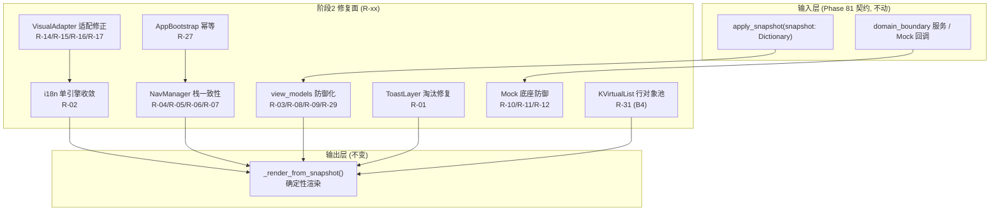

# 施工细则：单兵纯前端模块逻辑/性能/结构优化与防御健壮性提纯 —— 阶段2：核心逻辑缺陷与性能热点修复

> [!NOTE]
> **【施工目标】**：依据阶段1 改动理由总表，修复纯前端模块的 P0 崩溃/挂起缺陷与 P1 逻辑正确性、性能热点缺陷——覆盖 Toast 淘汰死循环（R-01）、i18n 双引擎占位符重复消费（R-02）、视图模型空引用与越界（R-03/R-08/R-09/R-29）、导航栈一致性（R-04/R-05/R-06/R-07）、视觉适配器 CJK 宽度/兜底/Tab 粒度/破坏性改写（R-14~R-17）、Mock 悬空回调和槽位与错误码（R-10/R-11/R-12）、启动幂等（R-27）、`k_virtual_list` 行对象池与 `reset_state()` 契约（R-31，用户裁定 B4）。本阶段**只修缺陷与热点，不做大范围结构重组**（结构收敛留阶段3）。
> **案卷全局共享上下文**：👉 [KALAR-DEV-2026-ST78-ATT_附件_案卷共享契约与上下文.md](KALAR-DEV-2026-ST78-ATT_附件_案卷共享契约与上下文.md)。
> **【施工开始日期】：施工开始日期: 2026-09-11（中午 12:34）** —— 真实读取系统时间。
> 状态：✅ 已完成（Phase 82 全域验收通过，110 套件 · 760 断言 · audit-all 20/20 全绿）
> **【用户指令溯源】**：用户明确诉求（2026-09-11）——「请对现有代码进行全面完善与优化改造：单兵模块保持纯前端实现，不接入任何后端接口或服务；深入梳理并优化整体逻辑、性能与结构；严格遵守项目既定的开发规范与命名约定，确保代码风格统一、可维护，并明确说明各优化点的改动理由。」**（补记：2026-09-11 用户就 B1~B4 边界项拍板：B1 清零 / B2 删除 / B3 暂不接线 / B4 引入对象池）**
> **【对应需求源】**：[路线图总索引](../../../../路线图/路线图总索引.md)。
> 📍 **卷内快速直达**：[ATT 共享附件](KALAR-DEV-2026-ST78-ATT_附件_案卷共享契约与上下文.md) ｜ [阶段1](KALAR-DEV-2026-ST78-001_阶段1_残留缺口穿透审计与改动理由基线固化.md) ｜ **阶段2 (当前)** ｜ [阶段3](KALAR-DEV-2026-ST78-003_阶段3_结构收敛与配置驱动边界治理.md) ｜ [阶段4](KALAR-DEV-2026-ST78-004_阶段4_全量回归验收与工程闭环.md)

---

## 📌 第一性原理溯源指针

* **精准上游规范指针**：本卷第 1 阶段《残留缺口穿透审计与改动理由基线固化》全表（G-01~G-31、R-01~R-31、B1~B4）；`docs/模板/GD老练风格硬性规范标准.md` §三（卫语句/模式匹配，行 73~118）、§四（Result 包装与零硬编码降级，行 121~150）、§五（循环零开销/对象池/Dirty 批处理，行 152~164，含 `ADV-POOL-001` 对象池复用契约）。
* **核心不变量约束断言**：
  * `Inv-P82-2-1 (渲染确定性)`：i18n 解析、视觉适配、视图模型更新对同一输入恒定产出同一结果，不得因修复引入随机或时序依赖；
  * `Inv-P82-2-2 (契约零回归)`：`apply_snapshot` 唯一入口、`FrontendSnapshot.read_*` 语义、五态容器行为不得改变；
  * `Inv-P82-2-3 (零静默崩溃)`：所有被修复路径须有可复现的边界断言（空值/类型漂移/NaN/INF/越界）；
  * `Inv-P82-2-4 (纯前端)`：修复不得引入 `res://backend` 实例化、网络调用或 `EventBusCore` 订阅。
* **防漂移最高指示**：每条改动必须回指阶段1 的 R-xx 编号并给出量化前后对比；严禁「顺手」扩大改动面；禁止以删除测试覆盖替代缺陷修复。

---

## 一、 核心缺陷修复与热点治理设计 (Defect Fix & Hotspot Governance)

### 1.1 修复链路总览



### 1.2 i18n 单引擎收敛（R-02）

```gdscript
# 模块路径: res://frontend/i18n/ui_text_resolver.gd
# 收敛前: resolve() 内 _fill_params 裸替换消费占位符 -> PlaceholderFiller 空转
# 收敛后: resolve() 只产出模板, 填充唯一由 PlaceholderFiller 承担
static func resolve(key: String, params: Dictionary = {}) -> String:
	var inst := get_instance()
	var template := inst._get_raw_text(key)
	if template.is_empty():
		var fallback_views := GameConfig.get_string("frontend.views", key, "")
		if not fallback_views.is_empty():
			return PlaceholderFiller.fill(fallback_views, params)
		return "[" + key + "]"
	return PlaceholderFiller.fill(template, params)
```

* 同步收口 `ui_intermediary.gd` 内的六处调用（行 30-33/54-56/59-64/67-70/76-82/87-93）与 `ui_binding_registry.gd:71-72`：删除「resolve 已填充 → 再 fill」的二次调用，改为 `PlaceholderFiller.fill(UITextResolver 模板, data)` 的单次组合；
* `_fill_params` 保留为 `PlaceholderFiller.fill` 的委托或予以移除，确保千分位（`_format_thousands`）、百分比（`_format_value:37-41`）、时长（`_format_duration`）三条格式化分支对 `resolve` 路径**全部可达**；
* 验收锚点：`UITextResolver.resolve("ui.fe05.wallet.gold", {"amount": 5000})` 结果含 `5,000`（非裸 `5000`）。

### 1.3 视图模型防御化（R-03/R-08/R-09/R-29）

```gdscript
# 模块路径: res://frontend/view_models/combat_view_model.gd
func update_from_snapshot(snapshot: Dictionary) -> void:
	boss_name = str(snapshot.get("boss_name", boss_name))
	boss_hp_max = maxf(1.0, _safe_float(snapshot.get("boss_max_hp", boss_hp_max)))
	boss_hp_current = clampf(_safe_float(snapshot.get("boss_hp", boss_hp_current)), 0.0, boss_hp_max)
	boss_parts = FrontendSnapshot.read_array(snapshot, "boss_parts")  # 非 Array -> []
	# 同法: player_name(str) / player_hp_* / player_mp_* / player_ap_* 经 _safe_float + clampf(0, max)
	data_changed.emit()

static func _safe_float(value: Variant, fallback: float = 0.0) -> float:
	var f := float(value)
	return f if is_finite(f) else fallback

func append_log(category: String, message: String) -> void:
	if battle_logs.size() >= MAX_BATTLE_LOGS:
		battle_logs = battle_logs.slice(battle_logs.size() - MAX_BATTLE_LOGS + 1)
	battle_logs.append({"category": category, "message": message, "timestamp": Time.get_ticks_msec()})
	data_changed.emit()
```

```gdscript
# 模块路径: res://frontend/view_models/character_hud_view_model.gd
func update_from_domain(domain: CharacterDomainModel) -> void:
	if domain == null:
		return
	var safe_cur := domain.current_hp if is_finite(domain.current_hp) else 0.0
	var safe_max := domain.max_hp if is_finite(domain.max_hp) and domain.max_hp >= 1.0 else 1.0
	hp_display_text = "%d / %d" % [int(clampf(safe_cur, 0.0, safe_max)), int(safe_max)]
	# 同法: hp_progress_ratio 经 get_health_ratio() 已 clamp; hp_bar_color 阈值换色与钱包三元组格式化保持原语义
```

* `MAX_BATTLE_LOGS` 上限常量落 `DesignTokens` 或本类常量（严禁魔法数字）；
* 全域视图的裸 `snapshot.get(...) as Array/Dictionary`（G-29 清单：`crafting_workshop_view.gd:207-213`、`world_map_view.gd:175,221,228`、`guild_social_view.gd:173,177`、`gacha_wish_view.gd:268,270`、`economy_trade_view.gd:142-200`、`mail_system_view.gd:80`、`quest_causality_view.gd:111,113`、`monster_ecology_view.gd:390`、`grimoire_authoring_view.gd:161`、`system_save_view.gd:630`、`misc_edge_view.gd:661`、`character_progression_view.gd:899` 等）统一改经 `FrontendSnapshot.read_array/read_dict`。

### 1.4 导航栈一致性（R-04/R-05/R-06/R-07）

```gdscript
# 模块路径: res://frontend/navigation/nav_manager.gd
func _navigate_to(screen_id: String, params: Dictionary, record_history: bool) -> Control:
	if not _screen_registry.has(screen_id):
		printerr("[NavManager] 未注册的 Screen: %s" % screen_id)
		return null
	var inst := _instantiate_cached(screen_id)
	if inst == null:
		return null
	# 先确保可挂载: 宿主无效则不入栈, 杜绝孤儿 + 栈不一致
	if _app_root == null or _app_root.screen_container == null:
		printerr("[NavManager] 宿主未绑定, 拒绝跳转以保持栈/场景一致: %s" % screen_id)
		inst.queue_free()
		return null
	_destroy_current_screen()
	_current_screen = inst
	_app_root.screen_container.add_child(inst)
	inst.set_anchors_and_offsets_preset(Control.PRESET_FULL_RECT)
	if record_history:
		_screen_stack.append(screen_id)   # 挂载成功后才写栈
	if inst.has_method("on_screen_enter"):
		inst.call("on_screen_enter", params)
	return inst

func replace_screen(screen_id: String, params: Dictionary = {}) -> Control:
	var prev_depth := _screen_stack.size()
	var result := _navigate_to(screen_id, params, true)
	if result != null and prev_depth > 0:
		_screen_stack.remove_at(prev_depth - 1)  # 跳转成功后再抹去被替换项, 失败则栈不变
	return result

func pop_screen() -> Control:
	if _screen_stack.size() <= 1:
		printerr("[NavManager] 已经是栈底，无法继续返回")
		return null
	var prev_id: String = _screen_stack[_screen_stack.size() - 2]
	var result := _navigate_to(prev_id, {}, false)
	if result != null:
		_screen_stack.pop_back()   # 目标解析成功才真正出栈
	return result
```

* `_scene_cache` 逐出：设定最大条目常量（落 `DesignTokens`），超限时按插入序 FIFO 逐出（R-07）。

### 1.5 Toast 淘汰死循环修复（R-01）

```gdscript
# 模块路径: res://frontend/presentation/common/toast_layer.gd
func show_toast(message: String, level: int = NavTypes.ToastLevel.INFO, duration_sec: float = 2.0) -> void:
	while get_child_count() > MAX_TOASTS:   # 先移除使计数即时递减
		var oldest: Node = get_child(0)
		if oldest == null:
			break
		remove_child(oldest)   # 立即解除父子, get_child_count 当帧递减
		oldest.queue_free()    # 延迟释放对象
	# 其后构造 panel/lbl、加色覆盖、add_child(panel) 与淡入淡出 tween 序列保持原实现不动
```

### 1.6 视觉适配器修正（R-14/R-15/R-16/R-17）

```gdscript
# 模块路径: res://frontend/i18n/visual_adapter.gd
const CJK_WIDTH_RATIO := 1.0     # 全角近似 1.0em
const LATIN_WIDTH_RATIO := 0.5   # 半角近似 0.5em

static func _estimate_width(text: String, size: int, is_cjk: bool) -> float:
	var ratio := CJK_WIDTH_RATIO if is_cjk else LATIN_WIDTH_RATIO
	return float(text.length()) * float(size) * ratio

static func adapt_button(button: Button, text: String) -> void:
	# 保留原阶梯遍历 [16,14,12] 逐级降字号并置 fitted 标志的既有逻辑
	if not fitted:
		button.clip_text = true               # 兜底: 不溢出
		button.text_overrun_behavior = TextServer.OVERRUN_TRIM_ELLIPSIS

static func adapt_tab_title(container: TabContainer, text: String, tab_index: int) -> void:
	# 按 tab_index 粒度: 仅对该项标题生效 (不改写整容器字号)
	var current_size := _fit_tab_size(text)
	if tab_index >= 0 and tab_index < container.get_tab_count():
		container.set_tab_title(tab_index, _truncate_for_tab(text, current_size))
```

* `adapt_item_list_item`（R-17）：不再 `set_item_text` 覆盖源文本，改为「显示层截断」——保留源文本于调用方或在 `ItemList` 设 `text_overrun_behavior`，杜绝破坏性改写（语言切换后需可还原）。

### 1.7 Mock 底座与启动幂等（R-10/R-11/R-12/R-27）

```gdscript
# 模块路径: res://frontend/domain_boundary/mocks/mock_base_service.gd
	var cb := func() -> void:
		if not callback.is_valid():   # R-10: 超时回调复查有效性
			return
		callback.call(result)
	tree.create_timer(float(delay_ms) / 1000.0).timeout.connect(cb)
```

```gdscript
# 模块路径: res://frontend/app/app_bootstrap.gd
static var _bootstrapped: bool = false

static func bootstrap(app_root: AppRoot) -> void:
	var nav := NavManager.get_instance()
	nav.bind_root(app_root)
	if app_root != null:
		# ModalManager/TooltipManager/DrawerManager/ContextMenuManager 的 bind_layer 幂等重绑保持原样
		pass
	if _bootstrapped:
		return                    # R-27: 重复引导不再重跑生命周期与入口压栈
	_bootstrapped = true
	var services := MockServiceContainer.get_instance()
	_drive_lifecycle_boot(services)
	var theme_mgr := ThemeManager.get_instance()
	if app_root != null:
		app_root.theme = theme_mgr.theme
	nav.push_screen("account_entry")
```

* `mock_auth_service.gd:57` 槽位改 `"SLOT_%02d" % (_mock_characters.size() + 1)`（R-11）；
* 错误码域统一为 `ERR_*`（R-12）：`mock_auth_service` 的 `EMPTY_USERNAME/INVALID_CREDENTIALS/PARAM_INVALID/NAME_EMPTY` 与 `account_entry_view` 的 `ERR_EMPTY_USERNAME/ERR_USERNAME_TOO_SHORT` 归并为同一 `ERR_*` 前缀域，两侧同步。

### 1.8 `k_virtual_list` 行对象池与 `reset_state()` 契约（R-31，用户裁定 B4）

> 依据裁定 B4「引入对象池」：为 `frontend/components/k_virtual_list.gd` 引入**行对象池**，消除滚动/重建时的瞬态堆分配，对齐 `ADV-POOL-001`。**本卷仅组件层落地 + 接口预留；不得改动 `main_hud` 或既有列表视图的渲染语义**（与消费方接线仅提供接口，属后续演进）。

```gdscript
# 模块路径: res://frontend/components/k_virtual_list.gd
# 职责扩展: 在既有可见区间计算之上，新增行节点对象池（对齐 ADV-POOL-001）
const POOL_HARD_CAP: int = 128          # 池硬上限（防无限膨胀，魔法数字入常量）

var _row_pool: Array[Control] = []      # 空闲行节点栈
var _active_rows: Dictionary = {}       # index -> Control（在显可见行）

## 取用一枚行节点：优先复用池中空闲项，池空则新建
func acquire_row() -> Control:
    if not _row_pool.is_empty():
        var reused: Control = _row_pool.pop_back()
        reused.visible = true
        return reused
    var fresh: Control = Control.new()
    return fresh

## 归还一枚行节点：先置隐形并清态，再入池；超硬上限则直接释放
func release_row(row: Control) -> void:
    if row == null or not is_instance_valid(row):
        return
    if row.has_method("reset_state"):
        row.call("reset_state")         # 契约：归还前必须清态
    row.visible = false
    if _row_pool.size() >= POOL_HARD_CAP:
        row.queue_free()
        return
    _row_pool.append(row)

## 回收时机：可视区间变化（_refresh_range 命中）时收回离区行、按需取用入区行
func _recycle_rows_for_range(start_idx: int, end_idx: int) -> void:
    for idx in _active_rows.keys():
        if idx < start_idx or idx > end_idx:
            release_row(_active_rows[idx])
            _active_rows.erase(idx)
```

* **池化对象 `reset_state()` 接口规范（`ADV-POOL-001` 契约）**：池化行节点（消费方传入的 `Control`）须实现无参 `reset_state() -> void`，职责为「复位一切跨复用残留」——①断开上一行的数据绑定（i18n 键/文本/图标/进度/选中态清零）；②复位 `visible=true` 前的内部状态与信号连接（确保 `acquire_row()` 复用时不携带旧行语义）；③不得销毁自身节点、不得 `queue_free()`；④幂等，多次调用结果一致；
* **池容量与回收策略**：池容量上界 = 可视区间容量（`ceil(view_h/item_height) + 2*buffer_count`），并受 `POOL_HARD_CAP` 硬约束；采用**后进先出（LIFO）**复用（`pop_back`/`append`），使热点行节点留在池中；`set_total_count` 缩容或视图销毁时清空池并逐项 `queue_free`；
* **ADV-POOL-001 合规点**：①显式 `acquire/release` 生命周期对称；②复用前强制 `reset_state()` 清态，杜绝脏状态串行；③池有硬上限、无无界增长；④无重复入池（归还后即从 `_active_rows` 移除）；
* **接口预留声明**：本卷仅为 `k_virtual_list` 提供 `acquire_row()/release_row()/reset_state()` 契约与自测；`main_hud` 战报终端与各列表视图的接线**不在本卷范围**，仅预留接口供后续演进区消费（禁止越界扩范围）。

---

## 二、 命令式施工执行清单 (Agent Execution Checklist)

- [ ] **Step 2.1: i18n 单引擎收敛（R-02）** - `resolve` 只产模板，六处调用点去重，三条格式化分支验证可达
- [ ] **Step 2.2: 视图模型防御化（R-03/R-08/R-09/R-29）** - clamp/有限性守卫/日志上限/`FrontendSnapshot.read_*` 替换全清单
- [ ] **Step 2.3: 导航栈一致性（R-04/R-05/R-06/R-07）** - 先挂载后写栈、replace/pop 失败不动栈、缓存 FIFO 逐出
- [ ] **Step 2.4: Toast 淘汰修复（R-01）** - `remove_child`+`queue_free` 解除死循环，上限行为断言
- [ ] **Step 2.5: 视觉适配修正（R-14/R-15/R-16/R-17）** - CJK 系数、按钮兜底、Tab 粒度、去破坏性改写
- [ ] **Step 2.6: Mock 底座与启动幂等（R-10/R-11/R-12/R-27）** - 回调复查、槽位补零、错误码归并、`bootstrap` 幂等守卫
- [ ] **Step 2.7: KVirtualList 行对象池（R-31/B4）** - `acquire_row/release_row/reset_state` 契约、池容量与 LIFO 回收、`ADV-POOL-001` 合规；仅组件层落地 + 接口预留，不接线消费方

---

## 三、 修复与热点验收矩阵 (DoD Matrix)

| 检验项 ID | 校验目标 | 验证输入 | 预期输出断言 |
| :--- | :--- | :--- | :--- |
| `TC-P82-S2-01` | i18n 格式化生效 | `resolve("ui.fe05.wallet.gold", {"amount": 5000})` | 结果含千分位 `5,000`；百分比/时长分支命中 |
| `TC-P82-S2-02` | 视图模型空值防御 | `update_from_snapshot({"boss_parts": null})` | 返回不崩溃，`boss_parts == []` |
| `TC-P82-S2-03` | 数值越界/非有限防御 | `current_hp=-5`、`hp=NAN/INF` | 显示被 clamp 至 `[0,max]`，无异常整数 |
| `TC-P82-S2-04` | 日志有界 | 连续 `append_log` 超上限 | 日志条目 ≤ `MAX_BATTLE_LOGS`，最旧被裁剪 |
| `TC-P82-S2-05` | Toast 淘汰不死循环 | 压入 > `MAX_TOASTS` 条 | `show_toast` 单次调用及时返回，子节点数 ≤ 上限 |
| `TC-P82-S2-06` | 导航宿主缺失防护 | `bind_root` 前 `push_screen` | 返回 `null`，栈深不变，无孤儿节点 |
| `TC-P82-S2-07` | 导航失败不动栈 | `replace_screen("未注册")` | 返回 `null`，栈长度不变 |
| `TC-P82-S2-08` | 视觉适配兜底 | 超长按钮/中文标题/Tab 项 | 按钮不溢出、Tab 逐项自适应、ItemList 源文本可还原 |
| `TC-P82-S2-09` | Mock 悬空回调 | 定时器期间使回调失效 | 超时不崩溃，安全返回 |
| `TC-P82-S2-10` | 启动幂等 | 二次 `bootstrap(app_root)` | 无重复压栈、无非法状态跃迁 |
| `TC-P82-S2-11` | 行对象池复用与清态 | 滚动前进/后退交叉区间；`acquire_row`→`release_row` 循环，经 `reset_state()` 清态 | 稳态复用命中池、行节点新建次数 O(可视区间)；复用行无脏状态；无重复入池；池受 `POOL_HARD_CAP` 约束；`ADV-POOL-001` 合规 |
