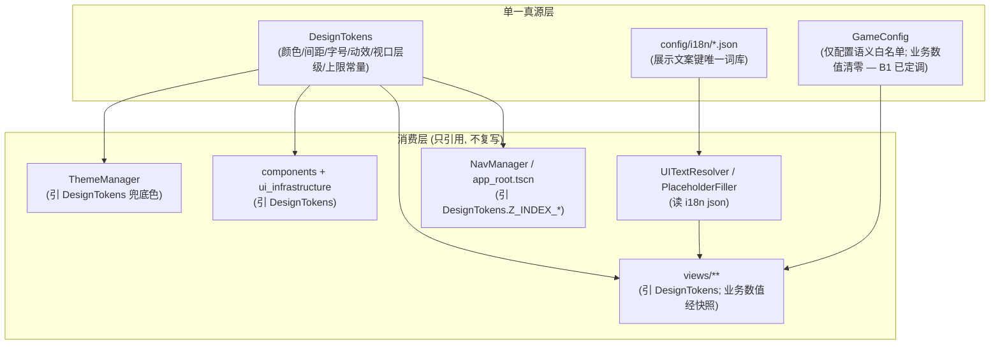

# 施工细则：单兵纯前端模块逻辑/性能/结构优化与防御健壮性提纯 —— 阶段3：结构收敛与配置驱动边界治理

> [!NOTE]
> **【施工目标】**：在阶段2 缺陷修复基础上完成结构收敛与配置驱动边界治理——i18n 绑定注册表 O(n)→O(1) 索引化（R-13）、主题色单一真源（R-18）、视口层级真源收敛（R-19）、视图直读 `GameConfig` 业务数值清零与配置语义白名单（R-20，B1）、Phase 81 新建文件硬编码文案 i18n 化（R-21）、UI 管理器幂等与生命周期（R-22/R-23/R-24）、Mock 夹具可证伪化与单例重置（R-25/R-26）、注释计数与死视图终局处置（R-28/R-30，B2）。本阶段为唯一涉及**边界决策执行**的阶段，依 **2026-09-11 边界裁定 B1（清零）/B2（删除）** 启动，B3 延后不接线、B4 对象池已于阶段2 落地。
> **案卷全局共享上下文**：👉 [KALAR-DEV-2026-ST78-ATT_附件_案卷共享契约与上下文.md](KALAR-DEV-2026-ST78-ATT_附件_案卷共享契约与上下文.md)。
> **【施工开始日期】：施工开始日期: 2026-09-11（中午 12:34）** —— 真实读取系统时间。
> 状态：✅ 已完成（Phase 82 全域验收通过，110 套件 · 760 断言 · audit-all 20/20 全绿）
> **【用户指令溯源】**：用户明确诉求（2026-09-11）——「请对现有代码进行全面完善与优化改造：单兵模块保持纯前端实现，不接入任何后端接口或服务；深入梳理并优化整体逻辑、性能与结构；严格遵守项目既定的开发规范与命名约定，确保代码风格统一、可维护，并明确说明各优化点的改动理由。」**（补记：2026-09-11 用户就 B1~B4 边界项拍板：B1 清零 / B2 删除 / B3 暂不接线 / B4 引入对象池）**
> **【对应需求源】**：[路线图总索引](../../../../路线图/路线图总索引.md)。
> 📍 **卷内快速直达**：[ATT 共享附件](KALAR-DEV-2026-ST78-ATT_附件_案卷共享契约与上下文.md) ｜ [阶段1](KALAR-DEV-2026-ST78-001_阶段1_残留缺口穿透审计与改动理由基线固化.md) ｜ [阶段2](KALAR-DEV-2026-ST78-002_阶段2_核心逻辑缺陷与性能热点修复.md) ｜ **阶段3 (当前)** ｜ [阶段4](KALAR-DEV-2026-ST78-004_阶段4_全量回归验收与工程闭环.md)

---

## 📌 第一性原理溯源指针

* **精准上游规范指针**：本卷第 1 阶段改动理由总表（R-13/R-18~R-31）与边界裁定（B1~B4，2026-09-11 已定调）；第 2 阶段修复后基线；`docs/模板/GD老练风格硬性规范标准.md` §一（命名/类型，行 11~30）、§二（解耦与扩展，行 33~72）、§四（零硬编码与配置降级，行 135~141）、§五（循环零开销/哈希映射，行 152~164）、§九（前端边界契约，行 277~351，含 §9.2 视图严禁自读 GameConfig 业务数值）；`docs/模板/工程化需求四阶段总标准.md` §3（工程化与配置驱动，行 77~111）。
* **核心不变量约束断言**：
  * `Inv-P82-3-1 (边界单一真源)`：颜色、层级、间距、字号、文案键各只有**一个**权威定义点，其余位置一律引用而非复写；
  * `Inv-P82-3-2 (依赖单向不破)`：结构收敛不得新增 `frontend/` 对 `backend/` 领域服务的运行时依赖，不得引入网络调用或 `EventBusCore` 订阅；
  * `Inv-P82-3-3 (契约零回归)`：`apply_snapshot`、`FrontendSnapshot`、五态容器、i18n 消费者 API 签名保持兼容；
  * `Inv-P82-3-4 (可证伪断言)`：Mock 兜底不得再使「非空」类断言恒真，空态/极值路径必须可被测试证伪。
* **防漂移最高指示**：配置语义与业务数值的边界以 **2026-09-11 裁定 B1（`GameConfig` 算依赖、业务数值直读清零，仅保留配置语义白名单）** 为准；严禁借「结构收敛」之名扩大业务改动；删除类操作（R-30/B2）已获用户授权，须留破坏性删除的回滚预案。

---

## 一、 结构收敛与配置驱动边界治理设计 (Structural Convergence & Boundary Governance)

### 1.1 收敛后依赖与真源拓扑



### 1.2 绑定注册表索引化（R-13）

```gdscript
# 模块路径: res://frontend/i18n/ui_binding_registry.gd
# 索引: instance_id -> _bindings 下标, 使 bind/unbind 由 O(n) 降为 O(1)
var _bindings: Array[Dictionary] = []
var _index: Dictionary = {}   # node.get_instance_id() -> int

func bind(node: Node, key: String, params: Dictionary = {}) -> void:
	if node == null or not is_instance_valid(node):
		return
	var nid := node.get_instance_id()
	var existing: int = _index.get(nid, -1)
	if existing >= 0 and existing < _bindings.size():
		_bindings[existing].key = key
		_bindings[existing].params = params
		return
	_index[nid] = _bindings.size()
	_bindings.append({"ref": weakref(node), "key": key, "params": params, "type": _detect_node_type(node)})
```

* `unbind`/`unbind_view`/`refresh_all` 的移除路径须**同步重建 `_index`**（避免下标漂移）；
* 验收锚点：绑定 1000 节点总调用次数由 O(N²) 降为 O(N)，`count()` 与 `_index.size()` 恒等。

### 1.3 主题与层级单一真源（R-18/R-19）

```gdscript
# 模块路径: res://frontend/theme/design_tokens.gd (新增语义兜底色与视口上限)
const COLOR_BG_DEFAULT: Color = Color(0.06, 0.08, 0.12, 1.0)
const COLOR_SURFACE_DEFAULT: Color = Color(0.10, 0.14, 0.20, 1.0)
const COLOR_BORDER_DEFAULT: Color = Color(0.18, 0.25, 0.35, 1.0)
const COLOR_BUTTON_PRESSED: Color = Color(0.20, 0.30, 0.45, 1.0)
# 视口层级唯一真源 (nav_types.LayerLevel 与 app_root.tscn 均引用本组)
const Z_INDEX_BACKGROUND: int = -10
const Z_INDEX_SCREEN: int = 0
const Z_INDEX_HUD: int = 10
const Z_INDEX_MODAL: int = 50
const Z_INDEX_OVERLAY: int = 80
const Z_INDEX_DEBUG: int = 100
# 有界常量 (循环/缓存/日志上限)
const SCENE_CACHE_MAX: int = 32
const BATTLE_LOG_MAX: int = 200
```

* `ThemeManager._setup_base_styles` 的 `DEFAULT_*`（行 24-32、79）改为引用 `DesignTokens.*`；视图中的 `ThemeManager.DEFAULT_*`（`gacha_wish_view.gd:379,593,600`、`crafting_workshop_view.gd:398,404,593`）改引 `DesignTokens.*`，使 `ThemeManager.DEFAULT_*` 的外部引用清零；
* 视口层级真源收敛：`nav_types.LayerLevel`（行 10-17）改为由 `DesignTokens.Z_INDEX_*` 派生（或删除死枚举），`app_root.tscn` 六层 `layer=` 数值与之一致，消除「80 vs 100 / 100 vs 120」三方冲突；`DRAWER/POPOVER/TOAST` 若确无独立层则不再单列，避免幽灵常量。

### 1.4 视图直读 GameConfig 边界治理（R-20，裁定 B1：算依赖，须清零）

```gdscript
# ★ 保留示例落点: res://frontend/views/main_hud/main_hud_view.gd
# 允许: 读取"配置语义"(纯表现容量/时长上限、键名/文案键、校验阈值) — 登记入白名单
var max_terminal_lines: int = GameConfig.get_int("frontend.views", "fe02_main_hud/max_terminal_lines", 100)
# ★ 迁出示例落点: res://frontend/views/account_entry/account_entry_view.gd
# 禁止: 读取"业务数值/演示数据" → 一律经 BaseScreen.apply_snapshot() 唯一入口注入
#   迁移前: var server_list: Array = GameConfig.get_array("frontend.views", "fe01_account_entry/default_servers", [])
#   迁移后: apply_snapshot({"character_slots": auth_service.get_servers_async(callback) 的回调载荷})
```

* **配置语义白名单判定口径（可直读 = 配置语义，须登记）**：仅当读取值属于「纯表现/结构语义、不含业务状态含义」时方可保留直读，满足以下任一且不落「不可直读」清单：
  1. **纯表现容量/时长上限**：仅约束渲染资源占用（如 `fe02_main_hud/max_terminal_lines`、`fe04_combat_view/default_text_lifetime`、`fe14_notification_bulletin/default_toast_duration`）；
  2. **键名/文案键/格式串**：仅作 i18n 键兜底或格式前缀（如 `fe05_economy_trade/default_shop_title`、`fe16_system_save/default_slot_prefix`）；
  3. **交互校验阈值**：仅约束交互流程判定、非业务数值（如 `fe01_account_entry/min_username_len`、`fe15_settings_center/revert_timeout_seconds`）；
  4. **纯表现初值**：仅影响初始呈现、不承载业务状态（如 `fe10_world_map/default_zoom`）。
* **不可直读（= 业务数值，一律清零）判据**：凡读取值承载**业务状态或演示数据**，即归业务数值，须迁 `domain_boundary` 服务快照注入，包括：①角色属性初值（HP/MP/AP 的 current/max）；②业务槽位/上限（槽位数、默认动作槽、`max_guild_members`、`max_chat_lines`、`pity counter`）；③名册/列表内容（servers、shop items、skills、titles、inventory、banners、guild roster、resource pools、materials、recipes）；④业务量值（余额/资金/等级/价格/汇率/概率）；⑤业务状态初值（账号默认服/种族、卡池 id、音量/分辨率/语言等用户状态初值）。
* **待清零清单（视图:行，共 8 视图 / 43 条，静态扫描目标「业务数值直读点 = 0」）**：

| 视图文件 | 待清零条目（行: 配置键） | 条数 |
| :--- | :--- | :---: |
| `views/account_entry/account_entry_view.gd` | `21: default_server_id`、`28: default_race`、`31: default_servers` | 3 |
| `views/main_hud/main_hud_view.gd` | `72/73: default_hp (cur/max)`、`74/75: default_mp (cur/max)`、`76/77: default_ap (cur/max)`、`94: default_action_slots` | 7 |
| `views/character_progression/character_progression_view.gd` | `146: base_attributes`、`150: default_potential_points`、`294: default_equipped_slots`、`311: mock_skill_nodes`、`320: mock_titles`、`352: mock_inventory_items` | 6 |
| `views/economy_trade/economy_trade_view.gd` | `375: default_shop_items`、`436: auction_items_mock`、`444: auction_my_listings_mock`、`492: caravan_list_mock`、`547: commodity_prices`、`651: resource_pools_mock` | 6 |
| `views/crafting_workshop/crafting_workshop_view.gd` | `170: forge_recipes_mock`、`180: dismantle_items_mock`、`187: materials_mock` | 3 |
| `views/gacha_wish/gacha_wish_view.gd` | `40: default_banner_id`、`43: default_pity_counter`、`239: banners_mock` | 3 |
| `views/guild_social/guild_social_view.gd` | `15: max_guild_members`、`16: max_chat_lines`、`220: guild_name`、`221: guild_level`、`222: guild_leader`、`223: guild_funds`、`224: guild_announcement`、`237: trade_partner`、`827: local_player_name` | 9 |
| `views/settings_center/settings_center_view.gd` | `13: default_volume_master`、`14: default_volume_bgm`、`15: default_volume_se`、`21: default_resolution`、`28: default_locale`、`445: default_resolution` | 6 |
| **合计** | **8 视图** | **43** |

* **配置语义白名单保留清单（共 8 视图 / 10 条，登记后方可直读）**：`account_entry_view.gd:354`（`min_username_len` 校验阈值）、`combat_view.gd:394`（`default_text_lifetime` 表现时长）、`economy_trade_view.gd:22`（`default_shop_title` 文案键）、`main_hud_view.gd:106`（`max_terminal_lines` 表现容量）、`settings_center_view.gd:26/111/407`（`revert_timeout_seconds` 交互门限）、`notification_bulletin_view.gd:570`（`default_toast_duration` 表现时长）、`system_save_view.gd:94`（`default_slot_prefix` 格式前缀）、`world_map_view.gd:101`（`default_zoom` 表现初值）。
* **唯一注入契约对齐**：全部迁出项经 `base_screen.gd:32 apply_snapshot(payload)` 注入 → `_render_from_snapshot()`；视图不得自读业务数值，与 GD 规范 §9.2「视图严禁自读 GameConfig 业务数值」一致。
* 交付物：`视图 × GameConfig 读取点` 迁移映射表（每点标注「保留（语义，白名单）/迁出（数值）」与目标服务方法，见 1.7）。

### 1.5 i18n 文案清零与 UI 管理器治理（R-21/R-22/R-23/R-24）

```gdscript
# 模块路径: res://frontend/ui_infrastructure/dialog_manager.gd (示例)
var btn_ok := Button.new()
btn_ok.text = UIIntermediary.text("ui.common.dialog.confirm")   # 原内联 "确认"
```

* 清零清单（R-21）：`dialog_manager.gd:25,35,53,78,86`、`context_menu_manager.gd:78`、`ui_state_container.gd:46,51,62,68`、`loading_overlay.gd:24`、`k_button.gd:33`——全部改经 `UIIntermediary.text/resolve`；新增 i18n 键入 `config/i18n/zh_CN.json` 与 `en_US.json`（成对）；
* `tooltip_manager._ensure_bubble`（R-22）：重绑时若容器变更，迁移 `_bubble_panel` 至新容器，达成幂等；
* `ui_audio_bridge.play_sfx`（R-23）：依裁定 B3「暂不接线（保留占位）」——本卷**不接线**，保留纯信号桥与 7 个 `play_*` 发射方法；阶段1 §1.6 已登记为「待接线占位项（延后至长期演进区）」，阶段4 仅断言占位保留且无运行时报错。
* `base_modal.gd:4`/`loading_overlay.gd:4`（R-24）：头注释与实现对齐（补动画/指示器，或修正注释描述），杜绝文档-代码漂移。

### 1.6 Mock 夹具可证伪与单例重置（R-25/R-26/R-28/R-30）

```gdscript
# 模块路径: res://frontend/domain_boundary/mocks/mock_data_catalog.gd
static func get_domain_data(domain_id: String) -> Dictionary:
	match domain_id:
		"empty_sample":
			return {}                       # 可证伪的空态夹具
		"extreme_sample":
			return {"hp_current": 0.0, "hp_max": 1.0, "amount": 9223372036854775807}
		# 其余 account/hud_snapshot/combat/world_map/economy/guild/mail 真实域保持原实现
		_:
			return {}                       # 未登记域不再返回非空兜底
```

* 新增 EMPTY/极值夹具，使「非空」类断言恢复可证伪（R-25）；
* `MockServiceContainer`/`MockAuthService` 增 `reset_instance()`（R-26），`teardown` 期重置 `_mock_characters` 与 `_services`；
* `nav_manager.gd:23` 注释计数修正为 17（R-28）；
* `legacy/main_dashboard`（R-30/B2）：依裁定 B2「删除」执行——删除 `main_dashboard.gd` + `main_dashboard.tscn` + `main_dashboard.gd.uid` 伴生文件；并清理 `nav_manager` 注册表（**经扫描 0 命中**，无相关注册需移除）、全库 `.gd/.tscn/.uid` 引用（`main_dashboard.tscn:3` 的 `ext_resource` 指向随文件删除自然消除）、`config/frontend/ui.json` 死注释段；**仅前端本地，零后端接线**；回滚预案=提交前副本留存；验收断言「删除后全库零引用 + `frontend/legacy/` 目录不存在」。

### 1.7 结构收敛交付映射表（节选，实施时全量展开）

| 视图/模块 | GameConfig 语义保留点 | GameConfig 数值迁出点 | 目标服务方法 |
| :--- | :--- | :--- | :--- |
| account_entry | `min_username_len`、`default_server_id`、`default_race` | `default_servers`（列表内容） | `auth().get_servers_async` |
| main_hud | `max_terminal_lines` | `default_hp/mp/ap`、`default_action_slots` | `world().get_hud_snapshot` |
| character_progression | `default_potential_points` | `base_attributes`、`mock_skill_nodes`、`mock_titles`、`mock_inventory_items` | `character().get_profile` |
| economy_trade | — | `default_shop_items`、`auction_*_mock`、`caravan_list_mock`、`commodity_prices` | `economy().get_market` |
| settings_center | `revert_timeout_seconds`（交互门限，白名单） | `default_volume_master/bgm/se`、`default_resolution`、`default_locale` | `settings` 服务经 `apply_snapshot` 注入（B1 定调） |
| crafting_workshop | — | `forge_recipes_mock`、`dismantle_items_mock`、`materials_mock` | `crafting` 服务经 `apply_snapshot` 注入 |
| gacha_wish | — | `default_banner_id`、`default_pity_counter`、`banners_mock` | `gacha` 服务经 `apply_snapshot` 注入 |

### 1.8 本阶段两条主线任务（依 2026-09-11 裁定）

> 两条主线均为**仅前端本地改动，零后端接线**：不得新增 `res://backend` 实例化、网络调用或 `EventBusCore` 订阅；不得修改任何业务代码以外的测试/配置口径（配置仅在清理死注释段时触及）。

**主线任务①：`GameConfig` 业务数值直读清零（B1 / R-20）**
* 目标：将 §1.4 待清零清单中 **8 视图 43 条**业务数值直读全部迁出，改经 `BaseScreen.apply_snapshot()` 唯一入口注入（对齐 `base_screen.gd:32`）；仅保留 §1.4 白名单中 **8 视图 10 条**配置语义读取并登记。
* 判据：白名单外「视图直读 `GameConfig` 业务数值点 = 0」；静态扫描 `frontend/views/**` 的 `GameConfig.get_array/get_dict/get_float/get_int/get_string` 全部落白名单。
* 边界：仅前端本地，零后端接线；`GameConfig` 本身仍作为配置语义读取器保留（不搬迁 `backend/infrastructure/`）。

**主线任务②：`legacy/main_dashboard` 删除与全库引用清理（B2 / R-30）**
* 删除物：`frontend/legacy/main_dashboard/main_dashboard.gd`、`main_dashboard.tscn`、`main_dashboard.gd.uid`（3 个文件，含其内部 18 处后端类直连残留 + `EventBusCore` 订阅 + 57 处 `GameConfig`）。
* 引用清理：`nav_manager` 注册表（**扫描 0 命中**）、全库 `.gd/.tscn/.uid` 引用（仅 `main_dashboard.tscn:3` 自引用，随文件删除消除）、`config/frontend/ui.json:62` 死注释段；`.godot/editor/project_metadata.cfg` 为编辑器缓存自动再生，不入手工清理。
* 边界：仅前端本地，零后端接线；回滚预案=提交前副本留存。
* 判据：「`frontend/legacy/` 目录不存在」且「全库引用扫描 0 命中」。

---

## 二、 命令式施工执行清单 (Agent Execution Checklist)

- [ ] **Step 3.1: 边界裁定落表与白名单登记（B1~B4，2026-09-11 已定调）** - 固化配置语义白名单（8 视图 10 条）与 B1 清零/B2 删除决议，B3 延后、B4 阶段2 已落地
- [ ] **Step 3.2: 绑定注册表索引化（R-13）** - `_index` O(1) 查重与移除重建，`count()` 恒等断言
- [ ] **Step 3.3: 主题与视口层级单一真源（R-18/R-19）** - 兜底色迁 `DesignTokens`、`LayerLevel`/`app_root.tscn` 对齐
- [ ] **Step 3.4: 【主线①】视图 GameConfig 业务数值直读清零（R-20/B1）** - 8 视图 43 条经 `apply_snapshot` 迁出，白名单 10 条登记，静态扫描业务数值直读点 = 0（仅前端本地，零后端接线）
- [ ] **Step 3.5: 文案清零与 UI 管理器治理（R-21/R-22/R-23/R-24）** - i18n 键新增成对，气泡迁移，音效占位登记（B3 不接线），注释对齐
- [ ] **Step 3.6: Mock 夹具与单例重置（R-25/R-26）** - EMPTY/极值夹具，`reset_instance`，teardown 重置
- [ ] **Step 3.7: 【主线②】死视图删除与全库引用清理（R-28/R-30/B2）** - 计数修正；删除 `legacy/main_dashboard`（3 文件）+ 清 `nav_manager`/`.gd/.tscn/.uid`/`ui.json` 死注释，全库零引用断言（仅前端本地，零后端接线）

---

## 三、 结构治理验收矩阵 (DoD Matrix)

| 检验项 ID | 校验目标 | 验证输入 | 预期输出断言 |
| :--- | :--- | :--- | :--- |
| `TC-P82-S3-01` | 绑定索引正确 | 绑定/解绑/刷新序列 | `count()` 与 `_index.size()` 恒等，无下标漂移 |
| `TC-P82-S3-02` | 颜色单一真源 | 扫描 `ThemeManager.DEFAULT_*` 外部引用 | 视图/组件引用为 0，均经 `DesignTokens` |
| `TC-P82-S3-03` | 视口层级单一真源 | `nav_types`/`design_tokens`/`app_root.tscn` 交叉核对 | 六层级数值三方一致，幽灵常量 0 |
| `TC-P82-S3-04` | 视图配置边界（B1） | 静态扫描 views 直读 GameConfig | 业务数值直读点 = 0（8 视图 43 条全迁出），保留点 10 条全部在白名单且经 `apply_snapshot` 语义可校验 |
| `TC-P82-S3-05` | 硬编码文案清零 | 扫描 Phase 81 新建文件内联中文 | 展示文案内联为 0，i18n 键 zh/en 成对存在 |
| `TC-P82-S3-06` | Mock 断言可证伪 | EMPTY/极值夹具 + 兜底分支 | 「非空」断言可被空态证伪，兜底不再恒真 |
| `TC-P82-S3-07` | 死视图删除终局（B2） | 引用与注册扫描 | `legacy/main_dashboard` 三文件已删除，无游离态、无残留注册 |
| `TC-P82-S3-08` | 零后端接线 | 静态扫描结构收敛改动 | 无 `res://backend` 运行时新增依赖与网络调用 |
| `TC-P82-S3-09` | legacy 删除零引用 | 全库 `.gd/.tscn/.uid` + `nav_manager` + `ui.json` 引用扫描 | `frontend/legacy/` 目录不存在；`main_dashboard` 零引用；`nav_manager` 无相关注册 |
