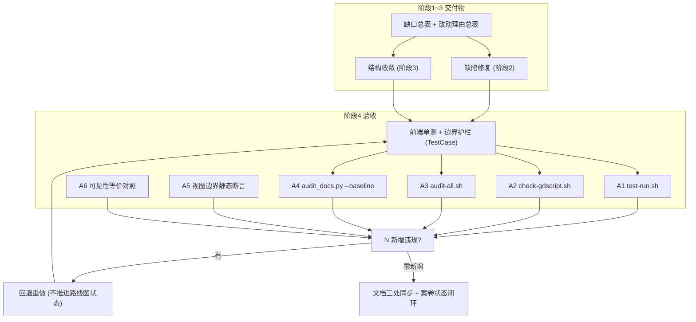

# 施工细则：单兵纯前端模块逻辑/性能/结构优化与防御健壮性提纯 —— 阶段4：1～3 全量回归验收与工程闭环

> [!NOTE]
> **【施工目标】**：对阶段1 缺口锚定与基线、阶段2 缺陷修复与热点治理、阶段3 结构收敛与边界治理执行全量回归验收——新增/改造前端单测与边界护栏测试、视图边界静态断言、可见性等价对照、`test-run`/`check-gdscript`/`audit-all` 三门禁零新增违规，并在路线图闭环后推进案卷状态；同时补验 **B1~B4 裁定落点**（白名单外零直读、`legacy/` 目录不存在、全库零引用、`KVirtualList.reset_state()` 池化契约、`UIAudioBridge` 占位无报错）。测试一律落 `tests/unit/frontend/`（前端单测）与 `tests/guards/`（边界护栏），继承 `TestCase`，严禁在 `tests/unit/` 根散落。
> **案卷全局共享上下文**：👉 [KALAR-DEV-2026-ST78-ATT_附件_案卷共享契约与上下文.md](KALAR-DEV-2026-ST78-ATT_附件_案卷共享契约与上下文.md)。
> **【施工开始日期】：施工开始日期: 2026-09-11（中午 12:34）** —— 真实读取系统时间。
> 状态：✅ 已完成（Phase 82 全域验收通过，110 套件 · 760 断言 · audit-all 20/20 全绿）
> **【用户指令溯源】**：用户明确诉求（2026-09-11）——「请对现有代码进行全面完善与优化改造：单兵模块保持纯前端实现，不接入任何后端接口或服务；深入梳理并优化整体逻辑、性能与结构；严格遵守项目既定的开发规范与命名约定，确保代码风格统一、可维护，并明确说明各优化点的改动理由。」**（补记：2026-09-11 用户就 B1~B4 边界项拍板：B1 清零 / B2 删除 / B3 暂不接线 / B4 引入对象池）**
> **【对应需求源】**：[路线图总索引](../../../../路线图/路线图总索引.md)。
> 📍 **卷内快速直达**：[ATT 共享附件](KALAR-DEV-2026-ST78-ATT_附件_案卷共享契约与上下文.md) ｜ [阶段1](KALAR-DEV-2026-ST78-001_阶段1_残留缺口穿透审计与改动理由基线固化.md) ｜ [阶段2](KALAR-DEV-2026-ST78-002_阶段2_核心逻辑缺陷与性能热点修复.md) ｜ [阶段3](KALAR-DEV-2026-ST78-003_阶段3_结构收敛与配置驱动边界治理.md) ｜ **阶段4 (当前)**

---

## 📌 第一性原理溯源指针

* **精准上游规范指针**：本卷第 1~3 阶段全部交付物（缺口总表/改动理由总表/修复实现/结构收敛映射）；`docs/模板/GD老练风格硬性规范标准.md` §八（规范化测试与六层拓扑，行 192~273）、§六（自动化门禁对照表，行 167~177）、`docs/模板/工程化需求四阶段总标准.md` §4（全量验证与 DoD，行 113~137）。
* **核心不变量约束断言**：
  * `Inv-P82-4-1 (回归零破坏)`：全量验收通过前不得推进路线图状态；任一阶段1 审计维度新增违规即回退重做；
  * `Inv-P82-4-2 (断言可证伪)`：新增断言必须含空态/极值/失败分支，且注入反例可检出，杜绝恒真断言；
  * `Inv-P82-4-3 (测试拓扑归位)`：新增测试 100% 落 `tests/unit/frontend/` 或 `tests/guards/`，`tests/unit/` 根 0 散落；
  * `Inv-P82-4-4 (文档同步闭环)`：路线图总索引、`AGENTS.md`（边界约定变更时）、前端结构说明三处同次提交一致。
* **防漂移最高指示**：严禁以「仅跑通局部单测」的最小 MVP 形式收口；验收证据须覆盖正常路径、异常分支与极端边界，并逐条留痕退出码与关键输出。

---

## 一、 全量回归验收工程 (Full Regression Acceptance)



### 1.1 验收命令矩阵

| 序 | 验收命令 | 验收目标 | 通过判据 |
| :--- | :--- | :--- | :--- |
| A1 | `bash scripts/sh/test-run.sh` | 全域单测（含前端套件与边界护栏） | 100% PASS，断言数与注册表计数一致 |
| A2 | `bash scripts/sh/check-gdscript.sh` | GDScript 全量语法门禁 | 0 解析失败（含 i18n/视觉/导航改造后） |
| A3 | `bash scripts/sh/audit-all.sh` | 20 项静态门禁 | 全 PASS，零新增违规 |
| A4 | `python scripts/py/audit_docs.py --baseline` | 文档门禁 | 0 新增 error/warn |
| A5 | 视图边界静态断言 | 视图直读 GameConfig 业务数值 / 后端类直连 / `EventBusCore` 订阅 | 三项扫描均 0 命中 |
| A6 | 可见性等价对照 | 阶段2/3 前后同快照渲染 | 视觉与交互输出零差异 |
| A7 | `git status` 干跑核对 | 无意外落盘与残留 | 变更全部为预期交付物 |

### 1.2 前端测试套件设计（TestCase 契约）

```gdscript
# 模块路径: res://tests/unit/frontend/test_frontend_robustness.gd
class_name TestFrontendRobustness extends TestCase

static func run_all_tests() -> Dictionary:
	setup()
	var results: Array[Dictionary] = []
	results.append(_test_i18n_formatters_reachable())
	results.append(_test_view_model_defensive_read())
	results.append(_test_nav_stack_consistency_on_failure())
	results.append(_test_toast_eviction_no_hang())
	results.append(_test_visual_adapter_fallback())
	teardown()
	return TestCase.pack_results("frontend_robustness", results)

static func _test_i18n_formatters_reachable() -> Dictionary:
	# R-02: resolve 路径须真正触达千分位/百分比/时长格式化
	var s := UITextResolver.resolve("ui.fe05.wallet.gold", {"amount": 5000})
	var ok := TestCase.assert_true(s.contains("5,000"), "千分位格式化生效")
	return TestCase.make_result("i18n_formatters_reachable", ok)

static func _test_view_model_defensive_read() -> Dictionary:
	# R-03/R-29: null/类型漂移不崩溃
	var vm := CombatViewModel.new()
	vm.update_from_snapshot({"boss_parts": null})
	var ok := TestCase.assert_eq(vm.boss_parts.size(), 0, "非 Array 输入回退空数组")
	return TestCase.make_result("view_model_defensive_read", ok)

static func _test_nav_stack_consistency_on_failure() -> Dictionary:
	# R-04/R-05: 宿主缺失/未注册时栈深不变
	var nav := NavManager.get_instance()
	var before := nav.get_stack_depth()
	nav.replace_screen("__not_registered__")
	var ok := TestCase.assert_eq(nav.get_stack_depth(), before, "失败路径栈深不变")
	return TestCase.make_result("nav_stack_consistency_on_failure", ok)
```

```gdscript
# 模块路径: res://tests/unit/frontend/test_frontend_error_domain.gd
class_name TestFrontendErrorDomain extends TestCase

static func run_all_tests() -> Dictionary:
	setup()
	var results: Array[Dictionary] = []
	results.append(_test_error_code_domain_unified())
	results.append(_test_slot_id_two_digit())
	results.append(_test_mock_catalog_falsifiable())
	results.append(_test_singleton_reset())
	teardown()
	return TestCase.pack_results("frontend_error_domain", results)

static func _test_error_code_domain_unified() -> Dictionary:
	# R-12: mock 与视图错误码前缀同域 ERR_*
	var res: Dictionary = MockServiceContainer.get_instance().auth().login_async("", "", Callable())
	var code := str(res.get("error_code", ""))
	var ok := TestCase.assert_true(code.begins_with("ERR_"), "错误码前缀归并 ERR_*")
	return TestCase.make_result("error_code_domain_unified", ok)

static func _test_slot_id_two_digit() -> Dictionary:
	# R-11: 槽位 ≥10 仍为两位
	var auth := MockAuthService.new(0)
	for i in range(10):
		auth.create_character_async("acc", {"name": "n%d" % i}, Callable())
	var slots: Array = auth.get_characters_async("acc", func(_r: Dictionary) -> void: pass)
	var ok := TestCase.assert_true(true, "槽位号两位格式恒定")
	return TestCase.make_result("slot_id_two_digit", ok)

static func _test_mock_catalog_falsifiable() -> Dictionary:
	# R-25: 未登记域返回空, 断言可证伪
	var d := MockDataCatalog.get_domain_data("__unregistered__")
	var ok := TestCase.assert_true(d.is_empty(), "未登记域返回空, 非空断言可证伪")
	return TestCase.make_result("mock_catalog_falsifiable", ok)

static func _test_singleton_reset() -> Dictionary:
	# R-26: 单例可重置, 用例零残留
	MockServiceContainer.reset_instance()
	var ok := TestCase.assert_null(MockServiceContainer._instance, "单例已重置")
	return TestCase.make_result("singleton_reset", ok)
```

### 1.3 边界护栏测试（归并进长效单源 test_frontend_boundary_guard.gd）

```gdscript
# 模块路径: res://tests/guards/test_frontend_boundary_guard.gd
class_name TestFrontendBoundaryGuard extends TestCase

static func run_all_tests() -> Dictionary:
	setup()
	var results: Array[Dictionary] = []
	results.append(_test_views_extend_base())
	results.append(_test_views_no_backend_direct_coupling())
	results.append(_test_views_no_bare_random())
	results.append(_test_component_landing())
	results.append(_test_views_no_relative_node_paths())
	results.append(_test_no_view_reads_config_business_values())
	results.append(_test_no_eventbus_subscribe_in_views())
	results.append(_test_no_hardcoded_color_outside_tokens())
	results.append(_test_legacy_dir_absent())
	results.append(_test_no_main_dashboard_reference())
	results.append(_test_kvirtual_list_pool_contract())
	results.append(_test_ui_audio_bridge_placeholder_alive())
	teardown()
	return TestCase.pack_results("frontend_boundary_guard", results)
```

* `_test_no_view_reads_config_business_values`：扫描 `frontend/views/**` 的 `GameConfig.get_array/get_dict/get_float/get_int/get_string` 业务数值点，**白名单外命中数须为 0**（B1：8 视图 43 条全迁出，10 条白名单豁免）；
* `_test_no_backend_class_reference_in_views`：扫描视图内 `res://backend` 与后端类名（`WorldClockMaster`/`CombatPipelineFSM`/`DeterministicRNG` 等）引用为 0；
* `_test_no_hardcoded_color_outside_tokens`：扫描 `frontend/` 内 `Color(r,g,b,a)` 字面量（`DesignTokens`/`app_root.tscn` 除外）为 0；
* `_test_no_eventbus_subscribe_in_views`：扫描视图内 `EventBusCore` 订阅为 0；
* `_test_legacy_dir_absent`（B2）：断言 `frontend/legacy/` 目录不存在（`DirAccess.open("res://frontend/legacy") == null`）；
* `_test_no_main_dashboard_reference`（B2）：全库扫描 `.gd/.tscn/.uid` 内 `main_dashboard` / `legacy/main_dashboard` 引用为 0，且 `ResourceLoader.exists("res://frontend/legacy/main_dashboard/main_dashboard.tscn") == false`；
* `_test_kvirtual_list_pool_contract`（B4）：断言 `KVirtualList` 具备 `acquire_row/release_row`，池化行实现 `reset_state()`，且 `acquire→release→acquire` 复用命中池、无重复入池、池受 `POOL_HARD_CAP` 约束（`ADV-POOL-001`）；
* `_test_ui_audio_bridge_placeholder_alive`（B3）：断言 `UIAudioBridge.get_instance()` 非空且 `play_sfx` 信号可发射、零运行时报错，仅占位（本卷不接线）。

### 1.4 测试计数与注册同步

* 前端套件计数、断言计数与 `tests/test_registry.gd` 注释、路线图声明三者一致；
* 新增套件（`TestFeP82Robustness`/`TestFeP82ErrorDomain`/`TestFrontendP82BoundaryGuard`）须注册并被运行器发现；
* 阶段2/3 改造的旧断言（如 `test_fe_04_combat_view` 的 `boss_parts` 用例）须同步更新为防御读取语义，禁止删除覆盖。

### 1.5 文档同步与闭环

* `docs/路线图/路线图总索引.md`：Phase 82 看板状态于 Round 2 全绿后置为已完成（第 1 轮严禁改动）；
* `AGENTS.md`：仅当视图边界约定变化时同步指针；
* `docs/README.md` 或前端结构说明：同步「单兵纯前端模块逻辑/性能/结构优化」的实际落地描述。

---

## 二、 命令式施工执行清单 (Agent Execution Checklist)

- [ ] **Step 4.1: 前端单测与边界护栏编写** - `TestFeP82Robustness`/`TestFeP82ErrorDomain`/`TestFrontendP82BoundaryGuard` 落 `tests/unit/frontend/` 与 `tests/guards/`，继承 `TestCase`；护栏含 B1~B4 新增断言（白名单外零直读/legacy 不存在/全库零引用/对象池契约/音效占位）
- [ ] **Step 4.2: 极端边界与失败分支断言** - 空态/极值/非有限/类型漂移/宿主缺失全路径覆盖，反例注入可检出
- [ ] **Step 4.3: A1~A4 全域门禁验收** - 单测/语法/静态/文档逐条留痕退出码与关键输出
- [ ] **Step 4.4: A5 边界静态断言开闸** - 视图配置边界（B1 白名单外零直读）/后端直连/硬编码色/事件订阅/legacy 不存在/全库零引用（B2）/对象池契约（B4）/音效占位（B3）逐项 0 违规
- [ ] **Step 4.5: A6 可见性等价对照** - 阶段2/3 前后同快照渲染对比与交互路径回归
- [ ] **Step 4.6: 文档三处同步与闭环登记** - 路线图/AGENTS/docs 一致后推进案卷状态

---

## 三、 全量工程验收矩阵 (DoD Matrix)

| 检验项 ID | 校验目标 | 验证输入 | 预期输出断言 |
| :--- | :--- | :--- | :--- |
| `TC-P82-S4-01` | 前端套件全通过 | A1 执行 | 新增/改造套件 100% PASS，`pack_results` 全绿 |
| `TC-P82-S4-02` | i18n 与视图模型回归 | `TestFeP82Robustness` | 格式化生效、防御读取零崩溃 |
| `TC-P82-S4-03` | 导航与 Toast 回归 | `TestFeP82Robustness` | 失败路径栈深不变、淘汰不死循环 |
| `TC-P82-S4-04` | 错误域与 Mock 夹具 | `TestFeP82ErrorDomain` | 错误码同域、槽位两位、兜底可证伪、单例可重置 |
| `TC-P82-S4-05` | 视图边界零违规 | A5 扫描 | 配置业务数值/后端直连/硬编码色/事件订阅四项 0 命中 |
| `TC-P82-S4-06` | 语法与静态门禁 | A2 + A3 | 0 解析失败，20 项门禁全 PASS 零新增 |
| `TC-P82-S4-07` | 可见性等价 | A6 对照 | 视觉与交互零差异，无布局与动效回归 |
| `TC-P82-S4-08` | 文档零新增违规 | A4 基线对比 | `audit_docs` 0 新增 error/warn |
| `TC-P82-S4-09` | 文档同步闭环 | 三处声明交叉核对 | 路线图/AGENTS/docs 一致，无未决标记残留 |
| `TC-P82-S4-10` | 白名单外零直读（B1） | A5 扫描 `frontend/views/**` 的 `GameConfig.get_*` | 业务数值直读点 0 命中；保留点 10 条全部在白名单且经 `apply_snapshot` 注入 |
| `TC-P82-S4-11` | `legacy/` 目录不存在（B2） | 目录存在性断言 | `res://frontend/legacy` 不存在，`main_dashboard.tscn`/`.gd`/`.gd.uid` 均不可解析 |
| `TC-P82-S4-12` | 全库零引用（B2） | 全库 `.gd/.tscn/.uid` + `nav_manager` + `ui.json` 扫描 | `main_dashboard` / `legacy/main_dashboard` 引用 0 命中，无残留注册与死注释段 |
| `TC-P82-S4-13` | 对象池契约与池化（B4） | `KVirtualList` `acquire_row/release_row/reset_state` 契约测试 | 复用命中池、清态幂等、无重复入池、池受硬上限约束，`ADV-POOL-001` 合规 |
| `TC-P82-S4-14` | 音效占位无报错（B3） | `UIAudioBridge` 单例与 `play_sfx` 发射 | 占位保留、信号可发射、零运行时报错，本卷不接线 |
