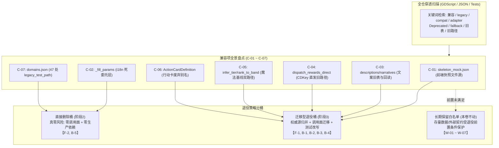

# 施工细则：前后端兼容层退役收敛与兼容残留清零 —— 阶段1：兼容层全景盘点与退役策略契约

> [!NOTE]
> **【施工目标】**：在 Phase 81（前端可视化边界收敛）与 Phase 82（单兵纯前端模块逻辑性能结构优化与防御健壮性提纯）闭环后，前后端两侧积累的兼容/适配残留进入终局处置窗口。本阶段对 WebGames 全仓兼容层开展穿透式全景审计，逐条锚定 `文件:行` 证据，裁定「直接删除 / 迁移型退役 / 长期保留」三类归宿，固化六条基线不变量契约与白名单，为阶段2（零风险直接删除桶）与阶段3（迁移型退役实施）提供唯一施工依据。本阶段**只做审计、盘点、建模与契约固化，严禁编写或修改任何业务代码**。
> **案卷全局共享上下文**：👉 [KALAR-DEV-2026-ST79-ATT_附件_案卷共享契约与上下文.md](KALAR-DEV-2026-ST79-ATT_附件_案卷共享契约与上下文.md)。
> **【施工开始日期】：施工开始日期: 2026-09-12（细则编制立项）** —— 真实读取系统时间。
> 状态：✅ 已完成（2026-09-12 验收闭环，兼容层全景穿透盘点与退役策略契约已固化落地）
> **【用户指令溯源】**：用户明确指令（2026-09-12）——「工作区出现P82施工细则，但不规范，请规范化调整以及补充盲区」（经交互确认为针对 Phase 83 案卷，要求完整提供严格对齐标准的 4 篇施工细则，规范化调整文本布局、标题层级与内容细化，消除审计盲区）。
> **【对应需求源】**：[路线图总索引](../../../../路线图/路线图总索引.md)。
> 📍 **卷内快速直达**：[ATT 共享附件](KALAR-DEV-2026-ST79-ATT_附件_案卷共享契约与上下文.md) ｜ **阶段1 (当前)** ｜ [阶段2](KALAR-DEV-2026-ST79-002_阶段2_零风险死代码与死配置直接删除.md) ｜ [阶段3](KALAR-DEV-2026-ST79-003_阶段3_兼容层迁移收敛与配置归并实施.md) ｜ [阶段4](KALAR-DEV-2026-ST79-004_阶段4_全量回归验收与工程闭环.md)

---

## 📌 第一性原理溯源指针

* **精准上游规范指针**：
  * `docs/模板/GD老练风格硬性规范标准.md` §一（命名与严格类型系统，行 11~30）、§二（架构解耦与配置驱动，行 33~72）、§三（现代 GDScript 高级特性与卫语句，行 73~118）、§四（统一防御工程与 Result 包装，行 121~150）、§五（高承压与性能治理，行 152~164）、§八（六维测试拓扑与零黑话铁律，行 192~273）、§九（前端可视化边界硬性契约，行 277~351）；
  * `docs/模板/工程化需求四阶段总标准.md` §1（数据结构与契约，行 12~41）、§3（工程化与配置驱动，行 77~111）、§4（全量验证与 DoD，行 113~137）；
  * `AGENTS.md`「统一测试拓扑与零黑话铁律」、「护栏单源演进」、「禁止随案卷分裂新护栏文件」硬性红线；
  * Phase 24（文案单一真源 `copywriting.*`）、Phase 33（魔法基线 O(1) 反查索引）、Phase 35（奖励发放统一经邮件管线）、Phase 42（行动卡权威载体收编 `CombatActionCardEntity`）、Phase 81（快照单一注入入口契约）历史权威卷宗。
* **核心不变量约束断言**：
  * `Inv-P83-1-1 (单一真源收敛)`：全仓任一领域概念（数据快照、文案条目、奖励发放路径、魔法基线查询、行动卡载体）在退役完成后仅存在**唯一权威载体**，杜绝并存态与双写路径；
  * `Inv-P83-1-2 (接口契约零破坏)`：`ISnapshotDataService` 抽象接口与对外暴露的服务契约保持兼容，底层收敛对消费层透明；
  * `Inv-P83-1-3 (白名单零渗透)`：长期保留白名单（W-01~W-07）严格受退役前置条件保护，在条件未满足前严禁越界修改或删除；
  * `Inv-P83-1-4 (证据全仓可回溯)`：盘点出的每一项兼容代码/配置必须具备精确到 `文件:行` 的代码级证据，严禁无凭据臆造或遗漏调用面。
* **防漂移最高指示**：严格遵守两轮施工机制，第一轮编制待批期间绝不动任何业务代码；盘点逐条附 `文件:行` 证据，退役分桶裁定必须唯一且互斥；严禁以局部最小实现搪塞全仓收敛。

---

## 一、 兼容层全景穿透审计与退役策略基线 (Compatibility Inventory & Retirement Baseline)

### 1.1 开工前置检查结论（序号门禁核验）

| 检查项 | 核验结论与规范判定 | 证据/依据 |
| :--- | :--- | :--- |
| 短期施工区序号连续性 | Phase 75~82 全部在案且无跳号、重号、越序；第 08 期归档周期在途 8/10（Phase 82 ✅ 已闭环） | `docs/路线图/路线图总索引.md` |
| 下一合法序号 | **Phase 83**（本卷），严格承接 Phase 82，序号绝对连续合法 | 路线图总索引看板 |
| 在途未决项接管 | Phase 81 遗留待决项「`skeleton_mock.json` 与 `MockDataCatalog` 二选一收敛」正式由本卷主线接管 | Phase 81 卷宗留痕 |
| 案卷目录与文档规范 | 案卷目录下**严格仅允许存在 4 份标准分阶段细则**（阶段1~阶段4），严禁建 README 等多余文件 | `AGENTS.md` 边界约束 |
| 真源登记唯一性 | 唯一登记于 `docs/路线图/路线图总索引.md`；严禁向 `01_短期施工区/README.md` 写入在途任务 | 路线图全域施工规范 |

### 1.2 兼容层全景穿透审计总览



> **盘点口径**：全仓 `.gd` / `.tscn` / `config/**/*.json` / `tests/**` 静态扫描（关键词：`兼容` / `legacy` / `compat` / `adapter` / `Deprecated` / `fallback` / `旧表` / `旧路径` / `迁移期`），逐项穿透调用面后归入兼容层。非兼容机制（如 `ErrorReporter` 的防御性兜底、版本治理强更门禁、无头测试适配器）不入退役表，入长期保留白名单（§1.8）。

### 1.3 兼容项总表（C-01 ~ C-07，全卷唯一证据源）

| 编号 | 侧 | 维度 | 现状证据（文件:行） | 根因 | 严重度 | 归属 | 退役分类 |
| :--- | :--- | :--- | :--- | :--- | :---: | :--- | :--- |
| C-01 | 前端 | 数据真源 | `frontend/mocks/skeleton_mock.json`（82 行，5 域：account:6-17 / character:18-40 / combat:42-52 / economy:53-70 / world_map:71-81）；`frontend/domain_boundary/mocks/mock_snapshot_data_service.gd:10`（`MOCK_PATH`）；`mock_service_container.gd:41,100-101`；消费视图 4 处：`views/account_entry/account_entry_view.gd:162`、`views/character_progression/character_progression_view.gd:257`、`views/economy_trade/economy_trade_view.gd:187`、`views/world_map/world_map_view.gd:217` | 骨架期（Phase 77）文件真源与 Phase 81 代码真源 `MockDataCatalog` 双源并存，3 域字段漂移（见 §1.4） | P1 | 延续（Phase 81 待决项「二选一迁移收敛」） | **迁移型**（F-1） |
| C-02 | 前端 | 死代码 | `frontend/i18n/ui_text_resolver.gd:64-66`（`_fill_params` 薄委托层，函数定义 :65） | Phase 82 R-02 双引擎收敛后保留的兼容委托；**全仓调用面 = 1（仅函数定义自身，无任何调用点；frontend/ + tests/ 均 0 命中）** | P2 | 延续（Phase 82 R-02 遗留） | **直接删除**（F-2） |
| C-03 | 后端 | 旧表回读 + 直读 | ① 回读兜底：`backend/infrastructure/copywriting_resolver.gd:68-74`（`_legacy_fallback` 回读 `descriptions.items` / `narratives.events`，头注释 :7-8 自证「迁移期回读」，调用点 :46）；② **生产直读点**：`backend/domains/narrative_orchestration/event_description_resolver.gd:23`（存在性检查直读 `narratives.events` 表）；③ 旧表 `config/descriptions/items.json`（44 行，2 条目）vs 新表 `config/copywriting/item.json`（42 行，2 条目，条目文案逐字一致）；④ 旧表 `config/narratives/events.json`（14 行，2 事件）vs 新表 `config/copywriting/narrative.json`（12 行，2 事件，逐字一致）；⑤ 测试直读：`tests/unit/infrastructure/test_event_description.gd:77`、`tests/unit/infrastructure/test_item_description.gd:82,102` | Phase 24 迁移期「新表未命中回读旧表」兜底；文本生成路径迁移已完成（新旧条目逐字一致，回读分支对已迁移条目为死分支），**但存在性检查与测试仍直读旧表——迁移半完成**，直读面迁移完成前不得删旧表 | P1 | 延续（Phase 24「迁移完成后退役」承诺） | **迁移型**（B-1，直读面迁新表后方可删） |
| C-04 | 后端 | 旧路径隔离 | `backend/domains/cdkey_voucher/voucher_dispatch_pipeline.gd:56-59`（`dispatch_rewards_direct`，注释自证「Phase 35 已隔离，非规范实现，保留仅为兼容既有调用方」）；调用面**仅测试 1 处**：`tests/unit/domains/test_cdkey_voucher.gd:136,147`（`_test_reward_dispatch_direct`），生产业务调用 = 0 | 违反「奖励统一经邮件系统发放」边界（Phase 35 已立）；「兼容既有调用方」前提已不成立（调用面仅测试） | P1 | 延续（Phase 35 隔离残留） | **直接删除 + 测试改写**（B-2） |
| C-05 | 后端 | 性能双路径 | `backend/domains/item_namespace_registry/magic_ability_tier_resolver.gd:19-35`（`infer_tier_candidates(rank, registry = null)`，registry 非空走 O(1) 反查索引，null 走旧路径读配置遍历 :23-35）；`magic_rank_band_resolver.gd:18-28`（`rank_to_band(rank, registry = null)` 同构双路径，旧分支 :22-28） | Phase 33 性能优化引入 O(1) 索引后保留的「null → 读配置」兼容分支；**生产调用面仅 `magic_baseline_resolver.gd:51,52` 2 处（恒传 `_registry` 实参，且 :31 `is_ready()` 卫语句前置拦截）**；`MagicBaselineResolver` 本身全仓仅测试引用（`test_magic_tier.gd:140,208,225`），无生产代码引用；null 旧分支仅可经测试省略 registry 实参触达（`test_magic_tier.gd:103-107,169-176,184-186,267` 共 12 处） | P2 | 延续（Phase 33 性能项残留） | **迁移型**（B-3） |
| C-06 | 后端 | Deprecated Alias | `backend/domains/magic_system/action_card_definition.gd`（96 行，头注释自证「兼容别名 / Deprecated Alias，平滑迁移 Phase 41 引用面，新代码禁用」）；生产引用**仅 1 处**：`backend/domains/magic_system/multi_cast_solver.gd:16`（`const CONSUMES_PLAY: int = ActionCardDefinition.CONSUMES_PLAY`，:6 头注释提及不计引用）；测试引用 4 用例：`tests/unit/domains/test_magic_system.gd:109-116,146-153,295-312,334-341`（frontend/ + scripts/ 0 命中，全 .gd 终核已闭环） | Phase 42 收编权威载体 `PhysicalVerbRegistry.CombatActionCardEntity`（`backend/domains/physics_thermodynamics/physical_verb_registry.gd:62-103`）后，别名引用面收敛至 1 生产点 + 测试，平滑迁移条件达成 | P1 | 延续（Phase 42 收编承诺） | **迁移型**（B-4） |
| C-07 | 后端 | 死配置 | `config/infrastructure/domains.json` **47 处**域级 `legacy_test_path` 字段（如 `:39` inventory、`:489` world_gateway；均为所属 domain 条目**末字段**，删行需同步去前一行尾逗号） | 测试平铺旧布局（`tests/unit/test_<domain>.gd`）迁移至六维测试拓扑后的死字段；**全仓消费面 = 0**（`tests/**` / `scripts/**` / 门禁脚本均 0 命中，`test_architecture_guard.gd` 无 legacy 字样） | P2 | 延续（测试平铺历史残留） | **直接删除**（B-5） |

### 1.4 C-01 双源字段漂移明细（收敛时逐项对账）

| 域 | `skeleton_mock.json`（文件源） | `MockDataCatalog`（代码源，`mock_data_catalog.gd:10-105`） | 漂移裁定与归并策略 |
| :--- | :--- | :--- | :--- |
| `account` | `character_slots` 前 2 槽无 `empty` 键（`:13-14`） | 3 槽均含 `empty` 标志（`:20-22`） | 代码源补全版为准；文件源丢弃 |
| `combat` | 无 `player_*` 字段（`:42-52`）；且**无任何视图调用 `load_snapshot("combat")`**（死数据域） | 含 `player_hp_current/player_hp_max/player_ap_current/player_ap_max`（`:53-56`）；另为 `MockCombatService` 主数据源 | 代码源为准；文件域不搬运 |
| `economy` | 含 `wallet`（`:54`）与 `price_trend` 7 日走势（`:61-69`） | **仅** `shop_title`/`shop_items`（`:70-78`），无 wallet/price_trend | 文件源独有数据**必须并入代码源**（`economy_trade_view.gd:187-190` 依赖 wallet） |
| `character` | 全量角色快照（`:18-40`：name/title/age/attributes/potential_points/vitality/equipped_slots/inventory_*） | **无 character 域**（未登记） | 文件源全量并入代码源（`character_progression_view.gd:257-303` 逐字段依赖） |
| `world_map` | 地标 4 + 行军路线 1（`:71-81`） | 同构（`:58-69`） | 任取其一（代码源），文件源丢弃 |

### 1.5 退役分类统计

| 分类 | 计数 | 编号 | 执行阶段 | 核心判据 |
| :--- | :---: | :--- | :---: | :--- |
| **直接删除** | 2 | F-2、B-5 | 阶段2 | 真零风险：全仓调用面/消费面恒等于 0，且零生产业务依赖 |
| **迁移型退役** | 5 | F-1、B-1、B-2、B-3、B-4 | 阶段3 | 需将直读面/数据源收敛至单一真源，并同步改写测试等价断言后再物理删除旧载体 |
| **长期保留** | 7 | W-01 ~ W-07（§1.8） | 不执行 | 存量存档、历史无盐口令或联机多版本并存等前置条件未满足，本卷严格不动 |

### 1.6 改动理由总表（工程护栏，全卷逐点引用）

> 本表为**全卷改动理由的唯一总源**；阶段2/阶段3 每条 Step 必须引用本表编号，禁止在本卷内另立无编号的改动点。

| 编号 | 对应兼容项 | 改动内容 | 前置核验（施工前必做） | 预期收益（可量化） | 风险与回滚 |
| :--- | :--- | :--- | :--- | :--- | :--- |
| R-01 | C-01 | 快照数据源收敛为单一真源：`MockSnapshotDataService.load_snapshot` 实现改为委托 `MockDataCatalog.get_domain_data(domain_id)`；`MockDataCatalog` 扩 `character` 域（并入 json `:18-40` 全量）、`economy` 域补 `wallet`/`price_trend`（并入 json `:54,61-69`）、`account` 域 `character_slots` 保持含 `empty` 标志；删除 `frontend/mocks/skeleton_mock.json`（及空目录 `frontend/mocks/`）；**保留** `ISnapshotDataService` 接口、`mock_service_container.gd:41,100-101` 注册与访问器、4 视图调用路径不动 | 逐域比对 json 与 catalog 的字段集合（§1.4 对账表）；确认 `load_snapshot` 消费视图仅 4 处 | 前端 mock 数据真源 **2 → 1**；字段漂移项 3 → 0；4 视图快照字段完整性 100%（economy.wallet.gold==50 / character.attributes.STR==14 等抽样断言） | 中：字段搬运须逐字保真；回滚 = 恢复 json 文件 + 还原 `load_snapshot` 文件读取实现 |
| R-02 | C-02 | 删除 `ui_text_resolver.gd:64-66` 的 `_fill_params` 函数（含头注释） | 全仓 `_fill_params(` 调用面扫描 = 0（预检已确认：仅定义处 + 文档引用） | 死函数 1 → 0；i18n 模块零死代码 | 低：零调用点；回滚 = 恢复函数体（2 行） |
| R-03 | C-03 | **直读面迁移 + 旧表退役（三步不可拆）**：① `backend/domains/narrative_orchestration/event_description_resolver.gd:23` 存在性检查改读新表 `GameConfig.get_dict("copywriting.narrative", <event_id>, {})`（新表顶层键即 event_id，无 `descriptions` 包装段；保持 `EVENT_DESC_MISSING` 错误码语义不变——事件未在新表登记仍拒绝）；② 删除 `copywriting_resolver.gd:67-74` 的 `_legacy_fallback` 函数与 `:45-48` 回读调用分支（新表未命中直接返回 `COPY_ENTRY_MISSING`）；头注释 :7-8「适配层兜底（迁移期回读旧表）」同步改写为「文案单一真源 copywriting.*，无回退」；③ 测试直读迁移：`test_event_description.gd:75-84`（TC-EVTDESC-04）与 `test_item_description.gd:79-107`（占位符白名单核验 + TC-ITEMDESC-05）改读新表并同步改表名断言；`scripts/py/audit_copywriting.py:16,110-113` 提示级「适配层激活中」段删除（旧表删后该提示恒空转）；最后删除旧表 `config/descriptions/items.json`（连带清空 `config/descriptions/` 目录）与 `config/narratives/events.json`（`config/narratives/` 目录其余 49 文件不动）。**`game_config.gd` `_required_tables`（:50-116）核验结论：从未登记两旧表，本项无需改动** | 新旧表逐条目文案逐字 diff（§1.3 C-03 预检通过：item 域 2 条目 / narrative 域 2 事件全同构）；`descriptions.items` / `narratives.events` 全仓 .gd 读取面终核 = 仅 4 处（`copywriting_resolver.gd:71,73` + `event_description_resolver.gd:23` + 测试 3 行 :77/:82/:102），无第 5 处；`audit_copywriting.py` 零内联扫描（:99-107）不依赖旧表文件存在性；`config/descriptions/` 下仅 `items.json` 1 文件（目录可安全整体删除） | 旧文案表 2 → 0；旧表读取点 4 → 0；运行时回读分支 1 → 0；文案单一真源 `copywriting.*` 成立（audit 提示清零） | 中：生产存在性检查语义迁移（新表键结构无 `descriptions` 包装，读错层级即 EVENT_DESC_MISSING 恒真）；回滚 = 恢复 2 表 + 恢复 fallback 分支 + 回退直读点 |
| R-04 | C-04 | 删除 `voucher_dispatch_pipeline.gd:56` 起 `dispatch_rewards_direct` 整函数（含「旧路径」注释段）；`tests/unit/domains/test_cdkey_voucher.gd` `_test_reward_dispatch_direct` 改写为 `dispatch_rewards_via_mail` 等价断言（保留原覆盖语义：金币/魔单晶入账、注册表三元组实例化、未登记 template_id 严格拒绝计入 failed），或经 via_mail 路径断言邮件附件字段 | 全仓 `dispatch_rewards_direct` 调用面扫描 = 仅 `test_cdkey_voucher.gd:136,147`（预检已确认）；`dispatch_rewards_via_mail` 对「未登记模板严格拒绝」语义的既有覆盖核对 | 违规直发入口 1 → 0；「奖励统一经邮件发放」边界（Phase 35）零例外；测试覆盖语义不降（直发语义 → 邮件附件语义） | 低-中：删公开静态函数；回滚 = 恢复函数 + 原测试 |
| R-05 | C-05 | `magic_ability_tier_resolver.gd:20` 与 `magic_rank_band_resolver.gd:19` 的 `registry` 参数去 `= null` 默认值（必填化），删除「null → 读配置遍历」旧路径分支（tier:23-35 / band:22-28）；头注释 :19/:18「Phase 33 性能：…兼容旧路径」同步改写为「registry 必填（O(1) 反查索引唯一路径）」；测试侧 12 处省略实参的调用（`test_magic_tier.gd:103-107,169-176,184-186,267`）补传本地装配的 `MagicTierRegistry.new() + reload_configuration()` 实例（文件内 :135-136/:264-265 已有同构装配先例可复用，建议提为文件级 helper）；**生产调用点 `magic_baseline_resolver.gd:51,52` 已恒传 `_registry`，零改动**（其 `_init` 构造注入 + `resolve` :31 `is_ready()` 卫语句保证实参恒就绪） | 全仓 `infer_tier_candidates(` / `rank_to_band(` 调用点穷举清单 = 生产 2（`magic_baseline_resolver.gd:51,52`，已传参）+ 测试 12（`test_magic_tier.gd` 上述行号），无第 3 类调用方；`registry.query_tier_candidates` / `query_band` 索引实现与旧遍历路径行为一致性断言（`test_magic_tier.gd:262-268` TC-M3-03 已覆盖，改后保持绿） | 双路径分支 2 → 0；魔法基线查询恒定 O(1)；签名自证「registry 必填」契约（漏传即编译期/调用期显式错误，杜绝静默降级读配置） | 中：调用点枚举必须穷尽（漏 1 处即运行时「缺少参数」崩溃）；回滚 = 恢复默认参数 + 旧分支 |
| R-06 | C-06 | 删除 `backend/domains/magic_system/action_card_definition.gd` 整文件；`multi_cast_solver.gd:16` 改为本文件本地常量 `const CONSUMES_PLAY: int = 1`（语义为战斗求解器常量，MultiCastSolver 为唯一消费方）；`test_magic_system.gd` 4 处引用迁移：`_make_cast_card`（:146-153）改直接构造 `CombatActionCardEntity`（`card_id/card_category/magic_ref/effects` 字段直接赋值）；DTO 往返用例（:109-116）改权威实体 `to_dto()` 字段断言 + 测试内本地 DTO→实体 helper；TC-CARD-S2-01（:295-312）与封印用例（:334-341）改权威实体直构，`to_combat_card`/`from_combat_card` 迁移断言删除 | 全仓 `ActionCardDefinition` 引用面扫描 = `multi_cast_solver.gd:16` + `test_magic_system.gd` 4 处（预检已确认）；`CombatActionCardEntity` 字段集核对（`physical_verb_registry.gd:62-103`：含 `card_category/magic_ref/effects/card_pool/to_dto`，无 `from_dto` → 测试侧本地 helper 补齐） | 废弃别名类型 1 → 0；行动卡权威载体唯一（Phase 42 契约）静态可证（全仓 `ActionCardDefinition` 0 命中）；生产依赖别名 = 0 | 中：1 生产点 + 4 测试点迁移；回滚 = 恢复文件 |
| R-07 | C-07 | 批量删除 `config/infrastructure/domains.json` 全部域条目的 `legacy_test_path` 字段（**47 处**，均为所属 domain 条目末字段——删除行本身的同时须去除**前一行行尾逗号**，保持 JSON 合法；推荐脚本化批量处理 + 删后 `python3 -m json.tool` 校验） | 全仓 `legacy_test_path` 消费面扫描 = 0（`tests/**` / `scripts/**` / 门禁脚本 / 护栏 `test_architecture_guard.gd` 均 0 命中，预检已确认；`audit_docs.py` 无该 key 的 schema 校验）；删后 `domains.json` 仍含 47 个 domain 条目的 `id`/`test`/`test_symbol` 五方一致性字段（护栏校验对象不受影响） | 死配置字段 47 → 0；`domains.json` 字段与六维测试拓扑 100% 对齐；单文件体积 -47 行 | 低：纯 JSON 字段删除（唯一风险 = 逗号处理失误致 JSON 非法，删后强制 json.tool 校验拦截）；回滚 = 恢复字段 |

### 1.7 基线契约固化（不得回归）

```gdscript
# 基线不变量（阶段1 固化，阶段2/3 不得破坏，阶段4 逐条断言）
#
# Inv-P83-1-1: 前端 mock 数据单一真源（本卷 R-01 后成立）
#    res://frontend/domain_boundary/mocks/mock_data_catalog.gd 为唯一前端 mock 数据真源
#    视图一律经 MockServiceContainer.snapshot_data().load_snapshot(domain) -> apply_snapshot() 消费
#    （Phase 81 唯一入口契约不变）；res://frontend/mocks/skeleton_mock.json 不存在
#
# Inv-P83-1-2: 快照读取接口抽象保留（Phase 81 契约）
#    ISnapshotDataService 为唯一快照读取接口；未来真实后端替换仅改实现，视图零改动
#
# Inv-P83-1-3: 奖励发放唯一路径（Phase 35 边界，本卷 R-04 后零例外）
#    VoucherDispatchPipeline.dispatch_rewards_via_mail 为奖励发放唯一入口
#    dispatch_rewards_direct 不存在
#
# Inv-P83-1-4: 魔法基线查询单路径（Phase 33 契约，本卷 R-05 后强制）
#    MagicAbilityTierResolver / MagicRankBandResolver 的 registry 参数必填；
#    生产 registry 装配唯一（GameBootstrap.assemble 阻断式就绪校验）
#
# Inv-P83-1-5: 行动卡权威载体唯一（Phase 42 契约，本卷 R-06 后静态可证）
#    PhysicalVerbRegistry.CombatActionCardEntity 为唯一行动卡载体；
#    ActionCardDefinition 全仓 0 命中
#
# Inv-P83-1-6: 文案单一真源（Phase 24 迁移终局，本卷 R-03 后成立）
#    copywriting.* 新表为唯一文案源；descriptions.items / narratives.events 旧表不存在
```

### 1.8 长期兼容保留白名单（本卷登记，不实施退役）

> 以下 7 项兼容机制的兼容对象为**历史数据 / 存量外部契约**，退役前置条件（存档数据迁移完成 / 版本推进淘汰旧客户端 / 功能下线）尚未满足，登记为长期保留项，本卷**不动**。每项注明退役前置条件，供后续卷按条件触发。

| 编号 | 机制（文件:行） | 兼容对象 | 退役前置条件（满足后方可另立卷处置） |
| :--- | :--- | :--- | :--- |
| W-01 | `backend/domains/item_namespace_registry/item_uid_generator.gd:28-31,80-82`（`LGC_` 旧档迁移 UID 前缀校验放行，配置 `config/domains/item_namespace_registry.json:19-21`） | 历史存档无 UID 物品（`ItemEntity.migrate_legacy_uid` 确定性派生） | 全量存量存档完成 UID 迁移且旧档版本经 `version_governance` 淘汰 |
| W-02 | `backend/domains/account/auth_service.gd:23`（空盐兼容历史档口令读取） | 历史无盐口令档 | 全量账号口令完成加盐重铸 |
| W-03 | `backend/domains/admin_sandbox/clawback_service.gd:45`（`item_id` 兼容回退回扣） | 联机多版本客户端并存期的 GM 回扣请求 | 旧版本客户端经强更门禁（`min_supported_version`）全部淘汰 |
| W-04 | `backend/infrastructure/error_reporter.gd:127-128`（`error_code` 本体直查 `narratives.errors` 兜底） | 消息键未登记的异常错误码（防御性兜底，非迁移残留） | 不设退役计划（防御性兜底，随错误码注册表完备度自然空转） |
| W-05 | `backend/domains/version_governance/version_manifest_dto.gd`（`min_supported_version` 强更门禁） | 版本兼容治理**功能**（非兼容残留） | 不适用（功能项） |
| W-06 | `backend/infrastructure/event_bus/headless_presentation_mock_adapter.gd`（无头测试视觉适配器桩） | 纯逻辑无头测试基础设施（非生产兼容层） | 不适用（测试基建项） |
| W-07 | `config/infrastructure/domains.json` `_meta.naming_aliases`（16 组历史目录/表名别名） | 门禁与审计脚本识别历史命名（历史演进记录） | 别名引用面（门禁脚本）完成别名感知的终局改造 |

---

## 二、 命令式施工执行清单 (Agent Execution Checklist)

- [ ] **Step 1.1: 兼容项总表落盘** - C-01~C-07 逐条 `文件:行` 证据固定（§1.3），标注严重度/归属/退役分类，无空缺
- [ ] **Step 1.2: 双源字段漂移对账表落盘** - C-01 五域逐项对账（§1.4），逐域裁定「代码源为准 / 文件源并入 / 丢弃」
- [ ] **Step 1.3: 退役分类统计与分桶** - 确认直接删除桶（F-2, B-5）与迁移型退役桶（F-1, B-1~B-4）互斥完备
- [ ] **Step 1.4: 改动理由总表建模** - R-01~R-07 全字段（改动/前置核验/量化收益/风险回滚），逐条映射兼容项编号
- [ ] **Step 1.5: 基线契约固化** - 六条不变量成文（§1.7），与 Phase 24/33/35/42/81 既有契约零冲突核对
- [ ] **Step 1.6: 长期保留白名单登记** - W-01~W-07 逐项注明兼容对象与退役前置条件（§1.8），确认本卷施工范围不含白名单项
- [ ] **Step 1.7: 调用面预检复核** - 五项少调用面结论（F-2=0 调用点、B-1=1 生产直读点+3 测试直读行、B-2=仅测试 2 行、B-4=1 生产+4 测试用例、B-5=0 消费面）全仓复核一次，结果写入阶段2 开工前置检查

---

## 三、 审计与基线验收矩阵 (DoD Matrix)

| 检验项 ID | 校验目标 | 验证输入 | 预期输出断言 |
| :--- | :--- | :--- | :--- |
| `TC-P83-S1-01` | 兼容项证据可回放 | 逐条跳转 §1.3 的 `文件:行` | 7 条证据 100% 定位命中，无失效行号 |
| `TC-P83-S1-02` | 退役分类完备且无越界 | C 表分类列 + §1.8 白名单核对 | 全仓兼容机制 = C-01~C-07 ∪ W-01~W-07，无遗漏无重叠；白名单项未列入 R 表 |
| `TC-P83-S1-03` | 双源对账表完备 | §1.4 五域逐域核对 | 每域含「文件源/代码源/漂移裁定」三列且裁定唯一（无「二选一」悬空表述） |
| `TC-P83-S1-04` | 改动理由完整性 | R-01~R-07 字段核对 | 每条含改动/前置核验/量化收益/风险回滚四要素，无空缺；每条映射唯一 C 编号 |
| `TC-P83-S1-05` | 基线契约零冲突 | 对照 Phase 24/33/35/42/81 契约原文 | 六条不变量与既有契约 100% 兼容，零冲突零放宽 |
| `TC-P83-S1-06` | 白名单可审计 | W-01~W-07 逐项核对 | 每项含机制/兼容对象/退役前置条件三要素；退役前置条件为可判定表述 |
| `TC-P83-S1-07` | 调用面预检可复核 | 按 §二 Step 1.7 的五项扫描逐条执行 | 五项调用面计数与 §1.3 标注一致（F-2=0 调用点 / B-1=生产直读 1+测试直读 3 / B-2=测试 2 行 / B-4=生产 1+测试用例 4 / B-5=0 消费面） |
