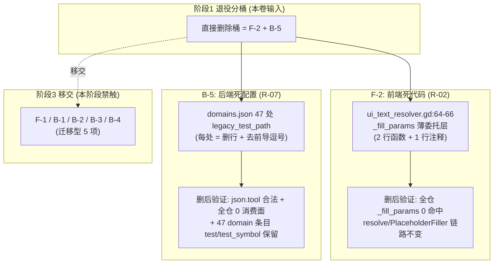

# 施工细则：前后端兼容层退役收敛与兼容残留清零 —— 阶段2：零风险死代码与死配置直接删除

> [!NOTE]
> **【施工目标】**：依据阶段1 退役分桶结论，执行**直接删除桶**（真零风险：零调用面 + 零生产依赖）的 2 个兼容项——F-2（`UITextResolver._fill_params` 死委托层）、B-5（`domains.json` 47 处 `legacy_test_path` 死字段）。本阶段**只做删除与删除后校验**，不迁移、不改语义、不动任何生产调用链（迁移型 5 项 F-1/B-1/B-2/B-3/B-4 全部留阶段3）。
> **案卷全局共享上下文**：👉 [KALAR-DEV-2026-ST79-ATT_附件_案卷共享契约与上下文.md](KALAR-DEV-2026-ST79-ATT_附件_案卷共享契约与上下文.md)。
> **【施工开始日期】：施工开始日期: 2026-09-12（细则编制立项）** —— 真实读取系统时间。
> 状态：✅ 已完成（2026-09-12 验收闭环，零风险死代码与死配置直接删除完成）
> **【用户指令溯源】**：用户明确指令（2026-09-12）——「工作区出现P82施工细则，但不规范，请规范化调整以及补充盲区」（经交互确认为针对 Phase 83 案卷，要求完整提供严格对齐标准的 4 篇施工细则，规范化调整文本布局、标题层级与内容细化，消除审计盲区）。
> **【对应需求源】**：阶段1《兼容层全景盘点与退役策略契约》（C-02/C-07、R-02/R-07、§1.5 分桶表）；[路线图总索引](../../../../路线图/路线图总索引.md)。
> 📍 **卷内快速直达**：[ATT 共享附件](KALAR-DEV-2026-ST79-ATT_附件_案卷共享契约与上下文.md) ｜ [阶段1](KALAR-DEV-2026-ST79-001_阶段1_兼容层全景盘点与退役策略契约.md) ｜ **阶段2 (当前)** ｜ [阶段3](KALAR-DEV-2026-ST79-003_阶段3_兼容层迁移收敛与配置归并实施.md) ｜ [阶段4](KALAR-DEV-2026-ST79-004_阶段4_全量回归验收与工程闭环.md)

---

## 📌 第一性原理溯源指针

* **精准上游规范指针**：
  * 本卷阶段1 全表（C-01~C-07、R-01~R-07、W-01~W-07、§1.7 六条基线不变量）；
  * `docs/模板/GD老练风格硬性规范标准.md` §三（现代 GDScript 高级特性与卫语句，行 73~118）、§四（异常防御与 Result 包装，行 121~150）；
  * `AGENTS.md`「重命名/删档不同步全库入链」与「改基线消音新增违规」铁律禁令。
* **核心不变量约束断言**：
  * `Inv-P83-2-1 (零行为变更)`：本阶段删除的每个目标在删除前调用面/消费面恒为 0——删除前后任何测试输出、任何视图渲染、任何配置解析结果**逐位相同**；
  * `Inv-P83-2-2 (契约零回归)`：`UITextResolver.resolve` / `PlaceholderFiller.fill` 的 R-02 单引擎契约、`domains.json` 的 47 个 domain 条目 `id`/`test`/`test_symbol` 五方一致性字段、`GameConfig` 全部 66 张 `_required_tables` 表加载行为不变；
  * `Inv-P83-2-3 (不越桶边界)`：本阶段严禁触碰迁移型 5 项（F-1/B-1/B-2/B-3/B-4）的任何文件——`skeleton_mock.json` / `copywriting_resolver.gd` / `event_description_resolver.gd` / `voucher_dispatch_pipeline.gd` / 双 resolver / `action_card_definition.gd` 在本阶段 diff 中**必须零出现**；
  * `Inv-P83-2-4 (删除可回放)`：每个删除动作前留 grep 计数快照，删除后留全仓零命中验证（§二 命令式清单逐项留痕）。
* **防漂移最高指示**：每条改动必须回指阶段1 的 R-xx 编号并给出删除前后量化对比；严禁「顺手」扩大改动面（如顺手改 i18n 其他函数、顺手清理 domains.json 其他字段）；禁止以「删除失败」为由改写目标函数语义。

---

## 一、 零风险死代码与死配置直接删除设计 (Direct Deletion Design & Execution)

### 1.1 删除面总览



### 1.2 F-2：`UITextResolver._fill_params` 死委托层删除（R-02）

**删除对象**（唯一文件）：`frontend/i18n/ui_text_resolver.gd:64-66`

```gdscript
# 删除前（:64-66）
## 填充动态占位参数 {key}（R-02：委托 PlaceholderFiller，保留为兼容旧调用点的薄委托层）
func _fill_params(template: String, params: Dictionary) -> String:
	return PlaceholderFiller.fill(template, params)

# 删除后：三行整体移除，前后空行结构不变（:63 空行与 :68 set_locale 之间不留连续多空行）
```

**零风险证明（阶段1 已预检，执行时复核一次）**：
- 全仓 `_fill_params` 调用点扫描（frontend/ + tests/ + backend/ + scripts/）= 仅定义自身 1 处，无任何 `resolver._fill_params(...)` / `UITextResolver._fill_params(...)` 调用；
- 参数填充唯一真源 `PlaceholderFiller.fill` 的活跃调用点（`ui_text_resolver.gd:47,50`）不经 `_fill_params` 中转，删除不改变任何填充路径；
- `_fill_params` 为实例方法但全仓无实例持有与调用，无 GDScript 隐式反射触达（本仓无 `call("_fill_params")` 动态调用，执行时 grep `call(` 复核确认）。

**删除后行为不变量**：`UITextResolver.resolve(key, params)` 的返回值对任意输入逐字符不变（函数体 :40-50 未动）；`is_cjk_locale` / `has_key` / `set_locale` 等邻近函数零改动。

### 1.3 B-5：`domains.json` 47 处 `legacy_test_path` 死字段删除（R-07）

**删除对象**（唯一文件）：`config/infrastructure/domains.json`，47 行，模式已验证 100% 统一：

```json
// 删除前（47 处同构，示例 :38-40）
        }
      },
      "legacy_test_path": "res://tests/unit/test_inventory.gd"   // 末字段行
    },

// 删除后（删 :39 行 + 去 :38 行行尾逗号）
        }
      }
    },
```

**形态核验结论（阶段1 预检数据）**：47 处中前导行以逗号结尾 = 47/47，后续行 = `},` 46 处 + `}` 1 处（末条目）。**每处必须联动删除前一行行尾逗号**，否则 JSON 非法。

**执行方式（脚本化，禁止手工 47 次 edit）**：

```python
# 一次性处理：删 legacy_test_path 行 + 去前一行尾逗号（执行时写入临时脚本运行后删除）
import re
p = "config/infrastructure/domains.json"
lines = open(p, encoding="utf-8").read().splitlines(keepends=True)
out = []
for i, line in enumerate(lines):
    if '"legacy_test_path"' in line:
        # 前一行去尾逗号（模式已验证 47/47 前导行必以逗号结尾）
        assert out[-1].rstrip().endswith(","), f"line {i+1}: 前导行未以逗号结尾，模式偏离，中止"
        out[-1] = out[-1].rstrip()[:-1] + "\n"
        continue  # 丢弃 legacy_test_path 行本身
    out.append(line)
open(p, "w", encoding="utf-8", newline="\n").write("".join(out))
print(f"removed {len(lines) - len(out)} lines (expect 47)")
```

**删除后强制校验（三项全绿方可继续）**：
1. `python3 -m json.tool config/infrastructure/domains.json > /dev/null` —— JSON 语法绝对合法；
2. `grep -c "legacy_test_path" config/infrastructure/domains.json` = **0**；
3. 全仓消费面复查 = 0：`grep -rn "legacy_test_path" backend/ frontend/ tests/ scripts/` 空输出，且 domain 条目计数不变：`python3 -c "import json; print(len(json.load(open('config/infrastructure/domains.json',encoding='utf-8'))['domains']))"` 仍 = 47。

**删除后行为不变量**：`GameConfig.ensure_loaded()` 对 `infrastructure.domains` 表的解析结果除 47 个 `legacy_test_path` 键消失外逐键相同；五方一致性护栏 `test_architecture_guard.gd`（只读 `id`/`test`/`test_symbol`）零影响；`audit_docs.py` 无该 key 的 schema 校验（阶段1 已核）。

### 1.4 本阶段文件级改动清单（diff 边界，白名单制）

| # | 文件 | 动作 | 对应 R 编号 | 预估 diff |
| :--- | :--- | :--- | :--- | :--- |
| 1 | `frontend/i18n/ui_text_resolver.gd` | 删 3 行（:64-66） | R-02 | -3 行 |
| 2 | `config/infrastructure/domains.json` | 删 47 行 + 47 处前导逗号 | R-07 | -47 行、-47 字符 |

**diff 边界铁律**：本阶段 commit 的 diff 中**只允许**上述 2 个文件出现；其余任何文件（含测试、脚本、其他配置）出现即违反 `Inv-P83-2-3`，回滚该文件改动。

### 1.5 回归风险面与验证策略

#### 1.5.1 风险面清单（删什么会伤什么——全部预判为安全并给出验证手段）

| 风险假设 | 预判 | 验证手段 |
| :--- | :--- | :--- |
| `_fill_params` 有反射/动态调用残留 | 安全（全仓无 `call(` 动态调用该函数名） | 执行时 `grep -rn "_fill_params" frontend/ backend/ tests/ scripts/` 删后 = 0 命中 |
| `_fill_params` 删除破坏 i18n 填充链路 | 安全（resolve 直连 PlaceholderFiller，不经委托层） | 跑 `tests/unit/frontend/` 全量前端套件，i18n 相关用例（test_fe_01+ 占位符填充断言）全绿 |
| `legacy_test_path` 被某门禁/脚本消费 | 安全（tests/ scripts/ 护栏 0 命中，阶段1 已核） | 执行时全仓 grep 复查 = 0；跑 `bash scripts/sh/audit-all.sh` 20 项门禁全绿 |
| 删字段时逗号处理失误致 JSON 非法 | 脚本内置 assert 拦截 + json.tool 终检 | 脚本 assert 47/47 全通过；json.tool exit 0 |
| domains.json 条目数被误删 | 不可能（只删字段行不删条目） | 删后 `len(domains)` = 47 断言 |

#### 1.5.2 验证命令序列（执行顺序固定）

```bash
# 0. 删除前快照（留痕）
grep -rn "_fill_params" frontend/ backend/ tests/ scripts/ | grep -c "_fill_params"   # 期望 1（仅定义）
grep -c "legacy_test_path" config/infrastructure/domains.json                          # 期望 47

# 1. F-2 删除（edit_file 精确删 3 行）
# 2. B-5 脚本化删除（§1.3 脚本）
# 3. 删除后零命中验证
grep -rn "_fill_params" frontend/ backend/ tests/ scripts/                            # 期望 0
grep -rn "legacy_test_path" config/ backend/ frontend/ tests/ scripts/                # 期望 0
python3 -m json.tool config/infrastructure/domains.json > /dev/null && echo JSON_OK   # 期望 JSON_OK
python3 -c "import json; assert len(json.load(open('config/infrastructure/domains.json',encoding='utf-8'))['domains'])==47; print('DOMAINS_47_OK')"

# 4. 全域门禁
bash scripts/sh/test-run.sh          # 全量测试（110 套件基线，用例数不减）
bash scripts/sh/check-gdscript.sh    # GDScript 语法/规范
bash scripts/sh/audit-all.sh         # 20 项静态门禁全绿
bash scripts/py/audit_docs.py --baseline 2>/dev/null || bash scripts/sh/audit-docs.sh --baseline   # 0 新增
```

#### 1.5.3 回滚预案

| 异常场景 | 回滚与应对动作 |
| :--- | :--- |
| 测试套件出现新失败且定位到本阶段 diff | `git checkout -- frontend/i18n/ui_text_resolver.gd config/infrastructure/domains.json`（需用户确认后执行），重审 R-02/R-07 前置核验 |
| domains.json 脚本执行中途 assert 失败 | 文件未写入（脚本先校验后写），零残留；检查失败行模式后修正断言重跑 |
| json.tool 报非法 | 定位首个报错行 → 检查该处前导逗号是否漏删 → 手工补删 |

### 1.6 量化验收目标与阶段边界声明

#### 1.6.1 量化验收目标对照

| 指标 | 删除前 | 删除后 | 验收口径 |
| :--- | :--- | :--- | :--- |
| `_fill_params` 全仓命中数 | 1（定义） | **0** | grep 终核 |
| `legacy_test_path` 全仓命中数 | 47 | **0** | grep 终核 |
| `domains.json` domain 条目数 | 47 | **47** | python json 解析 |
| `domains.json` 文件行数 | 基线 N | **N-47** | wc -l |
| `ui_text_resolver.gd` 行数 | 84 | **81** | wc -l |
| 前端套件用例数 | 基线 | **持平** | test-run.sh 输出 |
| audit-all 门禁 | 20/20 | **20/20** | audit-all.sh 输出 |

#### 1.6.2 阶段边界声明铁律

**本阶段做完即停**，以下事项**明确不属于**本阶段（防止施工漂移）：
1. ❌ 迁移型 5 项（F-1 快照双源收敛 / B-1 旧文案表退役 / B-2 直发管线删除 / B-3 双路径参数必填化 / B-4 行动卡别名删除）——全部移交阶段3；
2. ❌ 白名单 7 项（W-01~W-07）——本卷不动，退役前置条件未满足；
3. ❌ 任何「顺手」重构（ui_text_resolver 其他函数、domains.json 其他字段、测试文件）；
4. ❌ 阶段3/阶段4 的细则编制工作（各阶段细则独立成文，不得提前施工）。

---

## 二、 命令式施工执行清单 (Agent Execution Checklist)

- [x] **Step 2.0: 开工前置检查** - 复读阶段1 §1.5 分桶表确认本阶段仅 F-2+B-5；执行 §1.5.2 删除前快照（2 个计数留痕：1 与 47）
- [x] **Step 2.1: F-2 删除** - `edit_file` 精确删除 `ui_text_resolver.gd:64-66` 三行（含注释行），diff 仅此 3 行
- [x] **Step 2.2: F-2 零命中验证** - 全仓 `_fill_params` grep = 0；`ui_text_resolver.gd` 行 84→81
- [x] **Step 2.3: B-5 脚本化删除** - 按 §1.3 脚本执行（断言 47/47 前导逗号模式），脚本运行后删除临时脚本
- [x] **Step 2.4: B-5 三项强制校验** - json.tool 合法 + 全仓 0 命中 + domain 条目数 = 47
- [x] **Step 2.5: 全域测试** - `test-run.sh` 全量套件跑通，用例数与基线持平、零新增失败
- [x] **Step 2.6: 门禁全绿** - `check-gdscript.sh` + `audit-all.sh`（20/20）+ audit-docs 0 新增
- [x] **Step 2.7: diff 边界终核** - `git status --short` 确认仅 2 个白名单文件被修改；§1.6.1 量化目标逐项核对并记录实际值
- [x] **Step 2.8: 阶段2 收口** - 本文件状态改为 ✅ 已完成（附实际验收数据），进入阶段3 细则编制

---

## 三、 零风险删除验收矩阵 (DoD Matrix)

| 检验项 ID | 校验目标 | 验证输入 | 预期输出断言 |
| :--- | :--- | :--- | :--- |
| `TC-P83-S2-01` | F-2 死代码零残留 | 全仓 `_fill_params` grep | 0 命中；`ui_text_resolver.gd` resolve/PlaceholderFiller 调用链（:40-50）逐行未动 |
| `TC-P83-S2-02` | F-2 填充行为不变 | 前端 i18n 相关测试用例 | 占位符填充断言（ui.fe* 键）全绿，输出逐字符不变 |
| `TC-P83-S2-03` | B-5 死字段零残留 | 全仓 `legacy_test_path` grep + domains.json | 0 命中；文件行数 = 基线-47 |
| `TC-P83-S2-04` | domains.json 结构完整性 | json.tool + 条目计数 + 字段抽样 | JSON 合法；domain 条目 = 47；任取 3 个条目 `id`/`test`/`test_symbol` 字段完好 |
| `TC-P83-S2-05` | 五方一致性护栏零回归 | `test_architecture_guard.gd` 运行结果 | 护栏用例全绿（只读 test/test_symbol，不触碰 legacy_test_path） |
| `TC-P83-S2-06` | 全域测试持平 | `test-run.sh` 输出 | 套件数/用例数与基线持平，零新增失败 |
| `TC-P83-S2-07` | 20 项门禁全绿 | `audit-all.sh` 输出 | 20/20 pass，0 新增违规（对比 audit-docs baseline） |
| `TC-P83-S2-08` | diff 边界铁律 | `git status --short` + `git diff --stat` | 仅 `ui_text_resolver.gd`（-3 行）与 `domains.json`（-47 行）出现；迁移型 5 项文件零出现 |
