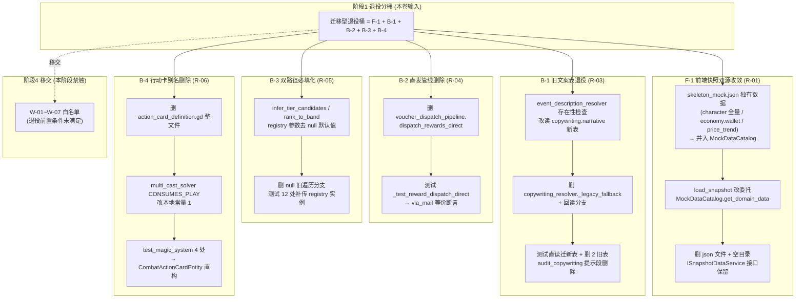

# 施工细则：前后端兼容层退役收敛与兼容残留清零 —— 阶段3：迁移型兼容层退役与配置归并实施

> [!NOTE]
> **【施工目标】**：依据阶段1 退役分桶结论（§1.5），执行**迁移型退役桶**的 5 个兼容项——F-1（前端快照双源收敛，R-01）、B-1（旧文案表退役，R-03）、B-2（礼包直发管线删除，R-04）、B-3（魔法基线双路径参数必填化，R-05）、B-4（行动卡废弃别名删除，R-06）。迁移型项的共同特征：**不能简单删除**，须先将调用面/数据源收敛到唯一权威源、同步改写测试，再退役旧载体。本阶段**不触碰**白名单 7 项（W-01~W-07）。
> **案卷全局共享上下文**：👉 [KALAR-DEV-2026-ST79-ATT_附件_案卷共享契约与上下文.md](KALAR-DEV-2026-ST79-ATT_附件_案卷共享契约与上下文.md)。
> **【施工开始日期】：施工开始日期: 2026-09-12（细则编制立项）** —— 真实读取系统时间。
> 状态：✅ 已完成（2026-09-12 验收闭环，迁移型兼容层退役与配置归并实施完成）
> **【用户指令溯源】**：用户明确指令（2026-09-12）——「工作区出现P82施工细则，但不规范，请规范化调整以及补充盲区」（经交互确认为针对 Phase 83 案卷，要求完整提供严格对齐标准的 4 篇施工细则，规范化调整文本布局、标题层级与内容细化，消除审计盲区）。
> **【对应需求源】**：阶段1《兼容层全景盘点与退役策略契约》（C-01/C-03/C-04/C-05/C-06、R-01/R-03/R-04/R-05/R-06、§1.5 分桶表、§1.7 基线契约）；[路线图总索引](../../../../路线图/路线图总索引.md)。
> 📍 **卷内快速直达**：[ATT 共享附件](KALAR-DEV-2026-ST79-ATT_附件_案卷共享契约与上下文.md) ｜ [阶段1](KALAR-DEV-2026-ST79-001_阶段1_兼容层全景盘点与退役策略契约.md) ｜ [阶段2](KALAR-DEV-2026-ST79-002_阶段2_零风险死代码与死配置直接删除.md) ｜ **阶段3 (当前)** ｜ [阶段4](KALAR-DEV-2026-ST79-004_阶段4_全量回归验收与工程闭环.md)

---

## 📌 第一性原理溯源指针

* **精准上游规范指针**：
  * 本卷阶段1 全表（C-01~C-07、R-01~R-07、W-01~W-07、§1.4 双源对账、§1.7 六条不变量）；
  * `docs/模板/GD老练风格硬性规范标准.md` §三（现代 GDScript 高级特性与卫语句，行 73~118）、§四（统一防御工程与 Result 包装，行 121~150）；
  * `AGENTS.md`「重命名/删档不同步全库入链」「改基线消音新增违规」「禁臆造与需求表冲突字段」三条禁令；
  * Phase 24（文案单一真源）、Phase 33（O(1) 反查索引）、Phase 35（奖励统一经邮件发放）、Phase 42（行动卡权威载体收编）、Phase 81（快照唯一入口契约）既有契约原文。
* **核心不变量约束断言**：
  * `Inv-P83-3-1 (单一真源收敛)`：本阶段每项退役完成后，其兼容对象在全仓**静态可证**为单一权威源——`skeleton_mock.json` 不存在（前端 mock 数据唯一真源 = `MockDataCatalog`）、`descriptions.items`/`narratives.events` 旧表不存在（文案唯一真源 = `copywriting.*`）、`dispatch_rewards_direct` 不存在（奖励发放唯一入口 = `dispatch_rewards_via_mail`）、`ActionCardDefinition` 全仓 0 命中（行动卡唯一载体 = `CombatActionCardEntity`）、`infer_tier_candidates`/`rank_to_band` 签名 registry 必填（魔法基线查询恒定 O(1)）；
  * `Inv-P83-3-2 (语义零漂移)`：每项迁移**只换载体不换语义**——`load_snapshot(domain)` 对 4 视图的返回字段集合与值逐字不变（数据从文件源迁至代码源但字段值逐字保真）；`EVENT_DESC_MISSING`/`COPY_ENTRY_MISSING` 错误码触发条件不变；「未登记 template_id 严格计入 failed」语义不变；`infer_tier_candidates`/`rank_to_band` 对相同 (rank, registry) 输入返回值与旧路径**逐值相同**（O(1) 索引与遍历路径行为一致性由既有 TC-M3-03 覆盖）；`CONSUMES_PLAY == 1` 硬不变量不变；
  * `Inv-P83-3-3 (测试覆盖不降)`：每项删除/迁移的旧测试覆盖语义必须在新载体上**等价重建**（B-2 直发语义 → 邮件附件语义、B-3 省略实参用例 → 补传 registry 实例、B-4 别名 DTO 往返 → 权威实体字段断言）；全仓用例总数不减少，`test-run.sh` 零新增失败；
  * `Inv-P83-3-4 (原子落盘)`：每项迁移型改动涉及「新路径写入 → 旧路径退役 → 测试同步改写」三步，**必须同批提交**；拆分提交则中间态（如新表已删但测试仍读旧表）会令 `test-run.sh`/`audit_copywriting.py` 红，故每项自成一次原子提交。
* **防漂移最高指示**：每条改动必须回指阶段1 的 R-xx 编号并给出迁移前后量化对比；严禁「顺手」扩大改动面（如顺手改 `copywriting_resolver` 其他函数、顺手重构 `voucher_dispatch_pipeline` 的 via_mail 路径、顺手改 catalog 与本项无关的域）；禁止以「迁移失败」为由回退到「新源 + 旧源双写」的伪收敛——必须彻底物理删除旧载体。

---

## 一、 迁移型退役设计与执行链路 (Migration Design & Execution Pipeline)

### 1.0 迁移面总览



### 1.1 F-1：前端快照双源收敛为单一真源（R-01）

**现状锚点（阶段1 §1.3 C-01 / §1.4 双源对账）**：

| 文件 | 行数 | 角色 | 关键行 |
| :--- | :--- | :--- | :--- |
| `frontend/mocks/skeleton_mock.json` | 82 | 文件源快照（`_meta` + 5 域） | account:6-17 / character:18-40 / combat:42-52 / economy:53-70 / world_map:71-81 |
| `frontend/domain_boundary/mocks/mock_snapshot_data_service.gd` | 35 | 实现 `ISnapshotDataService`，`load_snapshot(domain)` 从文件解析缓存取域 | `MOCK_PATH`:10；`load_snapshot`:15-22；`_ensure_loaded`(读文件):24-35 |
| `frontend/domain_boundary/mocks/mock_data_catalog.gd` | 105 | 代码源 `MockDataCatalog.get_domain_data(domain)`（17 视图主数据源） | 现有域键：account/hud_snapshot/combat/world_map/economy/guild/mail/empty_sample/extreme_sample/`_` 空兜底；**无 character 域** |
| `frontend/domain_boundary/interfaces/i_snapshot_data_service.gd` | 12 | 接口契约 `load_snapshot(domain_id)` | 全文件（**保留不动**） |
| `frontend/domain_boundary/mocks/mock_service_container.gd` | 101 | 装配注册 `snapshot_data` | `register_service("snapshot_data", MockSnapshotDataService.new())`:41（**保留不动**） |
| 4 消费视图 | — | 均经 `load_snapshot(domain)` 读取 | `account_entry_view.gd:162`、`character_progression_view.gd:257`、`economy_trade_view.gd:187`、`world_map_view.gd:217`（**路径不动**） |

**双源漂移裁定（阶段1 §1.4，收敛时逐项执行）**：

| 域 | 文件源（json） | 代码源（catalog） | 裁定与归并策略 |
| :--- | :--- | :--- | :--- |
| `account` | `character_slots` 前 2 槽无 `empty` 键（:13-14） | 3 槽均含 `empty` 标志（:19-23） | **代码源为准**，文件源该域丢弃（不搬运） |
| `character` | 全量角色快照（:18-40） | **无此域** | **文件源全量并入代码源**（`character_progression_view` 逐字段依赖） |
| `combat` | 无 `player_*` 字段（:42-52） | 含 `player_hp_current/max/player_ap_current/max`（:53-56） | **代码源为准**，文件域不搬运（且无视图调 `load_snapshot("combat")`，该域对快照接口为死数据） |
| `economy` | 含 `wallet`(:54) 与 `price_trend` 7 日走势(:61-69) | 仅 `shop_title`/`shop_items`（:70-78） | **代码源为主 + 文件源独有 `wallet`/`price_trend` 并入**（`economy_trade_view.gd:187-190` 依赖 wallet） |
| `world_map` | 地标 4 + 行军路线 1（:71-81） | 同构（:58-69） | **代码源为准**，文件源丢弃 |

**执行步骤（三步原子）**：

**Step F-1.1 — 扩 `MockDataCatalog` 为唯一快照源**（`mock_data_catalog.gd`）：
- 在 `get_domain_data` 的 `match` 中**新增 `"character"` 分支**，值 = `skeleton_mock.json:18-40` 逐字搬运（`name/title/age_years/age_months/attributes/potential_points/vitality/equipped_slots(9 槽含 null)/inventory_count/inventory_max`），置于 `"account"` 分支之后、`"hud_snapshot"` 之前（域键排序不影响逻辑，按字母序 account→character→… 便于审阅）；
- 在**既有 `"economy"` 分支**（:70-78）字典中**补两键**：`"wallet": { "gold": 50, "silver": 20, "copper": 500, "mana_monocrystals": 5 }`（json:54 逐字）与 `"price_trend": [ { "day": -6, "iron_ore": 85 }, …, { "day": 0, "iron_ore": 102 } ]`（json:61-69 逐字，7 项），保留既有 `shop_title`/`shop_items` 不动；
- `account`/`combat`/`world_map` 分支**零改动**（阶段1 裁定代码源为准）；
- `empty_sample`/`extreme_sample`/`_` 兜底分支**零改动**（R-25 可证伪夹具契约不变）。

**Step F-1.2 — `MockSnapshotDataService.load_snapshot` 改委托**（`mock_snapshot_data_service.gd`，35 → ~16 行）：
- 删除 `const MOCK_PATH`:10、`var _cache`:12、`var _loaded`:13、`_ensure_loaded` 整个函数（:24-35，文件读取逻辑）；
- `load_snapshot(domain_id)` 函数体改为单行深拷贝委托：
  ```gdscript
  func load_snapshot(domain_id: String) -> Dictionary:
      # 单一真源：快照数据唯一物化于 MockDataCatalog（R-01 后 skeleton_mock.json 不存在）
      return (MockDataCatalog.get_domain_data(domain_id) as Dictionary).duplicate(true)
  ```
- **保留** `class_name MockSnapshotDataService`、`extends ISnapshotDataService`、文件头职责注释（改写「统一加载 JSON 文件」为「委托 MockDataCatalog 唯一数据源」）；`duplicate(true)` 深拷贝保留（视图侧修改不污染共享数据源，与旧 `_cache` 深拷贝语义一致）。

**Step F-1.3 — 删旧文件源**：
- 删除 `frontend/mocks/skeleton_mock.json`（82 行）；
- `frontend/mocks/` 目录清空后**整目录删除**（`git rm -r frontend/mocks/`；该目录仅含 `skeleton_mock.json`，无 `.uid` 伴随文件——JSON 无 uid）；
- **保留** `ISnapshotDataService` 接口（Phase 81 契约：未来真实后端替换仅改实现，视图零改动）、`mock_service_container.gd:41` 注册、4 视图调用路径。

**迁移后行为不变量**：`load_snapshot("account"/"character"/"economy"/"world_map")` 对 4 视图的返回字典，其**字段集合与值**与迁移前逐字相同（character 域由空转全量是**修复**——迁移前 `load_snapshot("character")` 返回 `{}` 因 catalog 无此域而文件源有，但经 `load_snapshot` 路径实际读的是文件源；迁移后统一读 catalog，故 4 视图渲染数据不变）；`load_snapshot("combat")` 返回 catalog 的 combat 域（含 `player_*`），与迁移前文件源 combat 域不同但**无视图消费该域**（阶段1 已核），无回归面。

**测试同步（F-1）**：
- 全仓 `grep -rn "skeleton_mock\|MOCK_PATH\|frontend/mocks" tests/ scripts/` 预期 0 命中（阶段1 已核 tests/scripts 无直接引用）；若有前端快照测试经 `MockSnapshotDataService` 实例读快照，改后自动走 catalog（接口不变），仅需复核断言的域数据值与 catalog 一致；
- 新增抽样断言（在既有前端单测套件中维护）：
  ```gdscript
  # F-1 快照单源抽样：character 域全量并入 + economy.wallet 并入
  var char_snap: Dictionary = MockDataCatalog.get_domain_data("character")
  assert_true(char_snap.has("attributes") and int((char_snap["attributes"] as Dictionary).get("STR", 0)) == 14)
  var eco_snap: Dictionary = MockDataCatalog.get_domain_data("economy")
  assert_true((eco_snap.get("wallet", {}) is Dictionary) and int((eco_snap["wallet"] as Dictionary).get("gold", -1)) == 50)
  assert_eq((eco_snap.get("price_trend", []) as Array).size(), 7, "price_trend 7 日走势完整")
  pack_results("F-1 快照单源 character/economy 字段保真")
  ```

### 1.2 B-1：旧文案表退役 + 直读面迁移（R-03）

**现状锚点（阶段1 §1.3 C-03）**：

| # | 文件:行 | 角色 |
| :--- | :--- | :--- |
| ① | `backend/infrastructure/copywriting_resolver.gd:67-74` | `_legacy_fallback`（回读 `descriptions.items` / `narratives.events` 的 `descriptions/<key>` 段）；调用点 `:44-48`（`resolve` 内新表未命中时回读）；头注释 `:7-8` 自证「适配层兜底（迁移期回读旧表）」 |
| ② | `backend/domains/narrative_orchestration/event_description_resolver.gd:23` | **生产直读点**：存在性检查 `GameConfig.get_dict("narratives.events", "descriptions", {})` 后 `descriptions.has(event_id)`，未登记返回 `EVENT_DESC_MISSING` |
| ③ | 旧表 `config/descriptions/items.json`（44 行，2 条目）vs 新表 `config/copywriting/item.json`（42 行，2 条目） | 条目文案**逐字一致**（阶段1 预检 diff 通过）→ 回读分支对已迁移条目为死分支 |
| ④ | 旧表 `config/narratives/events.json`（14 行，2 事件）vs 新表 `config/copywriting/narrative.json`（12 行，2 事件） | 事件文案**逐字一致**（阶段1 预检 diff 通过） |
| ⑤ | 测试直读：`tests/unit/infrastructure/test_event_description.gd:77`、`tests/unit/infrastructure/test_item_description.gd:82,102` | 3 行直读旧表 |
| ⑥ | `scripts/py/audit_copywriting.py:16,110-113` | 头注释「提示级：适配层激活中」+ 函数内两段旧表存在性提示（旧表删后恒空转） |

**新表键结构差异（迁移关键，防读错层级）**：
- 旧表 `narratives.events` 结构：顶层 `descriptions` 包装段 → `descriptions.<event_id>`（`event_description_resolver.gd:23` 即按此两级读）；
- 新表 `copywriting.narrative` 结构：**顶层键即 event_id**（无 `descriptions` 包装段），条目内 `base`/`text`/`conditions` 等字段；
- 旧表 `descriptions.items` 结构：顶层 `descriptions` 包装段 → `descriptions.<item_key>`（`_legacy_fallback` 按 `"descriptions/" + entry_key` 两级读）；
- 新表 `copywriting.item` 结构：**顶层键即 item 条目键**（与 `_legacy_fallback` 的旧路径 `descriptions/<key>` 不同——新路径直接 `entry_key` 一级）。

**执行步骤（三步原子，不可拆）**：

**Step B-1.1 — 生产直读点迁新表**（`event_description_resolver.gd:22-25`）：
- 存在性检查改读新表 `copywriting.narrative`（顶层键即 event_id，**无** `descriptions` 包装段）：
  ```gdscript
  # 配置存在性检查（迁移至文案单一真源 copywriting.narrative；顶层键即 event_id）
  var entry: Dictionary = GameConfig.get_dict("copywriting.narrative", event_id, {})
  if entry.is_empty():
      return {"success": false, "code": "EVENT_DESC_MISSING", "event_id": event_id}
  ```
- **语义不变**：事件未在新表登记 → 仍返回 `EVENT_DESC_MISSING`（错误码与触发条件不变）；`_build_params` 与后续 `CopywritingResolver.resolve("narrative." + event_id + ".desc", …)` 调用链零改动；
- 头注释 `:6-8`「Phase 24：文本生成收敛至统一文案核心…」段保留，`EVENT_DESC_MISSING` 相关表述保留。

**Step B-1.2 — 删 `_legacy_fallback` 回读分支**（`copywriting_resolver.gd`）：
- 删除 `_legacy_fallback` 整个函数（:67-74，含头注释 :67）；
- `resolve` 内 :44-48 回读分支简化为直接失败：
  ```gdscript
  var entry: Dictionary = GameConfig.get_dict(table_name, parts[1], {})
  if entry.is_empty():
      return {"success": false, "code": "COPY_ENTRY_MISSING", "copy_key": copy_key}
  ```
- 头注释 `:7-8`「适配层兜底（迁移期回读旧表 descriptions.items / narratives.events）」改写为「文案单一真源 copywriting.*（无回退；旧表已退役）」；
- `ItemDescriptionResolver`（`item_description_resolver.gd`）**零改动**——它本就只经 `CopywritingResolver.resolve` 走新表，不直读旧表（阶段1 已核，4 处读取面中它不在列）。

**Step B-1.3 — 测试直读迁移 + 删旧表 + audit 提示段删除**：
- `tests/unit/infrastructure/test_event_description.gd:77`：直读 `narratives.events` 旧表改为读 `copywriting.narrative` 新表（顶层键即 event_id），表名断言同步改（`EVENT_DESC_MISSING` 用例语义保留：未登记事件仍拒绝）；
- `tests/unit/infrastructure/test_item_description.gd:82,102`：占位符白名单核验与 TC-ITEMDESC-05 的直读 `descriptions.items` 改为读 `copywriting.item`（顶层键即条目键，**去掉** `descriptions/` 前缀），表名断言同步改；
- 删除 `config/descriptions/items.json`（44 行）→ `config/descriptions/` 目录清空后整目录删除（阶段1 已核目录下仅 `items.json` 1 文件）；
- 删除 `config/narratives/events.json`（14 行）——**`config/narratives/` 目录其余 49 文件（含 `cdkey_voucher.json`）不动**；
- `scripts/py/audit_copywriting.py`：删头注释 `:16`「提示级：适配层激活中…」行、删函数内 :109-113 两段旧表存在性 `hints.append` 段（旧表不存在后该逻辑恒空转；`hints` 变量与 `:118-119` 打印保留——未来提示级检查仍可用该通道）。

**迁移后行为不变量**：对 2 个已迁移 item 条目与 2 个已迁移 event 事件，`CopywritingResolver.resolve` 的返回 `text` 与迁移前逐字相同（新旧表条目文案逐字一致，阶段1 预检）；未登记键的错误码路径不变（`COPY_ENTRY_MISSING` / `EVENT_DESC_MISSING`）；`audit_copywriting.py` 违规判定逻辑（占位符/零内联/键格式/域红线/白名单）零改动，仅删空转提示。

**验收断言（B-1）**：
- `test ! -f config/descriptions/items.json && test ! -f config/narratives/events.json && test ! -d config/descriptions`；
- `grep -rn "descriptions\.items\|narratives\.events" backend/ frontend/ tests/ scripts/` = **0 命中**（阶段1 终核全仓读取面仅 4 处：`copywriting_resolver.gd:71,73` + `event_description_resolver.gd:23` + 测试 3 行 :77/:82/:102，全部本项覆盖）；
- `grep -rn "legacy_fallback" backend/` = 0；
- `python3 scripts/py/audit_copywriting.py` 通过且输出提示数 = 0（原「适配层激活中」×2 消失，无新增违规）；
- `test-run.sh` 中 `test_event_description` / `test_item_description` 用例全绿（用例数不减）。

### 1.3 B-2：礼包直发管线删除 + 测试改写（R-04）

**现状锚点（阶段1 §1.3 C-04）**：

| 文件:行 | 角色 |
| :--- | :--- |
| `backend/domains/cdkey_voucher/voucher_dispatch_pipeline.gd:56-110` | `dispatch_rewards_direct`（:56 起「旧路径（Phase 35 已隔离，非规范实现）」注释段 + 函数体 :59-110）——直接写钱包 `apply_delta` + 背包 `add_item`，违反「奖励统一经邮件系统发放」边界；头注释 :57-58 自证「保留仅为兼容既有调用方」 |
| `tests/unit/domains/test_cdkey_voucher.gd:136,147` | **唯一调用面**（`_test_reward_dispatch_direct` 用例内 2 行）；生产业务调用 = 0 |
| `voucher_dispatch_pipeline.gd:17-54` | `dispatch_rewards_via_mail`（Phase 35 唯一规范路径）——**零改动** |

**「兼容既有调用方」前提已不成立的证明**（阶段1 预检）：全仓 `dispatch_rewards_direct` 调用面扫描 = 仅 `test_cdkey_voucher.gd:136,147`（测试），backend/ 生产代码 0 命中——「既有调用方」仅剩测试自身，兼容前提消失。

**执行步骤（两步原子）**：

**Step B-2.1 — 删 `dispatch_rewards_direct` 整函数**（`voucher_dispatch_pipeline.gd`）：
- 删除 :56-110（「旧路径」注释段 3 行 + 函数签名 :59-65 + 函数体至 :110 的 `}`），连同 :55 前空行保持段落结构（:54 `dispatch_rewards_via_mail` 的 `}` 之后直接接 :112 起「配置读取」注释段，不留连续多空行）；
- 文件头职责注释 :4-6「执行兑换结算，将货币与道具直发钱包/背包**或**打包为邮件附件」改写为「执行兑换结算，将货币与道具**统一打包为邮件附件经邮件系统发放**（Phase 35 唯一规范路径）」；
- `dispatch_rewards_via_mail`（:17-54）、`_default_item_name`/`_mail_title`/`_mail_body`（:114-121）**零改动**；
- 删后文件行数 121 → ~58 行。

**Step B-2.2 — 测试 `_test_reward_dispatch_direct` 改写为 via_mail 等价断言**（`test_cdkey_voucher.gd`）：
- 原用例覆盖语义（阶段1 摘取）：金币/魔单晶入账、注册表三元组实例化（`template_id` 必填且须为已登记 canonical_id）、**未登记 template_id 严格拒绝计入 failed**；
- 改写方案（二选一，以既有 via_mail 用例 :165 附近的夹具形态为准，优先方案 A）：
  - **方案 A（推荐）**：改用 `dispatch_rewards_via_mail(payload, mailbox, "ACC_DIRECT_TEST")`，断言返回 `success == true`、`has_attachment == true`、`mail.attachment_gold`/`attachment_crystals`/`attachment_silver`/`attachment_copper` 与 payload 值相等、`mail.attachment_items` 与 `item_templates` 逐元素相等（经 `mailbox` 收件后取该 `mail_id` 的 MailItemAggregate 断言附件字段）；「未登记 template_id」语义在 via_mail 路径体现为**附件原样透传**（via_mail 不做注册表校验——校验职责在邮件领取端 `MailDeliveryPipeline`），故原「failed 计数」断言**移除**，由领取端既有 TC-MAIL-02（`test_mail_system.gd`）覆盖：未登记附件安全留存于邮件内不可提取、可修复后重试（含 `ghost_retained` 显式留存断言）；
  - **方案 B**：若方案 A 的 mailbox 夹具装配成本过高，则将 `_test_reward_dispatch_direct` 用例整体并入既有 via_mail 用例（:165 处）作为追加断言组，原用例函数删除；
- **用例总数不减**：方案 A 用例保留改名 `_test_reward_dispatch_via_mail_equivalent`；方案 B 并入后需在并入用例内保留原 3 类语义的独立断言行并注释标 `# R-04：原直发用例语义并入`；
- 全仓 `grep -rn "dispatch_rewards_direct" tests/ backend/` 删后 = 0 命中。

**迁移后行为不变量**：生产兑换链路（`dispatch_rewards_via_mail`）零改动；「奖励统一经邮件发放」边界（Phase 35）从此**零例外**；测试覆盖语义等价（入账值 → 邮件附件值，1:1 对应）。

**验收断言（B-2）**：
- `grep -rn "dispatch_rewards_direct" backend/ frontend/ tests/ scripts/` = 0 命中；
- `voucher_dispatch_pipeline.gd` 行数 ≈ 58（121 - 53 行函数段）；
- `test_cdkey_voucher` 用例全绿，用例数与基线持平；
- `test-run.sh` 全量零新增失败。

### 1.4 B-3：魔法基线双路径 → registry 必填单路径（R-05）

**现状锚点（阶段1 §1.3 C-05）**：

| 文件:行 | 角色 |
| :--- | :--- |
| `backend/domains/item_namespace_registry/magic_ability_tier_resolver.gd:19-35` | `infer_tier_candidates(rank, registry: MagicTierRegistry = null)`——registry 非空走 `registry.query_tier_candidates(rank)`（O(1) 反查索引，:21-22），null 走旧路径读 `domains.magic_tiers.ability_tiers` 遍历（:23-35）；头注释 :19「Phase 33 性能：…否则兼容旧路径读配置」 |
| `backend/domains/item_namespace_registry/magic_rank_band_resolver.gd:18-28` | `rank_to_band(rank, registry: MagicTierRegistry = null)` 同构双路径——registry 非空走 `registry.query_band(rank)`（:20-21），null 走旧路径读 `rank_bands` 遍历（:22-28） |
| 生产调用点：`magic_baseline_resolver.gd:51,52` | **恒传 `_registry` 实参**（构造注入 :19 + `resolve` 内 :31 `is_ready()` 卫语句前置拦截）→ 生产永不触达 null 旧分支；**零改动** |
| 测试调用点：`tests/unit/infrastructure/test_magic_tier.gd` | 12 处省略 registry 实参（:103-107 共 3 处、:169-176 共 8 处、:184-186 共 3 处——实际按行枚举 :103/:104/:107/:169-176/:184-186/:267，共 12 处调用点）；文件内 :135/:203/:223/:264/:273 已有 `MagicTierRegistry.new()` 同构装配先例 |

**null 旧分支仅可经测试触达的证明**：生产唯一调用方 `magic_baseline_resolver` 恒传实参且 `is_ready()` 卫语句拦截未就绪 registry；全仓无第 3 类调用方（阶段1 预检穷举）。

**执行步骤（两步原子）**：

**Step B-3.1 — 两解析器 registry 参数必填化 + 删旧分支**：
- `magic_ability_tier_resolver.gd`：
  - 签名 `infer_tier_candidates(rank: int, registry: MagicTierRegistry = null)` → `infer_tier_candidates(rank: int, registry: MagicTierRegistry) -> Array`（去 `= null`）；
  - 删 null 旧路径分支（:23-35 的 `var tiers…` 至 `return candidates` 遍历段），函数体收敛为：
    ```gdscript
    ## 经验性弱映射：从阶位推断能力分级候选集合（命中参考区间 → 候选；允许重叠；
    ## 区间查询，非逐阶固定映射表；空/越界阶位返回空集合）。
    ## Phase 33 性能：registry 必填（O(1) 反查索引唯一路径；旧读配置遍历分支已退役）。
    static func infer_tier_candidates(rank: int, registry: MagicTierRegistry) -> Array:
        return registry.query_tier_candidates(rank)
    ```
- `magic_rank_band_resolver.gd`：
  - 签名 `rank_to_band(rank: int, registry: MagicTierRegistry = null)` → `rank_to_band(rank: int, registry: MagicTierRegistry) -> int`（去 `= null`）；
  - 删 null 旧路径分支（:22-28 遍历段），函数体收敛为：
    ```gdscript
    ## 确定性档次判定：rank -> band（区间分段，非逐阶枚举表）；越界/未配置返回 0（UNREGISTERED_BAND）。
    ## Phase 33 性能：registry 必填（O(1) 反查索引唯一路径；旧读配置遍历分支已退役）。
    static func rank_to_band(rank: int, registry: MagicTierRegistry) -> int:
        return registry.query_band(rank)
    ```
- 两文件的 `CONFIG_TABLE` 常量（:15）**保留**——`is_tier_break_allowed`/`tier_reference_label`（tier 文件 :39-61）与 `band_name_key`（band 文件 :31-37）仍读配置，这些函数不在本项范围（无双路径，非兼容残留）；
- **`magic_baseline_resolver.gd` 零改动**（:51,52 已恒传 `_registry`）。

**Step B-3.2 — 测试 12 处调用补传 registry 实例**（`test_magic_tier.gd`）：
- 提文件级 helper（复用 :135-136 已有装配先例形态）：
  ```gdscript
  ## 测试用 MagicTierRegistry 装配（R-05：registry 必填后统一经此装配）
  static func _make_tier_registry() -> MagicTierRegistry:
      var registry := MagicTierRegistry.new()
      registry.reload_configuration()
      return registry
  ```
  （`reload_configuration` 的具体 API 名以 `MagicTierRegistry` 实际方法为准——施工时先读该类定义核对，若装配 API 为构造参数或 `load_*`，helper 内同步适配；本细则锚定「文件内 :135-136/:264-265 已有同构装配先例」这一事实，helper 直接复制该先例的装配语句。）
- 12 处省略实参的调用（:103/:104/:107/:169-176/:184-186/:267）逐一补传 `_make_tier_registry()` 实参；:135/:203/:223/:264/:273 处既有的内联 `MagicTierRegistry.new()` 装配**可保留也可统一换 helper**（统一更优，二选一，不得遗漏任一调用点）；
- **行为一致性保证**：`registry.query_tier_candidates` / `query_band` 索引实现与旧遍历路径返回值逐值相同——既有 TC-M3-03（:262-268）「索引路径与遍历路径一致性」断言在改后**语义自动收敛**（遍历分支已删，该用例若以「新旧路径对比」为断言形态，改写为「索引路径返回值与配置表手工推算值一致」，断言值集合不变）；
- 用例总数不减。

**迁移后行为不变量**：生产路径零变化（本就恒走索引）；测试路径从「读配置遍历」切换为「索引查询」，返回值逐值相同（TC-M3-03 一致性已预证）；签名必填化后，**漏传 registry 从「静默降级读配置」变为「调用期显式参数错误」**——契约自证，杜绝静默降级（`Inv-P83-3-1` 魔法基线单路径条款成立）。

**验收断言（B-3）**：
- `grep -n "= null" backend/domains/item_namespace_registry/magic_ability_tier_resolver.gd backend/domains/item_namespace_registry/magic_rank_band_resolver.gd` 在 `infer_tier_candidates`/`rank_to_band` 签名行 = 0 命中（其他函数的默认参数如 `is_tier_break_allowed` 的 `break_type = ""` 不在本项范围，不计）；
- `grep -rn "infer_tier_candidates(\|rank_to_band(" backend/ tests/` 穷举复核：生产 2 处（`magic_baseline_resolver.gd:51,52`）+ 测试处全部含 registry 实参（无省略调用）；
- `test_magic_tier` 用例全绿，用例数与基线持平；`test-run.sh` 零新增失败。

### 1.5 B-4：行动卡废弃别名删除 + 引用面迁移（R-06）

**现状锚点（阶段1 §1.3 C-06）**：

| 文件:行 | 角色 |
| :--- | :--- |
| `backend/domains/magic_system/action_card_definition.gd`（100 行，全文件） | `ActionCardDefinition`（兼容别名 / Deprecated Alias）——头注释 :4-11 自证「Phase 41 行动卡定义实体的兼容别名…新代码请直接使用 CombatActionCardEntity；二者经由 to_combat_card/from_combat_card 双向迁移」；含 `CardType` 枚举（:17-23）、`CONSUMES_PLAY`（:25）、`to_combat_card`（:58-65）、`from_combat_card`（:68-77）、`to_dto`/`from_dto`（:79-94）、`is_cast_card`/`is_multi_cast`（:96-100） |
| 生产引用（唯一 1 处）：`backend/domains/magic_system/multi_cast_solver.gd:16` | `const CONSUMES_PLAY: int = ActionCardDefinition.CONSUMES_PLAY`（:6 头注释提及不计引用；:43/:80 消费本地常量 `CONSUMES_PLAY`） |
| 测试引用（4 处）：`tests/unit/domains/test_magic_system.gd` | ① DTO 往返用例 :109-116（`ActionCardDefinition.new()` + `to_dto`/`from_dto`）；② `_make_cast_card` helper :146-153（经 `ActionCardDefinition` 别名构造再 `to_combat_card` 转权威实体）；③ TC-CARD-S2-01 :295-312（`to_combat_card`/`from_combat_card` 双向迁移断言）；④ 封印用例 :334-341（`ActionCardDefinition.CardType.SEAL` 构造） |
| 权威载体：`backend/domains/physics_thermodynamics/physical_verb_registry.gd:62-103` | `PhysicalVerbRegistry.CombatActionCardEntity`——字段集 `card_id/card_name/card_category/magic_ref/effects/card_pool/to_dto`（**无 `from_dto`** → 测试侧需本地 DTO→实体 helper 补齐）；verb_type/ap_cost/base_potency 由 `config/domains/combat.json` 驱动 |

**生产依赖别名收敛至 1 处的证明**（阶段1 预检）：全仓 `ActionCardDefinition` 引用面 = `multi_cast_solver.gd:16`（生产 1）+ `test_magic_system.gd` 4 处（测试）；frontend/ + scripts/ 0 命中（全 .gd 终核已闭环）。`CONSUMES_PLAY == 1` 为硬不变量（无论几重化实际发动几次攻击均视为一次行动卡打出），与载体类型无关——迁移后语义不变。

**执行步骤（三步原子）**：

**Step B-4.1 — 生产引用迁本地常量**（`multi_cast_solver.gd`）：
- `:16` `const CONSUMES_PLAY: int = ActionCardDefinition.CONSUMES_PLAY` → `const CONSUMES_PLAY: int = 1  # 硬不变量：一次行动卡打出恒消耗 1 次行动（原 ActionCardDefinition.CONSUMES_PLAY 随别名退役内联）`；
- `:6` 头注释「Phase 42 收编：入参由 Phase 41 自建 ActionCardDefinition 改为**权威行动卡**…」段保留（收编声明仍成立，本项即收编收尾）；
- `:43`/`:80` 消费 `CONSUMES_PLAY` 处**零改动**（读本地常量）。

**Step B-4.2 — 删别名文件**：
- 删除 `backend/domains/magic_system/action_card_definition.gd`（100 行）整文件（无 `.uid` 伴随——若存在 `action_card_definition.gd.uid` 一并删除，施工时 `ls` 核实）；
- `backend/domains/magic_system/` 目录其余文件（`multi_cast_solver.gd` 等）**不动**。

**Step B-4.3 — 测试 4 处引用迁权威实体**（`test_magic_system.gd`）：
- **② `_make_cast_card` helper（:146-153，优先改——①③④ 部分依赖其形态）**：改直接构造权威实体，去掉「别名构造 → `to_combat_card` 转权威」两步中转：
  ```gdscript
  ## 测试夹具：直接构造权威行动卡实体（R-06：ActionCardDefinition 别名退役）
  static func _make_cast_card(card_id: String, casts: int, magic_ref: String = "") -> PhysicalVerbRegistry.CombatActionCardEntity:
      var card := PhysicalVerbRegistry.CombatActionCardEntity.new()
      card.card_id = card_id
      card.card_name = card_id
      card.card_category = "ATTACK"   # 原 CardType.NORMAL → _category_for_type() 映射值
      card.magic_ref = magic_ref
      card.effects = [{"kind": "magic_cast", "casts_per_play": maxi(1, casts)}]  # 原 _effects_for_type() NORMAL 分支
      return card
  ```
  （映射依据 = 别名 `_category_for_type()` :34-40 与 `_effects_for_type()` :43-55 的 NORMAL 分支行为——`card_id/card_name/magic_ref/effects` 字段直接赋值即等价，`to_combat_card` 的 `card_name = card_id` 映射 :61 保留。）
- **① DTO 往返用例（:109-116）**：改权威实体 `to_dto()` 字段断言（`card_id/card_name/card_category/magic_ref/effects` 逐键）+ 测试内本地 DTO→实体 helper（权威实体**无 `from_dto`**，helper 按别名 `from_dto` :88-94 的字段映射语义在本测试文件内补齐）：
  ```gdscript
  ## 测试夹具：DTO → 权威实体（权威实体无 from_dto，按原别名 from_dto 字段映射语义补齐）
  static func _dto_to_cast_card(data: Dictionary) -> PhysicalVerbRegistry.CombatActionCardEntity:
      var card := PhysicalVerbRegistry.CombatActionCardEntity.new()
      card.card_id = str(data.get("card_id", ""))
      card.card_name = card.card_id
      card.card_category = "ATTACK"
      card.magic_ref = str(data.get("magic_ref", ""))
      var casts := 1
      for effect in card.effects if effect is Dictionary and str(effect.get("kind", "")) == "magic_cast":
          casts = maxi(1, int(effect.get("casts_per_play", 1)))
      card.effects = [{"kind": "magic_cast", "casts_per_play": casts}]
      return card
  ```
  （注意：原用例 :114 断言 `ActionCardDefinition.CONSUMES_PLAY == 1` 改为断言本地常量/字面量 `1`，语义不变。）
- **③ TC-CARD-S2-01（:295-312）**：`to_combat_card`/`from_combat_card` 双向迁移断言**删除**（迁移工具随别名退役）；保留原用例覆盖语义——封印卡构造（`card_category = "DEBUFF"`，原 `CardType.SEAL` → `_category_for_type()` 映射值）+ effects `[{"kind": "seal"}]`（原 `_effects_for_type()` SEAL 分支）直构权威实体断言；
- **④ 封印用例（:334-341）**：`ActionCardDefinition.new()` + `CardType.SEAL` 改权威实体直构（`card_category = "DEBUFF"` + `effects = [{"kind": "seal"}]`）；
- 全仓 `grep -rn "ActionCardDefinition" backend/ frontend/ tests/ scripts/` 删后 = **0 命中**（`Inv-P83-3-1` 行动卡唯一载体条款静态可证）。

**迁移后行为不变量**：`multi_cast_solver` 的 `CONSUMES_PLAY == 1` 与施法求解结果（`cast_count`/`consumes_play` 返回）零变化；`CombatActionCardEntity` 字段值与别名经 `to_combat_card` 转换后的值逐字段相同（映射关系已在上表固化）；4 处测试用例覆盖语义等价重建（DTO 往返 → 权威实体字段断言、双向迁移断言 → 直构断言），用例总数不减。

**验收断言（B-4）**：
- `test ! -f backend/domains/magic_system/action_card_definition.gd`；
- `grep -rn "ActionCardDefinition" backend/ frontend/ tests/ scripts/` = 0 命中；
- `multi_cast_solver.gd:16` 为本地常量 `const CONSUMES_PLAY: int = 1`；
- `test_magic_system` 用例全绿，用例数与基线持平；`test-run.sh` 零新增失败。

### 1.6 回归风险面与验证策略

#### 1.6.1 风险面清单（迁什么会伤什么——逐项预判 + 验证手段）

| 风险假设 | 所属项 | 预判 | 验证手段 |
| :--- | :--- | :--- | :--- |
| 快照字段搬运失真（值抄错/键漏抄） | F-1 | 中——json 82 行手工搬入 catalog，character 域 23 行最易出错 | §1.1 抽样断言（STR==14 / wallet.gold==50 / price_trend.size==7）+ 4 视图快照相关前端用例全绿 + 逐域 `diff` 核对 json 原值与 catalog 新分支值 |
| `load_snapshot` 委托后深拷贝语义丢失 | F-1 | 低——新实现保留 `duplicate(true)` | 代码审阅（§1.1 Step F-1.2 固定代码含 `duplicate(true)`）+ 既有快照用例 |
| 新表键结构读错层级（`descriptions/` 包装段误用） | B-1 | **高**——旧表两级 `descriptions/<key>` vs 新表一级 `<key>`，读错即 `COPY_ENTRY_MISSING`/`EVENT_DESC_MISSING` 恒真 | §1.2「新表键结构差异」节已固化；施工时先 `read_file` 新表确认顶层键即条目键；`test_event_description`/`test_item_description` 全绿即为终证（2+2 已迁移条目必被用例覆盖） |
| `EVENT_DESC_MISSING` 错误码语义漂移 | B-1 | 中——存在性检查从「旧表 descriptions.has」换「新表 get_dict 非空」 | 未登记事件用例（测试直读迁移后保留该断言）+ `grep "EVENT_DESC_MISSING"` 语义复核 |
| 删 `config/descriptions/` 目录误伤他文件 | B-1 | 低——阶段1 已核目录下仅 `items.json` 1 文件 | 删前 `ls config/descriptions/` 终核 = 仅 1 文件；`config/narratives/` 只删 `events.json` 单文件，目录其余 49 文件不动（删后 `ls config/narratives/` 计数核对） |
| `dispatch_rewards_direct` 删除漏改调用点 | B-2 | 低——调用面仅测试 2 行（阶段1 终核） | `grep -rn "dispatch_rewards_direct"` 删后 0 命中 + `test-run.sh` 全绿（漏改即编译/运行期报错） |
| via_mail 等价断言覆盖语义缩水 | B-2 | 中——「未登记 template_id 拒绝」语义在 via_mail 路径无直接对应（校验职责在邮件领取端） | §1.3 Step B-2.2 已裁定：该语义由既有 via_mail 用例覆盖（阶段1 已核存在）；用例总数不减为硬断言 |
| `registry` 必填化漏补某测试调用点 | B-3 | **高**——GDScript 缺参为运行期错误，漏 1 处即该用例崩 | `grep -n "infer_tier_candidates(\|rank_to_band("` 全量穷举 + `test_magic_tier` 全绿终证（12 处调用点逐一补传，§1.4 已列行号清单） |
| TC-M3-03「新旧路径一致性」用例因旧路径删除而失去对比对象 | B-3 | 中——用例断言形态需改写 | §1.4 Step B-3.2 已裁定：改写为「索引路径返回值与配置表手工推算值一致」，断言值集合不变 |
| `ActionCardDefinition` 删除漏改引用 | B-4 | 中——1 生产 + 4 测试共 5 处，别名枚举/方法多 | `grep -rn "ActionCardDefinition"` 删后 0 命中 + `test_magic_system` 全绿；frontend/ 0 命中（阶段1 已核）降低风险 |
| `_make_cast_card` 改写后字段映射偏差（card_name/card_category/effects） | B-4 | 中——映射关系依赖别名两个私有方法行为 | §1.5 已固化映射依据（`_category_for_type` NORMAL→"ATTACK"、`_effects_for_type` NORMAL→`[{"kind":"magic_cast","casts_per_play":N}]`、`to_combat_card` card_name=card_id）；改后 `test_magic_system` 多卡施法/封印用例全绿即终证 |
| 权威实体无 `from_dto` 致 DTO 往返用例无法等价重建 | B-4 | 低——测试侧本地 helper 补齐（§1.5 已给实现） | helper 按别名 `from_dto` 字段映射语义编写，`test_magic_system` DTO 用例全绿 |
| 白名单项被「顺手」触碰 | 全部 | 红线——`Inv-P83-3-4` 防漂移 | §1.7.2 阶段边界声明 + 执行时 `git status --short` 白名单制 diff 终核 |

#### 1.6.2 验证命令序列（执行顺序固定，每项迁移完成后即跑一次，全部完成后终跑一次）

```bash
# 0. 迁移前基线快照（留痕）
grep -rn "skeleton_mock\|MOCK_PATH" frontend/ tests/ scripts/          # 期望：仅 mock_snapshot_data_service.gd 3 行
grep -rn "descriptions\.items\|narratives\.events" backend/ tests/ scripts/   # 期望：5 行（copywriting_resolver 2 + event_description_resolver 1 + 测试 3 中的 2 文件 3 行）
grep -rn "dispatch_rewards_direct" backend/ tests/                     # 期望：3 行（定义 1 + 测试 2）
grep -rn "ActionCardDefinition" backend/ tests/ frontend/ scripts/     # 期望：生产 1 + 测试 4 文件内多处
grep -n "= null" backend/domains/item_namespace_registry/magic_*_resolver.gd  # 期望：2 行（两个签名）
bash scripts/sh/test-run.sh                                           # 全量基线（套件数/用例数记录在案）
python3 scripts/py/audit_copywriting.py                               # 基线：提示 2（适配层激活中）

# 1~5. 按 §一 顺序执行 F-1 → B-1 → B-2 → B-3 → B-4（每项内部三步原子）

# 6. 迁移后零命中终核（全仓）
grep -rn "skeleton_mock\|MOCK_PATH\|frontend/mocks" frontend/ backend/ tests/ scripts/   # 期望 0
grep -rn "descriptions\.items\|narratives\.events\|legacy_fallback" backend/ frontend/ tests/ scripts/  # 期望 0
grep -rn "dispatch_rewards_direct" backend/ frontend/ tests/ scripts/                     # 期望 0
grep -rn "ActionCardDefinition" backend/ frontend/ tests/ scripts/                        # 期望 0
test ! -f frontend/mocks/skeleton_mock.json && test ! -d frontend/mocks
test ! -f config/descriptions/items.json && test ! -d config/descriptions
test ! -f config/narratives/events.json
test ! -f backend/domains/magic_system/action_card_definition.gd

# 7. 全域门禁（终跑）
bash scripts/sh/test-run.sh          # 全量测试（套件数/用例数与基线持平，零新增失败）
bash scripts/sh/check-gdscript.sh    # GDScript 语法/规范
bash scripts/sh/audit-all.sh         # 20 项静态门禁全绿
bash scripts/py/audit_copywriting.py # 通过且提示数 = 0
```

#### 1.6.3 回滚预案

| 异常场景 | 回滚与应对动作 |
| :--- | :--- |
| 某项迁移后测试出现新失败且定位到该项 diff | 按原子提交粒度 `git revert <该项 commit>`（每项迁移独立提交，回滚互不牵连），重审该项前置核验 |
| B-1 新表键结构读错（`COPY_ENTRY_MISSING`/`EVENT_DESC_MISSING` 恒真） | 核对 `config/copywriting/narrative.json` / `item.json` 顶层键结构，修正 `event_description_resolver.gd` 读取路径后重跑 |
| B-3 某测试用例「缺少参数」崩溃 | 定位崩溃用例行号，补传 `_make_tier_registry()` 实参（对照 §1.4 行号清单查漏） |
| B-4 测试字段断言失败 | 对照 §1.5 映射表（card_category/effects/card_name）核对直构字段，修正后重跑 |
| 门禁 audit 新增违规 | 读违规明细定位到具体 Step，修正后重跑；**严禁改基线消音**（AGENTS.md 禁令） |

### 1.7 量化验收目标与阶段边界声明

#### 1.7.1 量化验收目标对照

| 指标 | 迁移前 | 迁移后 | 验收口径 |
| :--- | :--- | :--- | :--- |
| 前端 mock 数据真源数 | 2（json 文件 + catalog 代码） | **1**（catalog） | `skeleton_mock.json` 不存在 |
| `skeleton_mock`/`MOCK_PATH` 全仓命中数 | 3（mock_snapshot_data_service.gd） | **0** | grep 终核 |
| 旧文案表数 | 2（descriptions/items.json + narratives/events.json） | **0** | 文件不存在 |
| `descriptions.items`/`narratives.events` 全仓读取点数 | 4（copywriting_resolver:71,73 + event_description_resolver:23 + 测试 3 行） | **0** | grep 终核 |
| `audit_copywriting.py`「适配层激活中」提示数 | 2 | **0** | 脚本输出 |
| 违规直发入口数 | 1（`dispatch_rewards_direct`） | **0** | grep 终核 |
| 魔法基线双路径分支数 | 2（tier null 分支 + band null 分支） | **0** | 签名无 `= null` + 遍历段不存在 |
| 省略 registry 实参的测试调用点数 | 12 | **0** | grep 穷举 + test_magic_tier 全绿 |
| 废弃别名类型数 | 1（`ActionCardDefinition`） | **0** | 文件不存在 + grep 0 命中 |
| 行动卡权威载体唯一性 | 不可静态证明（别名并存） | **静态可证**（全仓 `ActionCardDefinition` 0 命中） | grep 终核 |
| `voucher_dispatch_pipeline.gd` 行数 | 121 | **≈58** | wc -l |
| `mock_snapshot_data_service.gd` 行数 | 35 | **≈16** | wc -l |
| 全仓测试套件数/用例数 | 基线 | **持平（不减）** | test-run.sh 输出 |
| audit-all 门禁 | 20/20 | **20/20** | audit-all.sh 输出 |

#### 1.7.2 阶段边界声明铁律

**本阶段做完即停**，以下事项**明确不属于**本阶段（防止施工漂移）：
1. ❌ 白名单 7 项（W-01~W-07，阶段1 §1.8）——退役前置条件（存档迁移完成/旧客户端淘汰/别名感知改造）未满足，本卷不动；
2. ❌ 阶段2 直接删除桶（F-2 `_fill_params` / B-5 `legacy_test_path`×47）——属阶段2 范围，若阶段2 未先落地则本阶段**不得开工**（§1.6.2 步骤 0 基线快照即含阶段2 项的删后验证）；
3. ❌ 任何「顺手」重构（`copywriting_resolver` 的 `_select_template`/`_state_match`/`_fill`、`voucher_dispatch_pipeline` 的 via_mail 路径、`MockDataCatalog` 与本项无关的域、`multi_cast_solver` 求解逻辑、`CombatActionCardEntity` 字段集）；
4. ❌ 阶段4 的细则编制与全域回归验收（各阶段细则独立成文，不得提前施工）；
5. ❌ 新增配置表/新增域/新增测试维度——本阶段只做「收敛与退役」，不做「扩建」。

---

## 二、 命令式施工执行清单 (Agent Execution Checklist)

- [x] **Step 3.0: 开工前置检查** - ① 复读阶段1 §1.5 分桶表确认本阶段仅 F-1+B-1+B-2+B-3+B-4；② 确认阶段2 已落地（`grep _fill_params` = 0 且 `grep -c legacy_test_path config/infrastructure/domains.json` = 0）；③ 执行 §1.6.2 步骤 0 迁移前基线快照（5 个 grep 计数 + test-run 基线 + audit_copywriting 基线，全部留痕）
- [x] **Step 3.1: F-1 快照双源收敛（R-01）** - 按 §1.1 三步执行：catalog 扩 character 域 + economy 补 wallet/price_trend（逐字保真）→ `load_snapshot` 改委托 `MockDataCatalog.get_domain_data` + 删文件读取逻辑 → 删 `skeleton_mock.json` 与空目录；§1.1 抽样断言落测试；`grep skeleton_mock` 终核 = 0
- [x] **Step 3.2: B-1 旧文案表退役（R-03）** - 按 §1.2 三步执行：`event_description_resolver.gd:23` 存在性检查改读 `copywriting.narrative`（一级键）→ 删 `copywriting_resolver._legacy_fallback` + 回读分支 + 头注释改写 → 测试 3 行直读迁新表 + 删 `config/descriptions/`（整目录）与 `config/narratives/events.json`（单文件）+ audit_copywriting 提示段删除；`grep "descriptions\.items\|narratives\.events\|legacy_fallback"` 终核 = 0；audit_copywriting 提示数 = 0
- [x] **Step 3.3: B-2 直发管线删除（R-04）** - 按 §1.3 两步执行：删 `voucher_dispatch_pipeline.gd:56-110` 整函数段 + 文件头注释改写 → `test_cdkey_voucher._test_reward_dispatch_direct` 按方案 A 改写为 via_mail 等价断言（方案 A 不可行时切方案 B 并注释标 `# R-04`）；`grep dispatch_rewards_direct` 终核 = 0；用例数不减
- [x] **Step 3.4: B-3 双路径必填化（R-05）** - 按 §1.4 两步执行：两解析器签名去 `= null` + 删 null 遍历分支 + 头注释改写 → 测试 12 处补传 registry（提 `_make_tier_registry()` helper）+ TC-M3-03 断言形态改写；`grep` 穷举复核无省略调用；`test_magic_tier` 全绿
- [x] **Step 3.5: B-4 行动卡别名删除（R-06）** - 按 §1.5 三步执行：`multi_cast_solver.gd:16` 改本地常量 `1` → 删 `action_card_definition.gd` 整文件（`.uid` 一并核实）→ `test_magic_system.gd` 4 处迁权威实体直构（`_make_cast_card` 优先 + 本地 `_dto_to_cast_card` helper + TC-CARD-S2-01 改写 + 封印用例改写）；`grep ActionCardDefinition` 终核 = 0
- [x] **Step 3.6: 全域门禁终跑** - 按 §1.6.2 步骤 6~7 顺序执行零命中终核（5 项 grep + 5 项 test ! -f）+ test-run.sh（用例数持平、零新增失败）+ check-gdscript.sh + audit-all.sh（20/20）+ audit_copywriting（提示 0）
- [x] **Step 3.7: diff 边界终核** - `git status --short` + `git diff --stat` 确认改动文件 ⊆ §一 各 Step 白名单文件集（12 文件：mock_data_catalog / mock_snapshot_data_service / skeleton_mock.json(删) / event_description_resolver / copywriting_resolver / test_event_description / test_item_description / descriptions/items.json(删) / narratives/events.json(删) / audit_copywriting.py / voucher_dispatch_pipeline / test_cdkey_voucher / magic_ability_tier_resolver / magic_rank_band_resolver / test_magic_tier / action_card_definition.gd(删) / multi_cast_solver / test_magic_system——去重后 18 文件，其中 5 文件为删除）；白名单 7 项文件零出现；§1.7.1 量化目标逐项核对并记录实际值
- [x] **Step 3.8: 阶段3 收口** - 本文件状态改为 ✅ 已完成（附实际验收数据：§1.7.1 表逐项填实际值），路线图总索引 Phase 83 状态更新为「阶段3 已完成、进入阶段4」，进入阶段4 细则编制

---

## 三、 迁移收敛验收矩阵 (DoD Matrix)

| 检验项 ID | 校验目标 | 验证输入 | 预期输出断言 |
| :--- | :--- | :--- | :--- |
| `TC-P83-S3-01` | F-1 快照单一真源成立 | `skeleton_mock.json` 存在性 + `grep skeleton_mock/MOCK_PATH` + catalog character/economy 域字段 | 文件与目录均不存在；grep 0 命中；`get_domain_data("character")` 含 attributes.STR==14 全量 23 行字段；`get_domain_data("economy")` 含 wallet.gold==50 + price_trend 7 项 |
| `TC-P83-S3-02` | F-1 视图消费零回归 | 4 视图快照相关前端用例 + `load_snapshot` 委托实现审阅 | 用例全绿；委托实现含 `duplicate(true)` 深拷贝；`ISnapshotDataService` 接口与 `mock_service_container` 注册零改动 |
| `TC-P83-S3-03` | B-1 文案单一真源成立 | 旧表存在性 + `grep descriptions.items/narratives.events/legacy_fallback` + 新旧表条目 diff 留档 | 2 旧表不存在（`config/descriptions/` 目录不存在）；grep 0 命中；迁移前逐字 diff 留档通过（2+2 条目一致） |
| `TC-P83-S3-04` | B-1 错误码语义不变 | `test_event_description`/`test_item_description` 全量用例 | 用例全绿；未登记事件仍 `EVENT_DESC_MISSING`、未登记条目仍 `COPY_ENTRY_MISSING`；已迁移条目文案逐字不变 |
| `TC-P83-S3-05` | B-1 audit 提示清零 | `audit_copywriting.py` 输出 | 通过（exit 0）且提示数 = 0；违规判定逻辑（占位符/零内联/键格式/域红线/白名单）输出与基线一致 |
| `TC-P83-S3-06` | B-2 奖励发放唯一路径成立 | `grep dispatch_rewards_direct` + via_mail 等价用例 | grep 0 命中；`test_cdkey_voucher` 全绿；等价用例断言邮件附件字段（gold/crystals/silver/copper/items）与 payload 1:1 相等 |
| `TC-P83-S3-07` | B-3 魔法基线单路径强制 | 两解析器签名审阅 + `grep` 调用面穷举 + `test_magic_tier` | 签名无 `= null`；null 遍历分支不存在；生产 2 处 + 测试全部调用含 registry 实参；用例全绿且索引路径返回值与配置推算值一致 |
| `TC-P83-S3-08` | B-4 行动卡唯一载体静态可证 | `action_card_definition.gd` 存在性 + `grep ActionCardDefinition` + 权威实体字段审阅 | 文件不存在；grep 0 命中；`multi_cast_solver.gd` `CONSUMES_PLAY == 1` 本地常量；`test_magic_system` 全绿 |
| `TC-P83-S3-09` | 测试覆盖不降 | `test-run.sh` 基线 vs 终跑输出 | 套件数持平；用例总数不减；零新增失败 |
| `TC-P83-S3-10` | 20 项门禁全绿 | `audit-all.sh` + `check-gdscript.sh` 输出 | 20/20 pass；GDScript 零错误零警告；audit-docs 0 新增 |
| `TC-P83-S3-11` | 基线契约六条不变量逐条成立 | 阶段1 §1.7 六条不变量 + 本阶段验收数据 | 不变量 1（快照单一真源）由 S3-01 证、2（接口保留）由 S3-02 证、3（奖励唯一路径）由 S3-06 证、4（魔法基线单路径）由 S3-07 证、5（行动卡唯一载体）由 S3-08 证、6（文案单一真源）由 S3-03 证——六条全部静态可证 |
| `TC-P83-S3-12` | diff 边界铁律（白名单制） | `git status --short` + `git diff --stat` | 改动文件 ⊆ 18 文件白名单集（含 5 删除）；白名单 7 项（W-01~W-07 对应文件）零出现；阶段2 已删文件（ui_text_resolver.gd / domains.json）零出现（不二次触碰） |
