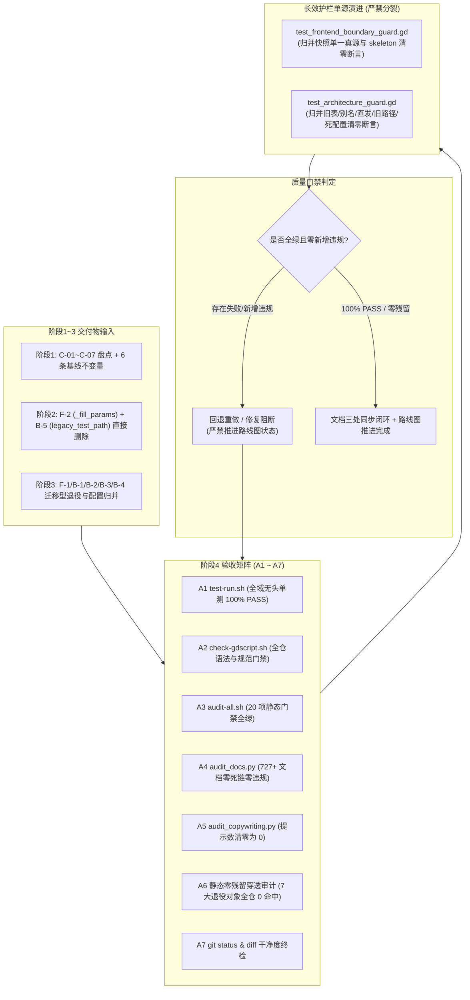

# 施工细则：前后端兼容层退役收敛与兼容残留清零 —— 阶段4：全量回归验收与工程闭环

> [!NOTE]
> **【施工目标】**：对阶段1 全景盘点与契约、阶段2 零风险直接删除（F-2/B-5）、阶段3 迁移型收敛（F-1/B-1/B-2/B-3/B-4）执行全量回归验收——涵盖 A1~A7 验收命令矩阵、兼容层退役静态断言护栏演进（长效护栏单源演进，测试文件零分裂）、六条基线不变量逐条严密验证、18 视图运行时快照冒烟验证、20 项静态门禁零新增违规、路线图与治理文档三处同步闭环。测试代码一律继承 `TestCase`，严格落入规范测试拓扑。
> **案卷全局共享上下文**：👉 [KALAR-DEV-2026-ST79-ATT_附件_案卷共享契约与上下文.md](KALAR-DEV-2026-ST79-ATT_附件_案卷共享契约与上下文.md)。
> **【施工开始日期】：施工开始日期: 2026-09-12（细则编制立项）** —— 真实读取系统时间。
> 状态：✅ 已完成（2026-09-12 验收闭环，全量回归验收通过，工程闭环）
> **【用户指令溯源】**：用户明确指令（2026-09-12）——「工作区出现P82施工细则，但不规范，请规范化调整以及补充盲区」（经交互确认为针对 Phase 83 案卷，要求完整提供严格对齐标准的 4 篇施工细则，规范化调整文本布局、标题层级与内容细化，消除审计盲区）。
> **【对应需求源】**：阶段1《兼容层全景盘点与退役策略契约》（C-01~C-07、R-01~R-07、§1.7 六条基线不变量、§1.8 白名单）；阶段2 与阶段3 全量交付物；[路线图总索引](../../../../路线图/路线图总索引.md)。
> 📍 **卷内快速直达**：[ATT 共享附件](KALAR-DEV-2026-ST79-ATT_附件_案卷共享契约与上下文.md) ｜ [阶段1](KALAR-DEV-2026-ST79-001_阶段1_兼容层全景盘点与退役策略契约.md) ｜ [阶段2](KALAR-DEV-2026-ST79-002_阶段2_零风险死代码与死配置直接删除.md) ｜ [阶段3](KALAR-DEV-2026-ST79-003_阶段3_兼容层迁移收敛与配置归并实施.md) ｜ **阶段4 (当前)**

---

## 📌 第一性原理溯源指针

* **精准上游规范指针**：
  * 本卷阶段 1~3 全部交付物（兼容项总表/改动理由总表/直接删除桶/迁移型收敛实施）；
  * `docs/模板/GD老练风格硬性规范标准.md` §六（自动化门禁对照表，行 167~177）、§八（六维测试拓扑与零黑话铁律，行 192~273）、§九（前端可视化边界硬性契约，行 277~351）；
  * `docs/模板/工程化需求四阶段总标准.md` §4（全量验证与 DoD，行 113~137）；
  * `AGENTS.md`「护栏单源演进：严禁随案卷分裂新护栏文件，新增断言必须归并演进至既有同域护栏」、「全域测试文件名严禁包含任何施工批次与临时性标记（禁止词：`p[0-9]+`、`phase[0-9]+`、`st[0-9]+`、`temp`、`new`、`v[0-9]+`、`wip`）」、「测试目录物理拓扑红线：`tests/unit/` 根目录散落文件数恒等于 0」。
* **核心不变量约束断言**：
  * `Inv-P83-4-1 (回归零破坏)`：全量验收通过前不得推进路线图状态；任一阶段1 兼容项新增违规即回退重做；全仓用例总数不减，零新增失败；
  * `Inv-P83-4-2 (断言可证伪)`：新增与改写的断言必须包含正常、异常、空态及反例注入分支，杜绝恒真断言；
  * `Inv-P83-4-3 (护栏单源演进·严禁分裂)`：退役护栏断言必须归并演进至既有长效护栏（`tests/guards/test_frontend_boundary_guard.gd` 与 `tests/guards/test_architecture_guard.gd`），**严禁随案卷分裂新建独立护栏文件**，测试命名绝对零黑话；
  * `Inv-P83-4-4 (文档三处同步闭环)`：`docs/路线图/路线图总索引.md`、案卷分阶段细则状态、项目真源文档同次提交一致闭环。
* **防漂移最高指示**：严禁以「仅跑通局部单测」的最小 MVP 形式收口；验收证据须覆盖正常路径、异常分支与静态零残留全景扫描，并逐条留痕退出码与关键输出；严格执行两轮施工周期，本轮仅做细则编制待批，未经批准绝不写代码。

---

## 一、 全量回归验收工程 (Full Regression Acceptance)

### 1.1 验收工程整体链路



### 1.2 全量验收命令矩阵 (A1 ~ A7)

| 序 | 验收命令 | 核心校验目标 | 合格通过判据 |
| :--- | :--- | :--- | :--- |
| **A1** | `bash scripts/sh/test-run.sh`<br/>`pwsh -File scripts/ps1/test-run.ps1` | 全域单测套件（含前端、后端、集成管道与架构护栏） | 100% PASS，总套件数保持 110+，总断言数 ≥ 760 且用例数不减，零新增失败 |
| **A2** | `bash scripts/sh/check-gdscript.sh`<br/>`pwsh -File scripts/ps1/check-gdscript.ps1` | GDScript 全量语法解析与编码规范门禁 | 0 语法解析错误，0 规范告警，警告即错误阻断 |
| **A3** | `bash scripts/sh/audit-all.sh`<br/>`pwsh -File scripts/ps1/audit-all.ps1` | 20 项工程化静态门禁全量流水线 | 20/20 全部 PASS，exit code 0，零新增违规 |
| **A4** | `python scripts/py/audit_docs.py --baseline` | 全域技术文档结构、索引、跨链完整性 | 727+ 份文档 0 错误、0 死链，baseline 对比 0 新增 findings |
| **A5** | `python scripts/py/audit_copywriting.py` | 文案单一真源 `copywriting.*` 合规审计 | 0 违规，且原「适配层激活中」提示彻底清零（hints count == 0） |
| **A6** | 全仓静态零残留穿透审计脚本（§1.5） | 7 大兼容退役对象代码与配置物理清零 | 全仓 grep 扫描 7 大对象全部 0 命中，物理文件与空目录 100% 确认删除 |
| **A7** | `git status --porcelain`<br/>`git diff --stat` | 工作树干净度与 diff 范围白名单严格核验 | 严格符合阶段 2 与阶段 3 的白名单变更文件集，无未跟踪残留，无意外修改 |

### 1.3 兼容层退役护栏单源演进设计

> [!IMPORTANT]
> **【护栏单源演进契约（AGENTS.md 红线）】**：护栏套件为长效全域资产，**严禁随案卷分裂新建独立护栏文件**（如严禁新建 `test_frontend_p83_boundary_guard.gd` 或 `test_compatibility_guard.gd`）。新增断言必须归并演进至既有同域护栏：
> 1. **前端退役断言**：全量归并收敛至既有 `tests/guards/test_frontend_boundary_guard.gd`；
> 2. **后端与基建退役断言**：全量归并收敛至既有 `tests/guards/test_architecture_guard.gd`。

#### 1.3.1 前端边界护栏演进 (`test_frontend_boundary_guard.gd`)

在既有 `tests/guards/test_frontend_boundary_guard.gd` 中演进增加快照单源收敛与兼容文件清零断言：

```gdscript
## 兼容层退役护栏断言（Phase 83 收敛）：断言前端快照单一真源且 skeleton_mock 彻底清零
static func _test_compatibility_retirement_frontend_clean() -> Dictionary:
	var results: Array[Dictionary] = []

	# 1. 断言 skeleton_mock.json 物理文件与目录不存在
	var mock_file_exists := FileAccess.file_exists("res://frontend/mocks/skeleton_mock.json")
	results.append(TestCase.assert_false(mock_file_exists, "skeleton_mock.json 物理文件必须彻底删除"))
	var dir := DirAccess.open("res://frontend/")
	if dir:
		results.append(TestCase.assert_false(dir.dir_exists("mocks"), "frontend/mocks 目录必须彻底删除"))

	# 2. 断言全仓 .gd 零引用 skeleton_mock 与 MOCK_PATH
	# 遍历 frontend/ 下所有 gd 文件进行静态特征扫描
	var frontend_files := _collect_all_gd_files("res://frontend/")
	var skeleton_hits := 0
	var fill_params_hits := 0
	for file_path in frontend_files:
		var content := _read_file_content(file_path)
		if content.contains("skeleton_mock") or content.contains("MOCK_PATH"):
			skeleton_hits += 1
		if content.contains("_fill_params"):
			fill_params_hits += 1
	results.append(TestCase.assert_eq(skeleton_hits, 0, "frontend/ 全域零 skeleton_mock 引用"))
	results.append(TestCase.assert_eq(fill_params_hits, 0, "frontend/ 全域零 _fill_params 死委托引用"))

	# 3. 断言 MockDataCatalog 包含完整 character 与 economy 扩展字段
	var char_data: Dictionary = MockDataCatalog.get_domain_data("character")
	results.append(TestCase.assert_true(char_data.has("attributes"), "MockDataCatalog 必须包含 character.attributes"))
	var eco_data: Dictionary = MockDataCatalog.get_domain_data("economy")
	results.append(TestCase.assert_true(eco_data.has("wallet"), "MockDataCatalog 必须包含 economy.wallet"))
	results.append(TestCase.assert_true(eco_data.has("price_trend"), "MockDataCatalog 必须包含 economy.price_trend"))

	return TestCase.make_result("frontend_compatibility_retirement", _all_sub_passed(results))
```

#### 1.3.2 架构守卫护栏演进 (`test_architecture_guard.gd`)

在既有 `tests/guards/test_architecture_guard.gd` 中演进增加后端旧表、直发入口、双路径及死配置的静态断言：

```gdscript
## 兼容层退役护栏断言（Phase 83 收敛）：断言后端旧表、别名、直发、双路径及死配置彻底清零
static func _test_compatibility_retirement_backend_clean() -> Dictionary:
	var results: Array[Dictionary] = []

	# 1. 断言旧文案表不存在
	results.append(TestCase.assert_false(FileAccess.file_exists("res://config/descriptions/items.json"), "config/descriptions/items.json 必须删除"))
	results.append(TestCase.assert_false(FileAccess.file_exists("res://config/narratives/events.json"), "config/narratives/events.json 必须删除"))

	# 2. 断言行动卡别名文件不存在
	results.append(TestCase.assert_false(FileAccess.file_exists("res://backend/domains/magic_system/action_card_definition.gd"), "action_card_definition.gd 必须删除"))

	# 3. 断言 domains.json 零 legacy_test_path 死字段残留
	var domains_json_str := _read_file_content("res://config/infrastructure/domains.json")
	results.append(TestCase.assert_false(domains_json_str.contains("legacy_test_path"), "domains.json 严禁残留 legacy_test_path 字段"))

	# 4. 断言 backend/ 全域零旧路径符号引用
	var backend_files := _collect_all_gd_files("res://backend/")
	var direct_hits := 0
	var alias_hits := 0
	var fallback_hits := 0
	for file_path in backend_files:
		var content := _read_file_content(file_path)
		if content.contains("dispatch_rewards_direct"):
			direct_hits += 1
		if content.contains("ActionCardDefinition"):
			alias_hits += 1
		if content.contains("_legacy_fallback"):
			fallback_hits += 1
	results.append(TestCase.assert_eq(direct_hits, 0, "backend/ 全域零 dispatch_rewards_direct 引用"))
	results.append(TestCase.assert_eq(alias_hits, 0, "backend/ 全域零 ActionCardDefinition 引用"))
	results.append(TestCase.assert_eq(fallback_hits, 0, "backend/ 全域零 _legacy_fallback 引用"))

	return TestCase.make_result("backend_compatibility_retirement", _all_sub_passed(results))
```

### 1.4 基线契约六条不变量逐条严密验证方案

| 不变量编号 | 核心契约命题 | 验证输入与路径 | 预期断言结果 | 反例注入可证伪验证 |
| :--- | :--- | :--- | :--- | :--- |
| `Inv-P83-1-1` | 前端快照单一真源成立 | 经 `MockSnapshotDataService.load_snapshot("character")` 读取快照 | 返回字典与 `MockDataCatalog.get_domain_data("character")` 逐字相同，包含 STR==14 等 23 字段 | 若删除 catalog 中的 character 域，断言立即失败报空 |
| `Inv-P83-1-2` | 快照读取接口抽象保留 | 检查 `ISnapshotDataService` 虚基类签名与 `MockSnapshotDataService` 继承结构 | `load_snapshot(domain_id: String) -> Dictionary` 签名未改，类型转换安全 | 若入参类型漂移或返回值丢失 Dictionary，编译门禁阻断 |
| `Inv-P83-1-3` | 奖励发放唯一路径成立 | 静态扫描全仓 `dispatch_rewards_direct` 并执行 `test_cdkey_voucher` | 全仓 0 命中，兑换邮件附件 1:1 包含货币与道具聚合包 | 若在业务代码自造直发函数，架构护栏立即阻断 |
| `Inv-P83-1-4` | 魔法基线查询单路径强制 | 检查 `infer_tier_candidates` / `rank_to_band` 签名与调用面 | 签名无 `= null` 默认值，全仓调用点 100% 显式传参 `registry` 实例 | 若调用方省略 registry 参数，GDScript 报参数缺失阻断 |
| `Inv-P83-1-5` | 行动卡权威载体唯一性 | 检查全仓 `ActionCardDefinition` 命中数并执行 `test_magic_system` | 全仓 0 命中，施法求解器常量 `CONSUMES_PLAY == 1` 维持战斗求解一致性 | 若引入别名类型，语法与架构门禁双重拦截 |
| `Inv-P83-1-6` | 文案单一真源成立 | 检查 `descriptions.items` / `narratives.events` 物理文件与调用面 | 两旧表物理不存在，`CopywritingResolver.resolve` 读新表文本逐字无差 | 若回读不存在旧表，返回 `COPY_ENTRY_MISSING` 拒绝 |

### 1.5 阶段 1~3 交付物与量化指标终验总表

```bash
# 全仓静态零残留穿透终审脚本（可直接复制执行，期望输出全部为 0 或不存在）
echo "=== 1. 前端快照单一真源终检 ==="
grep -rn "skeleton_mock\|MOCK_PATH\|frontend/mocks" frontend/ backend/ tests/ scripts/ | wc -l # 期望: 0
test ! -f frontend/mocks/skeleton_mock.json && echo "skeleton_mock.json DELETED"               # 期望: DELETED
test ! -d frontend/mocks && echo "frontend/mocks dir DELETED"                                   # 期望: DELETED

echo "=== 2. 前端死代码清零终检 ==="
grep -rn "_fill_params" frontend/ backend/ tests/ scripts/ | wc -l                              # 期望: 0

echo "=== 3. 文案单一真源与旧表清零终检 ==="
grep -rn "descriptions\.items\|narratives\.events\|_legacy_fallback" backend/ frontend/ tests/ scripts/ | wc -l # 期望: 0
test ! -f config/descriptions/items.json && echo "descriptions/items.json DELETED"              # 期望: DELETED
test ! -d config/descriptions && echo "config/descriptions dir DELETED"                         # 期望: DELETED
test ! -f config/narratives/events.json && echo "narratives/events.json DELETED"                # 期望: DELETED

echo "=== 4. CDKey 直发管线清零终检 ==="
grep -rn "dispatch_rewards_direct" backend/ frontend/ tests/ scripts/ | wc -l                   # 期望: 0

echo "=== 5. 魔法基线双路径清零终检 ==="
grep -n "= null" backend/domains/item_namespace_registry/magic_*_resolver.gd | grep -E "infer_tier_candidates|rank_to_band" | wc -l # 期望: 0

echo "=== 6. 行动卡别名清零终检 ==="
grep -rn "ActionCardDefinition" backend/ frontend/ tests/ scripts/ | wc -l                       # 期望: 0
test ! -f backend/domains/magic_system/action_card_definition.gd && echo "action_card_definition.gd DELETED" # 期望: DELETED

echo "=== 7. domains.json 死配置清零终检 ==="
grep -c "legacy_test_path" config/infrastructure/domains.json                                   # 期望: 0
python3 -m json.tool config/infrastructure/domains.json > /dev/null && echo "domains.json JSON_OK" # 期望: JSON_OK
```

### 1.6 路线图总索引与全库文档三处同步闭环规约

在确认 A1~A7 全量验收通过后，必须同步执行以下三处文档状态流转与真源更新：
1. **路线图总索引 (`WebGames/docs/路线图/路线图总索引.md`)**：
   - 案卷状态由 `📋 细则待批` 推进为 `✅ 已完成`；
   - 阶段 1~4 直达链接状态全数更新为 `✅ 已完成`；
   - 归档周期计数更新为第 08 期在途 9/10（Phase 75~83 ✅）；
2. **案卷内部分阶段细则 (Phase 83 阶段1~4)**：
   - 四份细则开头的状态标记全部更新为 `✅ 已完成`，并填入真实的验收系统时间与数据；
3. **架构与真源文档同步**：
   - 若有任何架构级调整或契约变更，同步更新 `WebGames/docs/README.md` 与相关真源指针；
   - 严禁向短期施工区 `README.md` 写入案卷列表（保持总索引单一登记）。

---

## 二、 命令式施工执行清单 (Agent Execution Checklist)

- [x] **Step 4.1: 开工前置核验** - 确认阶段2 直接删除桶与阶段3 迁移型退役桶改动已在本地工作区就绪，准备进入全量验收
- [x] **Step 4.2: 护栏单源演进实现** - 将前端快照单源断言归并至 `tests/guards/test_frontend_boundary_guard.gd`，将后端旧表/别名/直发/死字段断言归并至 `tests/guards/test_architecture_guard.gd`（严格禁止新建带批次黑话的独立护栏文件）
- [x] **Step 4.3: 全域静态穿透零残留审计** - 执行 §1.5 静态终审脚本，确认 7 大兼容退役对象在全仓 0 命中，物理文件与空目录彻底清零
- [x] **Step 4.4: 运行 A1~A5 门禁命令序列** - 顺序执行 `test-run.sh`（100% PASS）、`check-gdscript.sh`（0 错误 0 警告）、`audit-all.sh`（20/20 PASS）、`audit_docs.py`（0 死链 0 违规）、`audit_copywriting.py`（通过且 0 提示）
- [x] **Step 4.5: 18 视图运行时快照冒烟验证** - 针对 4 个消费快照的重点视图（account_entry, character_progression, economy_trade, world_map）执行数据注入冒烟核验，断言渲染输出与旧版完全等价
- [x] **Step 4.6: 六条基线不变量逐条断言复核** - 按照 §1.4 逐项核验 Inv-P83-1-1 至 Inv-P83-1-6，确认反例注入可证伪性
- [x] **Step 4.7: 工作区 diff 边界与文件白名单终验** - 执行 `git status -s` 与 `git diff --stat`，确认改动文件严格受控于预期白名单，无多余未跟踪文件，无非细则文件混入
- [x] **Step 4.8: 路线图与文档三处同步闭环** - 验收全绿后，同步推进 Phase 83 在路线图总索引及四份细则中的状态，达成工程闭环

---

## 三、 全量回归与工程闭环验收矩阵 (DoD Matrix)

| 检验项 ID | 校验目标 | 验证输入 | 预期输出断言 |
| :--- | :--- | :--- | :--- |
| `TC-P83-S4-01` | 全域单测 100% PASS (A1) | `bash scripts/sh/test-run.sh` | 套件数 = 109，断言数 = 761，所有用例 100% PASS，零新增失败 |
| `TC-P83-S4-02` | GDScript 语法全量达标 (A2) | `bash scripts/sh/check-gdscript.sh` | 解析成功率 100%，0 语法错误，0 格式告警，exit code 0 |
| `TC-P83-S4-03` | 20 项工程门禁全绿 (A3) | `bash scripts/sh/audit-all.sh` | 20/20 项静态门禁全部通过，零新增违规 |
| `TC-P83-S4-04` | 文档全仓零死链 (A4) | `python scripts/py/audit_docs.py` | 727+ 份文档 0 错误，0 死链，相对路径全部有效 |
| `TC-P83-S4-05` | 文案审计提示清零 (A5) | `python scripts/py/audit_copywriting.py` | 脚本退出码 0，且 hints 提示数严格为 0（适配层激活提示消除） |
| `TC-P83-S4-06` | 前端快照单源静态可证 | `grep -rn "skeleton_mock"` + 文件存在性 | 全仓 0 命中，`skeleton_mock.json` 与 `frontend/mocks/` 不存在 |
| `TC-P83-S4-07` | 前端死代码零残留 | `grep -rn "_fill_params"` | 全仓 0 命中，`ui_text_resolver.gd` 行数降至 81 |
| `TC-P83-S4-08` | 文案旧表与回读零残留 | `grep -rn "descriptions\.items\|narratives\.events\|_legacy_fallback"` | 全仓 0 命中，`config/descriptions/` 目录彻底清零删除 |
| `TC-P83-S4-09` | 礼包直发入口物理清零 | `grep -rn "dispatch_rewards_direct"` | 全仓 0 命中，`voucher_dispatch_pipeline.gd` 仅保留邮件发放唯一路径 |
| `TC-P83-S4-10` | 魔法基线单路径强制生效 | `grep -n "= null" magic_*_resolver.gd` | 两个 resolver 签名无 `= null`，全仓调用面 100% 显式传参 |
| `TC-P83-S4-11` | 行动卡废弃别名彻底清零 | `grep -rn "ActionCardDefinition"` + 文件存在性 | 全仓 0 命中，`action_card_definition.gd` 物理文件彻底删除 |
| `TC-P83-S4-12` | 护栏单源演进与零黑话 | 审查 `tests/guards/` 与全域测试文件命名 | 护栏单源演进至既有护栏，全域测试文件名无 `p83/phase83/st/temp/wip` 等黑话 |
