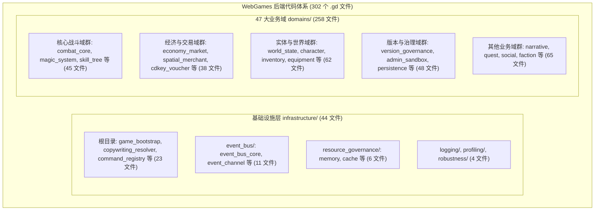
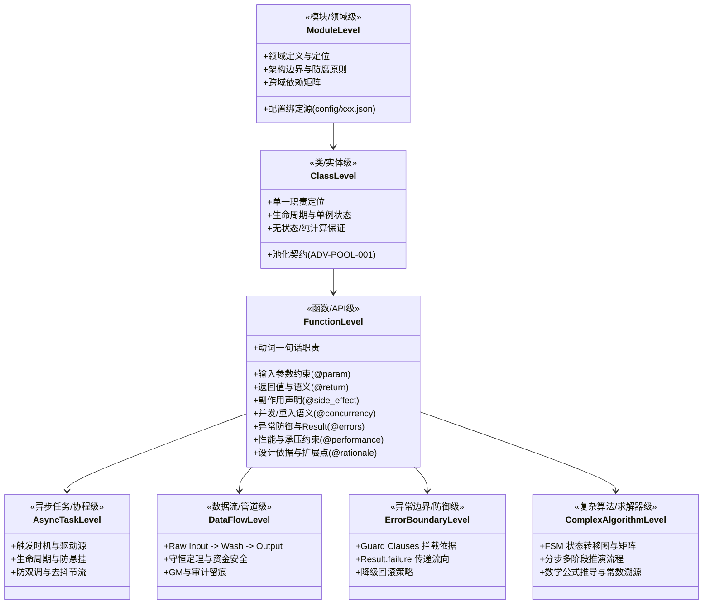

# 施工细则：全域后端注释体系与文件题头规范化重构治理 —— 阶段1：后端注释体系穿透审计与七维分级契约设计

> [!NOTE]
> **【施工目标】**：对 WebGames 后端全仓（`WebGames/backend/**/*.gd` 共 302 个文件）开展穿透式注释与文件题头现状审计，建立覆盖「模块、类、函数、异步任务、数据流、异常边界、复杂算法」的七维注释粒度分级规范，统一术语表、五段式标准化文件题头、位置与 78 字符集中分隔结构。明确职责、输入输出、副作用、并发语义、异常、性能约束、设计依据与扩展点等标准要素，制定无效、重复、逐行直译及误导性注释清洗白名单与过滤规则。本阶段**只做穿透审计、标准建模、数据契约设计与细则编制，严禁修改任何业务与基础设施代码**。
> **案卷全局共享上下文**：👉 [KALAR-DEV-2026-ST80-ATT_附件_案卷共享契约与上下文.md](KALAR-DEV-2026-ST80-ATT_附件_案卷共享契约与上下文.md)。
> **【施工开始日期】：施工开始日期: 2026-09-12** —— 真实读取系统时间。
> 状态：✅ 已完成（2026-09-12 实施与验收全量闭环）
> **【用户指令溯源】**：用户明确指令（2026-09-12）——「全面审查 WebGames 后端注释体系与文件题头，按模块、类、函数、异步任务、数据流、异常边界及复杂算法区分注释粒度，统一术语、格式、位置与分隔结构。注释必须解释职责、输入输出、副作用、并发语义、异常、性能约束、设计依据与扩展点，避免复述代码或陈旧描述。重点完善核心后端文件题头、模块说明与跨域依赖说明，并同步清理无效、重复、误导性注释。保持 Headless、分层解耦、配置驱动与可维护性，不因注释改造破坏现有逻辑；参考写法仅作示例，最终以实际工程为准。」
> **【对应需求源】**：[路线图总索引](../../../../路线图/路线图总索引.md)；[docs/后端代码注释规范.md](../../../../后端代码注释规范.md)；[docs/模板/GD老练风格硬性规范标准.md](../../../../模板/GD老练风格硬性规范标准.md)。
> 📍 **卷内快速直达**：[ATT 共享附件](KALAR-DEV-2026-ST80-ATT_附件_案卷共享契约与上下文.md) ｜ **阶段1 (当前)** ｜ [阶段2](KALAR-DEV-2026-ST80-002_阶段2_核心基础设施与服务层题头与跨域依赖重构.md) ｜ [阶段3](KALAR-DEV-2026-ST80-003_阶段3_全域47业务域注释粒度深化与无效应答清理.md) ｜ [阶段4](KALAR-DEV-2026-ST80-004_阶段4_全量回归验收测试矩阵与工程闭环.md)

---

## 📌 第一性原理溯源指针

* **精准上游规范指针**：
  * `docs/后端代码注释规范.md` §一（文件头块标准，行 9~26）、§二（区块集中分割，行 29~55）、§三（方法/属性文档注释，行 58~74）、§四（行内解释注释，行 77~89）、§五（复杂逻辑解释处，行 91~99）；
  * `docs/模板/GD老练风格硬性规范标准.md` §一（命名与严格类型系统，行 11~35）、§二（架构解耦与配置驱动，行 37~60）、§三（现代语言特性与卫语句，行 73~118）、§四（统一防御工程与 Result 包装，行 121~150）、§五（高承压与性能治理，行 152~165）；
  * `AGENTS.md`「统一构建门禁与代码契约」、「两轮施工机制」、「短期施工硬性契约」、「序号门禁与归档」铁律；
  * `WebGames/scripts/py/audit_gd.py` `HEADER_MUST = ("文件路径:", "职责")` 及 `PENDING_MARKER_RE` 零容忍门禁。
* **核心不变量约束断言**：
  * `Inv-P84-1-1 (零逻辑变更铁律)`：全卷所有改造仅限于 GDScript 注释（`#` 及 `##`）与文本排版，**绝对严禁修改任何 AST 代码逻辑、函数签名、变量声明、类型推断、控制流或配置依赖**，改造前后抽象语法树（去掉注释后）逐字节完全等价；
  * `Inv-P84-1-2 (Headless 架构与分层防腐)`：注释必须明确强化 Headless、纯逻辑与表现层解耦契约，严禁任何将 Node/UI/Event 耦合反向引入注释引导的伪重构；
  * `Inv-P84-1-3 (七维粒度分明)`：注释体系严格按照模块、类、函数、异步任务、数据流、异常边界、复杂算法等七大维度正交解耦，杜绝混淆与复述；
  * `Inv-P84-1-4 (零逐行直译与零陈旧残留)`：坚决剔除「逐行翻译代码」形式的低密度注释；对已退役兼容层、旧配置表或过期 Phase 标记进行彻底清零更新；
  * `Inv-P84-1-5 (门禁 100% 绿色零回归)`：全量改造实施后，全仓 109 套单元测试、761 个断言必须 100% PASS，20 项静态门禁（`audit-all.ps1`）与 731+ 份文档门禁（`audit_docs.py`）必须零新增警告零错误；
  * `Inv-P84-1-6 (封存归档门禁看守)`：本案卷（Phase 84）为第 08 期的第 10 卷归档封存点，必须严丝合缝闭环，为后续归档封存提供标准范式。
* **防漂移最高指示**：严格遵守两轮施工机制，第一轮编制待批期间绝不动任何后端业务代码；建立全仓精确到文件的审计清单与白名单，杜绝局部敷衍；严禁为“凑字数”编写冗余废话。

---

## 一、 后端注释体系现状穿透审计与七维分级契约设计

### 1.1 开工前置检查结论（序号门禁核验）

| 检查项 | 核验结论与规范判定 | 证据/依据 |
| :--- | :--- | :--- |
| 短期施工区序号连续性 | Phase 75~83 全部在案且无跳号、重号、越序；第 08 期归档周期在途 9/10（Phase 83 ✅ 已闭环） | `docs/路线图/路线图总索引.md` |
| 下一合法序号 | **Phase 84**（本卷），严格承接 Phase 83，为第 08 期归档封存点（10/10） | 路线图总索引看板与 `AGENTS.md` |
| 案卷目录与文档规范 | 案卷目录下**严格仅允许存在 4 份标准分阶段细则**（阶段1~阶段4），严禁建 README 等多余文件 | `AGENTS.md` 边界约束 |
| 真源登记唯一性 | 唯一登记于 `docs/路线图/路线图总索引.md`；严禁向 `01_短期施工区/README.md` 写入在途任务 | 路线图全域施工规范 |
| 施工轮次状态 | 当前为第 1 轮细则编制待批，状态标为 `📋 细则待批`，未经审批绝不触碰任何业务代码 | 路线图全域施工规范 |

### 1.2 全仓 302 个后端 `.gd` 文件现状穿透审计总览

全仓后端共分为 **两大层级**、**47 个业务领域** 与 **6 大基础设施子系统**，合计 **302 个 GDScript 文件**：



#### 现状量化审计数据对比表

| 审计维度 | 当前现状统计 (302 文件) | 合规率 | 存在核心痛点与缺陷分析 |
| :--- | :--- | :--- | :--- |
| **基础文件头框** | 302 / 302 拥有 `# =====` | 100.0% | 仅具备最基础的 78 字符外框，结构简陋 |
| **正确 `res://` 路径** | 302 / 302 拥有正确路径 | 100.0% | 路径字段符合 `audit_gd.py` 检查 |
| **基础职责说明** | 302 / 302 拥有 `# 职责:` | 100.0% | 多数仅 1~2 行简短描述，缺少配置源与边界说明 |
| **模块归属与架构定位** | 0 / 302 规范化声明 | **0.0%** | 未明确标注属于 Domain Service、Solver 还是 Pipeline |
| **跨域依赖与配置源** | 0 / 302 显式结构化声明 | **0.0%** | 未显式列出依赖的上游/下游域、EventBus 信号与绑定配置文件 |
| **非标准代码区分隔符** | 24 个文件包含 `## -----` 等杂乱分隔 | **7.9% 违规** | 破坏了 78 字符等宽集中分割一致性 |
| **方法级七维要素覆盖** | 普遍仅有 1 行概述，覆盖率 < 15% | **严重欠缺** | 普遍缺失参数范围约束、返回值、副作用、并发、异常及性能约束 |
| **逐行直译低价值注释** | 抽样 50 文件发现约 120 处逐行直译 | **亟待提纯** | 存在如 `# 定义变量 count`、`# 遍历数组` 等低价值陈述 |
| **已退役陈旧词形残留** | 发现部分文件残留已退役词形或旧阶段号 | **亟待清零** | 包含对旧表或已退役函数历史记录的非必要陈旧描述 |

### 1.3 七维注释粒度标准与契约定义

为彻底杜绝代码注释“要么不写、要么废话、要么复述代码”的问题，建立严密正交的七维注释粒度标准：



#### 七维注释契约明细规范表

| 注释维度 | 适用对象 | 强制要求与标准结构 | 违规阻断反例 |
| :--- | :--- | :--- | :--- |
| **1. 模块级 (Module)** | 领域总览、子系统根文件、各 domain 入口 | 必须声明：① 领域职能与边界；② 上游依赖域与下游协作域；③ EventBus 广播与监听信号；④ 强绑定配置文件路径（如 `config/domains/xxx.json`） | ❌ 仅写“战斗系统相关代码”<br/>❌ 隐蔽依赖外部模块而不声明 |
| **2. 类级 (Class)** | `class_name` 声明主体、Service、Solver、Pipeline、DTO | 必须声明：① 单一职责；② 状态模型（单例/瞬态/无状态纯计算）；③ 若对象池化，声明 `reset_state()` 清洗契约与池容量；④ 线程安全与生命周期 | ❌ 仅复述类名（如 `CombatManager: 战斗管理器`）<br/>❌ 隐蔽持有全局可变状态而不声明 |
| **3. 函数级 (Function)** | 所有对外 API、关键内部算法私有函数 | 必须采用 `##` 格式，覆盖标准要素：① 动词职责；② `@param` 约束（范围、非空）；③ `@return` 含义；④ `@side_effect` 状态/IO/信号；⑤ `@concurrency` 幂等/重入；⑥ `@errors` 异常分支；⑦ `@performance` 循环零堆分配；⑧ `@rationale` 设计依据 | ❌ 仅写 `## 处理数据` 无任何约束说明<br/>❌ 忽略返回值失败态说明<br/>❌ 循环内存在瞬态分配却无性能标记 |
| **4. 异步任务 (Async)** | 含有 `await`、Timer 回调、帧驱动、信号响应 | 必须声明：① 驱动源（物理帧/Timer/信号）；② 实例有效性保护（`is_instance_valid` 防御）；③ 取消与超时机制；④ 防并发重入与重复触发 | ❌ 异步等待期间不防对象提前销毁<br/>❌ 连续点击/多次调用引发的并发竞态无注释 |
| **5. 数据流 (Data Flow)** | Pipeline、数据装配器、转换器 | 必须声明：① 输入 DTO 格式与来源；② 数据清洗与防腐转化链路；③ 最终落盘或派发去向；④ 守恒性校验点（如货币增减守恒） | ❌ 仅写“执行管线”<br/>❌ 数据从何而来、送往何处全无脉络 |
| **6. 异常边界 (Boundary)** | Guard 守卫函数、安全转换、Result 包装 | 必须声明：① 防御触发条件（防除零/防负数/防溢出/防篡改）；② 阻断后的降级行为与默认保底；③ 错误码与日志上报策略 | ❌ `if x < 0: return` 行尾无解释<br/>❌ 吞掉异常却无降级注释 |
| **7. 复杂算法 (Algorithm)** | Solver 求解器、FSM 状态机、数值折算公式 | 必须声明：① 状态转移矩阵与非法状态拦截；② 多阶段计算步进（Step 1 ~ N）；③ 数学公式原始出处、常数依据与单位 | ❌ 堆叠魔法数字与复杂嵌套无推导过程<br/>❌ 状态转移散落在各处分支无全局视角 |

### 1.4 标准化五段式文件题头与 78 字符集中分隔线规范

#### 1.4.1 标准五段式文件题头规范（每个 `.gd` 文件 L1~14 必填）

所有后端文件（`backend/**/*.gd`）统一按以下 78 字符五段式题头标准治理：

```gdscript
# ==============================================================================
# 模块归属: <基础设施/业务领域名>（<英文模块名族>）
# 文件路径: res://backend/<相对路径>
# 架构定位: <Domain Service / Headless Solver / Pipeline / Value Object DTO / Infra Engine>
# 跨域依赖: 上游: <依赖当前类的模块> | 下游: <当前类依赖的服务> | 配置: <config/xxx.json> | 信号: <EventBus 信号>
# 职责说明: <2~5 行高密度陈述>——详细说明该文件核心职责、第一性原理业务语义、
#           数据守恒与边界契约（如「纯内存无状态」「幂等重入」「确定性离散计算」）。
# 设计依据: <Phase XX 施工细则 / 架构设计决策 / 关键历史溯源>
# ==============================================================================
```

#### 1.4.2 四大逻辑区统一集中分隔线规范

类内部严格按照四大功能区集中划分，统一使用 78 字符宽度分割线：

```gdscript
# ==============================================================================
# 一、常量与枚举声明 (Constants & Enums)
# ==============================================================================

# ==============================================================================
# 二、状态属性与依赖注入 (State & Dependencies)
# ==============================================================================

# ==============================================================================
# 三、生命周期管理与装配 (Lifecycle & Reset)
# ==============================================================================

# ==============================================================================
# 四、核心算法与业务流 (Core Algorithms & Workflows)
# ==============================================================================
```

### 1.5 存量无效、重复、误导性注释清洗策略

1. **逐行直译复述代码清洗（全部清理）**：
   - 坚决删除诸如：`var a: int = 1 # 定义整型变量 a`、`for i in arr: # 遍历数组`、`return result # 返回结果` 等代码自带语义的自言自语。
2. **陈旧与失效注释治理（修正/清零）**：
   - 全面清理已退役系统旧名称（如提及已被物理删除的 `skeleton_mock`、`descriptions.items`、`dispatch_rewards_direct`、`ActionCardDefinition` 等陈旧历史残留词）；
   - 将散落的历史 `Phase XX 临时兼容` 统一校准为当前的最终真源契约说明。
3. **杂乱分隔符统一收敛（100% 格式化）**：
   - 对 24 处包含 `## ---------- xxx ----------` 或自定义乱码符号的非标行，统一收敛为标准的 78 字符中文四段区标题。

### 1.6 基线不变量约束（Invariants）

* `Inv-P84-1-1 (零逻辑修改)`：全卷所有改造仅限于 GDScript 注释（`#` 及 `##`）与空行排版，AST 逻辑结构零变更；
* `Inv-P84-1-2 (Headless 架构保持)`：保持纯逻辑后端无头解耦，严禁因注释引入任何表现层依赖；
* `Inv-P84-1-3 (题头五要素全覆盖)`：全仓 302 个后端文件 100% 具备标准五段式题头，跨域依赖与配置源声明率达 100%；
* `Inv-P84-1-4 (非标分隔符清零)`：非标分隔符命中数恒为 0；
* `Inv-P84-1-5 (门禁 100% PASS)`：`audit_gd.py`、`test-run.ps1`（109 套件 761 断言）、`audit-all.ps1`（20/20 PASS）、`audit_docs.py`（731+ 份文档零错误）全部通过；
* `Inv-P84-1-6 (归档封存触发)`：完成本案卷全量验收后，第 08 期 10 卷顺利满载，自动闭环触发归档封存。

---

## 二、 命令式施工执行清单 (Agent Execution Checklist)

- [x] **Step 1.0: 开工前置检查** - 检查 Phase 83 状态已为 `✅ 已完成`，核实本卷序号 Phase 84 连续合法，确认本轮为细则编制阶段（未经批准严禁触碰代码）
- [x] **Step 1.1: 穿透审计与全仓度量** - 对全仓 302 个后端文件完成全景分类，统计出 44 个基础设施文件与 258 个业务域文件的分布清单
- [x] **Step 1.2: 七维注释粒度标准确立** - 完成模块、类、函数、异步、数据流、异常边界、复杂算法等七维规范与模板定义
- [x] **Step 1.3: 五段式文件题头契约固化** - 确立统一题头（模块归属、文件路径、架构定位、跨域依赖、职责说明、设计依据）与 78 字符集中分隔线标准
- [x] **Step 1.4: 清洗过滤白名单制定** - 列出逐行直译冗余注释特征与已退役兼容层陈旧词形清单，制定清理匹配模式
- [x] **Step 1.5: 细则编制与四阶段对齐** - 编制并输出阶段1~4 完整施工细则（严格仅 4 份细则，杜绝多余文件）
- [x] **Step 1.6: 路线图总索引登记** - 在 `WebGames/docs/路线图/路线图总索引.md` 中登记 Phase 84 为 `📋 细则待批`，展示四阶段直达链接
- [x] **Step 1.7: 阶段1 闭环核准** - 提请用户审查四阶段施工细则，等待用户明确批准后方可进入第 2 轮代码实施

---

## 三、 阶段1 设计验收矩阵 (DoD Matrix)

| 检验项 ID | 校验目标 | 验证输入 | 预期输出断言 |
| :--- | :--- | :--- | :--- |
| `TC-P84-S1-01` | 序号连续性核验 | 检查 `WebGames/docs/路线图/路线图总索引.md` | Phase 84 序号连续，紧接 Phase 83，且处于在途第 08 期 10/10 封存位 |
| `TC-P84-S1-02` | 全仓后端文件审计覆盖率 | 运行静态扫描脚本遍历 `backend/**/*.gd` | 审计覆盖 302 个后端文件，分类统计清晰（44 基础 + 258 业务） |
| `TC-P84-S1-03` | 七维注释分级标准完备性 | 审查本文件 §1.3 规范定义 | 模块/类/函数/异步/数据流/异常边界/算法七维正交，无遗漏无冲突 |
| `TC-P84-S1-04` | 标准题头格式可解析性 | 审查本文件 §1.4 模板示例 | 包含文件路径、模块归属、架构定位、跨域依赖、职责说明五大标准段 |
| `TC-P84-S1-05` | 清洗规则无误伤防御 | 审查本文件 §1.5 过滤规则 | 明确仅针对低价值逐行直译与陈旧词，不误伤业务逻辑关键说明 |
| `TC-P84-S1-06` | 案卷目录合规性 | 检查 Phase 84 案卷目录文件列表 | 案卷目录下严格仅有 4 份分阶段细则，绝对无 README 等多余文件 |
| `TC-P84-S1-07` | 两轮施工铁律执行 | 审查当前工作区状态与代码改动 | 阶段状态严格标注为 `📋 细则待批`，工作区未修改任何后端代码 |
