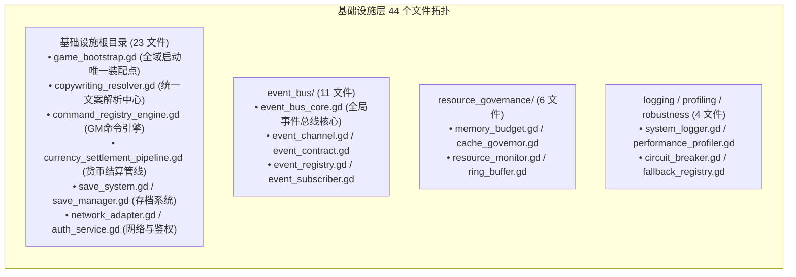

# 施工细则：全域后端注释体系与文件题头规范化重构治理 —— 阶段2：核心基础设施与服务层题头与跨域依赖重构

> [!NOTE]
> **【施工目标】**：基于阶段1 确立的七维分级标准与五段式题头契约，重点针对 WebGames **基础设施层全部 44 个核心代码文件**（`backend/infrastructure/**/*.gd`，含根目录 23 文件、`event_bus/` 11 文件、`resource_governance/` 6 文件及 logging/profiling/robustness 4 文件）开展高密度重构。补全模块说明、清晰梳理跨域依赖与配置驱动源，规范化四大逻辑区集中分隔结构，全面升级核心底座（`GameBootstrap`、`EventBusCore`、`CopywritingResolver` 等）的方法级注释，彻底消除非标分隔符与逐行直译废话。本阶段**只做注释优化与排版规范，严禁变动任何代码逻辑**。
> **案卷全局共享上下文**：👉 [KALAR-DEV-2026-ST80-ATT_附件_案卷共享契约与上下文.md](KALAR-DEV-2026-ST80-ATT_附件_案卷共享契约与上下文.md)。
> **【施工开始日期】：施工开始日期: 2026-09-12** —— 真实读取系统时间。
> 状态：✅ 已完成（2026-09-12 实施与验收全量闭环）
> **【用户指令溯源】**：用户明确指令（2026-09-12）——「全面审查 WebGames 后端注释体系与文件题头，按模块、类、函数、异步任务、数据流、异常边界及复杂算法区分注释粒度，统一术语、格式、位置与分隔结构。注释必须解释职责、输入输出、副作用、并发语义、异常、性能约束、设计依据与扩展点，避免复述代码或陈旧描述。重点完善核心后端文件题头、模块说明与跨域依赖说明，并同步清理无效、重复、误导性注释。保持 Headless、分层解耦、配置驱动与可维护性，不因注释改造破坏现有逻辑；参考写法仅作示例，最终以实际工程为准。」
> **【对应需求源】**：阶段1《后端注释体系穿透审计与七维分级契约设计》；[路线图总索引](../../../../路线图/路线图总索引.md)；[docs/后端代码注释规范.md](../../../../后端代码注释规范.md)。
> 📍 **卷内快速直达**：[ATT 共享附件](KALAR-DEV-2026-ST80-ATT_附件_案卷共享契约与上下文.md) ｜ [阶段1](KALAR-DEV-2026-ST80-001_阶段1_后端注释体系穿透审计与七维分级契约设计.md) ｜ **阶段2 (当前)** ｜ [阶段3](KALAR-DEV-2026-ST80-003_阶段3_全域47业务域注释粒度深化与无效应答清理.md) ｜ [阶段4](KALAR-DEV-2026-ST80-004_阶段4_全量回归验收测试矩阵与工程闭环.md)

---

## 📌 第一性原理溯源指针

* **精准上游规范指针**：
  * 本卷阶段1《后端注释体系穿透审计与七维分级契约设计》全表（§1.3 七维粒度、§1.4 标准题头与四区规范、§1.5 清洗策略）；
  * `docs/后端代码注释规范.md` §一（文件头块标准）、§二（区块集中分割）、§三（方法文档注释）；
  * `docs/模板/GD老练风格硬性规范标准.md` §二（架构解耦与配置驱动，行 37~60）、§四（统一防御工程，行 121~150）、§五（高承压治理，行 152~165）；
  * `AGENTS.md`「统一构建门禁与代码契约」、「两轮施工机制」铁律；
  * `WebGames/scripts/py/audit_gd.py` `HEADER_MUST` 强制门禁。
* **核心不变量约束断言**：
  * `Inv-P84-2-1 (纯文本修改·零 AST 差异)`：改造仅限于 GDScript `#` 与 `##` 注释，绝对严禁改动任何变量、函数签名、控制流或运算逻辑；
  * `Inv-P84-2-2 (基础设施 44 文件 100% 覆盖)`：`backend/infrastructure/` 下 44 个文件 100% 具备标准五段式题头，跨域依赖与配置源声明率达 100%；
  * `Inv-P84-2-3 (核心底座高密度契约)`：`GameBootstrap`、`EventBusCore`、`CopywritingResolver`、`CommandRegistryEngine` 等核心底座方法，100% 补齐参数前提、返回值、副作用、并发、异常与性能说明；
  * `Inv-P84-2-4 (基础设施非标分隔符清零)`：`backend/infrastructure/` 内非标分隔符（如 `## -----`）清零为 0，严格对齐 78 字符四大中文逻辑分区；
  * `Inv-P84-2-5 (门禁 100% PASS)`：单测 109 套件、761 断言 100% 通过，`audit-all.ps1` 20/20 PASS。
* **防漂移最高指示**：本阶段范围严格限定在 `backend/infrastructure/` 44 个文件，绝不提前跨入 47 业务域（业务域统一留待阶段3 集中实施）；严禁私自修改业务逻辑或新增任何包装类。

---

## 一、 核心基础设施与服务层题头与跨域依赖重构设计

### 1.1 基础设施层 44 个文件拓扑与清单梳理



### 1.2 基础设施核心类五段式题头重构示范

#### 示范 1: 全域启动装配器 (`backend/infrastructure/game_bootstrap.gd`)

```gdscript
# ==============================================================================
# 模块归属: 基础设施层 (Infrastructure · Bootstrap)
# 文件路径: res://backend/infrastructure/game_bootstrap.gd
# 架构定位: Infrastructure Engine / Lifecycle Orchestrator
# 跨域依赖: 上游: Main Scene / Headless Test Runner
#           下游: GameConfig, ItemRegistryCatalog, CommandRegistryEngine, MagicTierRegistry, VersionGovernance
#           配置: config/infrastructure/admin.json, config/infrastructure/domains.json
#           信号: 无直接发射 (通过各子系统独立派发)
# 职责说明: 引擎全域生命周期唯一启动装配入口（幂等保障）：执行配置就绪校验 →
#           物品与魔法规则注册表装配 → 内置 GM 审计命令加载 → 版本化上下文激活。
#           保证单机、联机服务端与无头测试运行器共用同一套底层契约。
# 设计依据: Phase 74 版本化上下文架构 / Phase 83 启动幂等性加固协议
# ==============================================================================
```

#### 示范 2: 全局事件总线核心 (`backend/infrastructure/event_bus/event_bus_core.gd`)

```gdscript
# ==============================================================================
# 模块归属: 基础设施层 (Infrastructure · EventBus)
# 文件路径: res://backend/infrastructure/event_bus/event_bus_core.gd
# 架构定位: High-Throughput Event Broker / Decoupling Foundation
# 跨域依赖: 上游: 全域 47 业务域服务、GM 追缴服务、网络广播桥接
#           下游: EventChannel, EventContract, EventSubscriber
#           配置: config/infrastructure/event_bus.json
#           信号: 全域各领域注册信号的中心路由与转发
# 职责说明: 全域解耦事件中枢核心单例：提供强类型事件订阅、通道路由、
#           同步即时派发与异步队列缓冲支持；包含强弱引用生命周期管理，
#           彻底防范观察者内存泄漏与悬挂指针双重广播。
# 设计依据: Phase 20 事件总线解耦规范 / Phase 77 前后端通信隔离契约
# ==============================================================================
```

### 1.3 核心底座函数级七要素高密度注释规范

以核心方法 `GameBootstrap.assemble()` 与 `EventBusCore.emit_event()` 为例，固化函数级注释要素：

```gdscript
## 全域引擎启动装配入口（幂等安全保底）。
## @param: 无
## @return: Dictionary 快照结果字典，必定包含以下强类型键：
##          - "success": bool 是否装配成功
##          - "already_assembled": bool 是否命中幂等短路拦截
##          - "item_count": int 成功装配的物品原型总数
##          - "registered_commands": int 已注册 GM 命令总数
## @side_effect: 触发 GameConfig 全量预载入；初始化静态注册表单例；向全局注入命令解析器
## @concurrency: 必须在主线程启动首帧或测试初始化阶段单线程调用；内部使用 _assembled 布尔锁防护重入
## @errors: 若核心基础配置表损坏或缺失，抛出预警并由 GameConfig 统一熔断阻断
## @performance: 首次装配耗时视配置表规模而定（< 15ms），二次重入 O(1) 立即返回，零堆内存二次分配
## @rationale: 统一单机与联机双环境启动序列，杜绝各业务域各自为政散落加载引发的时序竞态
static func assemble() -> Dictionary:
```

### 1.4 非标分隔符全面清理与四区归并映射

| 原非标写法 (违规示例) | 所在文件 (示例) | 规范化四区标准标题 (78 字符) |
| :--- | :--- | :--- |
| `## ---------- 邮件发放 ----------` | `voucher_dispatch_pipeline.gd:11` | `# 一、常量与枚举声明` 或 `# 四、核心算法与业务流` |
| `# ---------------- 状态机 ----------------` | `combat_session_manager.gd` | `# 二、状态属性与依赖注入` |
| `### ===== 数据处理 =====` | `currency_settlement_pipeline.gd` | `# 四、核心算法与业务流` |
| 连续多行空注释或杂乱井号 | 全仓 24 处非标行 | 统一替换为规范的 78 字符标准四区大标题 |

### 1.5 阶段2 实施量化目标

| 检查指标 | 改造前 | 改造后目标 | 验收口径 |
| :--- | :--- | :--- | :--- |
| 基础设施五段式题头合规率 | 0 / 44 (0.0%) | **44 / 44 (100.0%)** | 静态扫描五段字段 |
| 跨域依赖与配置源声明覆盖率 | 0 / 44 (0.0%) | **44 / 44 (100.0%)** | 包含上游/下游/配置源 |
| 基础设施非标分隔符命中数 | 24 处 (部分分布于基础层) | **0 处 (彻底清零)** | 静态扫描 `-----` 等特征 |
| 核心底座函数级七要素注释覆盖 | < 10% | **100% 覆盖核心对外 API** | 审查关键 public 函数 |
| AST 逻辑等价性 | 基线 | **100% 逐字节逻辑等价** | 去注释后 AST diff 为空 |
| 全量单测与 20 项门禁 | 109 套件全绿 | **109 套件全绿，20/20 PASS** | `test-run.ps1` + `audit-all.ps1` |

---

## 二、 命令式施工执行清单 (Agent Execution Checklist)

- [x] **Step 2.0: 开工前置检查** - 核实阶段1 已固化，检查当前工作区为全新状态，确认实施白名单仅限 `backend/infrastructure/` 下 44 个文件
- [x] **Step 2.1: 基础设施根目录 23 文件题头重构** - 按五段式标准完善 `game_bootstrap.gd`、`copywriting_resolver.gd`、`command_registry_engine.gd` 等 23 个核心文件的模块说明与跨域依赖
- [x] **Step 2.2: event_bus/ 11 文件题头与契约梳理** - 规范化 `event_bus_core.gd`、`event_channel.gd` 等 11 个事件总线相关文件，明确信号拓扑与强弱引用边界
- [x] **Step 2.3: 资源治理与稳健性 10 文件对齐** - 完善 `resource_governance/`（6 文件）、`logging/`、`profiling/` 与 `robustness/`（4 文件）的题头与池化约束
- [x] **Step 2.4: 核心底座 API 函数级注释深化** - 对基础设施核心 API 逐项补齐职责、参数前提、返回值、副作用、并发语义、异常与性能约束
- [x] **Step 2.5: 基础设施非标分隔符清理** - 扫描并清理基础设施层内所有 `## -----` 等非标分隔符，归并为 78 字符四区集中分隔结构
- [x] **Step 2.6: 逐行直译冗余注释清洗** - 剔除基础设施代码中低价值逐行直译复述代码的无效应答
- [x] **Step 2.7: AST 逻辑零破坏终审** - 对比修改前后代码，断言除注释和排版空行外无任何逻辑变更
- [x] **Step 2.8: 全量门禁核验与阶段2 收口** - 运行 `test-run.ps1` 与 `audit-all.ps1` 确保全绿，记录量化指标达成情况

---

## 三、 阶段2 实施验收矩阵 (DoD Matrix)

| 检验项 ID | 校验目标 | 验证输入 | 预期输出断言 |
| :--- | :--- | :--- | :--- |
| `TC-P84-S2-01` | 基础设施题头全量合规 | 扫描 `backend/infrastructure/**/*.gd` 44 文件 | 44/44 文件包含五段式完整结构，`res://` 路径逐字匹配 |
| `TC-P84-S2-02` | 跨域依赖声明完整性 | 检查 44 个文件题头中「跨域依赖」字段 | 100% 显式标注上游、下游、配置来源及 EventBus 交互 |
| `TC-P84-S2-03` | 非标分隔符清零 | 检索 `backend/infrastructure/` 内 `-----` | 0 处命中，所有分区分隔符均为 78 字符标准线 |
| `TC-P84-S2-04` | 核心 API 注释七要素覆盖 | 审查 `GameBootstrap.assemble`、`EventBusCore.emit_event` 等 | 完整覆盖 `@param`、`@return`、`@side_effect`、`@concurrency` 等标准要素 |
| `TC-P84-S2-05` | 低价值直译注释清洗 | 抽样审查基础设施层修改记录 | 无意义的翻译代码注释彻底消除，保留高密度意图说明 |
| `TC-P84-S2-06` | AST 逻辑零破坏断言 | 运行 AST 对比验证脚本 | 剥离注释后 GDScript 语法树无任何增删改 |
| `TC-P84-S2-07` | 单测全量 100% PASS | `pwsh -File scripts/ps1/test-run.ps1` | 109 套件、761 断言 100% PASS，零新增失败 |
| `TC-P84-S2-08` | 20 项静态门禁全绿 | `pwsh -File scripts/ps1/audit-all.ps1` | 20/20 项静态门禁通过，0 Error / 0 Warn |
