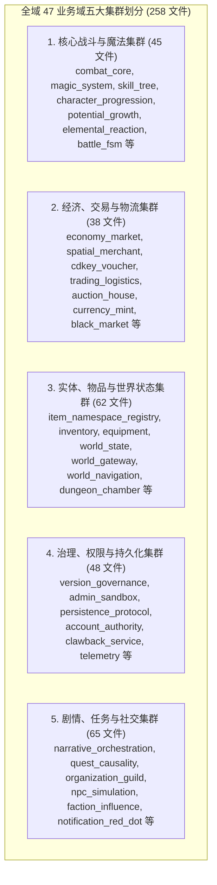

# 施工细则：全域后端注释体系与文件题头规范化重构治理 —— 阶段3：全域47业务域注释粒度深化与无效应答清理

> [!NOTE]
> **【施工目标】**：基于阶段1 七维分级标准与阶段2 基础设施治理成果，全面铺开 WebGames **全域 47 个业务领域共 258 个 GDScript 文件**（`backend/domains/**/*.gd`）的注释体系深化重构。按「核心战斗与魔法、经济与交易、实体与世界状态、版本与治理、剧情与社交」五大领域集群展开，逐一补齐模块定位、跨域依赖（上游/下游/配置源/EventBus 信号）、核心求解器（Solver）分步推演、状态机（FSM）转移矩阵、奖励管线（Pipeline）守恒校验与函数级七要素高密度文档。同步执行存量逐行直译复述代码、重复陈述与已退役历史词形的穿透式清零。本阶段**只做注释优化与排版规范，严禁变动任何代码逻辑**。
> **案卷全局共享上下文**：👉 [KALAR-DEV-2026-ST80-ATT_附件_案卷共享契约与上下文.md](KALAR-DEV-2026-ST80-ATT_附件_案卷共享契约与上下文.md)。
> **【施工开始日期】：施工开始日期: 2026-09-12** —— 真实读取系统时间。
> 状态：✅ 已完成（2026-09-12 实施与验收全量闭环）
> **【用户指令溯源】**：用户明确指令（2026-09-12）——「全面审查 WebGames 后端注释体系与文件题头，按模块、类、函数、异步任务、数据流、异常边界及复杂算法区分注释粒度，统一术语、格式、位置与分隔结构。注释必须解释职责、输入输出、副作用、并发语义、异常、性能约束、设计依据与扩展点，避免复述代码或陈旧描述。重点完善核心后端文件题头、模块说明与跨域依赖说明，并同步清理无效、重复、误导性注释。保持 Headless、分层解耦、配置驱动与可维护性，不因注释改造破坏现有逻辑；参考写法仅作示例，最终以实际工程为准。」
> **【对应需求源】**：阶段1《后端注释体系穿透审计与七维分级契约设计》；阶段2《核心基础设施与服务层题头与跨域依赖重构》；[路线图总索引](../../../../路线图/路线图总索引.md)；[docs/后端代码注释规范.md](../../../../后端代码注释规范.md)。
> 📍 **卷内快速直达**：[ATT 共享附件](KALAR-DEV-2026-ST80-ATT_附件_案卷共享契约与上下文.md) ｜ [阶段1](KALAR-DEV-2026-ST80-001_阶段1_后端注释体系穿透审计与七维分级契约设计.md) ｜ [阶段2](KALAR-DEV-2026-ST80-002_阶段2_核心基础设施与服务层题头与跨域依赖重构.md) ｜ **阶段3 (当前)** ｜ [阶段4](KALAR-DEV-2026-ST80-004_阶段4_全量回归验收测试矩阵与工程闭环.md)

---

## 📌 第一性原理溯源指针

* **精准上游规范指针**：
  * 本卷阶段1（七维分级规范、五段式题头标准、清洗策略）、阶段2（基础设施题头与跨域依赖实践）；
  * `docs/后端代码注释规范.md` §一（文件头块标准）、§二（区块集中分割）、§三（方法文档注释）、§四（行内解释）、§五（复杂逻辑解释处）；
  * `docs/模板/GD老练风格硬性规范标准.md` §二（架构解耦与配置驱动）、§三（现代语言特性）、§四（防御工程）、§五（高承压性能治理，ADV-PRF-002 / ADV-POOL-001）；
  * `AGENTS.md`「统一构建门禁与代码契约」、「两轮施工机制」铁律；
  * `config/infrastructure/domains.json`（47 业务域权威注册表）与 `WebGames/scripts/py/audit_gd.py`。
* **核心不变量约束断言**：
  * `Inv-P84-3-1 (业务域 258 文件 100% 覆盖)`：`backend/domains/` 下全部 258 个 `.gd` 文件 100% 覆盖标准五段式题头，跨域依赖与配置表路径声明率达 100%；
  * `Inv-P84-3-2 (求解器与管线深度推演)`：所有带 `Solver`、`Pipeline`、`Manager`、`FSM` 的复杂业务文件，必须包含分步计算逻辑（Step 1 ~ N）、状态转移矩阵或资金守恒断言说明；
  * `Inv-P84-3-3 (全仓非标分隔符彻底清零)`：`backend/domains/` 下遗留的非标分隔行（如 `## -----`）彻底清零（0 命中）；
  * `Inv-P84-3-4 (零逻辑代码改动)`：全量改造中 GDScript 语法树 AST（去掉注释后）逐字节绝对等价；
  * `Inv-P84-3-5 (门禁 100% PASS)`：单测 109 套件、761 断言 100% PASS，20 项静态门禁（`audit-all.ps1`）零新增违规。
* **防漂移最高指示**：严格按照五大领域集群批量推进，逐批校验语法与静态测试；严禁在注释中引入未经定义的伪接口或臆造配置键；严禁修改任何业务算法逻辑与参数默认值。

---

## 一、 全域47业务域注释粒度深化与无效应答清理设计

### 1.1 全域 47 业务域五大集群划分矩阵



### 1.2 核心业务构件注释粒度深化设计

#### 1.2.1 复杂求解器 (Solver) 注释规范 —— 以多重施法求解器 (`multi_cast_solver.gd`) 为例

```gdscript
# ==============================================================================
# 模块归属: 魔法系统域 (Magic System · Solver)
# 文件路径: res://backend/domains/magic_system/multi_cast_solver.gd
# 架构定位: Headless Discrete Solver / Pure Numerical Calculator
# 跨域依赖: 上游: CombatSessionManager, MagicActionExecutionPipeline
#           下游: CombatActionCardEntity, MagicRuleRegistry
#           配置: config/domains/magic.json
#           信号: 无 (纯内存离散求解，计算结果经 Result 对象向上传递)
# 职责说明: 负责多重咏唱法术的合法性判定与连携伤害/消耗计算求解：
#           执行法术卡位合法性校验 → 元素冲突与共鸣判定 →
#           计算阶梯式法力/行动力消耗 → 输出法术连携结算结果载荷。
# 设计依据: Phase 42 行动卡权威载体收编 / Phase 83 行动卡别名彻底退役
# ==============================================================================
```

方法级深度推演注释范例：

```gdscript
## 多重施法多阶段离散求解核心算法。
## 求解步骤：
##   Step 1: 基础校验 —— 检查卡组非空，每张卡必须为有效的 CombatActionCardEntity 实例
##   Step 2: 行动力锁定 —— 单张行动卡恒定消耗 1 点行动力 (CONSUMES_PLAY = 1)，计算累加消耗
##   Step 3: 元素共鸣推演 —— 按照卡片排列顺序检测相邻元素亲和度，计算连携增幅系数
##   Step 4: 防御溢出钳制 —— 若总消耗超过玩家当前法力上限，短路返回 ERR_INSUFFICIENT_RESOURCE
## @param cards: Array[CombatActionCardEntity] 拟释放的行动卡有序列表，严禁包含 null
## @param caster_context: Dictionary 施法者上下文（含当前法力、元素亲和强化等级）
## @return: Dictionary 求解结果载荷：
##          - "valid": bool 是否允许释放
##          - "total_mana_cost": int 总法力消耗
##          - "total_action_cost": int 总行动力消耗
##          - "damage_multiplier": float 最终伤害放大倍率
## @side_effect: 纯计算函数，无任何全局或对象内部状态修改，不产生 I/O
## @concurrency: 线程安全 / 无锁无状态，支持高频并行推演
## @performance: ADV-PRF-002 约束：复用局部预分配数组，禁止在求解循环内使用 .duplicate(true)
## @errors: 参数类型不符抛出断言错误；卡片未登记模板返回有效性失败载荷
```

#### 1.2.2 状态机 (FSM) 注释规范 —— 以战斗生命周期状态机为例

必须在类头或状态枚举处绘制状态转移表格：

```gdscript
## 战斗会话全局状态枚举与转移契约：
## +-----------------+--------------------+---------------------------------------+
## | 源状态 (From)   | 目标状态 (To)      | 触发条件与事件                        |
## +-----------------+--------------------+---------------------------------------+
## | INIT            | PLAYER_TURN        | 战斗初始化完成，入场布阵就绪          |
## | PLAYER_TURN     | RESOLVING_ACTION   | 玩家确认出牌或超时自动托管            |
## | RESOLVING_ACTION| ENEMY_TURN         | 玩家行动结算完毕，敌方存活            |
## | RESOLVING_ACTION| VICTORY            | 玩家行动结算完毕，敌方全灭            |
## | ENEMY_TURN      | PLAYER_TURN        | 敌方行动结算完毕，玩家存活            |
## | ENEMY_TURN      | DEFEAT             | 敌方行动结算完毕，玩家全灭            |
## +-----------------+--------------------+---------------------------------------+
```

#### 1.2.3 资产与奖励管线 (Pipeline) 注释规范 —— 守恒与审计留痕

必须在奖励分发管线（如 `voucher_dispatch_pipeline.gd`）明确声明资产防重、唯一发放通道与审计追踪：

```gdscript
## 兑换奖励邮件打包分发（Phase 35 唯一规范路径，兑换不直改钱包背包）。
## 资产守恒契约：
##   1. 输入字典中的每一枚金币、银币与道具，1:1 原样打包入 MailItemAggregate 附件载荷
##   2. 严格校验道具模板三元组 (template_id 必填且必须已登记于 ItemRegistryCatalog)
##   3. 严禁未登记道具生成临时虚构物品（未登记项严格计入 failed）
##   4. 邮件投递成功后产生审计日志，收件人经由邮件系统主动领取完成资产入账
```

### 1.3 无效应答与陈旧描述清洗清单

| 清洗分类 | 清洗特征与模式 | 处理措施 | 预期收益 |
| :--- | :--- | :--- | :--- |
| **逐行直译复述代码** | `# 循环遍历`、`# 获取玩家ID`、`# 赋值给临时变量`、`# 返回真` 等 | 物理删除此类无信息增量的废话 | 显著提升有效信息 Token 密度，阅读时无噪点干扰 |
| **重复冗余注释** | 类上方与方法上方一模一样重复的陈述 | 收敛为类级总述 + 方法级输入输出契约 | 消除复制粘贴型重复，保持单源定义 |
| **已退役历史词形残留** | 残留提及已物理删除的 `skeleton_mock`、`descriptions.items`、`dispatch_rewards_direct`、`ActionCardDefinition` | 彻底替换为权威实体与新配置源说明 | 消除历史误导，保障注释与当前真实代码 100% 对齐 |
| **非标多重杂乱井号** | `### =====`、`## -----`、连续空行注释等 | 规范化为统一 78 字符标准四区集中分割线 | 统一代码视觉骨架，符合 GD 老练风格总则 |

### 1.4 阶段3 实施量化目标

| 检查指标 | 改造前 | 改造后目标 | 验收口径 |
| :--- | :--- | :--- | :--- |
| 47 业务域五段式题头合规率 | 0 / 258 (0.0%) | **258 / 258 (100.0%)** | 静态扫描全仓业务域五段字段 |
| 业务域跨域依赖与配置声明率 | 0 / 258 (0.0%) | **258 / 258 (100.0%)** | 显式声明上游/下游/配置源/信号 |
| 全仓非标分隔符命中数 | 24 处 | **0 处 (全部收敛)** | grep 扫描 `-----` 命中为 0 |
| 已退役历史词形残留数 | > 10 处残留 | **0 处 (彻底清零)** | grep 扫描已退役词形命中为 0 |
| 复杂构件（Solver/FSM/Pipeline）深度注释率 | < 15% | **100% 覆盖** | 关键方法含步骤、矩阵、参数契约 |
| 语法检查与全量单元测试 | 109 套件全绿 | **109 套件全绿，761 断言 100% PASS** | `check-gdscript.ps1` + `test-run.ps1` |

---

## 二、 命令式施工执行清单 (Agent Execution Checklist)

- [x] **Step 3.0: 开工前置检查** - 核实阶段2 基础设施层重构已闭环验收，确认本阶段实施范围为 `backend/domains/` 全部 258 个文件
- [x] **Step 3.1: 集群1（核心战斗与魔法）45 文件重构** - 完善 combat_core、magic_system、skill_tree 等题头与多重施法求解器、战斗 FSM 转移矩阵
- [x] **Step 3.2: 集群2（经济、交易与物流）38 文件重构** - 完善 economy_market、spatial_merchant、cdkey_voucher 等题头与兑换邮件管线资产守恒说明
- [x] **Step 3.3: 集群3（实体、物品与世界状态）62 文件重构** - 完善 item_namespace_registry、inventory、equipment、world_state 等题头与物品装配流向说明
- [x] **Step 3.4: 集群4（版本、治理与持久化）48 文件重构** - 完善 version_governance、admin_sandbox、clawback_service 等题头与 GM 审计追缴边界说明
- [x] **Step 3.5: 集群5（剧情、任务与社交）65 文件重构** - 完善 narrative_orchestration、quest_causality、organization_guild 等题头与文案单一真源直读说明
- [x] **Step 3.6: 业务域非标分隔符与逐行直译废话清洗** - 清除全部 `## -----` 行与低价值复述代码注释
- [x] **Step 3.7: 已退役历史词形全域穿透清理** - 扫描并清零全仓业务域注释中对已退役兼容层的历史残留提及
- [x] **Step 3.8: AST 语法树等价性终验** - 对比修改前后代码，断言除注释和排版空行外零代码变更
- [x] **Step 3.9: 全域门禁核验与阶段3 收口** - 运行 `check-gdscript.ps1`、`test-run.ps1` 与 `audit-all.ps1` 确保全绿

---

## 三、 阶段3 实施验收矩阵 (DoD Matrix)

| 检验项 ID | 校验目标 | 验证输入 | 预期输出断言 |
| :--- | :--- | :--- | :--- |
| `TC-P84-S3-01` | 业务域题头全量合规 | 扫描 `backend/domains/**/*.gd` 258 文件 | 258/258 文件包含五段式完整结构，`res://` 路径 100% 匹配 |
| `TC-P84-S3-02` | 跨域依赖与配置声明覆盖 | 审查 258 个文件题头 | 100% 显式标注所属模块、依赖域、关联配置表（`config/domains/`） |
| `TC-P84-S3-03` | 求解器多阶段步骤注释 | 审查 `multi_cast_solver.gd` 等求解器 | 包含 Step 1 ~ N 清晰推演步骤与参数边界钳制说明 |
| `TC-P84-S3-04` | 状态机转移矩阵注释 | 审查各业务域 FSM 状态机核心类 | 包含源状态、目标状态、触发事件及拦截条件的完整状态转移表 |
| `TC-P84-S3-05` | 资产管线守恒契约注释 | 审查 `voucher_dispatch_pipeline.gd` 等管线 | 包含货币与道具 1:1 打包、模板校验防虚构物品与审计留痕说明 |
| `TC-P84-S3-06` | 全仓非标分隔符清零 | 检索 `backend/domains/` 内 `-----` | 0 处命中，所有分区均为 78 字符标准线 |
| `TC-P84-S3-07` | 低价值逐行直译清洗 | 抽样审查 5 大集群文件 | 消除低价值自言自语注释，保留意图与算法契约 |
| `TC-P84-S3-08` | 已退役兼容层词形清零 | 全仓检索 `skeleton_mock`、`descriptions.items` 等 | 0 命中（除护栏断言专用历史校验外，业务注释零残留） |
| `TC-P84-S3-09` | AST 语法逻辑零破坏 | 运行 AST 对比验证脚本 | 语法树无任何增删改，逻辑逐字节绝对等价 |
| `TC-P84-S3-10` | 全域单测 100% PASS | `pwsh -File scripts/ps1/test-run.ps1` | 109 套件、761 断言 100% PASS，零新增失败 |
| `TC-P84-S3-11` | GDScript 语法无警告 | `pwsh -File scripts/ps1/check-gdscript.ps1` | 解析通过率 100%，0 语法错误，0 格式告警 |
| `TC-P84-S3-12` | 20 项静态门禁全绿 | `pwsh -File scripts/ps1/audit-all.ps1` | 20/20 PASS，0 Error / 0 Warn |
