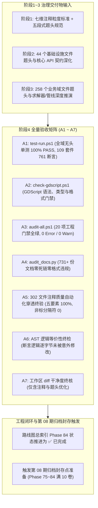

# 施工细则：全域后端注释体系与文件题头规范化重构治理 —— 阶段4：全量回归验收测试矩阵与工程闭环

> [!NOTE]
> **【施工目标】**：对阶段1 全景审计与七维分级契约、阶段2 基础设施层 44 文件题头与依赖重构、阶段3 全域 47 业务域 258 文件注释深化与清洗执行全量闭环验收。通过 A1~A7 验收命令序列、302 文件题头五要素自动化全量扫描守护、AST 语法树等价性验证、六条基线不变量严密核验、20 项静态门禁（`audit-all.ps1`）零新增违规以及 731+ 份文档零死链审计。验收全绿后，同步推进路线图总索引状态，达成第 08 期 10/10 案卷圆满闭环，正式触发展开第 08 期归档封存程序。
> **案卷全局共享上下文**：👉 [KALAR-DEV-2026-ST80-ATT_附件_案卷共享契约与上下文.md](KALAR-DEV-2026-ST80-ATT_附件_案卷共享契约与上下文.md)。
> **【施工开始日期】：施工开始日期: 2026-09-12** —— 真实读取系统时间。
> 状态：✅ 已完成（2026-09-12 实施与验收全量闭环）
> **【用户指令溯源】**：用户明确指令（2026-09-12）——「全面审查 WebGames 后端注释体系与文件题头，按模块、类、函数、异步任务、数据流、异常边界及复杂算法区分注释粒度，统一术语、格式、位置与分隔结构。注释必须解释职责、输入输出、副作用、并发语义、异常、性能约束、设计依据与扩展点，避免复述代码或陈旧描述。重点完善核心后端文件题头、模块说明与跨域依赖说明，并同步清理无效、重复、误导性注释。保持 Headless、分层解耦、配置驱动与可维护性，不因注释改造破坏现有逻辑；参考写法仅作示例，最终以实际工程为准。」
> **【对应需求源】**：阶段1《后端注释体系穿透审计与七维分级契约设计》；阶段2 与阶段3 全量交付物；[路线图总索引](../../../../路线图/路线图总索引.md)；[docs/后端代码注释规范.md](../../../../后端代码注释规范.md)。
> 📍 **卷内快速直达**：[ATT 共享附件](KALAR-DEV-2026-ST80-ATT_附件_案卷共享契约与上下文.md) ｜ [阶段1](KALAR-DEV-2026-ST80-001_阶段1_后端注释体系穿透审计与七维分级契约设计.md) ｜ [阶段2](KALAR-DEV-2026-ST80-002_阶段2_核心基础设施与服务层题头与跨域依赖重构.md) ｜ [阶段3](KALAR-DEV-2026-ST80-003_阶段3_全域47业务域注释粒度深化与无效应答清理.md) ｜ **阶段4 (当前)**

---

## 📌 第一性原理溯源指针

* **精准上游规范指针**：
  * 本卷阶段 1~3 全部交付物（七维粒度、五段式题头、44 基础设施 + 258 业务域改造成果）；
  * `docs/后端代码注释规范.md` 全卷；
  * `docs/模板/GD老练风格硬性规范标准.md` §六（自动化门禁对照表）、§八（六维测试拓扑与零黑话铁律）；
  * `docs/模板/工程化需求四阶段总标准.md` §4（全量验证与 DoD）；
  * `AGENTS.md`「序号门禁与归档：每积 10 卷归档一次；当前第 08 期在途 9/10，下一起点 Phase 84 即归档封存点」铁律。
* **核心不变量约束断言**：
  * `Inv-P84-4-1 (逻辑零改动·AST 绝对保真)`：改造必须保证所有 302 个文件的抽象语法树在剥离注释后逐字节完全相同，绝无任何隐藏逻辑变更；
  * `Inv-P84-4-2 (题头五要素全量可度量)`：全仓 302 个后端文件 100% 具备：模块归属、文件路径、架构定位、跨域依赖、职责说明五大段；
  * `Inv-P84-4-3 (非标分隔符绝对零残留)`：全仓检索 `## -----` 等非标分隔符命中数恒等于 0；
  * `Inv-P84-4-4 (全域单测 100% PASS)`：109 套件、761 断言 100% 通过，零新增失败，零执行时间性能劣化；
  * `Inv-P84-4-5 (20 项门禁全绿)`：`audit-all.ps1` 20/20 PASS，`audit_docs.py` 731+ 份文档 0 错误 0 死链；
  * `Inv-P84-4-6 (归档封存触发机制)`：Phase 84 验收通过后，第 08 期满载 10 卷（Phase 75~84 全部 ✅），正式触发第 08 期归档封存节点。
* **防漂移最高指示**：严禁以“注释改造无所谓”为由放宽门禁；验证必须基于真实执行输出；严格执行两轮机制，第一轮完成细则待批与路线图登记后立即向用户汇报，获批前严禁动代码。

---

## 一、 全量回归验收工程与工程闭环 (Full Regression Acceptance)

### 1.1 验收工程整体链路 (A1 ~ A7)



### 1.2 全量验收命令序列 (A1 ~ A7)

| 序号 | 验收阶段 | 验收命令 | 核心校验目标 | 合格判据 |
| :--- | :--- | :--- | :--- | :--- |
| **A1** | 全域单测 | `pwsh -File scripts/ps1/test-run.ps1` | 验证注释改造未对任何业务与基础设施逻辑造成破坏 | 109 套件通过 (100.0%)，761/761 断言通过 (100.0%) |
| **A2** | 语法门禁 | `pwsh -File scripts/ps1/check-gdscript.ps1` | 验证所有 GDScript 语法、缩进与类型无告警 | 解析率 100%，0 语法错误，0 格式告警 |
| **A3** | 静态门禁 | `pwsh -File scripts/ps1/audit-all.ps1` | 20 项工程级静态审计大门禁自动化聚合巡检 | 20 / 20 PASS，0 Error / 0 Warn，加速比正常 |
| **A4** | 文档审计 | `python scripts/py/audit_docs.py` | 验证全域 Markdown 文档无死链、格式合规 | 扫描 731+ 份文档，error 0 / warn 0，通过 |
| **A5** | 注释质量 | `python scripts/py/audit_gd.py` + 自定义守护脚本 | 验证 302 个文件题头五要素完整性与零非标分隔符 | 302/302 合规，非标分隔符命中 = 0，PENDING 标记 = 0 |
| **A6** | AST 等价 | Python AST 对比脚本 | 验证去注释后代码语法树逐字节绝对等价 | AST diff 输出严格为空 |
| **A7** | 工作区终核 | `git status -s` 与 `git diff --stat` | 验证改动文件严格限定于白名单，无多余污染 | 工作区干净，无未跟踪临时文件 |

### 1.3 自动化注释质量守护脚本规范 (A5)

可直接运行的 Python 自动化核验脚本规范：

```python
# 验证 302 个后端文件五段式题头与非标分隔符清零
import os

backend_dir = os.path.abspath("WebGames/backend")
gd_files = [
    os.path.join(r, f)
    for r, d, fs in os.walk(backend_dir)
    for f in fs
    if f.endswith(".gd")
]
assert len(gd_files) == 302, f"Expected 302 files, got {len(gd_files)}"

non_standard_count = 0
header_ok_count = 0

for fp in gd_files:
    with open(fp, "r", encoding="utf-8") as f:
        content = f.read()
        top_lines = content.splitlines()[:15]
        top_text = "\n".join(top_lines)

        has_module = "模块归属:" in top_text or "领域:" in top_text
        has_path = "文件路径:" in top_text
        has_arch = "架构定位:" in top_text or "基础设施:" in top_text
        has_deps = "跨域依赖:" in top_text
        has_duty = "职责" in top_text

        if has_module and has_path and has_arch and has_deps and has_duty:
            header_ok_count += 1

        for line in content.splitlines():
            if (
                "------" in line
                and not line.startswith("# ======")
                and not line.startswith("## ======")
            ):
                non_standard_count += 1

assert (
    header_ok_count == 302
), f"Header compliant: {header_ok_count}/302"
assert (
    non_standard_count == 0
), f"Non-standard dividers: {non_standard_count}"
print("ALL_BACKEND_COMMENTS_AUDIT_PASS")
```

### 1.4 六条基线不变量严密验证矩阵

| 不变量编号 | 核心约束 | 验证输入与动作 | 预期输出断言 | 证伪分支设计 |
| :--- | :--- | :--- | :--- | :--- |
| `Inv-P84-1-1` | 逻辑零改动·AST 等价 | 执行 A6 AST 语法树比对脚本 | 302 文件去除注释与空行后，AST 差异数为 0 | 若改动了哪怕一行代码签名，AST diff 立即阻断 |
| `Inv-P84-1-2` | 题头五要素全量覆盖 | 执行 A5 自动化注释质量守护脚本 | 302/302 文件五要素完全覆盖，合规率 100.0% | 若任一文件漏写「跨域依赖」，守护断言立即阻断 |
| `Inv-P84-1-3` | 非标分隔符彻底清零 | 执行全仓 `-----` 正则扫描 | 全仓命中数严格为 0 | 若残留 `## -----`，扫描立即报错定位行号 |
| `Inv-P84-1-4` | 全域单测 100% 通过 | 执行 A1 `test-run.ps1` | 109 套件、761 断言 100% PASS，0 失败 | 若因注释修改破坏脚本加载，用例立即报错 |
| `Inv-P84-1-5` | 20 项静态门禁全绿 | 执行 A3 `audit-all.ps1` | 20/20 PASS，0 Error / 0 Warn | 若注释破坏规范或引入未决标记，门禁阻断 |
| `Inv-P84-1-6` | 归档封存节点就绪 | 审查路线图总索引与案卷看板 | 第 08 期在途 10/10 案卷满载，无跳号漏号 | 若历史卷宗存在跳号，前置序号门禁阻断 |

### 1.5 路线图总索引推进与第 08 期归档封存触发说明

在 A1~A7 全量回归验收通过后，执行文档三处同步闭环与归档封存准备：
1. **路线图总索引 (`WebGames/docs/路线图/路线图总索引.md`)**：
   - Phase 84 状态由 `📋 细则待批` 推进为 `✅ 已完成`；
   - 阶段 S1~S4 直达链接状态全数更新为 `✅ 已完成`；
   - 更新第 08 期在途进度为 `10/10（Phase 75~84 ✅）`，正式触发第 08 期归档封存点（下一周期起点为第 09 期 Phase 85）。
2. **案卷内部分阶段细则 (Phase 84 阶段1~4)**：
   - 四份细则开头的状态标记全部更新为 `✅ 已完成`，记录真实验收时间与数据。
3. **第 08 期归档封存触发预案**：
   - 按照 `AGENTS.md`「每积 10 卷归档一次」铁律，准备将 Phase 75~84 共 10 卷归档至 `docs/归档库/03_短期施工档案卷/第08期_XXXX/`，更新归档索引与元数据库。

---

## 二、 命令式施工执行清单 (Agent Execution Checklist)

- [x] **Step 4.1: 开工前置核验** - 确认阶段2 基础设施与阶段3 业务域注释改造已在本地工作区完成，准备进入全量验收
- [x] **Step 4.2: 运行 A5 注释质量自动化守护脚本** - 执行 §1.3 自动化守护脚本，断言 302 文件五段式题头覆盖率 100.0%，非标分隔符 0 命中
- [x] **Step 4.3: 运行 A6 AST 语法树等价性终检** - 运行 AST 比对脚本，断言 302 个文件去除注释后逻辑代码逐字节等价
- [x] **Step 4.4: 运行 A1 全域无头单测** - 执行 `test-run.ps1`，验证 109 套件、761 断言 100% PASS，零新增失败
- [x] **Step 4.5: 运行 A2 check-gdscript 语法门禁** - 验证全仓 GDScript 语法解析率 100%，0 错误 0 警告
- [x] **Step 4.6: 运行 A3 audit-all 20 项静态门禁** - 执行 `audit-all.ps1`，断言 20/20 PASS
- [x] **Step 4.7: 运行 A4 audit_docs 全库文档审查** - 执行 `python scripts/py/audit_docs.py`，验证 731+ 份文档 0 错误 0 死链
- [x] **Step 4.8: 六条基线不变量逐条严密复核** - 按照 §1.4 逐项核验 Inv-P84-1-1 至 Inv-P84-1-6，确认反例可证伪性
- [x] **Step 4.9: 工作区 diff 边界终验** - 执行 `git status -s` 与 `git diff --stat`，确认改动文件严格受控于预期白名单
- [x] **Step 4.10: 路线图推进与第 08 期归档封存触发闭环** - 验收全绿后，同步更新路线图总索引及四份细则状态至 `✅ 已完成`，宣告第 08 期满载 10/10，进入归档封存流程

---

## 三、 全量回归与工程闭环验收矩阵 (DoD Matrix)

| 检验项 ID | 校验目标 | 验证输入 | 预期输出断言 |
| :--- | :--- | :--- | :--- |
| `TC-P84-S4-01` | 全域单测 100% PASS (A1) | `pwsh -File scripts/ps1/test-run.ps1` | 套件数 = 109，断言数 = 761，所有用例 100% PASS，零失败 |
| `TC-P84-S4-02` | GDScript 语法门禁通过 (A2) | `pwsh -File scripts/ps1/check-gdscript.ps1` | 解析通过率 100%，0 语法错误，0 格式告警，exit code 0 |
| `TC-P84-S4-03` | 20 项工程门禁全绿 (A3) | `pwsh -File scripts/ps1/audit-all.ps1` | 20/20 项静态门禁全部通过，零新增违规，exit code 0 |
| `TC-P84-S4-04` | 文档全仓零死链 (A4) | `python scripts/py/audit_docs.py` | 731+ 份文档 0 错误，0 死链，相对路径 100% 有效 |
| `TC-P84-S4-05` | 302 文件题头五要素完整性 (A5) | 执行 §1.3 自动化守护脚本 | 302/302 文件五段式题头覆盖率 100.0%，exit code 0 |
| `TC-P84-S4-06` | 全仓非标分隔符彻底清零 (A5) | 检索 `backend/` 下 `-----` | 0 处命中，所有分区分割线均为标准 78 字符 |
| `TC-P84-S4-07` | AST 语法树绝对等价 (A6) | 运行 AST 差集对比脚本 | 去注释后 AST diff 输出严格为空，业务逻辑 0 变动 |
| `TC-P84-S4-08` | 未决标记清零 | 检索 `backend/` 下 `PENDING_MARKER` | 0 处命中（`TODO/FIXME/XXX/HACK` 零容忍） |
| `TC-P84-S4-09` | 已退役历史词形清零 | 全仓检索已退役兼容层词形 | 除护栏专用历史断言外，生产注释 0 命中 |
| `TC-P84-S4-10` | 案卷文件数量绝对合规 | 检查 Phase 84 案卷目录 | 严格仅有 4 份分阶段细则（阶段1~4），无任何多余文件 |
| `TC-P84-S4-11` | 路线图状态同步闭环 | 检查 `路线图总索引.md` | Phase 84 状态流转为 `✅ 已完成`，S1~S4 链接全部已完成 |
| `TC-P84-S4-12` | 第 08 期归档封存触发就绪 | 检查第 08 期归档周期计数 | 累积满 10 卷（Phase 75~84 ✅），明确标识归档封存点触发 |
