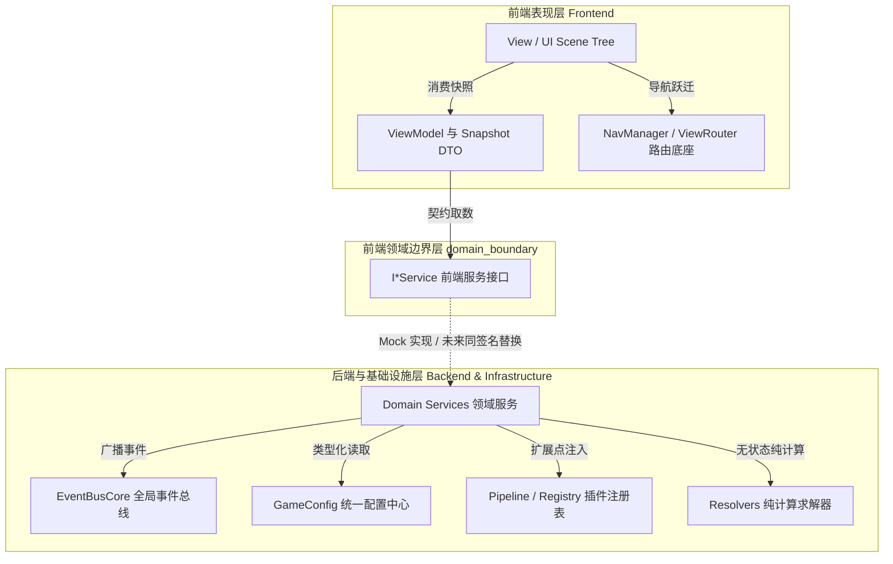

# GD老练风格硬性规范标准（WebGames 全域工程化提纯总则）

> 本标准为 WebGames 全域 GDScript 的硬性工程契约，全员与 Agent 必须以老练 GD 架构师品味进行现代化、可扩展、高内聚低耦合的架构设计与实现。违反即门禁阻断。  
> **指针真源**：[AGENTS.md](../../../AGENTS.md) 关键约定 ｜ [config/README.md](../../config/README.md) 取值规范 ｜ [docs/模板/README.md](README.md) 区间切片指引。

> [!CAUTION]
> **【严禁局部最小 MVP 敷衍实现 · 必须秉持全局长远大局观】**  
> 模板库与规范文档中的所有代码片段与数据结构**仅为格式与签名示范**。严禁以“仅为跑通某个局部断言”编写玩具级最小 MVP！必须完整闭环全生命周期状态（创建/校验/突变/持久化/遥测/追缴/销毁）、双向数据边界隔离、与需求表第一性原理对齐、配置热重载平滑演进及异常安全回滚。

---

## 🏛️ 一、 命名与严格类型系统（硬性门禁）

### 1.1 命名规范与符号门禁表

| 作用域 | 命名规范 | 正则 / 门禁规则 | 规范示范 | 违规阻断反例 |
| :--- | :--- | :--- | :--- | :--- |
| **文件** | `kebab-case` | `^[a-z][a-z0-9_]*\.gd$` (`audit_gd.py`) | `save_manager.gd` | ❌ `SaveManager.gd` |
| **类 / 场景类型** | `PascalCase` | `^[A-Z][A-Za-z0-9_]*$` | `SaveManager`, `BattleHUD` | ❌ `save_manager` |
| **变量 / 函数 / 参数** | `snake_case` | `^_?[a-z][a-z0-9_]*$` | `verbs`, `gold_amount`, `from_slot` | ❌ `VERBS`, `goldAmount` |
| **常量** | `UPPER_SNAKE` | `^_?[A-Z][A-Z0-9_]*$` | `MAX_LEVEL`, `DEFAULT_TIMEOUT` | ❌ `maxLevel`, `max_level` |
| **枚举** | `PascalCase` + 成员 `UPPER_SNAKE` | `^[A-Z][A-Za-z0-9_]*$` | `MagicForm.PRIMORDIAL` | ❌ `magic_form.primordial` |
| **私有成员** | `_` 前缀 | `^_` | `_forbidden_tokens`, `_execute()` | ❌ `forbiddenTokens` |
| **静态变量** | `snake_case`（严禁全大写） | `^static var _?[a-z]` | `static var _cache: Dictionary = {}` | ❌ `static var CACHE` |

### 1.2 类型声明与推断约束表

| 声明场景 | 语法契约 | 规范示范 | 违规反例（隐式弱类型漫游） |
| :--- | :--- | :--- | :--- |
| **局部变量** | 优先强推断 `:=` | `var count := 10`<br/>`var item := inventory.get_item(uid)` | ❌ `var count = 10`<br/>❌ `var item` |
| **类属性** | 显式强类型或泛型容器 | `var hp: float = 100.0`<br/>`var states: Array[EngineState] = []` | ❌ `var hp = 100.0`<br/>❌ `var states = []` |
| **场景/脚本常量** | `const` + `PascalCase` 类型 | `const BattleHUDScene := preload("res://...")` | ❌ `const battle_hud = preload("res://...")` |
| **容器约束** | 明确泛型与键值语义 | `Array[String]`, `Dictionary` 明确键值语义 | ❌ 裸泛型无约束弱类型漫游 |

---

## 🧩 二、 架构解耦、接口化与长远性扩展设计 (Decoupling & Extensibility)



> **依赖铁律**：前端视图严禁直接引用后端领域服务、`EventBusCore` 或网络通道；一切业务数据经「快照 DTO + ViewModel」注入（详见第九章）。

### 架构解耦与演进契约对照表

| 架构设计维度 | 核心契约与原则 | 规范落地机制 | 违规阻断反例 |
| :--- | :--- | :--- | :--- |
| **领域模型防腐** | 领域层与场景树解耦 | `backend/domains/` 仅限纯逻辑 `RefCounted / Object / Dictionary` | ❌ 领域类继承 `Node2D`/`Control`/`Node3D` 或依赖场景树 |
| **跨域通信治理** | 单向依赖，严禁环路引用 | 跨域协作统一经 `EventBusCore`（`emit_domain_event`）广播或 DTO 传参 | ❌ 业务领域之间互相强引用、直调彼此私有实现 |
| **接口契约化 (OCP)** | 面向抽象而非具体实现 | Duck-typing / 基类虚方法（如 `ItemLoaderPipeline`）+ 插件化插拔 | ❌ 核心分发器中 hardcode `match/switch` 穷举各分支 |
| **配置动态扩展** | 注册表与工厂模式 | `RegistryCatalog.register(type, handler)` 动态扩展点 | ❌ 新增规则、词缀或怪物类型时修改已有核心代码 |
| **单机唯一组装** | 依赖装配幂等收敛 | `GameBootstrap.assemble()` 为唯一初始化组装入口 | ❌ 在各子域零散初始化全局单例或基础设施服务 |
| **无状态求解器** | 纯计算与副作用剥离 | 算法/公式/掉落计算抽象为 Pure Resolver，保障无头单测（Headless） | ❌ 计算逻辑耦合状态机私有变量或场景树生命周期 |

---

## ⚡ 三、 GDScript 4.x 现代高级语言特性与老练品味

### 3.1 语言特性速查与代码范式矩阵

| 语言特性 | 核心契约与老练写法 | 收益与设计目标 | 违规 / 幼稚写法 (Anti-pattern) |
| :--- | :--- | :--- | :--- |
| **卫语句早期返回** | 入口校验失败立即 `return`，主逻辑平铺直叙 | 消除深层嵌套，降低认知复杂度 | ❌ `if cond1: if cond2: if cond3: ...` |
| **模式匹配解构** | 结构化 `match` + `when` 守卫解构复合载荷 | 声明式分支，杜绝多层级 `elif` | ❌ 冗长嵌套的 `if payload.get(...) == ...` |
| **Callable 管道** | 高阶函数一等公民：`.filter()`, `.map()` | 链式管道求值，逻辑紧凑清晰 | ❌ 手写冗长 `for` 循环与临时容器临时累加 |
| **属性 Accessor** | 受控 `get`/`set` 守卫与事件广播 | 内部状态只读保护，杜绝跨级越权篡改 | ❌ 外部直接对私有内部字典/数组任意赋值篡改 |
| **弱引用与有效性** | `is_instance_valid()` / `WeakRef` 安全复核 | 杜绝异步回调野指针与已释放对象崩溃 | ❌ 裸持有 Node 引用在 `await` 之后无检查直接调用 |
| **数值防爆与钳制** | `is_finite()` + `clampf()` / 安全除法包装 | 杜绝 `INF`/`NAN` 污染渲染树与状态机 | ❌ 裸算 `a / b`（未防护 `b == 0`）或裸接收外部浮点数 |

### 3.2 典型合规代码范例

```gdscript
# 范例 1：控制流卫语句与模式匹配
func handle_action(payload: Dictionary) -> Dictionary:
	if payload.is_empty():
		return {"success": false, "error_code": "EMPTY_PAYLOAD"}
	if not _is_ready:
		return {"success": false, "error_code": "NOT_READY"}

	match payload:
		{"type": "damage", "amount": var dmg} when dmg > 100:
			return _trigger_critical(dmg)
		{"type": "heal", "amount": var heal}:
			return _apply_heal(heal)
		_:
			return {"success": false, "error_code": "UNKNOWN_ACTION"}

# 范例 2：受控属性 Accessor 与弱引用守卫
var current_gold: int:
	get:
		return _wallet.get("gold", 0)
	set(value):
		_wallet["gold"] = maxi(0, value)
		EventBusCore.get_instance().emit_domain_event("wallet.changed", {"wallet": _wallet})

func safe_notify_node(target: Node, event: String) -> void:
	if not is_instance_valid(target) or target.is_queued_for_deletion():
		return
	target.call("on_custom_event", event)
```

---

## 🛡️ 四、 异常防御、Result 包装契约与优雅容错

### 4.1 统一防御工程矩阵

| 防御维度 | 核心契约与标准模型 | 降级与安全气囊策略 | 违规阻断反例 |
| :--- | :--- | :--- | :--- |
| **统一 Result DTO** | 返回结构：`{"success": bool, "data": Variant, "error_code": String, "message": String}` | 严禁返回裸 `null` / `-1`；错误码全大写 `UPPER_SNAKE` | ❌ 失败返回 `null` 或抛出未捕获异常崩溃 |
| **零硬编码三层降级** | 所有数值/枚举/阈值从 `GameConfig.get_*` 读取 | 1. 读领域配置 ➔ 2. 回退安全默认值并报警 ➔ 3. 禁魔法数 | ❌ 代码内裸写数字（如 `crit = 5`）、裸写文案 |
| **单机确定性 (RNG)** | 全域通过 `DeterministicRNG.resolve(rng).randf()` 派发 | 支持固定种子重现，单机回放与联机仲裁 100% 确定 | ❌ 裸调用 `randf()` / `randi()` / `randomize()` |
| **代码洁净可观测** | 业务流转走 `EventBusCore.emit_narrative_by_key`；管理走 `GMArbitrationAuditService` | 生产与提交代码 0 调试残留（门禁静态阻断） | ❌ 遗留 `print()`、`TODO`、`FIXME`、`HACK` |

---

## 🚀 五、 性能优化与热点循环治理 (Performance & Hotspots)

### 5.1 高承压与热点治理速查矩阵

| 治理场景 | 门禁规则编号 | 优化前反例（Anti-pattern） | 优化后规范（老练方案） | 复杂度 / 性能增益 |
| :--- | :--- | :--- | :--- | :--- |
| **循环内配置读取** | `ADV-PRF-001` | 循环内高频调用 `GameConfig.get_*` | 循环外缓存为局部变量或强类型 DTO | 消除高频字典查找与函数调用开销 |
| **循环内瞬态堆分配** | `ADV-PRF-002` | 循环内高频 `.new()` / `.duplicate(true)` | 预分配固定尺寸数组或就地重用对象 | 消除瞬态堆分配与 GC/引用计数停顿 |
| **循环内字符串格式化**| `ADV-PRF-003` | 循环内执行 `%` 占位符或字符串 format | 静态预编译模板或查表拼接 | 消除瞬态 String 内存分配与解析消耗 |
| **高频查找线性搜索** | `ADV-PRF-004` | 循环内使用 `Array.find()` / `has()` 线性扫 | 初始化时构建 `Dictionary` 哈希索引 | 时间复杂度由 $O(N)$ 降至 $O(1)$ |
| **高频对象池化契约** | `ADV-POOL-001` | 飘字/弹幕/特效反复 `new` / `queue_free()` | 接入 `ObjectPool`，必须实现 `reset_state()` 契约 | 杜绝渲染树抖动与内存碎片 |
| **表现层批处理渲染** | `ADV-UI-001` | 每项属性变动立即全量重绘 DOM/Scene | Dirty 标记 + `call_deferred("_render_dirty")` | 单帧合并多次数据刷新，消除掉帧 |

---

## 🔍 六、 自动化门禁与静态审查对照表

| 门禁审查脚本 | 覆盖范围与硬性指标 | 阻断级别 | 触发命令 |
| :--- | :--- | :---: | :--- |
| **`audit_gd.py`** | 命名规范、显式类型、static 变量 snake_case、空格格式 | **Error (阻断)** | `python WebGames/scripts/py/audit_gd.py` |
| **`audit_hardcode.py`** | 零硬编码检测、魔法数字剥离、print/TODO 零残留 | **Error (阻断)** | `python WebGames/scripts/py/audit_hardcode.py` |
| **`audit_perf_hotspots.py`**| 循环内配置读取、循环内字符串拼接、热点消耗扫描 | **Warn (门禁)** | `python WebGames/scripts/py/audit_perf_hotspots.py` |
| **`audit_config_unused.py`**| 配置表死配置、未引用表与动态叙事表覆盖率扫描 | **Error (阻断)** | `python WebGames/scripts/py/audit_config_unused.py` |
| **`check-gdscript.ps1`** | Godot Engine 官方语法检查与语义编译校验 | **Error (阻断)** | `pwsh scripts/ps1/check-gdscript.ps1` |
| **`test-run.ps1`** | 全域测试套件（六维测试拓扑）无头单元测试全覆盖 | **Error (阻断)** | `pwsh scripts/ps1/test-run.ps1` |
| **`audit-all.ps1`** | 一键执行全域 20 项工程门禁与文档基线棘轮 | **Error (阻断)** | `pwsh scripts/ps1/audit-all.ps1` |

---

## 📝 七、 Agent 核心操作契约与长远性构建准则

| 契约维度 | 核心行为准则 | 硬性红线与禁止清单 |
| :--- | :--- | :--- |
| **两轮施工闭环** | 第 1 轮细则规划与审查 ➔ 获批 ➔ 第 2 轮实施验收闭环 | 严禁第 1 轮编写业务代码；严禁未获批准提前在路线图标记完成 |
| **细则案卷结构** | 每个案卷目录严格仅包含 4 份分阶段细则（阶段1~4） | 严禁在案卷目录自造 `README.md` 或临时文本；唯一登记于路线图总索引 |
| **全局大局观** | 完整实现生命周期闭环（创建/校验/突变/持久化/遥测/销毁） | 严禁以“仅为跑通某个局部单测断言”的最小 MVP 敷衍实现 |
| **零臆造第一性** | 以需求表、配置表与已有架构为唯一真理源 | 严禁自造与需求冲突的字段、自造不存在的配置键 |
| **示范代码解耦** | 规范文档中的代码仅为格式与结构示范 | 严禁生搬硬套占位符 `<...>`；实际编码必须依据生产级领域设计 |
| **歧义与延后容许** | 需求未明确时以短期施工区与归档库既有案卷标准为准 | 跨模块长链路集成断言允许延后至后续阶段/案卷闭环，但基础契约必须稳固 |

---

## 🧪 八、 规范化测试编写与分层拓扑标准

### 8.1 六层测试工程拓扑与物理隔离（硬性红线）

全域测试套件按职责与执行粒度进行物理隔离分层。**`tests/unit/` 根目录严格禁止散落任何测试脚本（0 散落红线，违规直接阻断）**：

| 分层目录 | 职责定位 | 严格命名公式 | 规范示例 | 严禁的反例（违规阻断） |
| :--- | :--- | :--- | :--- | :--- |
| **`tests/unit/domains/`** | 纯后端领域模型与求解器单元测试 | `test_<domain_id>.gd`（1:1 对齐 `domains.json`） | `test_inventory.gd` | ❌ `test_inv.gd`, `test_p82_combat.gd` |
| **`tests/unit/frontend/`** (视图) | 17 大前端视图单元测试 | `test_fe_NN_<view_name>.gd`（NN 为 01~17 两位编号）| `test_fe_01_account_entry.gd` | ❌ `test_account.gd`, `test_fe_login.gd` |
| **`tests/unit/frontend/`** (基建) | 前端基础设施与横切逻辑单测 | `test_frontend_<topic>.gd`（全小写语义前缀） | `test_frontend_robustness.gd` | ❌ `test_fe_p82_robustness.gd`, `test_ui_mock.gd` |
| **`tests/unit/infrastructure/`**| 核心基础设施服务单测（总线/存储/日志等） | `test_<service>.gd` | `test_event_bus.gd` | ❌ `test_p75_logging.gd` |
| **`tests/guards/`** | 架构防护、配置健全与全域防腐门禁 | `test_<name>_guard.gd`（长效单源，禁随案卷分裂） | `test_frontend_boundary_guard.gd` | ❌ `test_frontend_p82_boundary_guard.gd` |
| **`tests/integration/pipelines/`** | 跨域长链路、状态机联动业务管道 | `test_<flow>_pipeline.gd` | `test_combat_dual_random_and_timeline_pipeline.gd` | ❌ `test_p65_timeline.gd` |
| **`tests/fixtures/factories/`** | 测试装配器与伪数据生成工厂 | `<entity>_factory.gd`（严禁 `test_` 前缀） | `contract_registry_factory.gd` | ❌ `test_contract_factory.gd` |
| **`tests/support/`** | 测试基类、断言器与共享辅助模块 | `test_case.gd` | `tests/support/test_case.gd` | — |

> [!CAUTION]
> **【测试命名绝对禁令（零黑话铁律）】**：全域测试文件名、类符号与路径中，**严禁包含任何施工批次与临时性标记**（禁止词：`p[0-9]+`、`phase[0-9]+`、`st[0-9]+`、`fe[0-9]+`（除 `fe_01`~`fe_17` 视图外）、`temp`、`new`、`v[0-9]+`、`wip`）。护栏套件属于长效全域资产，新断言必须归并演进至既有同域护栏文件，绝对禁止以案卷号独立分裂新护栏文件！

### 8.2 测试套件规范编写与 `TestCase` 统一契约

所有测试套件必须继承 `TestCase` 基类，遵循无副作用、可自动化收集的统一契约：
1. **类声明与继承**：显式 `class_name Test<PascalCase> extends TestCase`；
2. **统一入口签名**：提供 `static func run_all_tests() -> Dictionary:` 静态入口；
3. **统一结果打包**：调用 `TestCase.pack_results(domain_name, results)` 统一汇总指标；
4. **强类型断言**：全域使用 `TestCase` 强类型断言，并通过 `TestCase.make_result` 打包用例结果。

```gdscript
# 标准模板示例: res://tests/unit/domains/test_example.gd
class_name TestExampleDomain extends TestCase

static func run_all_tests() -> Dictionary:
	setup()
	var results: Array[Dictionary] = []
	results.append(_test_initialization())
	results.append(_test_state_mutation())
	teardown()
	return TestCase.pack_results("example", results)

static func _test_initialization() -> Dictionary:
	var instance := ExampleModel.new()
	var ok := TestCase.assert_not_null(instance, "实例初始化非空")
	ok = ok and TestCase.assert_eq(instance.get_status(), "IDLE", "初始状态为 IDLE")
	return TestCase.make_result("initialization", ok)

static func _test_state_mutation() -> Dictionary:
	var instance := ExampleModel.new()
	var res: Dictionary = instance.execute_action({"action": "start"})
	var ok := TestCase.assert_true(res.get("success", false), "动作执行成功")
	return TestCase.make_result("state_mutation", ok)
```

### 8.3 确定性、环境隔离与测试质量矩阵

| 质量维度 | 核心规范要求 | 落地机制与门禁看守 |
| :--- | :--- | :--- |
| **确定性 (零裸随机)** | 严禁调用 `randf()` / `randi()` | 统一经 `DeterministicRNG` 设置固定测试种子，100% 可重复验证 |
| **高承压零开销** | 遵循 `ADV-PRF-002` 门禁 | 循环体内严禁 `.new()` 或 `.duplicate(true)` 瞬态内存堆分配 |
| **环境隔离清理** | 保证测试执行零副作用、零污染 | `teardown()` 中幂等解绑 EventBus 监听；持久化测试使用内存/临时路径并在结束后严格销毁 |
| **双向对齐门禁** | 新增领域测试与配置 1:1 双向登记 | `domains.json` 声明 ➔ `test_registry.gd` 注册 ➔ `audit_test_coverage.py` 扫描零缺失 |

---

## 🖥️ 九、 前端可视化边界硬性契约 (Frontend Visualization Boundary Contract)

> **第一性原则**：前端是「接受后端数据传递的可视化显示层」。`frontend/` 下的所有分层唯一目的是隔离显示耦合；任何把业务计算、后端依赖或跨视图耦合带入视图的写法一律阻断。

### 9.1 视图职责白名单与红线

| 允许（纯显示职责） | 禁止（业务与耦合红线） |
| :--- | :--- |
| 渲染映射（快照字段 → 节点属性）、布局与动画、交互态（选中/展开/输入/分页/动画阶段）、文案与主题解析、路由跳转、调用原子组件与全局 UI 管理器 | 业务计算（随机数、汇率、概率、成功率、属性聚合公式）、规则状态机、伪持久状态（钱包/库存/任务/存档的写状态）、直连后端类、订阅或派发 `EventBusCore`、网络调用、跨视图节点引用 |

- **确定性渲染**：视图复访必须满足「同一快照输入 → 同一渲染输出」，严禁在视图内累积状态漂移；
- **派生限制**：展示派生字段（时间格式化、百分比文案）允许，但不得反推业务字段或参与规则判定。

### 9.2 唯一数据入口 `apply_snapshot`

```gdscript
# 模块路径: res://frontend/presentation/base/base_screen.gd
class_name BaseScreen extends Control

var _snapshot: Dictionary = {}

func on_screen_enter(params: Dictionary = {}) -> void:
	_apply_enter_params(params)

func apply_snapshot(snapshot: Dictionary) -> void:
	_snapshot = snapshot
	_render_from_snapshot()

func _render_from_snapshot() -> void:
	pass

func on_screen_exit() -> void:
	UIIntermediary.clear_view_bindings(self)
```

- 所有业务数据一律经 `apply_snapshot(snapshot)` 注入；视图严禁自读 `skeleton_mock.json`、`GameConfig` 业务数值或内联 mock；
- 视图数据源只允许来自 `frontend/domain_boundary/` 服务接口（当前 Mock 实现，未来后端实现同签名替换）。

### 9.3 依赖方向与防腐规则表

| 分层交互 | 依赖规则与方向 | 契约落地说明 |
| :--- | :---: | :--- |
| **视图 ➔ 表现基类与基建** | ✅ 允许 (单向) | `views` 依赖 `presentation/base`, `common`, `ui_infrastructure`, `components`, `navigation`, `i18n`, `theme` |
| **视图 ⇢ 领域边界接口** | ⇢ 受限 (契约) | 状态一律经 `apply_snapshot` 回流；交互动作允许经 `MockServiceContainer` 句柄发起 |
| **视图 ➔ 后端与网络** | ❌ 严禁 (阻断) | 严禁直连 `backend/`、订阅 `EventBusCore`、发起网络调用或跨视图寻址 |
| **服务实例创建** | ❌ 严禁内联 new | 视图内严禁自建 `I*Service`/Mock 实例或后端类，统一经容器句柄获取 |

### 9.4 快照 DTO 契约矩阵

| 契约要素 | 规范要求 | 落地标准与校验机制 |
| :--- | :--- | :--- |
| **强类型实体** | 必须为 `RefCounted` 实体类 | 禁止裸 `Dictionary` 在系统各层无序漫游 |
| **序列化对等** | 深度可逆转换 | 必须成对提供 `to_dictionary()` 与 `static from_dictionary(data)`，往返深度等价 |
| **字段权威来源** | 零臆造字段 | 字段必须 1:1 溯源后端领域字段或统一 DTO 规范，严禁无源字段 |
| **安全防御兜底** | 缺省与越界防御 | `from_dictionary` 对缺省与越界输入必须安全填充默认值，杜绝 Null 崩溃 |

### 9.5 节点引用与文案解析规范

| 治理维度 | 规范要求 (合规推荐) | 严禁行为 (违规阻断) |
| :--- | :--- | :--- |
| **节点引用** | 优先使用 `@export` 检查器绑定或 `%UniqueName` 场景唯一名；允许视图自有场景内字面绝对路径（`$A/B/C`） | ❌ 跨视图节点访问、`get_parent().get_node()` 相对漂移路径、运行时拼接字符串路径、`find_child(..., recursive=true)` 模糊定位 |
| **多语言文案** | 统一经 `UIIntermediary.resolve` / `resolve_placeholder` 解析词库 | ❌ 视图内直接内联硬编码任何人类可读展示字符串 |

### 9.6 原子组件与全局管理器复用清单

| UI 功能需求 | 强制复用原子组件 / 全局管理器 | 严禁行为 |
| :--- | :--- | :--- |
| **原子控件** | 按钮 `KButton` ｜ 物品格 `KItemSlot` ｜ 红点 `KBadge` ｜ 虚拟列表 `KVirtualList` | ❌ 视图内联重复实现通用原子控件 |
| **全局浮层** | 模态 `ModalManager` ｜ 确认框 `DialogManager` ｜ 提示 `TooltipManager` ｜ 抽屉 `DrawerManager` ｜ 菜单 `ContextMenuManager` | ❌ 视图内自建独立弹窗或遮罩层 |
| **交互辅助** | 焦点控制 `FocusInputManager` ｜ UI 音效桥接 `UIAudioBridge` ｜ 状态容器 `UIStateContainer`（加载/空/错/重试） | ❌ 视图私自内联实现焦点陷阱与五态逻辑 |

### 9.7 前端自动化门禁挂接

| 门禁检查项 | 自动化检查指标 | 违规阻断阈值 |
| :--- | :--- | :---: |
| **静态边界审计** | `frontend/views/**` 随机调用、后端类引用、`EventBusCore` 订阅、字符串动态路径 | **恒等于 0** |
| **配置白名单审计** | 视图读取 `GameConfig` 仅限已审批的表现层纯展示配置白名单 | **白名单外为 0** |
| **契约往返审计** | 快照 DTO `from_dictionary` 与 `to_dictionary` 往返序列化等价性断言 | **100% PASS** |
| **渲染一致性回归** | 接线重构前后，同一快照渲染的节点可见性与文本状态等价比对 | **100% PASS** |
