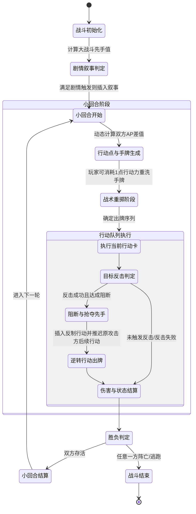
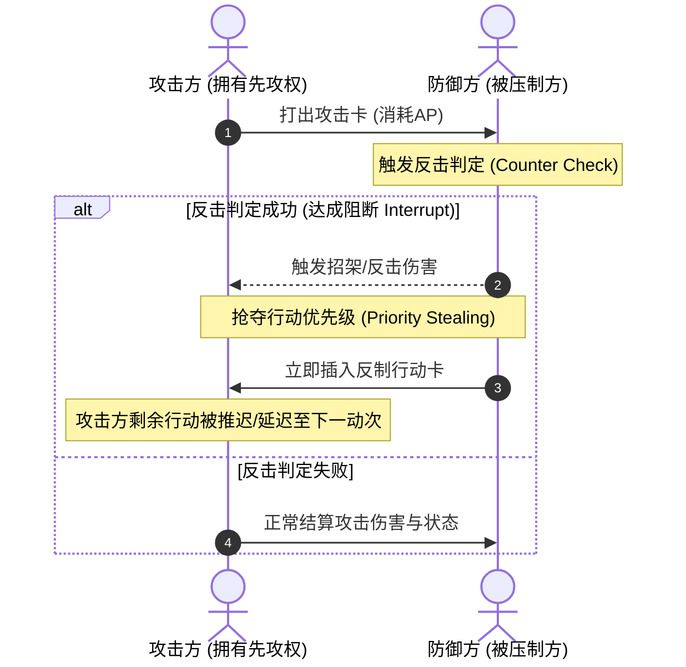

# 文字魔幻RPG - 基本玩法需求设计稿

## 一、 系统概述与核心概念

文字魔幻RPG战斗系统采用 **“动态行动轴 + 随机/固定卡牌池 + 响应式反击打断”** 的复合回合制架构。旨在打破传统回合制“你一刀我一刀”的死板交互，通过行动点差值压制、被动招架打断、先手权逆转等机制，构建高度博弈性的战斗逻辑。

---

## 二、 核心资源与名词定义

| 术语名称 | 英文标识 | 作用与定义说明 |
| :--- | :--- | :--- |
| **大战斗** | `Battle/Encounter` | 整个敌我遭遇战的全局生命周期，包含先手剧情判定、多轮次小回合直至一方阵亡或逃跑。 |
| **小回合/动次** | `Round` | 战斗的最小推进轮次。每一小回合重新判定双方行动点（AP）并分配手牌。 |
| **行动值** | `AP (Action Points)` | 每小回合动态生成的即时资源，用于执行行动卡。支持正负值区间（负值代表处于被压制/硬直状态）。 |
| **行动力** | `Stamina/Energy` | 角色职业自带的基础属性，用于每回合消耗进行战术重掷（Mulligan/洗牌）等特殊操作。 |
| **行动卡** | `Action Card` | 每回合临时生成供玩家/敌方决策的具体行为载体（分为随机卡池与职业固定技能池）。 |
| **反击率 / 招架值** | `Counter Rate/Parry`| 防守方在被攻击时触发被动拦截打断并反抢行动优先级的核心判定属性。 |

---

## 三、 战斗全局生命周期与状态机



---

## 四、 详细玩法规则与逻辑设计

### 4.1 大战斗先手与剧情插入系统
1. **先手值计算**：
   - 遭遇战斗初始化时，根据双方综合属性（敏捷、感知、等级加权）计算初始先手值：
     $$\text{InitialInitiative} = f(\text{Agility}, \text{Perception}, \text{Level})$$
2. **剧情叙事事件插入（Narrative Trigger）**：
   - 战斗支持配置剧情插入叙事数组 `NarrativeEvents[]`。
   - 每个剧情节点包含先决条件判断（如：首回合必定触发、HP低于30%触发、特定BOSS遭遇等）。
   - 判定命中后，暂停战斗主循环，按数组顺序执行文字剧情播报，叙事完毕后恢复战斗流程。

---

### 4.2 行动值（AP）与先后手动态压制机制
1. **小回合行动值生成**：
   - 每小回合开始时，根据**战斗难度系数、双方角色等级、敏捷与综合属性**，动态计算双方的行动值。
   - 后端划定数值上下界区间（例如 `[-10, 10]` 或 `[10, 20]`）。
2. **正负行动值与先后手逻辑**：
   - **AP > 0（先攻累计行动）**：获得主动权，可连续出牌消耗 AP，直至 AP 归零或无卡可用。
   - **AP < 0（被动受制状态）**：表示角色处于受击硬直或被敌方压制状态。此状态下即使手中有卡也无法主动出牌，必须承受敌方连续进攻，只能依赖**被动反击机制**寻求打断破局。
   - **AP = 0（僵持均势）**：根据敏捷细微差值进行单次动次判定。
3. **连续受压制保底机制（防滚雪球）**：
   - 若角色连续 2 个小回合 AP 均为负数，第 3 回合将触发“绝地反击”被动，赋予基础行动点保底（最低为 1），并提升 25% 基础反击率，防止玩家陷入无限死锁。

---

### 4.3 卡牌生成与重掷机制（随机池 + 固定技能池）
1. **卡牌池结构**：
   - **A. 随机卡牌池（基础卡）**：
     - **攻击类**：魔法攻击、物理攻击、混合攻击（物魔双修）。
     - **状态类**：
       - 增益类：防御、攻击、速度、生命上限、魔法上限。
       - 减益类：防御削弱、攻击削弱、速度削弱、持续掉血、魔法燃烧。
     - **恢复类**：生命即时恢复、魔法即时恢复。
     - **其他类**：道具使用卡。
   - **B. 技能卡池（职业专属固定技能）**：
     - 根据角色当前职业与技能解锁树固定加载，分类与随机卡一致，但具备更高的数值倍率或专属附加词条。
     - **特殊奥义技能（Ultimate）**：预留特殊技能卡槽位，当特定怒气/法力条件满足时激活（默认锁定）。
2. **后端随机控制策略**：
   - 后端支持配置三种随机算法：
     - `全随机 (Pure Random)`：纯伪随机数发生器。
     - `伪随机 (PRD / Pseudo-random)`：引入补偿机制，连续未抽到关键卡时逐步提高概率。
     - `混合随机 (Hybrid Random)`：核心保底 + 浮动随机。
   - 算法策略由服务器全局统一裁定，前端仅接收生成结果。
3. **战术重掷（Mulligan）**：
   - 每回合玩家拥有 1 次重新抽取行动卡的机会。
   - 消耗 **1点职业行动力（Stamina）**。

---

### 4.4 招架反击、行动阻断与优先级抢夺（核心博弈）



1. **反击判定触发条件**：
   - 当受到直接攻击（物理/魔法/混合）时，依据防御方反击属性、速度差与被动技能进行掷骰判定。
2. **阻断（Interrupt）与推条（Delay）**：
   - 一旦反击成功判定为“阻断”，攻击方的当前攻击立即被瓦解。
   - **优先级抢夺**：攻击方本回合后续原本预定的未执行攻击被**挂起推迟**（甚至部分强力打断卡可直接将敌方剩余行动消除并顺延至下一回合结算）。
3. **反制出卡与连击限制**：
   - 抢过优先级的防守方立即获得出牌权：
     - **攻击卡反制**：默认单次强力反击；若卡牌自带特殊触发状态，可引发连击。
     - **增益卡反制**：若打出增益卡，则对本回合后续的所有反制行动立即生效。
4. **反击链深度限制（防死循环 Loop-Breaker）**：
   - 单一动次内反击链最大深度为 **2层**（即：A反击B $\rightarrow$ B再次反击A后，强制终止反击链，双方进入正常伤害结算），严禁无限套娃。

---

### 4.5 Buff / Debuff 作用域与时效体系
1. **本回合即时生效增益（Turn-Instant Buff）**：
   - 仅在打出该卡的当前小回合内生效，直接作用于本回合剩余的所有连击与行动。
   - 理论上在本回合内可线性叠加（设置单回合增益上限，如最高 +200%）。
   - 小回合结算时该类临时增益全部清零。
2. **跨回合持续生效增益/减益（Multi-Round DOT/HOT/Buff）**：
   - 带有持续轮次计数器（`Duration: N Rounds`）。
   - 在每个小回合结算阶段进行跳字扣血/回血，并递减持续轮次，归零时移除。

---

### 4.6 战斗伤害与数值结算公式

1. **综合单次伤害计算公式**：
   $$\text{FinalDamage} = (\text{AtkBase} - \text{DefBase}) + (\text{AtkBuff} - \text{DefBuff}) + (\text{AtkDebuff} - \text{DefDebuff}) + (\text{AtkHealMod} - \text{DefHealMod})$$
   - $\text{AtkBase} / \text{DefBase}$：攻击方与防御方基础攻防数值。
   - $\text{AtkBuff} / \text{DefBuff}$：当前生效的增益效果折算值。
   - $\text{AtkDebuff} / \text{DefDebuff}$：当前生效的减益削弱折算值。
   - $\text{AtkHealMod} / \text{DefHealMod}$：恢复/吸血修正项。

2. **伤害边界硬性约束**：
   - **伤害下限**：$\text{FinalDamage} \ge 0$（伤害最低为0，不可产生负伤害导致加血）。
   - **伤害上限**：
     - 物理/混合伤害上限：$\le \text{MaxHP}_{\text{Atk}}$（攻击方最大生命值）。
     - 魔法伤害上限：$\le \text{MaxMP}_{\text{Atk}}$（攻击方最大魔法值）。

---

## 五、 数据结构与接口协议定义（供后端实现参考）

### 5.1 行动卡数据模型 (ActionCard Schema)
```typescript
export interface ActionCard {
  id: string;
  name: string;
  cardSource: 'RANDOM_POOL' | 'CLASS_SKILL'; // 随机池 or 职业固定技能
  cardType: 'ATTACK' | 'BUFF' | 'DEBUFF' | 'HEAL' | 'ITEM' | 'ULTIMATE';
  subType: 'PHYSICAL' | 'MAGICAL' | 'HYBRID' | 'DEFENSE' | 'SPEED' | 'HP' | 'MP';
  apCost: number;             // 消耗的行动值
  baseValue: number;          // 基础数值 (伤害/增益量/恢复量)
  effectScope: 'THIS_ROUND' | 'MULTI_ROUND'; // 即时生效 or 跨回合持续
  durationRounds?: number;    // 持续回合数 (仅 MULTI_ROUND 有效)
  canTriggerCounter: boolean; // 是否可被敌方招架反击
  counterInterruptRate?: number; // 自身打断几率
}
```

### 5.2 小回合状态机上下文 (RoundContext Schema)
```typescript
export interface RoundContext {
  roundNumber: number;
  playerAP: number;           // 玩家本回合行动值 (可正可负)
  enemyAP: number;            // 敌人本回合行动值
  initiative: 'PLAYER' | 'ENEMY' | 'STALEMATE'; // 当前先手主导方
  mulliganUsed: boolean;      // 本回合是否已重掷
  currentCounterDepth: number;// 当前反击链递归深度 (0 ~ 2)
  instantBuffs: Record<string, number>; // 本回合即时叠加增益
  activeEffects: Array<{
    effectId: string;
    target: 'PLAYER' | 'ENEMY';
    remainingRounds: number;
    value: number;
  }>;
}
```

---

## 六、 边界异常与防死锁设计

1. **AP耗尽且有手牌 / AP充足但无手牌**：
   - 当 AP $\le 0$ 时，禁止打出任何需要消耗 AP 的主动卡牌。
   - 当手牌用尽但 AP 仍有剩余时，当前动次立即自动结算并让出行动权，剩余 AP 不结转至下一回合。
2. **同速与零差值竞争（Tie Breaker）**：
   - 若双方计算后 AP 差值为 0，取敏捷绝对值高者优先行动；若敏捷一致，进行 `50/50` 随机微差决定。
3. **异常逃跑机制**：
   - 逃跑不属于卡牌系统，作为独立的战场指令，消耗整回合所有 AP 与 1 点行动力，成功率由双方敏捷比值判定。
