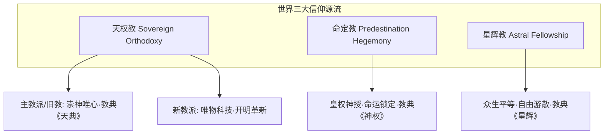

# 文字魔幻RPG - 基本玩法需求设计稿三：世界宗教、信仰法则与阵营技能演化

## 一、 系统概述与世界观哲学

在文字魔幻RPG的世界体系中，**宗教信仰（Faith & Dogma）**不仅是宏观地缘政治与剧情叙事的驱动核心，更是微观上干涉生命体**精神压力（MSF）、心核共鸣、多维信仰系数（FAITH）、以及专属神圣/命定/星辉魔法指令集**的深层法则引擎。

本设计稿系统化定义世界三大源流宗教，并与《设计稿一（战斗系统）》与《设计稿二（生命与技能体系）》实现底层逻辑的无缝咬合。

---

## 二、 世界三大宗派体系与教义法则



### 2.1 天权教（Sovereign Orthodoxy）—— 天赋人权与文明分立之锚
* **创教教皇**：第一代教皇 ‘普鲁斯特·顿 (Proust Dun)’
* **世界总部圣地**：中央大陆 · 斯特林顿王国 · 斯图克神谕城（拉特顿 / Latton）
* **历史地位**：世界上创立最早的元老级宗教。
* **核心教条与三大准则**：
  1. 宣扬**“天赋人权”**，将生命个体的核心权利视为天神所恩赐，神圣不可剥夺；
  2. **三大戒律准则**：必须遵守天权教义、必须履行教徒义务、必须始终维护天权教不可侵犯之威严。
* **几百年演变下的两大分裂派系**：
  * **主教派（旧教 / Traditional Orthodoxy）**：
    * **思潮**：保守、封闭、崇尚天神主义与唯心主义，恪守普鲁斯特·顿初代教皇意志，拒绝技术激进改革。
    * **教典**：《天典》
    * **游戏内增益**：大幅提升**【神圣级法术抗性】**与**【精神压力（MSF）坚韧度】**。
  * **新教派（Reformed Order）**：
    * **思潮**：激进、开放、偏唯物主义，代表着向科学、机械与工程技术发展的先锋思潮。
    * **游戏内增益**：大幅提升**【学习系数（LEARNING）】**与**【外置工程/道具使用能效】**。

---

### 2.2 命定教（Predestination Hegemony）—— 帝国极权与因果宿命之锁
* **创教神皇**：‘英吉尔·二世 (Ingil II)’
* **世界总部圣地**：北灵大陆 · 英尔帝国首都 ‘洛巴尔 (Lobar)’
* **核心教条与政治结构**：
  1. 宣扬**“一切命中注定，未来不可逆转”**的宿命论；
  2. 确立**政教绝对合一**——世间一切权力、领土与精神所有权，尽归英尔帝国与神皇英吉尔所有；
  3. 教徒必须无条件绝对服从教会指令，越界异端者处以极刑。
* **教典**：《神权》
* **游戏内机制特性【命运锁定】**：
  * 命定教神术具备**“因果律截断”**特质，可强制锁定敌我双方下一轮的 AP 差值或命中率，将不确定性压缩为绝对宿命。

---

### 2.3 星辉教（Astral Fellowship）—— 自由自治与游散星火之芒
* **源流宗师**：‘伊斯 (Isis)’ 或 ‘安吉尔 (Angel)’
* **组织形态**：
  * **无统一全球集权中枢**，以游散的自治信仰小团体、移动修道会（如西域大陆的伊斯星辉教会）为组织形态。
* **核心教条与权利共享**：
  * 主张**“人生而自由、人生而平等、人生而所享、人生而所生”**；
  * 一切权力归全体星辉教徒共有，享有平等的信仰与生活权利。
* **教典**：《星辉》
* **专属魔法流派【星辉魔法 (Astral Magic)】**：
  * 本质为**“规范元素法式魔法”的自我强化与分支派生**；
  * 战术特征：变幻莫测、法术编排极其灵活、连段平滑，擅长多属性快速切换。

---

## 三、 宗教信仰与前两稿底层系统的深度联动

```
                               【宗教信仰联动总网】
                                         │
        ┌────────────────────────────────┼────────────────────────────────┐
        ▼                                ▼                                ▼
【联动稿一：战斗与卡牌】               【联动稿二：生命与属性】            【联动稿二：技能指令集】
- 命定教: 强制推条/锁定AP              - 激活【信仰系数 (FAITH)】         - 三大教派专属第三层师承
- 天权教: 绝对招架/圣光打断            - 天权者资质共鸣加成               - 星辉魔法规范法式编排
- 星辉教: 灵活轻量化低AP连招           - 宗派认同对MSF压力的调节          - 独创第四层技能的信仰偏置
```

### 3.1 与《设计稿一（战斗系统）》的联动机制
1. **天权教战斗特质（主教反击 vs 新教道具）**：
   * **旧教主教**：打出带有“神圣神谕”标签的防御卡时，反击打断几率提升 25%，可强制中断敌方连段；
   * **新教教徒**：使用道具卡消耗的 AP 减半，道具效果受智力属性二次加成。
2. **命定教战斗特质（宿命判定）**：
   * 专属卡牌具备 `[DESTINY_SEAL]`（命定印记），若目标在本动次内受到三次连击，强制将目标下回合 AP 设置为负值（进入受制状态）。
3. **星辉教战斗特质（星辉流转）**：
   * 星辉魔法卡牌在打出后，有 30% 几率返还 1 点即时 AP，允许玩家在当前小回合内进行超长流畅连击。

---

### 3.2 与《设计稿二（生命与属性体系）》的联动机制
1. **多维机能【信仰系数（FAITH）】正式挂钩**：
   $$\text{FinalFaithMod} = \text{BaseFaith} \times \text{ReligiousDevotion} \times (1 + \text{BloodlineBias})$$
   - 虔诚度高的教徒，在施展本教典神术时，魔素转化能耗损失由常规的 25%~50% 骤降至 **10%~15%**！
2. **特殊资质【天权者】与天权教的宿命共鸣**：
   - 拥有 `HEAVEN_ORDAINED`（天权者）资质的角色，若加入天权教，将自动被主教派奉为“圣子/圣女”，直接解锁《天典》禁忌篇章。
3. **精神压力（MSF）调节**：
   - 星辉教徒因崇尚自由，其 MSF 基础自然衰减速度提升 50%（不易发疯）；
   - 命定教徒若违背教令，MSF 将瞬间飙升，触发“天罚反噬”。

---

### 3.3 与《设计稿二（指令集与四层技能金字塔）》的联动
1. **第三层（师承技能池）扩充**：
   * **天权主教**：传承《天之御壁》、《断罪神谕》（神圣位阶魔法）；
   * **命定教会**：传承《命定锁链》、《因果审判》（英雄级至神圣级束缚神术）；
   * **星辉教会**：传承《星辉折跃》、《流光星雨》（高度精简的标准规范法式）。
2. **第四层（自创技能）的教派偏置量（Faith Bias）**：
   * 玩家在自创混合技能时，若融入本教派专属魔语符文（如 `[符文:天命]` 或 `[符文:星芒]`），将赋予自创卡牌独一无二的宗派特质，并在分享传承给同教派玩家时获得额外威力增幅！

---

## 四、 数据结构与接口协议定义（TypeScript Reference）

```typescript
// 1. 宗教阵营与教派定义
export type ReligionType =
  | 'SOVEREIGN_ORTHODOX_OLD'  // 天权教 · 主教派 (旧教)
  | 'SOVEREIGN_ORTHODOX_NEW'  // 天权教 · 新教派
  | 'PREDESTINATION_HEGEMONY' // 命定教
  | 'ASTRAL_FELLOWSHIP'       // 星辉教
  | 'SECULAR_UNALIGNED';      // 世俗无信仰者

// 2. 角色信仰档案数据模型
export interface CharacterFaithProfile {
  religion: ReligionType;
  devotionScore: number;       // 虔诚度 (0 ~ 100)
  faithFactor: number;         // 信仰系数 FAITH (直接作用于魔法与神术结算)
  isExcommunicated: boolean;   // 是否被判为异端/开除教籍

  // 宗派特有能力激活状态
  unlockedDogmaPassives: string[]; // 已解锁教义被动
}

// 3. 宗教专属魔语符文与神术节点
export interface ReligiousRuneNode {
  religionAffiliation: ReligionType;
  dogmaName: string;           // 天典 / 神权 / 星辉
  faithRequirement: number;    // 所需最低虔诚度
  specialMechanic: 'AP_DRAIN' | 'INTERRUPT_BOOST' | 'DESTINY_LOCK' | 'ASTRAL_FLOW';
}
```
