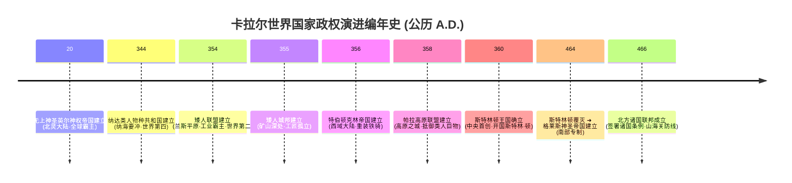

# 文字魔幻RPG - 基本玩法需求设计稿五：国家总览、地缘政权与世界格局

## 一、 系统概述与世界历史纪年

在卡拉尔（Kalar）星球的文明长河中，国家政权不仅是阶级统治与利益分配的实体，更是**地缘经济、跨大陆航海贸易、阵营声望、以及世界级边境危机（兽潮/巨物侵袭）**的核心组织者。

本设计稿以**卡拉尔公历纪年（A.D. 20 ~ A.D. 466）**为时间轴，系统化确立全球九大代表性国家政权的地缘档案、政治体系、战略资源与游戏机制联动。

---

## 二、 卡拉尔世界编年史与国家发展脉络



---

## 三、 全球九大国家政权详尽档案

```
┌─────────────────────────────────────────────────────────────┐
│  【全球综合国力第一梯队】                                   │
│  - No.1 无上神圣英尔神权帝国 (北灵大陆 · 魔素魔法与战略霸权) │
│  - No.2 矮人联盟 (矮人大陆 · 兰卡海湾外向型工业帝国)          │
│  - No.4 纳达类人物种共和国 (中央/北灵枢纽 · 开明多民族共和)  │
├─────────────────────────────────────────────────────────────┤
│  【区域地缘核心强权】                                       │
│  - 特伯顿克林帝国 (西域大陆中心 · 重甲农业君主专制)          │
│  - 格莱斯神圣帝国 (中央大陆帕拉特半岛 · 天权新教封建专制)    │
│  - 北方诸国联邦 (山海关天河北岸 · 造船航海与抗潮同盟)        │
├─────────────────────────────────────────────────────────────┤
│  【特异封闭与要塞政权】                                     │
│  - 矮人城邦 (深山矿脉 · 极端精工魔导与人口负增长)            │
│  - 帕拉高原联盟 (高原林区 · 长期抵御西面类人巨物)            │
│  - [历史丰碑] 斯特林顿王国 (中央历史首国 · 历经164年)        │
└─────────────────────────────────────────────────────────────┘
```

---

### 3.1 无上神圣英尔神权帝国（Supreme Sacred Ingil Theocracy）—— 全球第一霸权 (Rank 1)
* **建立年代与建立者**：公历 20 年，英吉尔精灵族（历经数百年完全统治北灵大陆）。
* **首都与核心资源**：天空之城 · 洛巴尔（Lobar）。全大陆富产最核心战略资源——**魔单晶 (Mana Monocrystal)**。
* **国力与地缘特征**：
  * 大陆魔素环境极其浓郁，公民平均魔法能力全球断层领先；科技、经贸、军事、文化全方位处于全球主导地位；
  * **国民心态**：极度傲慢，轻视弱国，任何国际地区冲突均受其意志干涉。
* **游戏机制联动**：
  * 高纯度魔单晶与神圣/命定高阶魔法发源地；非精灵族角色在此地声望获取惩罚 $-30\%$。

---

### 3.2 矮人联盟（Dwarven Federation）—— 全球工业与海洋贸易霸权 (Rank 2)
* **建立年代与建立者**：公历 354 年，皮耶克·基斯（矮人）。
* **核心地域与港口**：兰斯平原与东海岸兰卡海湾（众多天然不冻良港）。
* **国力与社会结构**：
  * 坚定推行自由贸易，制造业与商业垄断矮人大陆；高度开放外向型经济，与西域大陆贸易极其密切；
  * 种族多元包容、教育水平极高、宗教冲突极低，综合国力全球第二。
* **游戏机制联动**：
  * 全球高级工业流水线与魔导商品贸易中心；提供最丰富的跨大陆远洋海运航线与自由集市。

---

### 3.3 纳达类人物种共和国（Nada Humanoid Republic）—— 民族交融与双陆贸易枢纽 (Rank 4)
* **建立年代与建立者**：公历 344 年，纳特·达坎（兽族）。
* **首都与地理**：纳海地区 · 中央都市（连接中央大陆与北灵大陆的咽喉纽带）。
* **核心理念与政治**：
  * “兼容并蓄，民族共存”；兽族主导，那达克斯人族紧随，汇聚数百种类人物种；
  * 政治开明民主、文化宽容、经贸与科技先进，综合国力全球第四。
* **游戏机制联动**：
  * 跨大陆免税贸易区；全种族技能与混合职业（如魔剑士）交流研修中心，全阵营中立避风港。

---

### 3.4 特伯顿克林帝国（Teberton-Klin Empire）—— 西域大陆君主铁骑强权
* **建立年代与建立者**：公历 356 年，顿克林·特伯。
* **首都与地理**：特伯顿城（坚固城墙与宏伟宫殿，西域大陆中心战略要地）。
* **经济与军事基础**：
  * 农业与粮食基地雄厚；铁矿与金矿支撑了庞大的军事工业，常备军以严格训练的**铁甲骑兵与重装步兵**著称；对外大规模出口武器与矿产。
* **游戏机制联动**：
  * 重型护甲与物理战阵技能专属传承地；西域军火与雇佣兵调度中心。

---

### 3.5 矮人城邦（Dwarven City-State）—— 矿脉深处的极客工匠隐邦
* **建立年代与建立者**：公历 355 年，弗埃尔·基斯。
* **地理与社会特征**：
  * 依偎在矿产丰富的山脉深处。居民沉默寡言，全族世袭追求**极限精工技艺与最强魔导制品**；
  * 对外交流停滞，精神文化极度单一，人口呈现负增长趋势。
* **游戏机制联动**：
  * 传世神器淬炼与极限定制唯一圣地；不参与常规贸易，仅认可最高纯度稀有矿石与手艺交流。

---

### 3.6 帕拉高原联盟（Pala Plateau Alliance）—— 抵御巨物的生存要塞
* **建立年代与建立者**：公历 358 年，艾琳·缇娜（探险家）与高原改革派原住民。
* **地理分布**：主城“高原之城”（唯一森林区）与外围分散的卫星城网络。
* **地缘危机【类人巨物侵袭】**：
  * 西面边界长期遭遇**类人巨物 (Humanoid Colossi)** 频繁且有组织的侵袭，导致人口迁移频繁，矿产无法持续开采，科技相对落后，全员遵循警戒战略。
* **游戏机制联动**：
  * 巨型生物狩猎战役前哨站；提供高额巨物素材悬赏与要塞防御声望任务。

---

### 3.7 斯特林顿王国（Kingdom of Sterlington）—— [历史丰碑] 中央历史首国
* **历史时期**：公历 360 年 ~ 464 年（统治 164 年，三任国王）。
* **建立者**：斯特林·顿（在位 60 余年，开创全盛巅峰）。
* **历史遗产**：
  * 首都斯图克旧城，疆域曾横跨中央与矮人两大陆，确立了中央大陆的社会法统，后分裂瓦解为格莱斯帝国与北方诸国。

---

### 3.8 格莱斯神圣帝国（Glaice Holy Empire）—— 帕拉特半岛南部专制政权
* **建立年代与建立者**：公历 464 年（在王国废墟上建立），亚埃撒·菲尔伯特。
* **首都与意识形态**：
  * 斯图克城（帕拉特半岛南部）。封建专制，深度信奉**天权新教**；
  * 海外贸易被严格禁止，固步自封，缺乏对外探索欲；与北方诸国联邦长期处于敌对武装对峙状态。
* **游戏机制联动**：
  * 天权新教核心圣殿；南部边境实行严苛的关税封锁与异端审判机制。

---

### 3.9 北方诸国联邦（Northern Confederation）—— 山海关以北的航海与抗潮同盟
* **建立年代与同盟条约**：公历 466 年，巴哈特帝国、顿克尔共和国、兽王国、雷顿公国、艾尔森公国签署《诸国条例》。
* **首都与地理**：总部哈科夫（分部迪卡斯），领土涵盖山海关至天河北岸。土地贫瘠水缺，农业落后，但**造船业繁荣、航海贸易昌盛**。
* **两大战略使命**：
  1. 南方防线：抵御格莱斯帝国的武力扩张；
  2. 北方前线：在山海关构筑坚固要塞，**死守抵御北方的魔兽“兽潮”侵袭**！
* **游戏机制联动**：
  * 远洋造船厂与深海探险起点；山海关要塞抗击兽潮防守副本核心据点。

---

## 四、 国家政权数据结构定义（TypeScript Reference）

```typescript
// 1. 世界国家政权枚举
export type NationType =
  | 'SUPREME_INGIL_THEOCRACY'   // 无上神圣英尔神权帝国 (No.1)
  | 'DWARVEN_FEDERATION'        // 矮人联盟 (No.2)
  | 'NADA_REPUBLIC'             // 纳达类人物种共和国 (No.4)
  | 'TEBERTON_KLIN_EMPIRE'      // 特伯顿克林帝国
  | 'DWARVEN_CITY_STATE'        // 矮人城邦
  | 'PALA_PLATEAU_ALLIANCE'     // 帕拉高原联盟
  | 'GLAICE_HOLY_EMPIRE'        // 格莱斯神圣帝国
  | 'NORTHERN_CONFEDERATION'    // 北方诸国联邦
  | 'HISTORICAL_STERLINGTON';   // 斯特林顿王国 (历史实体)

// 2. 国家战略政权数据模型
export interface NationProfile {
  nationId: NationType;
  nationName: string;
  establishedYear: number;       // 建立年代 (公历 A.D.)
  capitalCity: string;          // 首都
  dominantRace: string;         // 主导种族
  rulingSystem: 'THEOCRATIC_EMPIRE' | 'MERCHANT_FEDERATION' | 'DEMOCRATIC_REPUBLIC' | 'MILITARY_CONFEDERACY' | 'FEUDAL_AUTOCRACY';
  globalPowerRank?: number;     // 全球综合国力排名 (1, 2, 4...)

  // 地缘核心机制与特产
  geopoliticalTraits: {
    hasNavalTradePort: boolean; // 是否拥有海洋贸易良港
    strategicResource: string;  // 战略资源 (魔单晶 / 稀有金铁 / 重装军火 / 远洋船舶)
    borderCrisis?: 'HUMANOID_COLOSSI' | 'BEAST_TIDE_DEFENSE' | 'BORDER_COLD_WAR'; // 边境危机 (类人巨物/兽潮防御/冷战对峙)
  };

  // 玩家外交与声望
  reputationModifier: {
    baseFavor: number;          // 初始好感度 (-100 ~ +100)
    visaRequirementTier: number;// 边境通关文牒等级
  };
}
```
