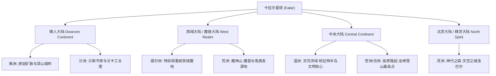
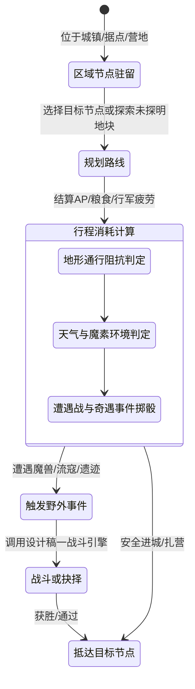

# 文字魔幻RPG - 基本玩法需求设计稿六：世界地理大地图、七大洲与探索法则

## 一、 系统概述与地理拓扑结构

卡拉尔（Kalar）星球的陆地空间由 **“四大大陆（Four Major Continents）”** 与 **“七大洲（Seven Realms）”** 构成了完整的全球地理拓扑体系。

大地图系统作为连接战斗、城镇、国家、生态与野外探险的中枢载体，负责管理**区域空间节点、跨大陆航海航线、地形阻隔通行度、移动补给消耗、以及战争迷雾探索**。

---

## 二、 全球四大大陆与七大洲宏观映射



### 2.1 四大大陆与七大洲空间对照表

| 大陆名称 (别称) | 下辖大洲 (Realm) | 核心地质特征与地理风貌 | 核心地缘政权与生态据点 |
| :--- | :--- | :--- | :--- |
| **矮人大陆** | **兰洲 (Lanzhou)** | 广袤的兰斯平原与东海岸兰卡海湾，水运发达、工业繁盛。 | **矮人联盟 (No.2)**、兰卡工业不冻港 |
|  | **夷洲 (Yizhou)** | 连绵起伏的富矿山脉与地底空洞，地势险峻。 | **矮人城邦**、古代传世工匠矿坑 |
| **西域大陆**<br/>*(魔兽大陆)* | **威尔洲 (Wilzhou)** | 肥沃的西域中央农业盆地，铁矿金矿伴生。 | **特伯顿克林帝国**、重装骑兵要塞 |
|  | **荒洲 (Huangzhou)** | 荒芜贫瘠的魔神山脉与阴暗焦土，魔素高度富集与污秽。 | **魔神山**（魔族/鬼族/魔兽/哥布林发源地） |
| **中央大陆** | **温洲 (Wenzhou)** | 天河流域与帕拉特半岛，气候温和，星球最早文明摇篮。 | **格莱斯神圣帝国**、斯特林顿旧都遗迹 |
|  | **苍洲/沧洲 (Cangzhou)**| 全球最高点龙崎雪山与隆北克高原，终年严寒。 | **龙族圣域**、**帕拉高原联盟**、山海关要塞 |
| **北灵大陆**<br/>*(精灵大陆)* | **灵洲 (Lingzhou)** | 原始神代之森与浮空高天，全球魔素浓度之冠。 | **无上神圣英尔神权帝国 (No.1)**、天空之城洛巴尔 |

---

## 三、 大地图探索机制与移动法则



### 3.1 移动消耗与资源度量衡
1. **行动点与行军时间（Travel Cost）**：
   - 跨节点移动依据道路等级消耗基础行动点与世界时钟（小时/天）；
   - **地形阻抗系数（Terrain Resistance）**：平原道路 $1.0$，密林 $1.5$，高原雪山 $2.5$，荒洲沼泽 $3.0$。
2. **粮草与补给（Supplies Consumption）**：
   - 队伍每天消耗固定口粮；缺粮时角色的**身体机能 (SF)** 与 **精神压力 (MSF)** 将受到严重衰退与惩罚。

### 3.2 跨大陆远洋航运与传送体系
1. **远洋航线网络（Maritime Shipping Network）**：
   - 兰洲兰卡海湾 $\longleftrightarrow$ 温洲天河港口 $\longleftrightarrow$ 灵洲纳海港口；
   - 航海需要购买船票或组建船队，受海况与深海巨兽侵袭概率影响。
2. **魔导传送阵（Mana Waygates）**：
   - 仅在顶级强权首都（如天空之城洛巴尔、中央都市）部署，消耗珍贵的**魔单晶**实现瞬间跨大陆折跃。

---

## 四、 地理与大地图数据结构定义（TypeScript Reference）

```typescript
// 1. 全球七大洲与四大大陆枚举
export enum MajorContinent {
  DWARVEN_CONTINENT = 'DWARVEN_CONTINENT', // 矮人大陆
  WEST_REALM = 'WEST_REALM',               // 西域大陆 (魔兽大陆)
  CENTRAL_CONTINENT = 'CENTRAL_CONTINENT', // 中央大陆
  NORTH_SPIRIT = 'NORTH_SPIRIT'            // 北灵大陆 (精灵大陆)
}

export enum RealmZone {
  LAN_ZHOU = 'LAN_ZHOU',     // 兰洲 (矮人)
  YI_ZHOU = 'YI_ZHOU',       // 夷洲 (矮人)
  WIL_ZHOU = 'WIL_ZHOU',     // 威尔洲 (西域)
  HUANG_ZHOU = 'HUANG_ZHOU', // 荒洲 (西域)
  WEN_ZHOU = 'WEN_ZHOU',     // 温洲 (中央)
  CANG_ZHOU = 'CANG_ZHOU',   // 苍洲 (中央)
  LING_ZHOU = 'LING_ZHOU'    // 灵洲 (北灵)
}

// 2. 地图节点与区域地块模型
export interface WorldMapNode {
  nodeId: string;
  nodeName: string;
  continent: MajorContinent;
  realmZone: RealmZone;
  terrainType: 'PLAINS' | 'FOREST' | 'SNOW_MOUNTAIN' | 'WASTELAND' | 'OCEAN_PORT';
  controllingNationId?: string; // 所属国家政权ID (联动设计稿五)

  // 地理环境参数
  ambientManaDensity: number;   // 环境魔素浓度 (影响设计稿二魔素转化能耗)
  terrainResistanceMod: number; // 地形通行阻抗系数
  hasWaygate: boolean;          // 是否有魔导传送阵
}
```
