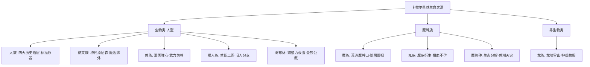

# 文字魔幻RPG - 基本玩法需求设计稿四：种族物种总览、生态演化与阵营法则

## 一、 系统概述与核心概念

在卡拉尔（Kalar）星球的生命演化史中，**“种族”**与**“物种”**构成了地缘政治、文明冲突、生理度量原器偏置量、以及微观生态循环的核心基底。

本设计稿系统化定义世界四大类分类矩阵、九大代表性种族/物种的起源生态、社会结构与游戏机制偏置量，并与《设计稿一、二、三》形成深层数据联动。

---

## 二、 概念界定与世界四大宏观分类矩阵

### 2.1 核心术语界定
* **【物种 (Species)】**：生命体拥有可变规模的栖息地以维系生存与繁衍后代，并在其内部存在基础生存协作或阶层结构。
* **【种族 (Race)】**：物种中存在拥有**稳定生产生活方式的有智慧个体**，并在社会结构中呈现出明确的**文明意识形态、阶级分工与阶层跃迁机制**。

---

### 2.2 世界四大宏观分类矩阵
```
┌─────────────────────────────────────────────────────────────┐
│  ① 生物类 · 人型种族 (Biological Humanoids)                 │
│  - 人族 (先祖/先驱/旧/新)、精灵族、兽族、矮人族、哥布林种、部分高等魔族 │
├─────────────────────────────────────────────────────────────┤
│  ② 魔种族 (Demonics / Fiendish Entities)                   │
│  - 大部分魔族、部分鬼族、部分高等有智魔兽种                      │
├─────────────────────────────────────────────────────────────┤
│  ③ 非生物类 · 人型种族 (Non-Biological Humanoids)           │
│  - 部分化形龙族、极少部分异质鬼族与幻化魔兽                      │
├─────────────────────────────────────────────────────────────┤
│  ④ 非生物类 · 非人型种族 (Non-Biological Non-Humanoids)     │
│  - 大部分真龙原形、大部分原生态魔兽种、大部分无形鬼族            │
└─────────────────────────────────────────────────────────────┘
```

---

## 三、 九大核心种族与物种详尽档案



---

### 3.1 精灵族（Elves）—— 孤高神代与排外神权之林
* **起源栖息地**：灵洲 · 原始之森（神代之森），星球最早生命之一。
* **种族特性与生理**：
  * 寿命漫长（寿命放大系数 $\times 10.0$）；天生全员具备 **[魔适者]** 资质；
  * 外貌极其优雅、智慧高贵，但在社会上奉行**极端排外主义、神权主义与天朝上国心态**。
* **社会结构与阶级**：
  * 内部阶级极度固化，贫富差距悬殊，底层个体几乎无阶级跃升通道；发展史不足 400 年（有智体社会中期）。
* **游戏数值偏置量**：
  * `INT +15%`, `SPR +10%`, `FAITH +20%`；但与非精灵交流时，魅力社交判定惩罚 $-30\%$。

---

### 3.2 兽族（Beastkin）—— 军国武力与唯心胜物之原
* **起源栖息地**：西域大陆与矮人大陆的深山老林；源于魔兽食入智体脑部有性变异演化。
* **阶级层次与规则**：
  * 四大严格阶级：**王级 $\rightarrow$ 侯级 $\rightarrow$ 士级 $\rightarrow$ 工级**；
  * **阶级跃升全凭个人实力**（武力评定占 50% 以上），全族崇尚军国主义与“心胜于物”的唯心主义信仰。
* **科技与魔法**：
  * 实用科学兴趣为 0；魔法发展正常；历史不足 200 年（早期有智体社会）。
* **游戏数值偏置量**：
  * `STR +20%`, `CON +15%`, `MORALE +25%`；但学习科技/机械手艺时经验获取 $-50\%$。

---

### 3.3 人族（Humans）—— 广泛繁衍与历史断代之源
* **起源栖息地**：中央大陆 · 天河流域。全球分布最广，占领 $1/4$ 陆地，人口占全球 $1/3$。
* **四大演化断层（Evolutionary Cleavages）**：
  1. **先祖人族 & 先驱人族**：史前超越常规轨迹的极度发达科技文明（达星海文明级，未掌握曲率航行），已成断代遗迹；
  2. **旧人族 & 新人族**：地质年代晚，科技衰落陷入循环发展，但部分个体觉醒了**灵能（魔能）**；国家多推行孤立主义与血脉氏族主义。
* **游戏数值基准**：
  * **全属性基准均为 $1.0$**（绝对标准原器），职业选择与技能编排自由度全宇宙最高。

---

### 3.4 魔族（Demons）—— 荒洲魔神与嗜血弱肉之森
* **起源栖息地**：西域大陆 · 荒洲魔神山区域；由天地魔素直接原生，或由异族堕落转化。
* **阶层鄙视链与亚种**：
  * 五大阶层：**王阶 $\rightarrow$ 公阶 $\rightarrow$ 侯阶 $\rightarrow$ 伯阶 $\rightarrow$ S/A/B/C/D级**；
  * 演化为异养生物，以各族血液为食，分化出吸血鬼、食人鬼亚种；极度崇尚个人实力与弱肉强食，无科技积累。
* **游戏数值偏置量**：
  * 物魔双修，攻击自带 **[生命吸取/嗜血]** 效果；但在白天或遭遇神圣属性魔法时，受到伤害额外增加 $35\%$。

---

### 3.5 龙族（Dragons）—— 巅峰神威与魔力枯竭之劫
* **起源栖息地**：中央大陆极高极寒点 · 龙崎雪山与隆北克高原。由纯粹天地魔素凝聚而生。
* **实力与寿命**：
  * 与天地同寿，世间最强肉身体魄与神级魔法造诣。最高统治者为【龙帝】（一龙驻守，万族莫犯）。
* **致命物种缺陷（The Mana Depletion Curse）**：
  * 繁衍极难，现存寥寥无几；
  * **魔素吸收与转化效率极低**：魔力储备极其庞大但不可持久；**一旦在战斗中将魔力彻底耗尽，该个体将永久丧失施法能力（永久废魔）**！
* **游戏机制**：
  * 单体战力数值天花板，但必须进行极其严苛的战斗魔力配额管理。

---

### 3.6 矮人族（Dwarves）—— 兰斯工匠与精工孤立之邦
* **起源栖息地**：矮人大陆 · 兰斯半岛流域。旧人族分支演化。
* **生理与社会结构**：
  * 方颅矮身，臂力与下肢力量极度发达；热衷繁重劳作；
  * **以手工精湛度决定社会地位**，无阶级鄙视链；对魔导制品与工业狂热，但社会整体孤立停滞。
* **游戏数值偏置量**：
  * `CON +20%`, `STR +10%`；锻造与装备精工手艺等级获取速度 $+100\%$；魔法亲和度略低。

---

### 3.7 鬼族（Specters / Oni）—— 魅惑苍白与不孕孤立之裔
* **起源栖息地**：西域荒洲魔神山，魔族衍生分支。
* **生理特征**：
  * 皮肤苍白、身形修长、极具魅惑外表；惧光惧火；物魔双修，单兵战力极强；
  * **【不孕体质】**：无法自然繁衍，全靠魔族个体转变而来，以氏姓划分，数量极度稀少。

---

### 3.8 魔兽种（Magical Beasts）—— 生态循环与兽潮天灾之核
* **起源与生态职能**：
  * 远古生物集群，无智慧杂食自养，是卡拉尔世界魔素与碳氮循环的重要分解转化者（排泄魔素晶体）；
* **天灾机制【兽潮 (Beast Tide)】**：
  * 具备群体共鸣意识；当区域内个体密度突破临界阈值时，自发凝结为群体意识，向周围发动毁灭性扩张。
* **摄取学习机制**：
  * 吞噬何种生物即可掌握其魔法；但若摄入过量魔素，个体将直接爆体而亡。

---

### 3.9 哥布林种（Goblins）—— 繁衍畸变与万族死敌之灾
* **物种特征**：
  * 绿皮尖鼻黄眼，奸邪残忍；无法修炼高深魔法与体魄，但野心极大；
* **极度繁衍力与借腹繁衍**：
  * **一胎九子**，必须借助外族进行繁殖掠夺；
* **【全大陆公敌机制】与【死后尸变】**：
  * 万族全敌视（发现即火化）；**哥布林尸体若未及时火化净化，其死地将自发滋生更多哥布林，甚至引爆周边魔兽的“兽潮”**！

---

## 四、 种族与物种数据结构定义（TypeScript Reference）

```typescript
// 1. 世界宏观四大分类与种族枚举
export enum RaceClassification {
  BIO_HUMANOID = 'BIO_HUMANOID',           // 生物类 · 人型
  DEMONIC_FIEND = 'DEMONIC_FIEND',         // 魔种族
  NON_BIO_HUMANOID = 'NON_BIO_HUMANOID',   // 非生物类 · 人型
  NON_BIO_MONSTER = 'NON_BIO_MONSTER'      // 非生物类 · 非人型
}

export type RaceType =
  | 'HUMAN_NEW' | 'HUMAN_OLD' | 'HUMAN_PROGENITOR'
  | 'ELF' | 'BEASTKIN' | 'DWARF' | 'DEMON' | 'DRAGON'
  | 'GHOST' | 'MAGICAL_BEAST' | 'GOBLIN';

// 2. 种族底层偏置量与物理常数配置
export interface RaceArchetypeProfile {
  raceId: RaceType;
  raceName: string;
  classification: RaceClassification;

  // 生理度量衡参数 (联动设计稿二)
  lifespanScale: number;          // 寿命放大系数 (人类=1.0, 精灵=10.0, 兽族=0.8)
  attributeModifiers: {
    strMod: number;               // 力量修正 (如 +0.20)
    conMod: number;               // 体质修正
    intMod: number;               // 智魔力修正
    agiMod: number;               // 敏捷修正
    sprMod: number;               // 精神力修正
    vitMod: number;               // 寿元储备修正
  };

  // 种族专属机制标签
  mechanicTraits: Array<
    | 'MANA_ADAPTED_NATIVE'        // 精灵: 天生魔适者
    | 'MARTIAL_SUPREMACY'         // 兽族: 个人武力至上
    | 'PERMANENT_MANA_BURNOUT'    // 龙族: 魔力耗尽永久废魔
    | 'BLOOD_PARASITE'            // 魔族: 嗜血异养
    | 'CRAFT_MASTERY_DOUBLE'      // 矮人: 精工双倍经验
    | 'INFERTILE_AFFLICTION'      // 鬼族: 不孕体质
    | 'BEAST_TIDE_RESONANCE'      // 魔兽: 兽潮共鸣
    | 'GLOBAL_HOSTILITY_CORPSE_IGNITE' // 哥布林: 万族死敌与尸火化机制
  >;
}

// 3. 跨种族年龄等效换算与动态修正工具规范 (Age Equivalence Engine)
export class AgeEquivalenceEngine {
  /**
   * 将异族真实寿命转换为人类标准原器等效年龄 (用于后端判定生命阶段)
   * @param rawAge 异族真实存活年数 (如精灵 234 岁)
   * @param lifespanScale 寿命放大因子 (如精灵 10.0)
   * @returns 归一化等效年龄 (0 ~ 100, 精确到小数点后1位并钳制)
   */
  public static toNormalizedAge(rawAge: number, lifespanScale: number): number {
    if (lifespanScale <= 0) lifespanScale = 1.0;
    const rawVal = rawAge / lifespanScale;
    // 浮点动态修正：防止精度溢出，保留1位小数并钳制在 [0, 100]
    const rounded = Math.round(rawVal * 10) / 10;
    return Math.min(Math.max(rounded, 0), 100);
  }

  /**
   * 将人类标准原器等效年龄反向换算为异族真实物理寿命
   * @param normalizedAge 标准原器年龄 (0 ~ 100)
   * @param lifespanScale 寿命放大因子
   * @returns 异族实际物理年龄 (整数年)
   */
  public static toRawBiologicalAge(normalizedAge: number, lifespanScale: number): number {
    const rawAge = normalizedAge * Math.max(lifespanScale, 0.1);
    return Math.floor(rawAge);
  }
}
```
