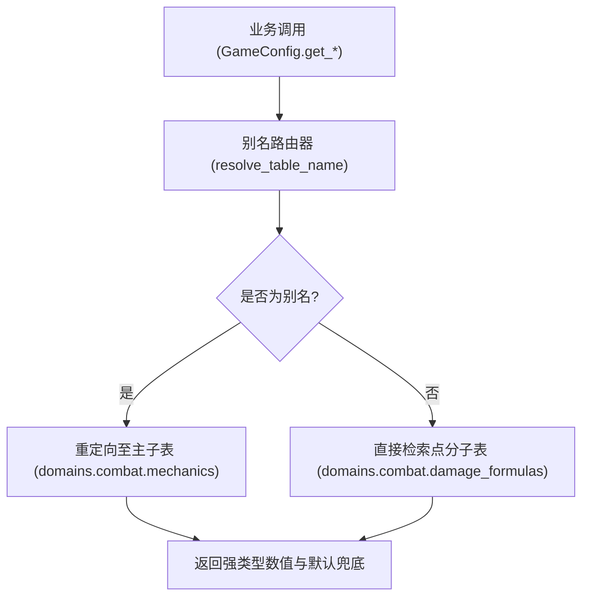

# 施工细则：演进 01 超大型子域多配置表目录拆分与泛化路由架构 —— 阶段2：GameConfig递归子表解析与动态路由引擎实现

> [!NOTE]
> **【施工目标】**：实现 GameConfig 递归子目录解析、点分命名空间映射与平滑向后兼容别名路由引擎。
> **【授权依据】**：**已获项目负责人/用户明确授权 (Explicit Authorization)**。
> **对应需求源**：[后端架构需求表索引](../../../后端架构/后端架构需求表索引.md)。

---

## 📌 第一性原理溯源指针

* **精准上游规范指针**：[二、 业务计算与求解器](../../../后端架构/后端架构需求表索引.md)
* **核心不变量约束断言**：`子表读取必须零 Variant 警告，别名重定向不得产生额外的 GC 损耗`。

---

## 一、 核心算法与业务实现 (Core Business Logic)

```gdscript
# 模块路径: res://backend/infrastructure/config_router_engine.gd
class_name ConfigRouterEngine extends RefCounted:

    static var _table_aliases: Dictionary = {
        "domains.combat": "domains.combat.mechanics"
    }

    static func resolve_table_name(requested_table: String) -> String:
        return _table_aliases.get(requested_table, requested_table)

    static func build_subtable_key(root_layer: String, domain_id: String, sub_table: String) -> String:
        return "%s.%s.%s" % [root_layer, domain_id, sub_table]
```


