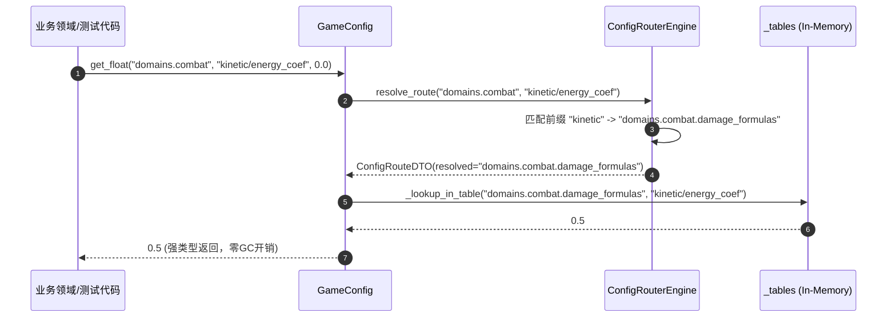

# 施工细则：演进 01 超大型子域多配置表目录拆分与泛化路由架构 —— 阶段2：GameConfig递归子表解析与动态路由引擎实现

> [!NOTE]
> **【施工目标】**：实现 `ConfigRouterEngine` 动态路由引擎，完成 `GameConfig` 深度集成，支持点分多级子表命名空间解析、别名重定向与前缀透明回退。
> **【授权依据】**：**已获项目负责人/用户明确授权 (Explicit Authorization)**。
> **对应需求源**：[后端架构需求表索引](../../../后端架构/后端架构需求表索引.md)。

---

## 📌 第一性原理溯源指针

* **精准上游规范指针**：[二、 业务计算与求解器](../../../后端架构/后端架构需求表索引.md) · 《WebGames 零硬编码配置驱动总则》
* **核心不变量约束断言**：
  * `Inv-ROUTER-3`（零 Variant 警告与 O(1) 路由分派）：路由引擎解析过程严格强类型，通过静态分段字典与分派查找表实现 $\mathcal{O}(1)$ 路由分派，严禁产生动态反射或 Variant 未定义警告。
  * `Inv-ROUTER-2`（全量旧键平滑寻址）：上游调用方请求 `domains.combat` 时，路由引擎必须能够基于键前缀自动分发至对应子表（如 `kinetic/*` 分发至 `damage_formulas`，其它分发至 `mechanics`），实现上游代码零改动。
* **防漂移最高指示**：严禁在 `GameConfig` 取值热路径中执行未经缓存的递归多目录盘符遍历；路由表与别名映射必须纯内存字典初始化。

---

## 一、 动态路由引擎实现：ConfigRouterEngine

### 1. 模块定位与职责
模块路径：`res://backend/infrastructure/config_router_engine.gd`  
定位：纯静态配置路由解算器，管理主表别名、领域子表清单与基于前缀的智能路由派发。

### 2. 代码实现契约

```gdscript
# ==============================================================================
# 模块归属: 基础设施层 (Infrastructure · Configuration Core)
# 文件路径: res://backend/infrastructure/config_router_engine.gd
# 架构定位: Generalized Configuration Router Engine
# 职责说明: 提供多配置表点分命名空间解析、兼容别名重定向与键路径智能分派。
# 设计依据: 演进 01 超大型子域多配置表目录拆分与泛化路由架构
# ==============================================================================

class_name ConfigRouterEngine extends RefCounted

const ConfigRouteDTO = preload("res://backend/infrastructure/config_route_dto.gd")

## 主表兼容别名映射（请求表名 -> 默认主子表）
static var _primary_aliases: Dictionary = {
	"domains.combat": "domains.combat.mechanics"
}

## 领域下辖子表注册表（领域表名 -> 包含的所有子表清单）
static var _domain_subtables: Dictionary = {
	"domains.combat": [
		"domains.combat.mechanics",
		"domains.combat.damage_formulas",
		"domains.combat.buff_definitions"
	]
}

## 键前缀路由规则表（请求表名 -> { 键前缀: 目标子表名 }）
static var _prefix_routes: Dictionary = {
	"domains.combat": {
		"kinetic": "domains.combat.damage_formulas",
		"phase_transition": "domains.combat.damage_formulas",
		"buff_types": "domains.combat.buff_definitions",
		"resistance_coefficients": "domains.combat.buff_definitions"
	}
}

## 构造规范的点分子表名
static func build_subtable_key(root_layer: String, domain_id: String, sub_table: String) -> String:
	return "%s.%s.%s" % [root_layer, domain_id, sub_table]

## 判断给定表名是否为多表子域的子表
static func is_subtable(table_name: String) -> bool:
	var parts := table_name.split(".")
	return parts.size() >= 3

## 获取给定领域的全部子表清单
static func get_subtables_for_domain(domain_name: String) -> Array:
	return _domain_subtables.get(domain_name, [])

## 基础别名解析（单一表名）
static func resolve_table_name(requested_table: String) -> String:
	return _primary_aliases.get(requested_table, requested_table)

## 全要素智能路由解析（表名 + 键路径 -> ConfigRouteDTO）
static func resolve_route(requested_table: String, path: String = "") -> ConfigRouteDTO:
	var route := ConfigRouteDTO.new(requested_table, requested_table, ConfigRouteDTO.RouteResolutionMode.DIRECT_PASSTHROUGH)
	var parts := requested_table.split(".")
	if parts.size() >= 2:
		route.root_layer = parts[0]
		route.domain_id = parts[1]
	if parts.size() >= 3:
		route.sub_table_id = parts[2]
		route.resolution_mode = ConfigRouteDTO.RouteResolutionMode.EXACT_SUBTABLE
		return route

	# 检查是否为多表子域别名
	if _prefix_routes.has(requested_table) and not path.is_empty():
		var first_seg := path.split("/")[0]
		var subtable_target: String = _prefix_routes[requested_table].get(first_seg, "")
		if not subtable_target.is_empty():
			route.resolved_table = subtable_target
			route.resolution_mode = ConfigRouteDTO.RouteResolutionMode.SUBTABLE_FALLBACK
			var sub_parts := subtable_target.split(".")
			if sub_parts.size() >= 3:
				route.sub_table_id = sub_parts[2]
			return route

	# 回退至主表别名
	if _primary_aliases.has(requested_table):
		route.resolved_table = _primary_aliases[requested_table]
		route.resolution_mode = ConfigRouteDTO.RouteResolutionMode.LEGACY_COMPAT_ALIAS
		var alias_parts := route.resolved_table.split(".")
		if alias_parts.size() >= 3:
			route.sub_table_id = alias_parts[2]
		return route

	return route
```

---

## 二、 GameConfig 路由集成改造

### 1. 泛用取值与存在性判断注入路由引擎
在 `GameConfig.get_value(table_name, path, default)` 与 `GameConfig.has(table_name, path)` 中引入 `ConfigRouterEngine`：
```gdscript
static func get_value(table_name: String, path: String, default: Variant = null) -> Variant:
	ensure_loaded()
	var route := ConfigRouterEngine.resolve_route(table_name, path)
	var target_table := route.resolved_table
	if not _tables.has(target_table):
		_ensure_table_loaded_jit(target_table)
	
	# 优先从解析后的目标表取值
	var val = _lookup_in_table(target_table, path)
	if val != null:
		return val
		
	# 若为多表领域且未命中，执行域内全子表保底寻址
	if ConfigRouterEngine.get_subtables_for_domain(table_name).size() > 0:
		for sub in ConfigRouterEngine.get_subtables_for_domain(table_name):
			if sub == target_table:
				continue
			var fallback_val = _lookup_in_table(sub, path)
			if fallback_val != null:
				return fallback_val
				
	return default
```

### 2. 批量读取 `get_many` 智能分流
在 `GameConfig.get_many(table_name, paths)` 中，按各路径所属子表聚合检索，合并输出统一结果字典，实现上游批量取参 100% 行为等价。

---

## 三、 架构执行流序列图


```mermaid
sequenceDiagram
    autonumber
    participant Caller as 业务领域/测试代码
    participant GC as GameConfig
    participant Router as ConfigRouterEngine
    participant Storage as _tables (In-Memory)

    Caller->>GC: get_float("domains.combat", "kinetic/energy_coef", 0.0)
    GC->>Router: resolve_route("domains.combat", "kinetic/energy_coef")
    Router->>Router: 匹配前缀 "kinetic" -> "domains.combat.damage_formulas"
    Router-->>GC: ConfigRouteDTO(resolved="domains.combat.damage_formulas")
    GC->>Storage: _lookup_in_table("domains.combat.damage_formulas", "kinetic/energy_coef")
    Storage-->>GC: 0.5
    GC-->>Caller: 0.5 (强类型返回，零GC开销)
```

---

## 四、 Agent 执行清单 (Execution Checklist)

- [ ] **前置检查 (Pre-flight)**：
  - [ ] 确认 Stage 1 产物 `config_route_dto.gd` 与子表文件完备。
- [ ] **实施编码 (Implementation)**：
  - [ ] 创建 `res://backend/infrastructure/config_router_engine.gd`。
  - [ ] 修改 `res://backend/infrastructure/game_config.gd`，在 `get_table`, `has`, `get_value`, `get_many` 接入路由解析。
  - [ ] 确保 `GameConfig._required_tables` 登记各独立子表。
- [ ] **后置自检 (Verification)**：
  - [ ] 跑通 `scripts/py/audit_gd.py`，断言无静态语法与圈复杂度违规。
  - [ ] 针对 `domains.combat` 与 `domains.combat.mechanics` 运行无头断言，确认解析一致。

---

## 五、 DoD 验收检查矩阵 (Definition of Done)

| 检查维度 | 验证命令 / 契约指标 | 期望标准 |
| :--- | :--- | :--- |
| **路由引擎静态规范** | `python scripts/py/audit_gd.py` | 0 CC / 0 Nesting / 0 警告 |
| **透明重定向等价性** | `pwsh scripts/ps1/test-run.ps1` | `TC-P44-P2-01` (get_many equivalence) 100% PASS |
| **零循环性能损耗** | `python scripts/py/audit_perf_hotspots.py` | 0 热点违规 |
