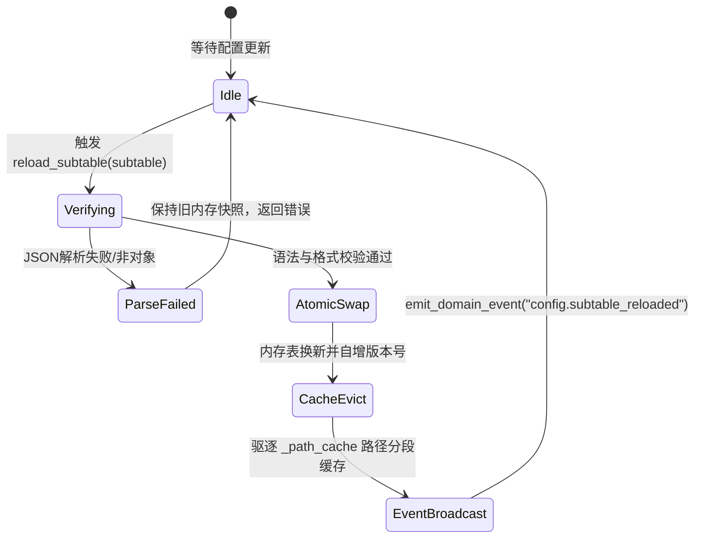

# 施工细则：演进 01 超大型子域多配置表目录拆分与泛化路由架构 —— 阶段3：工程化配置驱动改造与热重载广播机制

> [!NOTE]
> **【施工目标】**：扩展 `domains.json` 事实源声明 `sub_tables` 拓扑元数据，升级 `StorageResourceCatalog` 统一资源索引，实现 `GameConfig.reload_subtable` 细粒度热重载与 `EventBusCore` 靶向广播。
> **【授权依据】**：**已获项目负责人/用户明确授权 (Explicit Authorization)**。
> **对应需求源**：[后端架构需求表索引](../../../后端架构/后端架构需求表索引.md)。

---

## 📌 第一性原理溯源指针

* **精准上游规范指针**：[三、 状态机与配置驱动](../../../后端架构/后端架构需求表索引.md) · 《WebGames 零硬编码配置驱动总则》
* **核心不变量约束断言**：
  * `Inv-ROUTER-4`（细粒度热重载与靶向广播）：子表热重载仅针对被修改的单张子表执行原子替换，并通过 `EventBusCore` 派发 `"config.subtable_reloaded"` 领域事件，禁止触发布局全量 66 张表的重载与全域无差别脏标记。
* **防漂移最高指示**：`domains.json` 是全工作区唯一领域架构真源。严禁在代码中写死子表清单而不向 `domains.json` 登记；严禁在广播事件中产生未受架构元数据约束的裸字符串。

---

## 一、 domains.json 架构事实源元数据扩展

### 1. `_meta.field_notes` 语义追加
在 `config/infrastructure/domains.json` 的 `_meta.field_notes` 中登记 `sub_tables` 规范说明：
```json
"sub_tables": "超大型多表子域专属清单：显式声明该领域拆分包含的所有细分子表全路径表名（如 domains.combat.mechanics），供架构护栏进行物理文件、代码引用与资源目录三向一致性校验"
```

### 2. `physics_thermodynamics` 领域条目升级
```json
{
  "id": "physics_thermodynamics",
  "config": "domains.combat",
  "sub_tables": [
    "domains.combat.mechanics",
    "domains.combat.damage_formulas",
    "domains.combat.buff_definitions"
  ],
  "narrative": "narratives.combat",
  "test": "res://tests/unit/domains/test_physics_thermodynamics.gd",
  "test_symbol": "TestPhysicsDomain",
  "phase": 1,
  "depends_on": []
}
```

---

## 二、 StorageResourceCatalog 子表自动推导与索引登记

在 `res://backend/domains/persistence_protocol/storage_resource_catalog.gd` 的 `ensure_catalog_loaded()` 中增加对 `sub_tables` 的自动推导注册：

```gdscript
# 遍历 domains.json 注册各域子表
for entry in root_dom.get("domains", []):
	var ed: Dictionary = entry if entry is Dictionary else {}
	# ... 既有主表与文案表注册 ...
	for sub_table in ed.get("sub_tables", []):
		var st_str := String(sub_table)
		if not st_str.is_empty():
			_register_inferred_table(st_str, StorageContractInterfaces.LoadPriority.NORMAL)
```

通过这一改造，资源目录在启动阶段即可对所有子表建立 $\mathcal{O}(1)$ 索引，支持 JIT 按需加载与双域储存工作池并发预加载。

---

## 三、 细粒度子表热重载广播状态机 (Subtable Hot-Reload FSM)

### 1. `GameConfig.reload_subtable` 实现细则
在 `res://backend/infrastructure/game_config.gd` 中新增静态方法：

```gdscript
## 单子表靶向热重载（零污染、单子表原子替换）
static func reload_subtable(subtable_name: String) -> Dictionary:
	var resolved := ConfigRouterEngine.resolve_table_name(subtable_name)
	var parts := resolved.split(".")
	var file_path := CONFIG_DIR + "/".join(parts) + EXT_JSON
	
	if not FileAccess.file_exists(file_path):
		return {
			"success": false,
			"subtable": resolved,
			"error": "FILE_NOT_FOUND",
			"file_path": file_path
		}
		
	var json := JSON.new()
	var text := FileAccess.get_file_as_string(file_path)
	if json.parse(text) != OK:
		return {
			"success": false,
			"subtable": resolved,
			"error": "JSON_PARSE_FAILED",
			"details": json.get_error_message()
		}
		
	var data: Variant = json.get_data()
	if not (data is Dictionary):
		return {
			"success": false,
			"subtable": resolved,
			"error": "NOT_A_JSON_OBJECT"
		}
		
	# 原子置换内存表缓存并清空关联路径分段缓存
	_tables[resolved] = data
	_reload_counter += 1
	_path_cache.clear()
	
	# 广播细粒度重载事件
	EventBusCore.get_instance().emit_domain_event("config.subtable_reloaded", {
		"subtable": resolved,
		"version": _reload_counter
	})
	
	return {
		"success": true,
		"subtable": resolved,
		"version": _reload_counter
	}
```

### 2. 状态机流转图



---

## 四、 Agent 执行清单 (Execution Checklist)

- [ ] **前置检查 (Pre-flight)**：
  - [ ] 检查 `domains.json` 格式与当前 42 业务领域条目。
  - [ ] 检查 `StorageResourceCatalog` 的 `_register_inferred_table` 逻辑。
- [ ] **实施编码 (Implementation)**：
  - [ ] 修改 `config/infrastructure/domains.json`，在 `physics_thermodynamics` 登记 `sub_tables`。
  - [ ] 修改 `storage_resource_catalog.gd`，增加 `sub_tables` 自动推导注册。
  - [ ] 在 `game_config.gd` 中实现 `reload_subtable()`。
- [ ] **后置自检 (Verification)**：
  - [ ] 运行 `audit_config.py`，确认 `domains.json` 格式无 BOM、LF、2 空格缩进通过。
  - [ ] 在 Godot 环境中断言 `StorageResourceCatalog.get_instance()` 成功索引 3 张 combat 子表。

---

## 五、 DoD 验收检查矩阵 (Definition of Done)

| 检查维度 | 验证命令 / 契约指标 | 期望标准 |
| :--- | :--- | :--- |
| **元数据架构自洽** | `python scripts/py/audit_cdc.py` | 0 配置驱动违规 |
| **单表重载原子性** | 单元测试模拟更新单表内容 | 仅目标表更新，其它 66 表不变，版本号递增 |
| **资源目录全覆盖** | 资源目录断言查询 `config.domains.combat.mechanics` | 返回有效 EntryDTO 且物理路径正确 |
