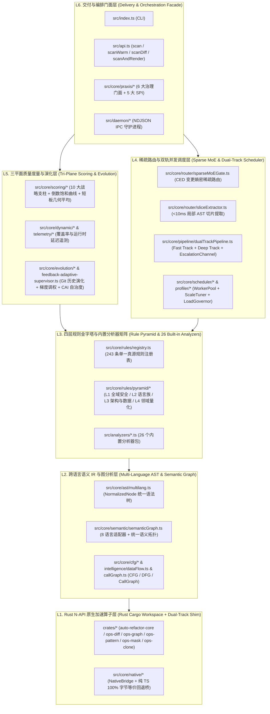

# 01. 系统六层架构全景与核心数据流

> **所属层级**：L1 核心架构与原生内核 (`docs/01-architecture/`)  
> **对应代码真源**：`src/api.ts`、`src/core/analyzer.ts`、`src/core/pipeline/dualTrackPipeline.ts`、`src/core/router/sparseMoEGate.ts`、`src/core/scheduler/`

---

## 1. 架构设计哲学与六层拓扑

`auto-refactor` 是一套面向多语言大型代码库与多智能体协作环境的工业级静态审查、重构指导与量化治理引擎。整个系统严格遵循**自底向上的六层单向依赖拓扑**，保证核心算子零外部耦合、跨语言规则统一复用、冷热扫描字节级 100% 等价。

---

## 2. 核心执行流水线详解

### 2.1 冷/热/增量多模态入口 (`src/api.ts`)

1. **`scan(options)`**：纯进程内确定性扫描。默认不触发后台守护进程连接（通过懒加载隔离 `net` 与 `child_process` 模块开销），确保库调用者具备「单次冷启动零额外成本」。
2. **`scanWarm(options)`**：优先通过命名管道或 Unix Domain Socket 请求常驻 Daemon (`src/daemon/server.ts`)，命中 `L1` 内存缓存与 `L2` 磁盘缓存（`.auto-refactor-cache`）；若 Daemon 不可达则自动降级至进程内冷扫，且输出的 `ScanReport` 逐字节一致。
3. **`scanDiff(diffs, options)` / `scanDiffStream(diffs, options)`**：面向增量补丁与 Praxis 实时代码流的向量化差分扫描通道。

### 2.2 双轨并发分析管道 (`DualTrackPipeline`)

位于 `src/core/pipeline/dualTrackPipeline.ts` 的双轨流水线将审查任务拆分为两条协同轨道：

| 轨道名称 | 目标延迟 | 核心处理构件 | 职责与升级机制 |
| :--- | :---: | :--- | :--- |
| **快速切片轨 (Fast Track)** | `< 10 ms` | `ASTSliceExtractor` + `SparseMoEGateRouter` | 提取受修改行影响的最小 AST 语法包围盒，仅激活与变更特征匹配的局部专家分析器，立即向 Agent 返回内环反馈 |
| **深度全图轨 (Deep Track)** | `50 ~ 300 ms` | `SemanticGraph` + `CallGraph` + `ModuleDependencyGraph` | 执行跨文件循环依赖检测（`runCyclePass`）、逆向调用冲击半径追踪与全仓数据流污点传播 |
| **升级通道 (`EscalationChannel`)** | 异步实时 | `src/core/pipeline/escalationChannel.ts` | 当快速轨发现导出签名破坏性变更（`GOV-SLC-001`）或高危安全特征时，立即提升至深度轨并触发 Praxis `L3A` 仲裁告警 |

### 2.3 Sparse MoE 变更熵密稀疏路由 (`SparseMoEGateRouter`)

位于 `src/core/router/sparseMoEGate.ts` 的混合专家门控路由器根据文件角色（`file-role-inference.ts`）、项目原型（`detectProjectArchetype`）以及变更熵密度（Change Entropy Density, CED），动态计算本次扫描需激活的分析器子集：

- **始终在线核心基座（Always-On Safety Core）**：`security`、`secrets`、`governance`、`hygiene` 等安全与底线分析器恒定激活。
- **条件激活领域专家（Conditional Domain Experts）**：仅当切片包含特定语法特征（如异步 I/O、SQL/ORM 查询、测试断言、GDScript 节点生命周期、VS Code `package.json` 贡献点）时，才按需唤醒 `data-architecture`、`test-modernity`、`gdscript-game`、`vscode-extension` 等领域专家。
- **路由效率指标**：在典型增量修改场景下，无关分析器绕过率（`bypassRatio`）稳定达到 **$\ge 70\%$**，且保证与全量分析器开启时的有效违规集合零漏报。

---

## 3. 规模自适应调优与负载总督 (`ScaleTuner` & `LoadGovernor`)

1. **项目画像与成熟度识别 (`src/core/profiler/projectProfiler.ts`)**：自动探测仓库规模等级（`micro` / `small` / `medium` / `large` / `monolith`）、成熟度层级（`demo` / `prototype` / `production` / `industrial`）及工程原型（CLI、Web 前端、游戏引擎、系统库等）。
2. **弹性复杂度预算矩阵 (`src/core/intelligence/elastic-budget-matrix.ts`)**：结合文件语义角色（如核心算法内核、状态机派发表、声明式配置表、测试夹具），动态分配圈复杂度（CC）与文件有效行数（Effective LOC）预算，避免对合理算法模块产生机械式误报。
3. **RSS 内存水位与并发限流 (`src/core/profiler/loadGovernor.ts`)**：实时监控工作线程池（`WorkerPool`）队列深度与进程 RSS 内存占用，超阈值时自动回收冷 AST 缓存并收缩并发度，杜绝 OOM 崩溃。

---

## 4. 关联文档导航

- [02. 两级增量缓存与配置指纹拓扑](./02-pipeline-and-caching.md)
- [03. 跨平台守护进程与 NDJSON IPC 协议](./03-daemon-and-ipc.md)
- [04. 分形 Git 工作树与多级门禁回滚规范](./04-praxis-git-fractal-and-gating-spec.md)
- [05. Rust N-API 原生加速内核与双轨等价桥](./05-rust-native-operator-kernel.md)
