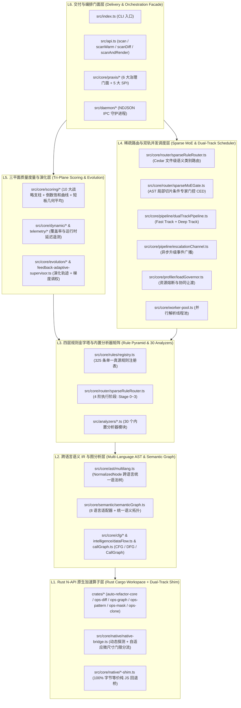
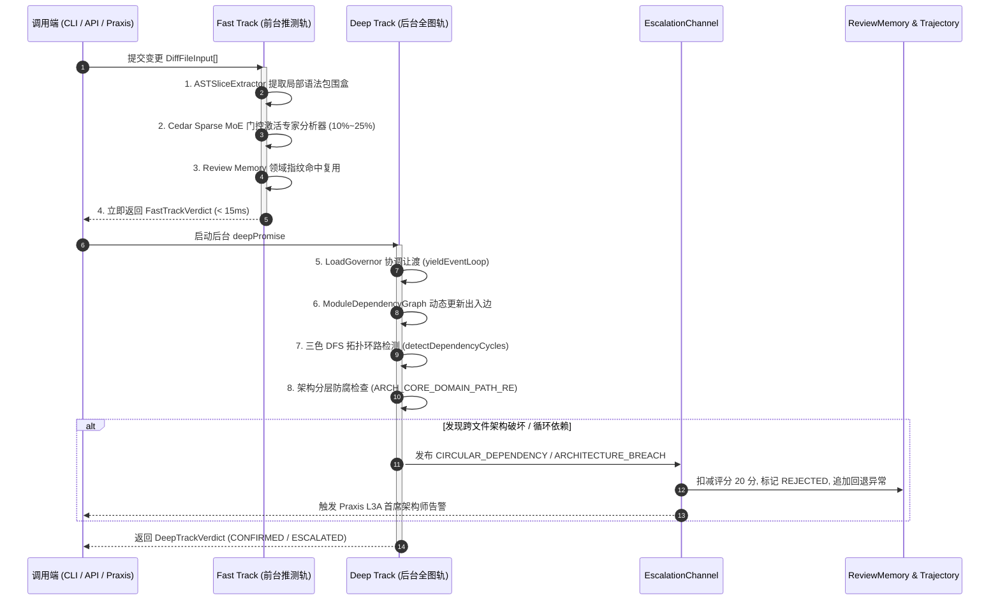

# 01. 系统六层架构全景与核心数据流

> **所属层级**：L1 核心架构与原生内核 (`docs/01-architecture/`)  
> **对应代码真源**：[`src/api.ts`](file:///c:/CODE_game-development/vscode-extensions/auto-refactor/src/api.ts)、[`src/core/analyzer.ts`](file:///c:/CODE_game-development/vscode-extensions/auto-refactor/src/core/analyzer.ts)、[`src/core/pipeline/dualTrackPipeline.ts`](file:///c:/CODE_game-development/vscode-extensions/auto-refactor/src/core/pipeline/dualTrackPipeline.ts)、[`src/core/pipeline/escalationChannel.ts`](file:///c:/CODE_game-development/vscode-extensions/auto-refactor/src/core/pipeline/escalationChannel.ts)、[`src/core/router/sparseRuleRouter.ts`](file:///c:/CODE_game-development/vscode-extensions/auto-refactor/src/core/router/sparseRuleRouter.ts)、[`src/core/router/sparseMoEGate.ts`](file:///c:/CODE_game-development/vscode-extensions/auto-refactor/src/core/router/sparseMoEGate.ts)、[`src/core/profiler/loadGovernor.ts`](file:///c:/CODE_game-development/vscode-extensions/auto-refactor/src/core/profiler/loadGovernor.ts)

---

## 1. 架构设计哲学与六层拓扑

`auto-refactor` 是一套面向多语言超大型代码库与多智能体协作环境的静态审查、重构指导与架构量化治理引擎。整个系统严格遵循**自底向上的六层单向依赖拓扑**，保证底层算子零外部耦合、跨语言规则统一抽象、冷热扫描输出逐字节绝对等价。



### 1.1 六层拓扑职责分工公理

- **L1 原生算子层**：基于 Rust 2021 Edition 构建的 6 Crate 工作区，通过 N-API (`crates/auto-refactor-core/`) 暴露底层高性能差分、支配树、数据流求解、词法脱敏与克隆检测算子；同时在 TypeScript 侧提供 100% 字节等价的纯 JS Shim，保证任何环境零编译即可运行。
- **L2 语义拓扑层**：屏蔽 TypeScript、JavaScript、Python、Rust、Go、Shell、GDScript 等语言的具体 AST 差异，构建统一的 `NormalizedNode` 语法树与跨模块语义拓扑图（`SemanticGraph`）。
- **L3 规则分析层**：维护由单一真源注册表（`src/core/rules/registry.ts`）严格看守的 325 条内置规则（310 条规范命名规则 + 15 条历史兼容别名规则）与 30 个内置分析器，划分为 4 个离散执行阶段。
- **L4 调度路由层**：集成 Cedar 稀疏混合专家门控（Sparse MoE Router）、双轨并发管道（`DualTrackPipeline`）与负载总督（`LoadGovernor`），以 `< 15ms` 极速返回前台推测性结论，并在后台异步执行全图闭包分析与资源熔断保护。
- **L5 质量度量层**：基于 10 大战略支柱执行倒数饱和曲线转换与加权几何平均，结合运行时动态遥测与 Git 演化轨迹进行动态调权。
- **L6 交付编排层**：对外暴露 CLI、进程内 TypeScript API、NDJSON IPC 守护进程接口，以及面向自主智能体协同的 Praxis 治理门面与 5 大 SPI。

---

## 2. 30 个内置分析器矩阵与规则注册表真源

为了实现流水线执行的确定性依赖拓扑，`src/core/router/sparseRuleRouter.ts` 中的 `ALL_BUILTIN_ANALYZERS` 将系统内置的 30 个分析器严格划分为 4 个流水线执行阶段（Stage 0 至 Stage 3）：

| 执行阶段 | 阶段定位与职责 | 内置分析器清单 (Count) | 阶段典型关注规则 |
| :--- | :--- | :--- | :--- |
| **Stage 0** | **物理底线与紧急安全**<br/>文本第一道防线，快速拦截特大文件、凭据泄漏与高危注入 | `hygiene`<br/>`shell-lint`<br/>`large-file`<br/>`secrets`<br/>`security`<br/>*(共 5 个)* | 凭据泄漏、命令注入、物理行超标、0 字节空文件与非规范换行 |
| **Stage 1** | **文本规范、词法符号与文档**<br/>校验命名、魔法常量、注释完整度与生产卫生 | `comments`<br/>`naming`<br/>`constants`<br/>`docs`<br/>`production-hygiene`<br/>*(共 5 个)* | 硬编码魔法字面量、命名风格断裂、导出缺少文档、调试残留代码 |
| **Stage 2** | **单文件语法 AST、控制流与语言现代化**<br/>遍历单文件控制流与各语言现代语法特征 | `simplify`<br/>`complexity`<br/>`stdlib`<br/>`typescript-modern`<br/>`python-modern`<br/>`rust-modern`<br/>`gdscript-modern`<br/>`go-modern`<br/>`frontend`<br/>*(共 9 个)* | 圈复杂度超标、过深条件嵌套、冗余条件分支、旧版语法迁移建议 |
| **Stage 3** | **领域架构契约、数据流与全工程拓扑**<br/>跨文件拓扑闭包、循环依赖、架构分层与垂直领域规范 | `performance`<br/>`architecture`<br/>`data-architecture`<br/>`dependency-layout`<br/>`dependency-graph`<br/>`gate-architecture`<br/>`gdscript-game`<br/>`vscode-extension`<br/>`client-exposure`<br/>`test-modernity`<br/>`governance`<br/>*(共 11 个)* | 循环依赖 (`import-cycle`)、分层架构倒置 (`clean-layer-violation`)、切片破坏 (`GOV-SLC-001`)、多智能体冲突 (`GOV-AGN-001`) |

### 2.1 单一真源规则注册表 (`RULE_REGISTRY`)

系统内所有可触发规则均由 [`src/core/rules/registry.ts`](file:///c:/CODE_game-development/vscode-extensions/auto-refactor/src/core/rules/registry.ts) 统一管理：
- **325 条注册规则**：包含 310 条规范命名规则（如 `CONST-LAY-001`、`GOV-SLC-001`、`GOV-AGN-001`、`HYG-DED-001`）与 15 条向后兼容的历史别名规则（如 `import-cycle`、`clean-layer-violation`）。
- **30 个标准规则族系**：由 `CANONICAL_TOPIC_CATALOG` 建立映射，确保无规则名称漂移（Zero Rule Drift）。
- **门禁严格约束**：通过 `node scripts/validate-rules-registry.js` 门禁断言文档、分析器工厂与注册表 100% 覆盖对齐。

---

## 3. 双轨并发分析流水线 (Dual-Track Pipeline)

在智能体高频微编辑或 IDE 保存即审场景下，全仓扫描开销不可接受。[`src/core/pipeline/dualTrackPipeline.ts`](file:///c:/CODE_game-development/vscode-extensions/auto-refactor/src/core/pipeline/dualTrackPipeline.ts) 将审查执行解耦为前台推测轨与后台全图轨：



### 3.1 前台推测轨 (Fast Track)

- **性能基准**：端到端延迟严格限制在 `< 15ms` 内。
- **输入形式**：接收 `DiffFileInput[]`，包含被修改文件的相对路径、修改前内容（`oldContent`）与修改后内容（`newContent`）。
- **执行逻辑**：
  1. 通过 `ASTSliceExtractor` 提取受修改行号包围的最小 AST 语法节点，完全旁路文件中未变更的类、函数与顶层定义。
  2. 结合 `ReviewMemoryManager` 提取的 `CodeDomainFingerprint` 比对历史审查领域，未污染文件直接复用已有审计结论。
  3. 执行局部稀疏路由分析，生成 `FastTrackVerdict`：
     - `status`: 若存在 `error` 级别违规为 `'SPECULATIVE_REJECTED'`，否则为 `'SPECULATIVE_PASSED'`；
     - `score`: 基于局部特征计算的文件级十维质量快照；
     - `agentGuidancePrompt`: 针对违规项由 `AgentConstraintGenerator` 即时生成的约束提示词。

### 3.2 后台全图轨 (Deep Track)

- **执行时机**：与前台解耦，返回推测结论后在后台异步执行（耗时约 `50 ~ 300ms`）。
- **协同调度**：在进入重计算前，主动调用 `LoadGovernor.yieldEventLoop()` 让出 Node.js 主事件循环，防止阻塞主线程 I/O。
- **拓扑分析**：
  1. 向 `ModuleDependencyGraph` 注册修改后的符号表与依赖边，递归计算反向受影响文件闭包（`affectedFiles`）。
  2. 执行基于显式调用栈的三色染色 DFS（`detectDependencyCycles`），检测跨模块循环依赖；
  3. 审查核心领域模块的越界引用（如 `core`/`domain` 模块禁止直接 `import` `ui`/`view`/`frontend`/`cli`）。
- **产出结论**：生成 `DeepTrackVerdict`，状态标记为 `'CONFIRMED'` 或 `'ESCALATED'`。

### 3.3 异步升级通道 (`EscalationChannel`)

位于 [`src/core/pipeline/escalationChannel.ts`](file:///c:/CODE_game-development/vscode-extensions/auto-refactor/src/core/pipeline/escalationChannel.ts) 的发布订阅总线：
- **广播事件类别**：
  - `CIRCULAR_DEPENDENCY`: 模块间产生导入环路；
  - `ARCHITECTURE_BREACH`: 核心层反向依赖展现层等分层倒置违规；
  - `TRANSITIVE_REGRESSION`: 依赖下游闭包出现衍生错误；
  - `SPECULATIVE_INVALIDATION`: 前台推测结论被全图事实证伪。
- **自动惩罚与污染标记**：当事件发布时，自动对违规文件的 `ReviewMemory` 扣除 20 分（`ESCALATION_SCORE_PENALTY = 20`）并置为 `REJECTED` 状态，同时向 `ChangeTrajectoryManager` 追加质量回退异常记录。
- **门禁联动**：实时驱动 Praxis 门禁提升至 `L3A` 首席架构师仲裁通道。

---

## 4. Cedar 稀疏 MoE 路由架构 (Sparse Mixture-of-Experts)

为了在大型工程中降低 80%~95% 的 AST 遍历开销与瞬态内存分配，系统采用了 Cedar 双层稀疏混合专家分发机制：

### 4.1 文件级宏观类别路由 (`sparseRuleRouter.ts`)

位于 [`src/core/router/sparseRuleRouter.ts`](file:///c:/CODE_game-development/vscode-extensions/auto-refactor/src/core/router/sparseRuleRouter.ts) 的路由层根据 Diff 变更语义分类（`DiffSemanticCategory`）与工程原型（`ProjectArchetype`）裁剪候选分析器：

1. **始终在线核心基座 (Always-On Core)**：
   `hygiene`、`secrets`、`security`、`governance` 等安全与工程规范分析器在任何代码变更下恒定激活。
2. **条件激活专家 (Conditional Domain Experts)**：
   - 仅纯文档变更（`doc-only`）时：仅激活 `comments` 与 `docs`，冷旁路全部 AST 语法与控制流分析器；
   - 仅字面量修改（`literal-only`）时：仅激活 `constants` 与 `secrets`；
   - 控制流变更时：激活 `complexity`、`simplify`、`performance`。
3. **绕过率基线**：在典型增量修改场景下，无关分析器绕过率（`bypassRatio`）稳定达到 **$\ge 70\%$**，且保证与全量分析相比零漏报。

### 4.2 AST 局部切片微观专家门控 (`sparseMoEGate.ts`)

位于 [`src/core/router/sparseMoEGate.ts`](file:///c:/CODE_game-development/vscode-extensions/auto-refactor/src/core/router/sparseMoEGate.ts) 的条件专家分发门控（Conditional Expert Dispatching, CED）更进一步，直接基于 AST 切片特征向量（`SliceFeatureVector`）在函数与代码块级别决策：

```typescript
export interface SliceFeatureVector {
  isDocOnly: boolean;
  hasLiteralMutation: boolean;
  hasSignatureMutation: boolean;
  hasControlFlowMutation: boolean;
  hasIoMutation: boolean;
  hasAsyncMutation: boolean;
  hasTypeMutation: boolean;
}
```

- **精确激活比例**：针对局部 AST 切片，仅唤醒与其特征强相关的 2~4 个分析器，单切片激活比例压缩至 **10% ~ 25%**。
- **自愈式安全兜底**：若特征向量为空或无法识别，门控自动回退至基准安全集（`complexity`、`governance`、`hygiene`），杜绝因分类失败导致的漏审。
- **决策留痕**：每个切片输出包含清晰的结构化绕过理由（`reasons`），供审核面板追溯。

---

## 5. 规模自适应调优与负载总督 (`LoadGovernor`)

在连续扫描与后台全图分析中，为了防止由于海量 AST 驻留导致宿主 Node.js 进程耗尽内存，[`src/core/profiler/loadGovernor.ts`](file:///c:/CODE_game-development/vscode-extensions/auto-refactor/src/core/profiler/loadGovernor.ts) 充当运行期资源总督：

### 5.1 资源熔断硬基线

系统预设严格的资源熔断安全水位：
- **RSS 内存阈值**：`DEFAULT_RSS_THRESHOLD_MB = 600`（600 MiB）；
- **Heap 堆内存阈值**：`DEFAULT_HEAP_THRESHOLD_MB = 450`（450 MiB）；
- **CPU 负载约束**：1 分钟系统平均负载超过可用 CPU 核心数的 85%（`loadAvg1m > cpuCount * 0.85`）。

### 5.2 项目规模自适应分级

根据工作区文件总数，负载总督自动将项目划分为四个规模层级：

| 规模层级 (`GovernorScaleGrade`) | 文件数量区间 | 基准深轨并发度 (`maxDeepConcurrency`) | 协同让渡间隔 (`yieldIntervalMs`) |
| :--- | :---: | :---: | :---: |
| **`MICRO`** | $< 50$ | 4 | 50 ms |
| **`STANDARD`** | $50 \sim 500$ | 4 | 25 ms |
| **`ENTERPRISE`** | $501 \sim 5000$ | 6 | 10 ms |
| **`MASSIVE`** | $> 5000$ | 8 | 5 ms |

### 5.3 协同让渡与自愈降级 (Cooperative Yielding)

1. **事件循环让渡**：`LoadGovernor.yieldEventLoop()` 基于 `setImmediate` 构建无损异步让渡机制，深轨任务在处理大批量文件闭包时按批次主动让出执行权，保证前台 HTTP/IPC 消息能够实时响应。
2. **压力熔断处置**：一旦采样检测到 `isMemoryConstrained === true`（RSS > 600MB 或 Heap > 450MB）：
   - 内存压力优先级高于 CPU 压力；
   - 立即将后台并发度强制收缩为 1（`maxDeepConcurrency = 1`）；
   - 将协同让渡间隔缩短为最高频的 5ms（`MEMORY_PRESSURE_YIELD_INTERVAL_MS = 5`）；
   - 设置 `throttleDeepTrack = true`，主动牺牲深轨吞吐换取宿主进程生存，从物理机制上彻底消除 Node 进程 OOM 崩溃。

---

## 6. 关联文档导航

- [02. 三级增量缓存与拓扑失效体系](./02-pipeline-and-caching.md)
- [03. 跨平台守护进程与统一 IPC 协议规范](./03-daemon-and-ipc.md)
- [04. 分形 Git 工作树与多级门禁回滚规范](./04-praxis-git-fractal-and-gating-spec.md)
- [05. Rust N-API 原生加速内核与双轨等价桥](./05-rust-native-operator-kernel.md)
