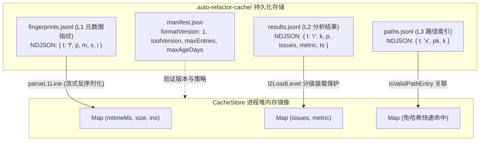
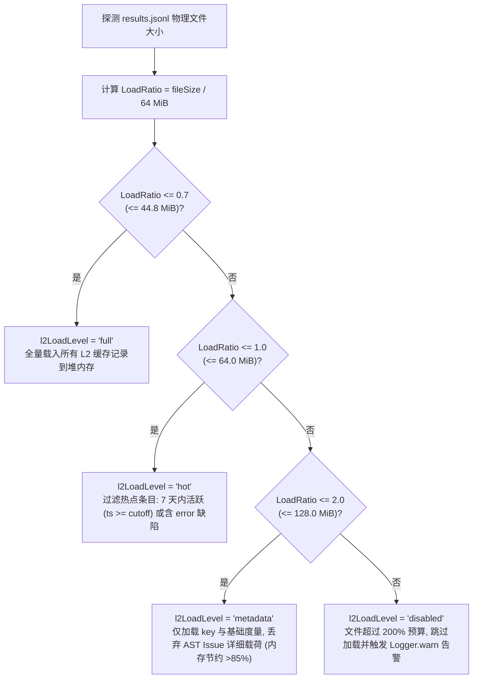
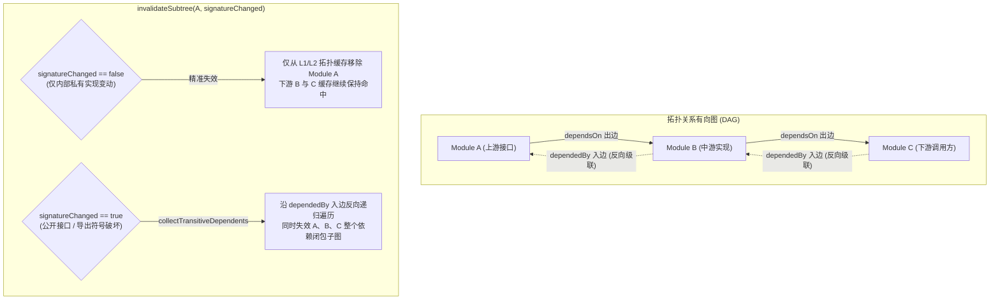
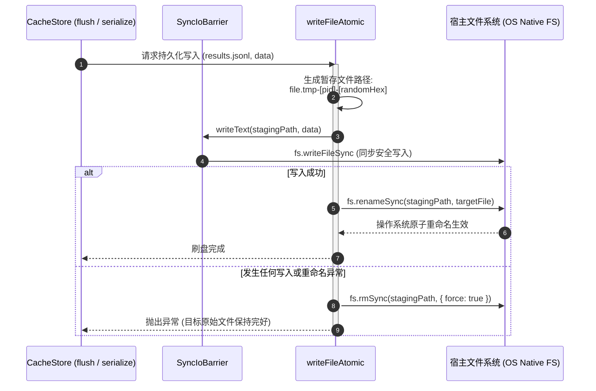

# 02. 三级增量缓存与拓扑失效体系

> **所属层级**：L1 核心架构与原生内核 (`docs/01-architecture/`)  
> **对应代码真源**：[`src/core/cache.ts`](file:///c:/CODE_game-development/vscode-extensions/auto-refactor/src/core/cache.ts)、[`src/core/cache-key.ts`](file:///c:/CODE_game-development/vscode-extensions/auto-refactor/src/core/cache-key.ts)、[`src/core/cache-persistence.ts`](file:///c:/CODE_game-development/vscode-extensions/auto-refactor/src/core/cache-persistence.ts)、[`src/core/scheduler/topology-cache-manager.ts`](file:///c:/CODE_game-development/vscode-extensions/auto-refactor/src/core/scheduler/topology-cache-manager.ts)、[`src/core/reporting/reportFinalizer.ts`](file:///c:/CODE_game-development/vscode-extensions/auto-refactor/src/core/reporting/reportFinalizer.ts)

---

## 1. 真实三级缓存物理存储布局与结构

为了在超大代码库上实现数十毫秒级别的增量复审与暖扫描，`auto-refactor` 在持久化目录（默认 `<projectRoot>/.auto-refactor-cache/`）中建立了严密隔离的物理分层存储体系：

```
.auto-refactor-cache/
├── manifest.json       # 缓存元数据、格式版本与容量策略
├── fingerprints.jsonl  # L1 物理元数据指纹层 (免读文件内容极速探活)
├── results.jsonl       # L2 扫描分析结果层 (单文件 Issue 与度量记录)
└── paths.jsonl         # L3 路径正向索引层 (免 SHA-256 快速命中映射)
```



### 1.1 `manifest.json`：环境签名与容量策略

`manifest.json` 是整个缓存目录的物理准入锚点，其数据结构严格受控：
```json
{
  "formatVersion": 1,
  "toolVersion": "0.4.0",
  "createdAt": "2026-10-10T02:00:00.000Z",
  "maxEntries": 100000,
  "maxAgeDays": 30
}
```
当系统检测到 `formatVersion !== CACHE_FORMAT_VERSION`（当前为 `1`）或缺少关键数字字段时，触发 `rebuildManifest()`，清空旧缓存并重建，杜绝跨版本数据结构破坏。

### 1.2 `fingerprints.jsonl` (L1 物理元数据指纹层)

- **物理格式**：换行符分隔的 NDJSON，行标记为 `t: 'f'`：
  ```json
  {"t":"f","p":"src/core/analyzer.ts","m":1775782400000,"s":26204,"i":1048576}
  ```
- **核心价值**：记录文件的最后修改时间戳（`m: mtimeMs`）、物理字节大小（`s: size`）与操作系统 inode 编号（`i: ino`）。
- **极速探活**：在执行扫描前，仅需调用一次操作系统底层的 `fs.statSync(filePath)`；若指标与 L1 记录完全匹配，即可确认文件内容未发生任何变动，**完全豁免读取文件原始文本与计算 SHA-256 哈希的 CPU / 磁盘 I/O 成本**。

### 1.3 `results.jsonl` (L2 扫描分析结果层)

- **物理格式**：NDJSON 编码，行标记为 `t: 'r'`：
  ```json
  {"t":"r","k":"v1:a1b2c3...:d4e5f6...","p":"src/core/analyzer.ts","issues":[],"metric":{"lines":575},"ts":1775782400100}
  ```
- **存储载荷**：绑定由配置指纹与内容哈希复合计算出的 `cacheKey`（`k`）、规范化相对路径（`p`）、已发现的全部代码违规缺陷列表（`issues`）、单文件聚合度量指标（`metric`）以及写入时间戳（`ts`）。

### 1.4 `paths.jsonl` (L3 路径正向索引层)

- **物理格式**：NDJSON 编码，行标记为 `t: 'x'`：
  ```json
  {"t":"x","pk":"src/core/analyzer.ts","k":"v1:a1b2c3...:d4e5f6..."}
  ```
- **设计初衷**：在不需要反复重新计算原始文件内容 SHA-256 的情况下，通过规范化文件路径（`pk`）瞬间定位历史匹配的最新 L2 缓存键（`k`），使得在超大仓库增量扫描中实现接近 $O(1)$ 的内存键值探查。

---

## 2. 四级动态装载分级保护 (`l2LoadLevel`)

大型工业工程在持续集成或长时间演进中，`results.jsonl` 文件大小可能累积增长到数十兆乃至上百兆。若守护进程或 CLI 在启动时机械式执行全量内存反序列化，极易导致 Node.js 堆内存瞬时暴涨，甚至引发 OOM。

在 [`src/core/cache.ts`](file:///c:/CODE_game-development/vscode-extensions/auto-refactor/src/core/cache.ts) 的 `loadResults()` 阶段，系统引入了以基准装载预算（`maxL2LoadBytes`，默认 64 MiB）为参照的四级动态装载保护机制：

$$\text{LoadRatio} = \frac{\operatorname{Stat}(\text{results.jsonl}).\text{size}}{\text{maxL2LoadBytes}}$$



| 装载级别 (`l2LoadLevel`) | 触发比率条件 | 内存驻留策略与处理动作 | 适用场景与安全目标 |
| :--- | :---: | :--- | :--- |
| **`full`** | $\text{Ratio} \le 0.7$ | 调用 `loadResultsFull()`，无差别将每一行的 Issue 数组与 Metric 反序列化进 `Map` | 正常中小型工程，全速秒级冷启动 |
| **`hot`** | $0.7 < \text{Ratio} \le 1.0$ | 调用 `loadResultsFiltered()`，根据 `isHotEntry` 判定：仅装载时间戳在 7 天内（`ts >= Date.now() - 7d`）或包含 `severity === 'error'` 的关键记录 | 活跃重构期大型项目，剔除冷门稳定文件 |
| **`metadata`** | $1.0 < \text{Ratio} \le 2.0$ | 调用 `loadResultsMetadataOnly()`，仅在内存记录键值索引映射与文件哈希，不装载庞大的 Issue AST 结构 | 巨型单体仓库，内存受限容器环境 |
| **`disabled`** | $\text{Ratio} > 2.0$ | 跳过文件解析，内存保持空缓存状态，通过 `Logger.warn` 打印警告，强制降级为按需重新分析 | 防止物理过载导致进程 OOM 崩溃 |

---

## 3. 复合缓存键推导公理与 `FingerprintPayload`

缓存有效性的最高刚性公理是：**绝不返回陈旧或受污染的错误分析结果**。任何可能影响代码审查产出的环境、规则、参数或实现变化，都必须在数学上导致缓存键完全不匹配。

### 3.1 复合缓存键构成公式

位于 [`src/core/cache-key.ts`](file:///c:/CODE_game-development/vscode-extensions/auto-refactor/src/core/cache-key.ts) 的 L2 缓存键遵循三段式规范结构：

$$\text{L2Key} = \texttt{"v1:"} + \text{fpHash} + \texttt{":"} + \text{contentHash}$$

1. **`contentHash`**：直接针对被分析文件的**原始物理字节 Buffer** 计算 SHA-256（`sha256Hex(fileRawBytes)`），避免因 UTF-8 / UTF-16 编码差异引起哈希漂移。
2. **`fpHash`**：对经过严格字典序排列、剔除所有多余空白的规范化指纹载荷（`FingerprintPayload`）计算 SHA-256：
   $$\text{fpHash} = \operatorname{sha256Hex}\big(\operatorname{canonicalJson}(\text{FingerprintPayload})\big)$$

### 3.2 `FingerprintPayload` 十大构成因子

```typescript
export interface FingerprintPayload {
  formatVersion: number;                    // 1. 缓存格式版本 (当前为 1)
  toolVersion: string;                      // 2. auto-refactor 工具版本号
  nodeMajor: number;                        // 3. Node.js 运行时主版本号 (如 20)
  adapterId: string;                        // 4. 解析器类型 ('typescript' | 'oxc' | 'rust')
  adapterVersions: Record<string, number>;  // 5. 各语言适配器内部版本字典
  projection: {                             // 6. AST 投影与快路径策略
    fastPath: boolean;
    legacyCount: number;
    policyHash: string;
  };
  analyzers: {                              // 7. 启用的分析器有序清单
    name: string;
    version: number;
    modulePath: string;
    optionsHash: string;
  }[];
  thresholds: Record<string, any>;          // 8. 全局复杂度与度量阈值字典
  customHash: string | null;                // 9. 自定义插件源码 SHA-256 (cacheCustom)
  fileExt: string;                          // 10. 文件扩展名 (如 '.ts', '.rs')
  unsupportedLanguage: 'error' | 'warning' | 'off'; // 守卫等级
}
```

### 3.3 零命令隐式失效与后处理解耦公理

- **零命令自洁**：由于任何分析因子的改变都会直接推导出全新的 `fpHash`，旧配置下的缓存键将永久失去索引入口，并在达到 `maxAgeDays` 后被后台 LRU 清理线程安全驱逐，**不需要任何手动执行 `cache clear` 命令**。
- **扫描后处理与缓存解耦**：
  - 单文件缓存（`results.jsonl`）**仅**保存无上下文依赖的单文件静态分析 Issue；
  - 跨文件循环依赖分析（`runCyclePass`）、基线棘轮比对（`baseline.json`）、Suppressions 过滤以及十维质量总分汇总统一在 [`src/core/reporting/reportFinalizer.ts`](file:///c:/CODE_game-development/vscode-extensions/auto-refactor/src/core/reporting/reportFinalizer.ts) 对合并后的全集执行；
  - 该设计通过 `npm run validate-postscan-parity` 门禁保障，确保命中缓存的 `ScanReport` 与全新冷扫描**逐字节绝对全等**。

---

## 4. 高阶拓扑缓存管理器 (`TopologyCacheManager`)

单纯的文件级哈希缓存无法处理跨模块依赖的级联影响。[`src/core/scheduler/topology-cache-manager.ts`](file:///c:/CODE_game-development/vscode-extensions/auto-refactor/src/core/scheduler/topology-cache-manager.ts) 构建了一套独立的、具备有向依赖 DAG 反向扩散能力的高阶拓扑缓存层：



### 4.1 双层拓扑 LRU 容器与双向边拓扑

- **双层容量管理**：维护 L1 堆内存热区（默认容量 1000）与 L2 结构化拓扑缓存（默认容量 4000），访问热点按 LRU 顺序刷新提升。
- **双向图结构**：
  - `dependsOn: Map<string, Set<string>>`：记录当前模块依赖的所有外部目标（正向依赖出边）；
  - `dependedBy: Map<string, Set<string>>`：记录所有依赖于当前模块的外部调用方（反向依赖入边）。

### 4.2 基于 `dependedBy` 的级联反向依赖失效

当文件 `changedFile` 发生变动时，调用 `invalidateSubtree(changedFile, signatureChanged)`：
1. **私有逻辑修改 (`signatureChanged === false`)**：
   如果仅修改了函数内部实现而未改变导出符号、公共类型签名或接口，系统**仅从拓扑缓存中删除该文件本身**，保留其所有下游调用模块的缓存有效性。
2. **公开签名破损 (`signatureChanged === true`)**：
   如果修改了导出函数签名、类契约或接口类型，系统触发 `collectTransitiveDependents` 算法，顺着 `dependedBy` 入边反向递归遍历所有直接和间接依赖该模块的下游闭包集合，将整棵受影响子树全部从 L1 和 L2 拓扑缓存中剔除，强制其在下轮扫描中重新推导语义，**从底层机制上杜绝由于上游签名修改引发的下游静默漏报**。

---

## 5. 原子刷盘机制与 I/O 隔离屏障

文件系统写入异常（如磁盘满、进程崩溃、断电）若损坏缓存文件，会导致后续扫描失败。[`src/core/cache-persistence.ts`](file:///c:/CODE_game-development/vscode-extensions/auto-refactor/src/core/cache-persistence.ts) 构建了严密的物理隔离屏障：



### 5.1 同步 I/O 隔离屏障 (`SyncIoBarrier`)

通过 `SyncIoBarrier` 集中封装 `readText` 与 `writeText` 原语，对所有底层阻塞式文件系统调用建立单一访问点，便于集中实施安全拦截、路径沙箱检查与单元测试 Mock。

### 5.2 原子重命名刷盘 (`writeFileAtomic`)

1. **唯一暂存路径**：在目标文件同目录下生成带有当前进程 PID 与高随机性后缀的临时文件：
   `${file}.tmp-${process.pid}-${Math.random().toString(36).slice(2, 8)}`
2. **完整数据暂存**：将全量序列化内容一次性写入临时文件并同步落盘。
3. **原生原子重命名**：调用操作系统的 `fs.renameSync(stagingPath, file)`。在 POSIX 与 NTFS 文件系统上，重命名属于原子操作，能保证目标文件**要么是上一版本的完整内容，要么是最新版本的完整内容**，物理上绝不可能出现 0 字节文件或写入半截的损坏文件。
4. **异常自愈清理**：任何环节发生 I/O 异常，`catch` 块立即调用 `cleanupStagingFile` 强制清理临时文件，杜绝遗留无用临时垃圾。

---

## 6. 关联文档导航

- [01. 系统六层架构全景与核心数据流](./01-system-overview.md)
- [03. 跨平台守护进程与统一 IPC 协议规范](./03-daemon-and-ipc.md)
- [04. 分形 Git 工作树与多级门禁回滚规范](./04-praxis-git-fractal-and-gating-spec.md)
