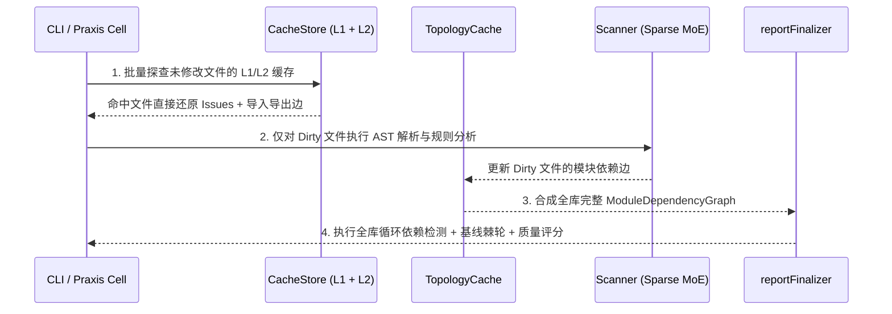

# 02. 两级增量缓存与配置指纹拓扑

> **所属层级**：L1 核心架构与原生内核 (`docs/01-architecture/`)  
> **对应代码真源**：`src/core/cache.ts`、`src/core/cache-key.ts`、`src/core/dependency-graph.ts`、`src/core/reporting/reportFinalizer.ts`

---

## 1. 两级缓存架构 (L1 Memory + L2 Disk)

为了在百毫秒内完成大型仓库的重复扫描与 CI 增量门禁验证，`auto-refactor` 构建了无损两级缓存体系（`CacheStore`，位于 `src/core/cache.ts`）：

| 缓存层级 | 驻留介质 | 索引键结构 | 命中延迟 | 生命周期与淘汰机制 |
| :--- | :--- | :--- | :---: | :--- |
| **L1 进程内热缓存** | Daemon / Node 进程堆内存 (`Map`) | `filePath` + `contentHash` + `configFingerprint` | `< 0.05 ms` | 随守护进程常驻；受 `LoadGovernor` RSS 水位控制执行 LRU 淘汰 |
| **L2 持久化磁盘缓存** | `<root>/.auto-refactor-cache/` 分片二进制/JSON | 内容哈希分桶 + 引擎版本与规则配置签名 | `< 1.2 ms` | 跨进程、跨 CI 任务持久化；配置或引擎版本变更时自动按指纹隔离失效 |
| **拓扑边缓存 (`TopologyCache`)** | `src/core/dependency-graph.ts` | 模块导出符号表与 `import/require` 依赖边快照 | `< 0.3 ms` | 单文件修改时仅更新该文件的出边，无需重解未变更模块的导入图 |

---

## 2. 复合缓存键与防污染指纹 (`src/core/cache-key.ts`)

任何缓存机制的首要前提是**绝不返回过期的错误结果**。`cache-key.ts` 通过多层哈希派生确保只要影响分析结果的任一因子变动，缓存键立即失配重算：

$$\text{CacheKey} = \operatorname{FNV1a / SHA256}\Big(\text{TOOL\_VERSION} \;\|\; \text{FileContentHash} \;\|\; \text{AnalyzerSetHash} \;\|\; \text{ThresholdsHash} \;\|\; \text{SemanticRole}\Big)$$

1. **工具与规则集版本绑定 (`TOOL_VERSION`)**：升级 `auto-refactor` 或修改内置规则逻辑后，旧缓存自动旁路。
2. **自定义插件安全策略 (`cacheCustom`)**：默认情况下，若用户注入了外部自定义分析器插件（其函数闭包可能依赖外部可变状态），`L2` 磁盘缓存会自动对该插件禁用；仅当显式开启 `cacheCustom: true` 时，系统才会对插件模块源码计算内容哈希并纳入 `CacheKey`。
3. **后处理阶段（Post-Scan Finalization）与缓存解耦**：
   - 文件级缓存（`L1/L2`）仅存储**单文件原始分析发现**与**导出/导入符号摘要**；
   - 跨文件循环依赖检查（`runCyclePass`）、抑制规则过滤（`suppressions`）、基线棘轮比对（`baseline.json`）以及十维质量总分汇总（`finalizeReport`）统一在 `src/core/reporting/reportFinalizer.ts` 中对缓存合并后的全集执行。
   - 该设计由 `npm run validate-postscan-parity` 门禁严格验证，确保开启缓存后的 `ScanReport` 与全新冷扫描 **100% 逐字节相等**。

---

## 3. 非对称增量探针 (`scanAsymmetric`)

针对超大仓库中的局部热修改，`src/core/intelligence/apiQueries.ts` 提供了 `scanAsymmetric` 非对称扫描通道：

- **单次冷跑零开销保障（Single-Run Zero Cost）**：当 `cache: false` 且 `daemon: 'off'`（默认配置）时，引擎不初始化任何磁盘缓存目录、不加载 `src/daemon/*` 网络通信模块，保持纯内存流水线的轻量运行。

---

## 4. 关联文档导航

- [01. 系统六层架构全景与核心数据流](./01-system-overview.md)
- [03. 跨平台守护进程与 NDJSON IPC 协议](./03-daemon-and-ipc.md)
