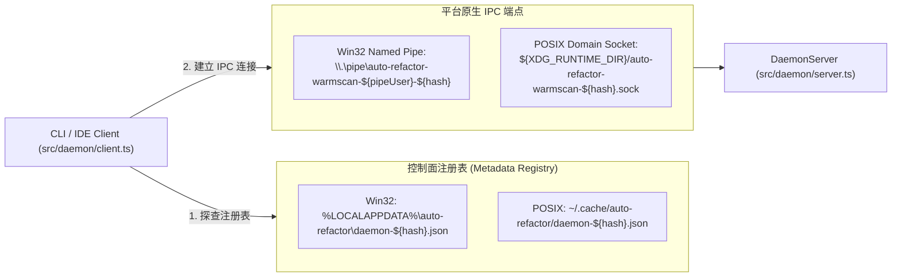
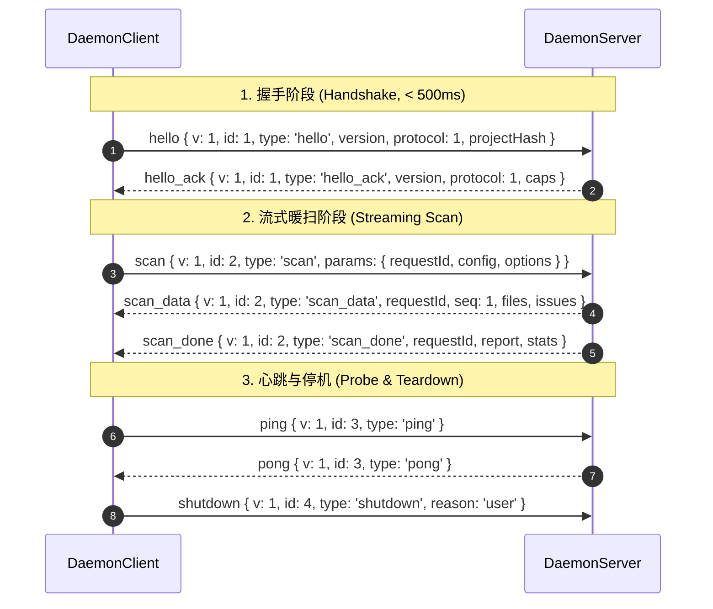
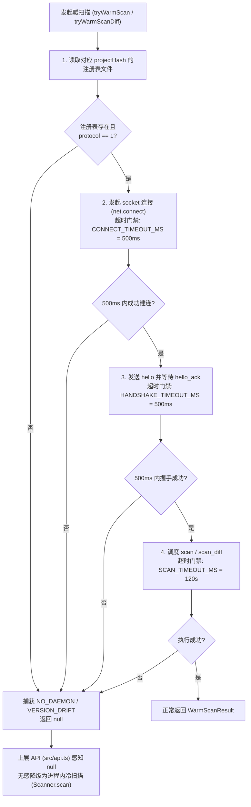

# 03. 跨平台守护进程与统一 IPC 协议规范

> **所属层级**：L1 核心架构与原生内核 (`docs/01-architecture/`)  
> **对应代码真源**：[`src/daemon/server.ts`](file:///c:/CODE_game-development/vscode-extensions/auto-refactor/src/daemon/server.ts)、[`src/daemon/client.ts`](file:///c:/CODE_game-development/vscode-extensions/auto-refactor/src/daemon/client.ts)、[`src/daemon/protocol.ts`](file:///c:/CODE_game-development/vscode-extensions/auto-refactor/src/daemon/protocol.ts)、[`src/daemon/registry.ts`](file:///c:/CODE_game-development/vscode-extensions/auto-refactor/src/daemon/registry.ts)、[`src/daemon/scanHandler.ts`](file:///c:/CODE_game-development/vscode-extensions/auto-refactor/src/daemon/scanHandler.ts)

---

## 1. 守护进程架构与跨平台物理端点规范

在 IDE 保存即审（Save-on-Audit）与 Agent 高频微编辑场景下，Node.js 运行时启动、V8 JIT 预热以及 AST Worker 线程池的初始化开销常常超过分析本身耗时的 60% 以上。`auto-refactor` 设计了常驻后台守护进程（Daemon），将 `WorkerPool`、`L1` 内存指纹/结果缓存以及拓扑图持久保活。

系统严格贯彻**单项目单守护进程实例（One-Daemon-Per-Project）**原则，以工作区绝对路径的 SHA-256 截断前 24 字符哈希（`projectHashFor(root)`）作为唯一租户隔离标识。



### 1.1 控制面注册表物理路径规范 (`registry.ts`)

注册表文件仅持久化控制面握手凭证，**不存储任何业务扫描数据**（业务缓存统一留存各项目根目录 `.auto-refactor-cache` 下），其跨平台物理路径定义如下：

- **Windows 平台**：
  `%LOCALAPPDATA%\auto-refactor\daemon-${projectHash}.json`  
  （若 `LOCALAPPDATA` 缺失，回退至 `path.join(os.homedir(), 'AppData', 'Local', 'auto-refactor')`）
- **POSIX 平台 (Linux / macOS)**：
  `~/.cache/auto-refactor/daemon-${projectHash}.json`  
  （若显式配置环境变量 `AUTO_REFACTOR_REGISTRY_DIR`，则优先采用该路径）
- **注册表数据模型 (`RegistryInfo`)**：
  ```typescript
  export interface RegistryInfo {
    pid: number;         // 守护进程操作系统进程 ID
    pipe: string;        // 平台原生 IPC 监听端点地址
    startedAt: string;   // ISO-8601 启动时间戳
    version: string;     // 软件版本号 ('0.1.0')
    protocol: number;    // 通信协议版本代数 (当前为 1)
    logFile: string;     // 守护进程日志文件绝对路径
  }
  ```

### 1.2 跨平台 IPC 端点命名与用户脱敏规范

- **Windows 命名管道 (Named Pipe)**：
  `\\.\pipe\auto-refactor-warmscan-${pipeUser()}-${projectHash}`
  - **`pipeUser()` 脱敏公理**：提取 `process.env.USERNAME`、`process.env.USER` 或 `os.userInfo().username`，使用正则 `/[^A-Za-z0-9._-]/g` 将所有非法字符原位替换为 `_`，并强制截断至前 32 字符（`PIPE_USER_MAX_LENGTH = 32`），防止含有空格或特殊符号的用户名导致 Windows Named Pipe 创建崩溃或权限混乱。
- **POSIX Unix Domain Socket (UDS)**：
  `path.join(process.env.XDG_RUNTIME_DIR || os.tmpdir(), `auto-refactor-warmscan-${projectHash}.sock`)`
  - 启动监听前强制执行 `fs.rmSync(this.pipe, { force: true })`，安全解除前序异常崩溃可能遗留的孤儿套接字文件。

---

## 2. 规范化 NDJSON IPC 通信协议 (`src/daemon/protocol.ts`)

客户端与服务端之间采用基于换行符分隔的 **NDJSON（Newline-Delimited JSON）** 流式协议。通信协议**全面废除任何模糊的 `op` 操作符字段**，统一约束为标准化的 `{ v: 1, id: number, type: string, ... }` 帧信封结构：

```typescript
export interface FrameEnvelope {
  v: number;      // 协议版本 (PROTOCOL_VERSION = 1)
  id: number;     // 请求关联序号，自增整数
  type: string;   // 帧消息判别类型
}
```



### 2.1 核心帧类型清单与数据载荷

| 帧类型 (`type`) | 传输方向 | 核心载荷字段定义 | 协议语义与行为说明 |
| :--- | :---: | :--- | :--- |
| **`hello`** | Client $\rightarrow$ Server | `{ version, protocol, projectHash }` | 建立连接后的首个握手帧，通告客户端软件版本与目标工作区哈希 |
| **`hello_ack`** | Server $\rightarrow$ Client | `{ version, protocol, caps: { cache, stream, maxWorkers: 8, diff } }` | 协商确认握手，声明服务端支持缓存复用、流式响应与 Diff 扫描能力 |
| **`scan`** | Client $\rightarrow$ Server | `{ params: { requestId, config, options: { cache, cacheDir, cacheCustom, workers, parser } } }` | 触发全量/增量暖扫描；客户端预先完成配置解析以消除客户端与服务端配置漂移 |
| **`scan_diff`** | Client $\rightarrow$ Server | `{ params: { requestId, config, diffs: DiffInput[], options: { cache, verifyDiskContent, delta } } }` | 触发内存补丁差异扫描，直接传入修改前后的代码文本，免除物理写盘 |
| **`scan_data`** | Server $\rightarrow$ Client | `{ requestId, seq, files: string[], issues: unknown[], metrics: unknown[] }` | 流式输出分批次扫描成果，支持长任务进度实时回传 |
| **`scan_done`** | Server $\rightarrow$ Client | `{ requestId, report: ScanReport, stats: WarmStats }` | 终态成功帧，返回完整聚合并经过后处理的扫描报告与暖缓存命中统计 |
| **`error`** | Server $\rightarrow$ Client | `{ requestId?, code: string, message: string, detail? }` | 终态失败帧，声明错误类型码（如 `PROTOCOL_PARSE`、`SCAN_FAILED`） |
| **`ping` / `pong`** | 双向探活 | `{}` | 双向轻量探活心跳，验证套接字连通性并刷新空闲自毁倒计时 |
| **`shutdown`** | Client $\rightarrow$ Server | `{ reason?: string }` | 优雅退出指令；服务端将立即拒绝新请求，释放 Worker 线程并清理注册表 |

---

## 3. 客户端连接、握手、超时控制与透明无感冷退回

在 [`src/daemon/client.ts`](file:///c:/CODE_game-development/vscode-extensions/auto-refactor/src/daemon/client.ts) 中，客户端对外承诺**绝对零故障阻断**。暖扫描在体系中被定位为「纯加速器」，任何守护进程异常均不可破坏主线业务的正确性：



### 3.1 阶梯式超时防护基线

- **连接超时**：`CONNECT_TIMEOUT_MS = 500`（500 毫秒）；
- **握手超时**：`HANDSHAKE_TIMEOUT_MS = 500`（500 毫秒）；
- **探活超时**：`DEFAULT_PING_TIMEOUT_MS = 1000`（1 秒）；
- **扫描全局超时**：`SCAN_TIMEOUT_MS = 120_000`（120 秒）。

### 3.2 零感冷退回策略 (Fail-Safe Cold Fallback)

在 `tryWarmScan` 与 `tryWarmScanDiff` 包装函数中：
1. 若遇到平台管道权限拒绝（`EPERM` / `EACCES`）、套接字不存在（`ENOENT`）、连接超时（`CONNECT_TIMEOUT`）、协议版本不匹配（`VERSION_DRIFT`）或中途异常断开（`DAEMON_DISCONNECT`）；
2. 异常被内部 `try/catch` 完整捕获，立即调用 `client.close()` 安全销毁套接字句柄并返回 `null`；
3. 上层调用者（如 `src/api.ts` 的 `scanWarm`）检测到 `null` 时，**静默无感回退**至当前进程内执行 `Scanner.scan()`；
4. 输出的扫描报告与暖扫结论保持逐字节一致，调用者不会感知到底层发生了重试与降级。

---

## 4. 服务端任务追踪与 AbortController 生命周期

在并发扫描或客户端被用户强行按 `Ctrl+C` 中断时，必须防止后台 Worker 线程无休止空转。[`src/daemon/server.ts`](file:///c:/CODE_game-development/vscode-extensions/auto-refactor/src/daemon/server.ts) 建立了严格的任务生命周期追踪：

```typescript
export interface PendingScan {
  requestId: string;
  id: number;
  kind: 'scan' | 'scan_diff';
  socket?: net.Socket;
  startedAt: number;
  abortController: AbortController; // 绑定中断控制器
}
```

### 4.1 客户端断开主动熔断机制

1. 服务端维护正在执行的任务字典：`private pending: Map<string, PendingScan> = new Map()`。
2. 每个新到来的 `scan` 或 `scan_diff` 请求都会实例化专属的 `AbortController`，并将信号挂载于处理流中。
3. 监听套接字连接事件：
   ```typescript
   socket.on('close', () => this.abortSocketPending(socket));
   socket.on('error', () => this.abortSocketPending(socket));
   ```
4. 一旦客户端主动掐断连接或发生网络中断，`abortSocketPending` 立即检索该套接字关联的所有未完成任务，调用 `scan.abortController.abort()`。
5. 后台 AST 解析调度器与 Worker 线程池接收到中止信号后立即中断当前批次处理，将任务从 `pending` 映射表中清除，**杜绝孤儿扫描任务持续侵占 CPU 与内存**。

---

## 5. 心跳探活、空闲自毁与内存健康

守护进程作为后台支撑进程，严禁成为失控的僵尸进程或无底线驻留内存。

### 5.1 十分钟空闲自毁机制 (Idle Auto-Teardown)

- **空闲超时阈值**：`IDLE_TIMEOUT_MINUTES = 10`（`600,000 ms`）。
- **`unref` 定时器**：空闲计时器在创建时显式调用 `this.idleTimer.unref()`，保证定时器本身不会强行阻碍 Node.js 事件循环的自然退出。
- **动态活跃重置**：
  - 客户端每次建立连接；
  - 每次收到 `hello`、`ping`、`scan`、`scan_diff` 等任意协议帧；
  - 任务执行结束与连接断开；
  均会触发 `this.touchIdle()`，将 10 分钟倒计时重置回起点。
- **自毁动作**：若连续 10 分钟内未接收到任何新的 IPC 交互，自动调用 `this.shutdown('idle-timeout')`。

### 5.2 平滑停机清理流 (Graceful Shutdown)

在触发空闲自毁、捕获系统退出信号（`SIGINT`/`SIGTERM`）或接收到 `shutdown` 帧时，服务端按固定拓扑逆序释放资源：
1. 将 `shuttingDown` 标志置为 `true`，拒绝后续一切新的连接与扫描请求；
2. 中止当前所有活跃的 `PendingScan` 任务；
3. 将脏 `L1/L2` 缓存原子刷入磁盘；
4. 销毁并断开 `WorkerPool` 中运行的所有后台 Worker 线程；
5. 调用 `clearRegistry(projectHash)` 物理删除控制面注册表 JSON 文件；
6. 关闭套接字监听器（POSIX 下清理 sock 文件），以 Exit Code 0 退出进程。

---

## 6. 关联文档导航

- [01. 系统六层架构全景与核心数据流](./01-system-overview.md)
- [02. 三级增量缓存与拓扑失效体系](./02-pipeline-and-caching.md)
- [04. 分形 Git 工作树与多级门禁回滚规范](./04-praxis-git-fractal-and-gating-spec.md)
