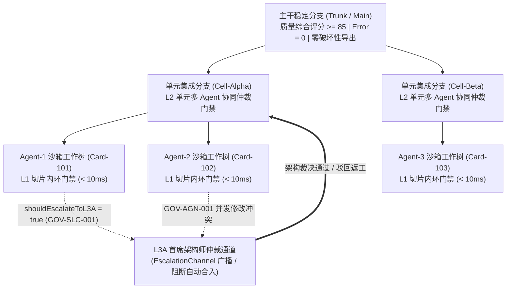
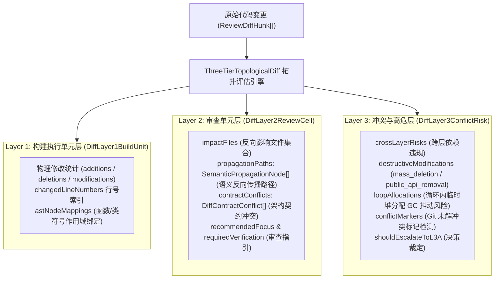
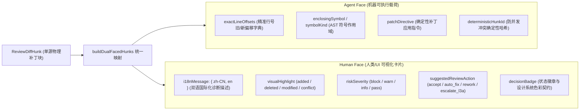
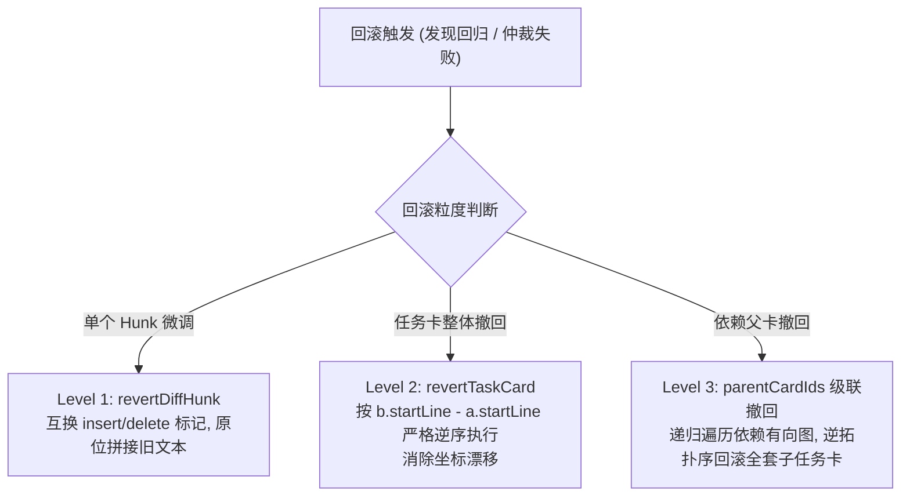
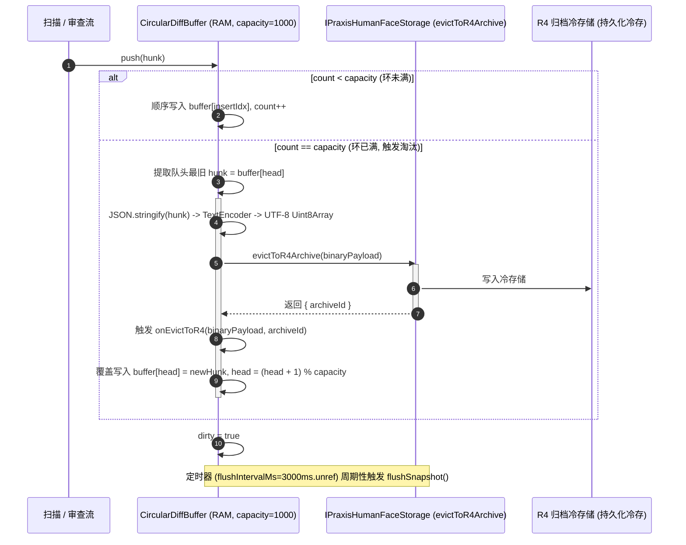

# 04. 分形 Git 工作树与多级门禁回滚规范

> **所属层级**：L1 核心架构与原生内核 (`docs/01-architecture/`)  
> **对应代码真源**：[`src/core/rollback.ts`](file:///c:/CODE_game-development/vscode-extensions/auto-refactor/src/core/rollback.ts)、[`src/core/praxis/diff-topology.ts`](file:///c:/CODE_game-development/vscode-extensions/auto-refactor/src/core/praxis/diff-topology.ts)、[`src/core/praxis/diff-topology-types.ts`](file:///c:/CODE_game-development/vscode-extensions/auto-refactor/src/core/praxis/diff-topology-types.ts)、[`src/core/praxis/diff-dual-faced.ts`](file:///c:/CODE_game-development/vscode-extensions/auto-refactor/src/core/praxis/diff-dual-faced.ts)、[`src/core/praxis/contracts.ts`](file:///c:/CODE_game-development/vscode-extensions/auto-refactor/src/core/praxis/contracts.ts)、[`src/core/pipeline/escalationChannel.ts`](file:///c:/CODE_game-development/vscode-extensions/auto-refactor/src/core/pipeline/escalationChannel.ts)、[`src/core/ring-buffer.ts`](file:///c:/CODE_game-development/vscode-extensions/auto-refactor/src/core/ring-buffer.ts)

---

## 1. 分形 Git 工作树拓扑与三级递进门禁体系

在多智能体（Multi-Agent）高度并发的研发作业场景中，代码协作不再是一条简单的单向提交流，而是呈现为**自顶向下分形展开的分形工作树拓扑（Fractal Git Worktree Topology）**：



### 1.1 三级递进门禁规范 (L1 / L2 / L3A)

| 门禁层级 | 触发边界与执行服务 | 目标耗时 | 判定准则与自动干预动作 |
| :--- | :--- | :---: | :--- |
| **L1 切片内环门禁** | Agent 在 `TaskCard` 沙箱内单次保存或小步提交时<br/>`PraxisSliceAuditService.auditSlice` | `< 10ms` | 抽取局部 AST 语法包围盒进行极速扫描；若出现语法解析破损、未捕获的高危安全漏洞或 `error` 级缺陷，立即阻断保存并由 `AgentConstraintGenerator` 原地注入 CAPP 提示词要求 Agent 自我修正 |
| **L2 单元仲裁门禁** | 多个 `TaskCard` 补丁申请合入功能单元 `Cell` 分支时<br/>`PraxisMultiAgentGovernanceService` | `50 ~ 200ms` | 检测不同智能体并发修改的语义重叠、重复造轮子与跨 Agent 循环调用（`GOV-AGN-001`）；未通过者标为 `rework_needed` 并打回对应的任务卡沙箱 |
| **L3A 架构升级门禁** | 跨越领域模块边界、修改核心公共导出签名或单 Hunk 膨胀超限时<br/>[`src/core/pipeline/escalationChannel.ts`](file:///c:/CODE_game-development/vscode-extensions/auto-refactor/src/core/pipeline/escalationChannel.ts) | 异步实时 | 任何触发 `GOV-SLC-001`（切片边界破坏）、`CIRCULAR_DEPENDENCY` 或 `ARCHITECTURE_BREACH` 时，广播升级事件并将 `verdict.shouldEscalateToL3A` 设为 `true`，立即挂起分支自动合入，交由人类架构师或高阶决策 Agent 终审 |

---

## 2. 三层拓扑 Diff 架构 (`ThreeTierTopologicalDiff`)

传统 Git Diff 仅局限于字符行的物理比对，缺乏语法作用域与架构依赖感知。[`src/core/praxis/diff-topology.ts`](file:///c:/CODE_game-development/vscode-extensions/auto-refactor/src/core/praxis/diff-topology.ts) 实现了从单一切片到全图风险的三层渐进拓扑：



### 2.1 Layer 1：构建执行单元层 (`DiffLayer1BuildUnit`)

- **关注焦点**：代码的物理变更形态与最小 AST 语法结构映射。
- **关键模型**：
  - `totalChangedLines`、`additions`、`deletions`、`modifications`；
  - `changedLineNumbers: number[]`：变更影响的准确行号集；
  - `astNodeMappings: DiffAstNodeMapping[]`：将具体的行号增删绑定到对应的 AST 符号定义（`symbolName`、`symbolKind`、`startLine`、`endLine`、`hunkIds`），供执行智能体高精度打补丁。

### 2.2 Layer 2：审查单元层 (`DiffLayer2ReviewCell`)

- **关注焦点**：跨文件调用冲击半径与语义拓扑传播路径。
- **关键模型**：
  - `impactFiles: string[]`：通过 `SemanticGraph` 逆向推导出的直接与间接受波及文件闭包；
  - `propagationPaths: SemanticPropagationNode[]`：沿逆向调用链记录的传播跳数（`distance`）与边类型（`edgeKind`）；
  - `contractConflicts: DiffContractConflict[]`：识别违反依赖注入规范或模块契约的冲突；
  - 导出 `recommendedFocus` 与 `requiredVerification` 列表，为审查员提供精准核对清单。

### 2.3 Layer 3：冲突与高危层 (`DiffLayer3ConflictRisk`)

- **关注焦点**：架构完整性、破坏性修改、垃圾回收（GC）性能隐患与合并冲突。
- **关键模型与检测判据**：
  1. **跨层依赖违规 (`crossLayerRisks`)**：识别核心领域模块逆向依赖展现层或驱动层（如 `core` 导入 `ui`）；
  2. **破坏性修改 (`destructiveModifications`)**：检测 `mass_deletion`（删除超 50 行且删增比 > 2.0）、`public_api_removal`（未经弃用流程直接剔除 `export` 公共符号）；
  3. **循环体内临时堆分配 (`loopAllocations`)**：通过正则与 AST 识别在 `for`、`while`、`map` 等高频循环体内进行 `new Array`、`new Object`、`Object.assign` 或闭包声明，防止引发严重的 V8 GC 停顿；
  4. **Git 合并冲突标记 (`conflictMarkers`)**：扫描残留的 `<<<<<<<`、`=======`、`>>>>>>>` 冲突标记；
  5. **仲裁输出**：若存在致命风险，将 `shouldEscalateToL3A` 置为 `true`，并输出详细的 `escalationReasons`。

---

## 3. 一体两面双载荷机制 (`DualFacedDiffHunk`)

同一个变更补丁在智能体与人类之间存在天然的认知屏障：机器需要极致精准的行号偏移与 AST 坐标，人类需要结构化的视觉分层、双语描述与操作指引。[`src/core/praxis/diff-dual-faced.ts`](file:///c:/CODE_game-development/vscode-extensions/auto-refactor/src/core/praxis/diff-dual-faced.ts) 实现了两面同构对称的统一载荷：

```typescript
export interface DualFacedDiffHunk {
  hunkId: string;
  agentFace: DiffAgentFace;      // 机器侧：高精度可执行指令视图
  humanFace: DiffHumanFace;      // 人类侧：UI 国际化双语诊断卡片视图
  rawHunk: ReviewDiffHunk;       // 物理原始 Diff Hunk
}
```



- **数据对称性保障**：Agent Face 与 Human Face 由单源 `ReviewDiffHunk` 派生，两者的决策结论（如 `riskSeverity` 与 `suggestedReviewAction`）在底层逻辑上保持 100% 互锁，杜绝「人眼看到的是 Warning，Agent 拿到的却是 Pass」的认知脱节。

---

## 4. 三级联动原子回滚引擎 (`PraxisRollbackEngine`)

当某个任务卡的代码合入功能单元分支后，若在后续门禁或动态监控中发现隐蔽缺陷，必须在不暴力重置分支历史的前提下执行外科手术式的精准回退。[`src/core/rollback.ts`](file:///c:/CODE_game-development/vscode-extensions/auto-refactor/src/core/rollback.ts) 提供了三级原子回滚引擎：



### 4.1 Level 1：Hunk 级原子反转 (`revertDiffHunk`)

- **运算原理**：
  1. 调用 `extractOldLines`，提取指定 `ReviewDiffHunk` 中所有 `type === 'delete'` 与 `type === 'context'` 的原始行；
  2. 根据 `hunk.newSpan.startLine` 与 `hunk.newSpan.lineCount` 校验当前文本对应的目标区间；
  3. 执行 `resultLines.splice(startLineIdx, newCount, ...oldLines)` 原位恢复原始行；
  4. 生成交换了 `+` 与 `-` 标记的反向 Unified Diff 补丁（`formatReversalPatch`）。
- **副作用隔离**：纯函数式计算，绝不直接原地污染传入的 `currentContent` 字符串，发生错误安全返回 `{ success: false, patch: '', error }`。

### 4.2 Level 2：TaskCard 级逆序撤回 (`revertTaskCard`)

当一张任务卡（`cardId`）跨越多个文件或同一文件内包含多个离散 Hunk 时，**严禁按文件从前向后应用补丁**！因为靠前 Hunk 的增删会改变后续所有行号的绝对物理偏移，导致后续 Hunk 定位失效（即**行号坐标漂移问题**）。

- **逆序执行防漂移核心公理**：
  在 `revertTaskCard` 中，同一文件的所有匹配 Hunk 必须按起始行号进行**严格降序排列（逆行号排序）**：
  ```typescript
  const sortedHunks = [...matchingHunks].sort(
    (a, b) => b.newSpan.startLine - a.newSpan.startLine
  );
  ```
  优先撤回靠后位置的修改块，后续行号的变动完全发生在靠前 Hunk 的下方，前序行号坐标保持绝对恒定，**100% 消除行号漂移**。
- **全回滚原子性**：若单文件在回滚中遇到任何异常，该文件整体回滚中止，`affectedFiles` 仅汇报完全成功还原的文件列表。

### 4.3 Level 3：依赖闭包级联撤回 (Cascading Rollback)

依据任务卡上下文的 `parentCardIds` 拓扑有向图，若基础底座卡 `Card-Base` 被撤回，引擎自动检索直接或间接依赖它的所有派生子卡集合 `{Card-Sub1, Card-Sub2}`，按依赖拓扑逆序逐卡调用回滚，并汇总归档所有关联的 `checkpointId`，保证工程依赖图在回退后依然保持合法。

---

## 5. 环形缓冲与 R4 冷存淘汰联动 (`CircularDiffBuffer`)

在长时间多轮次的代码审查与演化流中，内存中保留的 Diff 数据必须拥有严格的物理边界。[`src/core/ring-buffer.ts`](file:///c:/CODE_game-development/vscode-extensions/auto-refactor/src/core/ring-buffer.ts) 设计了内存常驻环形队列与 R4 归档的 Fail-Safe 联动体系：



### 5.1 内存零分配常驻窗口

- **容量基线**：默认容量为 1000（`DEFAULT_RING_CAPACITY = 1000`），保证常驻内存消耗恒定在 $O(1)$ 水平。
- **定时快照持久化**：内部启动一个 `3000ms`（`DEFAULT_FLUSH_INTERVAL_MS = 3000`）的定时器，检测到 `dirty` 标志后异步调用 `flushPeriodicSnapshot()`；定时器显式调用 `.unref()`，保证宿主 Node.js 进程可在无任务时正常退出。

### 5.2 R4 紧凑二进制归档与 Fail-Safe 容灾

- **紧凑编码**：当环形队列满并发生旧数据驱逐时，最旧的 `ReviewDiffHunk` 经 `JSON.stringify` 序列化后，使用 `TextEncoder` 转换为紧凑的 UTF-8 `Uint8Array` 二进制流。
- **SPI 归档交付**：调用存储契约接口 `storageAdapter.evictToR4Archive(binaryPayload)` 换取持久化的 `archiveId`，并记录在回滚审计日志中。
- **非阻塞 Fail-Safe 设计**：
  驱逐逻辑由专用 `try/catch` 完整包裹，支持同步返回与 Promise 异步返回；**归档过程中的任何序列化、网络或 SPI 异常均被静默吸收，绝不向外抛出**，确保存储层的任何瞬态故障绝对不会打断前台高优先级代码审查流水线的顺畅执行。

---

## 6. 关联文档导航

- [01. 系统六层架构全景与核心数据流](./01-system-overview.md)
- [02. 三级增量缓存与拓扑失效体系](./02-pipeline-and-caching.md)
- [03. 跨平台守护进程与统一 IPC 协议规范](./03-daemon-and-ipc.md)
- [05. Rust N-API 原生加速内核与双轨等价桥](./05-rust-native-operator-kernel.md)
