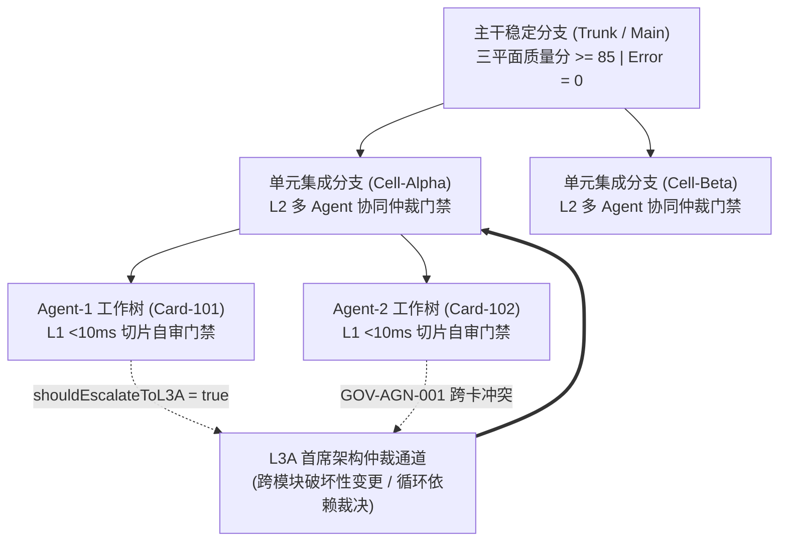

# 04. 分形 Git 工作树与多级门禁回滚规范

> **所属层级**：L1 核心架构与原生内核 (`docs/01-architecture/`)  
> **对应代码真源**：`src/core/rollback.ts`、`src/core/praxis/contracts.ts`、`src/core/praxis/diffGovernance.ts`、`src/core/ring-buffer.ts`

---

## 1. 分形 Git 工作树拓扑 (Fractal Git Worktree Topology)

在 Praxis 多智能体协作体系中，代码演进不再是单一线性分支，而是呈**分形树状拓扑（Fractal Branching）**：主干分支（`Trunk`）向下派生功能单元分支（`Cell Branch`），每个单元分支再向并发执行的智能体派生沙箱任务卡工作树（`TaskCard Worktree`）。

---

## 2. 三级递进门禁体系 (L1 / L2 / L3A Gating)

| 门禁级别 | 触发时机与作用边界 | 核心执行服务 | 阻断判据与自动处置动作 |
| :--- | :--- | :--- | :--- |
| **L1 切片内环门禁** | Agent 在 `TaskCard` 沙箱内每次局部编辑保存时 | `PraxisSliceAuditService.auditSlice` | 耗时 `< 10ms`；若出现局部语法破损或未处理的 `error` 级违规，立即通过 CAPP 提示词要求当前 Agent 原地修正 |
| **L2 单元合入仲裁门禁** | 多个 `TaskCard` 补丁申请合入 `Cell` 分支时 | `PraxisMultiAgentGovernanceService.reviewMultiAgentPatches` | 检测并发补丁冲突、重复开发重叠率与跨 Agent 循环依赖（`GOV-AGN-001`）；未通过者置为 `rework_needed` |
| **L3A 首席架构升级门禁** | 变更跨越模块边界、修改公共导出签名或单 Hunk 膨胀超阈值时 | `PraxisDiffGovernanceService` + `IPraxisThresholdPolicy` | 当 `verdict.shouldEscalateToL3A === true` 或触发 `GOV-SLC-001`（下游调用链破坏）时，挂起自动合入并转交 L3A 架构师/高阶智能体终审 |

---

## 3. 三级联动原子回滚规范 (`PraxisRollbackEngine`)

当某个已合入 `Cell` 分支的补丁在后续集成测试或动态遥测中触发故障时，`src/core/rollback.ts` 提供无需暴力重置整条分支的三级精准手术刀回滚：

### 3.1 Level 1：Hunk 级原子反转 (`revertDiffHunk`)

- **原理**：针对指定文件的单个 `ReviewDiffHunk`，将 `lines` 中的 `'insert'` 与 `'delete'` 操作精确互换，校验上下文锚点行（`'context'`）一致后原地生成还原文本。
- **适用场景**：单函数微调引入局部逻辑回归，其余同文件修改仍需保留。

### 3.2 Level 2：TaskCard 级跨文件逆序撤回 (`revertTaskCard`)

- **原理**：`PraxisRollbackEngine` 维护每张 `cardId` 写入的所有文件与 Hunk 序列；执行 `revertCard(cardId)` 时，严格按照 **后进先出（LIFO / 逆行号偏移）** 顺序逐一逆转该任务卡涉及的全部文件 Hunk，保证行号坐标零漂移。
- **返回契约**：返回 `{ success, restoredContents: Map<filePath, content>, rolledBackHunkIds }`。

### 3.3 Level 3：依赖闭包级联撤回 (`parentCardIds` Cascading Rollback)

- **原理**：根据 `PraxisCardContext.parentCardIds` 构建任务卡依赖有向图；当父卡 `Card-A` 被撤回时，自动遍历所有直接或间接依赖 `Card-A` 导出符号的子卡集合 `{Card-B, Card-C}`，按逆拓扑序一并执行原子回滚并归档关联 `checkpointId`。

---

## 4. 环形缓冲与 R4 冷存淘汰联动 (`CircularDiffBuffer`)

在高频分形分支演进过程中，`src/core/ring-buffer.ts` 负责维护固定容量（`capacity`）的活跃 `ReviewDiffHunk` 环形窗口：

1. **热区零分配驻留**：最近产生的 $N$ 个 Hunk 驻留于内存环形数组，供人机审查面板毫秒级拉取。
2. **R4 二进制紧凑归档**：当第 $N+1$ 个 Hunk 写入触发容量驱逐时，最旧的 Hunk 自动编码为 UTF-8 `Uint8Array` 二进制流并调用 `IPraxisHumanFaceStorage.evictToR4Archive(payload)`，换取 `archiveId` 存入回滚台账，实现内存占用恒定 $O(1)$ 且历史回滚链永不丢失。

---

## 5. 关联文档导航

- [01. Praxis 对接架构全景与五大 SPI 契约手册](../06-praxis-delivery/01-praxis-architecture-and-spi-contracts.md)
- [02. Praxis 六大核心治理服务门面 API 手册](../06-praxis-delivery/02-praxis-six-governance-services-api.md)
