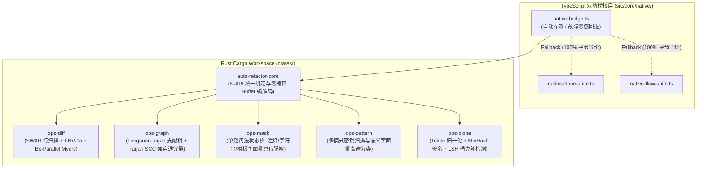

# 05. Rust N-API 原生加速内核与双轨等价桥

> **所属层级**：L1 核心架构与原生内核 (`docs/01-architecture/`)  
> **对应代码真源**：`crates/Cargo.toml`、`crates/auto-refactor-core/`、`crates/ops-diff/`、`crates/ops-graph/`、`crates/ops-pattern/`、`crates/ops-mask/`、`crates/ops-clone/`、`src/core/native/`

---

## 1. Cargo Workspace 六大成员 Crate 拓扑

为了突破 JavaScript 单线程在密集图算法、海量行差分、词法脱敏与代码克隆检测上的算力天花板，`auto-refactor` 在 `crates/` 下构建了基于 Rust 2021 Edition 的 **6 Crate 原生算子工作区**，并通过 N-API 编译为原生插件 (`index.node`)：

### 1.1 各 Crate 核心算法与职责清单

| Crate 名称 | 物理路径 | 核心算法与数据结构 | 服务の上层分析器 / 子系统 |
| :--- | :--- | :--- | :--- |
| **`auto-refactor-core`** | `crates/auto-refactor-core/` | N-API ABI 胶水层、跨边界 `Uint8Array` / `Float64Array` 零拷贝视图桥接 | `src/core/native/native-bridge.ts` |
| **`ops-diff`** | `crates/ops-diff/` | 64-bit SWAR 换行符向量定位、FNV-1a 32 位哈希、64 位字并行 Myers 差分 (BPM) 与 Histogram Diff | `edit-diff.ts`、`PraxisDiffGovernanceService` |
| **`ops-graph`** | `crates/ops-graph/` | Lengauer-Tarjan / CHK 支配树算法、Tarjan 强连通分量 (SCC) 环检测、逆向可达闭包遍历 | `ControlFlowGraph`、`ModuleDependencyGraph`、`CallGraph` |
| **`ops-mask`** | `crates/ops-mask/` | 零内存重分配单趟有限状态自动机（FSM），将源码中的行注释、块注释、字符串与正则字面量抹平为空格，严格保留原字节长度与行号坐标 | `comments`、`constants`、`governance`、`hygiene` |
| **`ops-pattern`** | `crates/ops-pattern/` | 多模式特征自动机、高熵凭证扫描（GitHub Token / AWS Key / 私钥块）与协议字面量快速判别 | `secrets`、`security`、`semanticLiterals.ts` |
| **`ops-clone`** | `crates/ops-clone/` | AST/Token 序列规范化、64 维 MinHash 签名生成与局部敏感哈希 (LSH) 近似克隆块聚类 | `hygiene` (`HYG-DED-001`)、`constants` |

---

## 2. 双轨 100% 字节与语义等价契约 (Dual-Track Equivalence)

根据工作区全局治理总规（`AGENTS.md` 第三节），Rust 原生算子库与 TypeScript 纯 JS 回退实现（`src/core/native/native-bridge.ts`、`native-clone-shim.ts`、`native-flow-shim.ts`）必须满足 **100% 语义与字节等价**：

1. **确定性哈希与种子对齐**：`ops-clone` 中的 MinHash 置换系数与 `ops-diff` 中的 FNV-1a 初始偏置基数（`2166136261`）在 Rust 与 TypeScript 两侧采用完全相同的无符号 32/64 位整数算术规则。
2. **相同的图遍历次序**：`ops-graph` 的支配树构建与强连通分量输出按节点 ID 字典序做确定性归一化排序，杜绝因哈希表迭代顺序差异引起的报告抖动。
3. **双门禁持续看守**：
   - `npm run gate:rust`：对全部 6 个 Crate 执行 `cargo clippy -- -D warnings`、`cargo fmt --check` 与 `cargo test`（零告警容忍）。
   - `npm run validate-native-parity` & `npm run validate-native-bridge`：在同一批复杂语料上分别强制调用 Rust Native 路径与 Pure-TS Shim 路径，逐字段断言输出的支配树父节点表、克隆对集合、掩码后源码字符串与 Diff 操作序列 **100% 全等**。

---

## 3. 关联文档导航

- [01. 系统六层架构全景与核心数据流](./01-system-overview.md)
- [02. 高性能差分算法栈与流式 Diff 规格](../03-incremental-and-diff/02-diff-interface-spec.md)
- [02. 全维性能基准与原生算子加速台账](../05-specs-and-benchmarks/02-performance-benchmarks.md)
