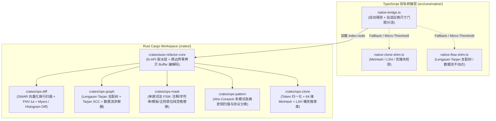
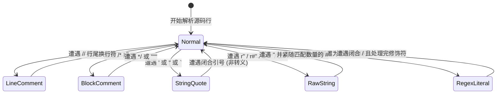
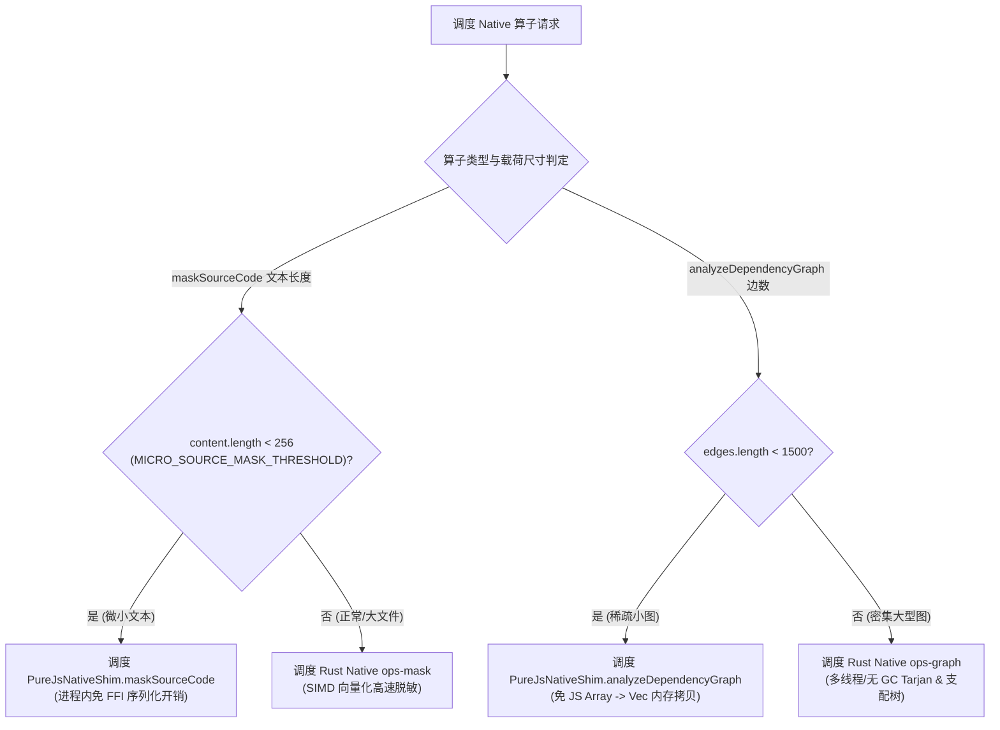

# 05. Rust N-API 原生加速内核与双轨等价桥

> **所属层级**：L1 核心架构与原生内核 (`docs/01-architecture/`)  
> **对应代码真源**：[`crates/Cargo.toml`](file:///c:/CODE_game-development/vscode-extensions/auto-refactor/crates/Cargo.toml)、[`crates/auto-refactor-core/`](file:///c:/CODE_game-development/vscode-extensions/auto-refactor/crates/auto-refactor-core/)、[`crates/ops-diff/`](file:///c:/CODE_game-development/vscode-extensions/auto-refactor/crates/ops-diff/)、[`crates/ops-graph/`](file:///c:/CODE_game-development/vscode-extensions/auto-refactor/crates/ops-graph/)、[`crates/ops-pattern/`](file:///c:/CODE_game-development/vscode-extensions/auto-refactor/crates/ops-pattern/)、[`crates/ops-mask/`](file:///c:/CODE_game-development/vscode-extensions/auto-refactor/crates/ops-mask/)、[`crates/ops-clone/`](file:///c:/CODE_game-development/vscode-extensions/auto-refactor/crates/ops-clone/)、[`src/core/native/native-bridge.ts`](file:///c:/CODE_game-development/vscode-extensions/auto-refactor/src/core/native/native-bridge.ts)、[`src/core/native/native-clone-shim.ts`](file:///c:/CODE_game-development/vscode-extensions/auto-refactor/src/core/native/native-clone-shim.ts)、[`src/core/native/native-flow-shim.ts`](file:///c:/CODE_game-development/vscode-extensions/auto-refactor/src/core/native/native-flow-shim.ts)

---

## 1. Cargo Workspace 六大成员 Crate 与完整算子矩阵

为了突破 JavaScript 单线程在密集图计算、海量行差分、词法脱敏与代码克隆挖掘中的 CPU 与 GC 瓶颈，`auto-refactor` 在 `crates/` 目录下构建了基于 Rust 2021 Edition 的 **6 Crate 原生算子工作区**，并通过 N-API（`napi-rs`）编译为单一二进制动态链接库（`index.node`）：



### 1.1 完整算子矩阵清单

| 导出算子函数 (N-API) | 归属 Crate | 核心算法与底层数据结构 | 解决的计算瓶颈与服务之上层系统 |
| :--- | :--- | :--- | :--- |
| **`compute_histogram_diff`** | `ops-diff` | 64-bit SWAR 换行符定位、FNV-1a 32 位哈希、直方图差分 (Histogram Diff) 与 Bit-Parallel Myers | 毫秒级海量文本差分、Praxis Diff 治理与门禁评估 |
| **`analyze_dependency_graph`** | `ops-graph` | 基于显式栈的 Tarjan 强连通分量 (SCC)、字典序拓扑排序与环路路径提取 | 跨模块循环依赖检测 (`import-cycle`) 与架构分层校验 |
| **`compute_dominator_tree`** | `ops-graph` | Lengauer-Tarjan 快速支配树算法、支配边界 (Dominance Frontiers)、回边识别 (Back Edges) | 控制流图 (CFG) 深度分析、不可约循环检测与自然循环头识别 |
| **`solve_dataflow`** | `ops-graph` | 单调框架前向/后向数据流方程不动点求解 (Fixed-Point Solver)、位集 (BitSet) 快速收敛迭代 | 跨过程污点传播、活跃变量分析与死代码消除 |
| **`mask_source_code`** | `ops-mask` | 单趟 SIMD/FSM 词法状态机、ECMAScript 全空白字符判定、注释与字面量原位纯空格替换 | 词法脱敏、行有效度量 (`linestats`)、注释规范与常量抽取 |
| **`count_duplicate_lines`** | `ops-clone` | 快速哈希与非空有效行重复频次统计 | 代码冗余度量化、物理坏味道扫描 |
| **`detect_clone_blocks`** | `ops-clone` | 滑动窗口行哈希比对、连续克隆代码块贪心聚类 (`CloneBlock`) | 重复代码块治理 (`HYG-DED-001`) |
| **`compute_minhash`** | `ops-clone` | Token 流规约化、64 组伪随机置换系数 MinHash 签名哈希向量生成 | 文件级语义结构指纹提取 |
| **`find_clone_pairs`** | `ops-clone` | 局部敏感哈希 (LSH) 桶碰撞聚类、Jaccard 相似度阈值快速筛选 | 跨全仓大规模近近似克隆检测 (`HYG-DED-001`) |
| **`fast_pattern_match`** | `ops-pattern` | Aho-Corasick 多模式自动机匹配、高熵凭证与敏感词快速命中 | 凭证泄漏扫描 (`secrets`) 与安全审计 (`security`) |

---

## 2. `ops-mask` 原生词法脱敏内核深入解剖

在静态分析中，为了避免正则表达式和 AST 分析器被注释、多行字符串以及内联字面量干扰，必须在词法阶段将干扰字符抹平。[`crates/ops-mask/src/lib.rs`](file:///c:/CODE_game-development/vscode-extensions/auto-refactor/crates/ops-mask/src/lib.rs) 实现了一套零内存重分配的单趟有限状态自动机（FSM）：



### 2.1 Rust 原始字符串 (Raw String) 精密状态机

Rust 原生语法支持带有多层 `#` 锚点的原始字符串（如 `r#"hello "world""#` 或 `cr##"byte"##`）。`ops-mask` 内核对其实现了极致严密的 FSM 匹配：

1. **前置单词边界验证**：
   ```rust
   if start > 0 {
       let prev = line[start - 1];
       if prev.is_ascii_alphanumeric() || prev == b'_' {
           return None; // 排除形如 expr"..." 的常规标识符
       }
   }
   ```
2. **多语言原始字符串前缀判定**：
   识别以 `r`、`br` 或 `cr` 开头的候选前缀，随后统计连续出现的 `#` 数量（`hashes: usize`）。
3. **闭合标记严格对齐**：
   必须且仅当遇到 `"` 后紧随**完全相同数量的 `#`** 时（`line[cursor + 1..cursor + 1 + hashes]` 全为 `#`），才标记 raw string 结束并退出。
4. **跨行状态延续**：
   若该行未闭合，状态存入 `state.raw_string = Some(hashes)`，下一行由 `step_raw_string_continuation_ascii` 继承匹配，直至遇到闭合标记。

### 2.2 ECMAScript 全空白字符判定 (`is_ecma_whitespace`)

为了与 JavaScript 运行时的 `String.prototype.trim()` 逻辑保持 100% 逐字符等价，Rust 侧通过 `is_ecma_whitespace` 覆盖了 ECMAScript 规范规定的全部 25 个 Unicode 空白符与行终止符：

```rust
#[inline]
pub fn is_ecma_whitespace(ch: u32) -> bool {
    matches!(
        ch,
        0x0009..=0x000d     // Tab, LF, VT, FF, CR
            | 0x0020        // Space (ASCII 32)
            | 0x00a0        // No-Break Space (NBSP)
            | 0x1680        // Ogham Space Mark
            | 0x2000..=0x200a // En/Em Quad, En/Em Space, Thin/Hair Space 等
            | 0x2028        // Line Separator (LS)
            | 0x2029        // Paragraph Separator (PS)
            | 0x202f        // Narrow No-Break Space (NNBSP)
            | 0x205f        // Medium Mathematical Space (MMSP)
            | 0x3000        // Ideographic Space (全角空格)
            | 0xfeff        // Zero Width No-Break Space (BOM)
    )
}
```

### 2.3 正则表达式前置字符上下文判别

在 JavaScript / TypeScript 中，斜杠 `/` 既可能是除法运算符，也可能是正则表达式字面量起始。`ops-mask` 通过回溯左侧非空白字符实施精准判别：

- **运算符白名单集**：
  `REGEX_PREFIX_CHARS = b"([{,=:!&|?;+-*%<>";`
- **判定准则**：
  遇到 `/` 时向左回溯第一个非空白字符：
  - 若属于 `REGEX_PREFIX_CHARS` 集合（如 `return /abc/`、`x = /abc/`、`test(/abc/)`），判定为正则表达式字面量起始，启动 `mask_regex_body_ascii` 脱敏正则体与末尾标志符（如 `/pattern/gi`）；
  - 若为标识符、数字或闭合括号 `)`、`]`，判定为数学除法运算符，原位保留不作脱敏。

### 2.4 纯空格原位替换保真契约

- **坐标零漂移公理**：被脱敏的所有字符统一被替换为**纯空格**（ASCII `b' '` / `' '`），严格保留原始换行符 `\n` 与 `\r`。
- **UTF-16 长度补偿**：针对多字节 Unicode 字符，使用 `line.encode_utf16().count()` 计算其在 ECMAScript 内部表示的 UTF-16 码元数量，并填充等量的空格字符。
- **输出效果**：脱敏后的源码字符串与原源码在**总字节长度、UTF-16 索引偏移、行列号坐标**上完全 1:1 重合，下游 AST 分析器报告的行号和高亮坐标绝不产生微秒级漂移。

---

## 3. 自适应微尺寸门限分流 (Adaptive Micro-Threshold Dispatch)

在 Node.js 中调用 Rust 编写的 N-API 原生插件并非毫无成本。参数封包、V8 堆内存拷贝与跨语言 C FFI 跨边界调用通常伴随约 `0.02 ~ 0.08ms` 的固有上下文切换开销。对于微小输入，FFI 调用本身的耗时甚至可能远远高于纯 JavaScript 运行时间。

[`src/core/native/native-bridge.ts`](file:///c:/CODE_game-development/vscode-extensions/auto-refactor/src/core/native/native-bridge.ts) 实现了**自适应微尺寸门限分流机制**：



1. **源码脱敏分流门限 (`MICRO_SOURCE_MASK_THRESHOLD = 256`)**：
   - 当文本长度 `< 256` 字符时，分流至纯 TypeScript 实现（`maskSourceTextJs`），消除跨 N-API 边界构建 `NativeMaskConfig` 对象的开销；
   - 当文本长度 $\ge 256$ 字符时，分流至 Rust `ops-mask` 原生内核，充分发挥 SWAR / SIMD 字节加速优势。
2. **依赖图分析分流门限 (`edges.length < 1500`)**：
   - 当图边数 `< 1500` 条时，分流至纯 TypeScript Tarjan 实现（`PureJsNativeShim.analyzeDependencyGraph`），省去将 JavaScript 嵌套数组序列化为 Rust `Vec<Vec<String>>` 的巨大内存分配损耗；
   - 当边数 $\ge 1500$ 条时，分流至 Rust `ops-graph` 原生内核，以零 GC、高密度的紧凑图遍历能力保障大型项目毫秒级分析。

---

## 4. 双轨 100% 字节等价性契约与两套 Shim 门禁验证

为了保障在无编译环境、轻量 Docker 容器或架构不兼容平台上的绝对可靠性，系统在 TypeScript 侧构建了**两套完整的算法等价 Shim**：

### 4.1 纯 JS Shim 实现矩阵

1. **[`src/core/native/native-clone-shim.ts`](file:///c:/CODE_game-development/vscode-extensions/auto-refactor/src/core/native/native-clone-shim.ts)**：
   - `countDuplicateLinesShim`: 统计重复行；
   - `detectCloneBlocksShim`: 贪心滑动窗口克隆代码块检测；
   - `computeMinHashShim`: 包含与 Rust `ops-clone` 严格一致的 64 组伪随机置换系数（`HASH_COEFFS`），采用完全相同的无符号 32 位溢出运算（`Math.imul` 与 `>>> 0`）；
   - `findClonePairsShim`: 局部敏感哈希 (LSH) 桶聚类算法。
2. **[`src/core/native/native-flow-shim.ts`](file:///c:/CODE_game-development/vscode-extensions/auto-refactor/src/core/native/native-flow-shim.ts)**：
   - `computeDominatorTreeShim`: 纯 TypeScript 完整实现 Lengauer-Tarjan 支配树算法，计算即时支配节点（`idom`）、支配边界（`dominance_frontiers`）与回边集（`back_edges`）；
   - `solveDataflowShim`: 纯 TypeScript 实现的前向/后向单调数据流方程不动点迭代求解器。

### 4.2 确定性输出契约与门禁看守

- **节点排序字典序归一化**：图遍历的 SCC 列表、拓扑排序和克隆对集合在输出前均按节点 ID 的字典序执行严格归一化排序，消除由于不同语言底层哈希表迭代顺序差异导致的输出抖动。
- **三重自动化验证门禁**：
  1. `npm run gate:rust`：在 Rust 侧对全部 6 个 Crate 执行 `cargo clippy -- -D warnings`、`cargo fmt --check` 与单元测试（零警告容忍）；
  2. `npm run validate-native-parity`：在同一组复杂真实代码库上分别强制调用 Rust Native 路径与 Pure-TS Shim 路径，逐字段断言输出的支配树映射、数据流收敛集合、克隆对、脱敏字符串与 Diff 操作序列 **100% 逐字节相等**；
  3. `npm run validate-native-bridge`：测试动态加载探测、二进制损坏模拟与透明回退逻辑，确保生产环境绝对零崩溃。

---

## 5. 关联文档导航

- [01. 系统六层架构全景与核心数据流](./01-system-overview.md)
- [02. 三级增量缓存与拓扑失效体系](./02-pipeline-and-caching.md)
- [04. 分形 Git 工作树与多级门禁回滚规范](./04-praxis-git-fractal-and-gating-spec.md)
