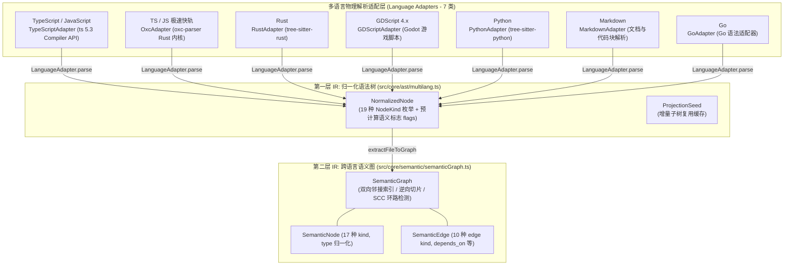

# 01. 统一语法树 `NormalizedNode` 与跨语言语义 IR (`SemanticGraph`)

> **所属层级**：L2 跨语言解析与语义图底座 (`docs/02-parsers-and-ast/`)  
> **代码真源**：  
> - 归一化 AST 契约：[`src/core/ast/multilang.ts`](file:///c:/CODE_game-development/vscode-extensions/auto-refactor/src/core/ast/multilang.ts)  
> - 语言适配器注册表：[`src/core/ast/adapters.ts`](file:///c:/CODE_game-development/vscode-extensions/auto-refactor/src/core/ast/adapters.ts)  
> - 语义图数据模型：[`src/core/semantic/types.ts`](file:///c:/CODE_game-development/vscode-extensions/auto-refactor/src/core/semantic/types.ts)  
> - 语义图拓扑引擎：[`src/core/semantic/semanticGraph.ts`](file:///c:/CODE_game-development/vscode-extensions/auto-refactor/src/core/semantic/semanticGraph.ts)  
> - 闭锁守卫：[`src/core/ast/language-support.ts`](file:///c:/CODE_game-development/vscode-extensions/auto-refactor/src/core/ast/language-support.ts)

---

## 1. 跨语言双层抽象架构

在面对多语言混合工程时，为消除各个分析器（Analyzer）对异构 AST（如 TypeScript Compiler API、oxc ESTree、tree-sitter CST）的直接绑定与重复遍历，`auto-refactor` 建立了「**底层归一化语法树 (`NormalizedNode`) + 顶层统一语义拓扑图 (`SemanticGraph`)**」的双层中间表示（IR）体系：



> [!NOTE]
> **物理路径纠偏**：早期设计文档曾提及虚构的 `src/core/parsers/` 与 `src/core/ir/` 目录。在真实代码实现中，归一化语法树全部收敛于 [`src/core/ast/`](file:///c:/CODE_game-development/vscode-extensions/auto-refactor/src/core/ast/)，而跨语言语义图模型与拓扑索引引擎全部收敛于 [`src/core/semantic/`](file:///c:/CODE_game-development/vscode-extensions/auto-refactor/src/core/semantic/)。

---

## 2. 真实 AST 适配器矩阵 (7 类)

系统在 [`src/core/ast/adapters.ts`](file:///c:/CODE_game-development/vscode-extensions/auto-refactor/src/core/ast/adapters.ts) 中声明并按需懒加载（Lazy Loading）7 类官方语言适配器：

| 适配器 ID | 对应类名 | 声明扩展名 | 解析引擎与特点 |
| :--- | :--- | :--- | :--- |
| `typescript` | `TypeScriptAdapter` | `.ts`, `.tsx`, `.js`, `.jsx`, `.mjs`, `.cjs` | 基于官方 TypeScript 编译器 API，解析完整语义与类型声明 |
| `oxc` | `OxcAdapter` | 同上（当 `parser: 'oxc'` 时优先分派） | Rust `oxc-parser` 高性能快轨，双模态（Mode A / Mode B）低内存占用 |
| `rust` | `RustAdapter` | `.rs` | 基于 `tree-sitter-rust`，提取 `fn`, `struct`, `impl`, `trait` |
| `gdscript` | `GDScriptAdapter` | `.gd` | Godot 4 游戏脚本专用，提取 `func`, `class_name`, `signal`, 变量与节点绑定 |
| `python` | `PythonAdapter` | `.py` | 基于 `tree-sitter-python`，提取 `def`, `class`, 缩进作用域与导入 |
| `markdown` | `MarkdownAdapter` | `.md` | 文档代码块（Fence）提取、跨文件死链与文档结构解析 |
| `go` | `GoAdapter` | `.go` | Go 语言结构体、接口与函数签名适配 |

> [!IMPORTANT]
> **领域分析器澄清**：Shell 脚本审查（`shell-lint.ts`）与配置清单审查（如 `package.json`、`ar.config.json` 的依赖配置检查）属于特定领域的规则分析器（Domain Analyzers），并不在 `LanguageAdapter` 语法适配器注册表中，系统不存在通用的 `ShellAdapter` 或 `ConfigAdapter`。

---

## 3. 归一化语法树实体：`NodeKind` 与预计算语义标志

在 [`src/core/ast/multilang.ts`](file:///c:/CODE_game-development/vscode-extensions/auto-refactor/src/core/ast/multilang.ts) 中，所有语言的原生节点在解析阶段被归一化为统一的 `NormalizedNode`。

### 3.1 19 种语言无关 `NodeKind` 枚举

```ts
export enum NodeKind {
  SourceFile = 'SourceFile',
  Function = 'Function',         // 独立函数 / fn / 箭头函数 / 闭包
  Method = 'Method',             // 类/结构体/Trait/Impl 内部声明的方法
  Struct = 'Struct',             // 结构体声明
  Class = 'Class',               // 类声明
  Impl = 'Impl',                 // Rust impl 块 / TS class 实现块
  Trait = 'Trait',               // Rust trait / 行为约束接口
  Interface = 'Interface',       // TypeScript / Go 接口
  Variable = 'Variable',         // let / var 可变绑定
  Constant = 'Constant',         // const / 静态常量绑定
  Field = 'Field',               // 字段 / 属性
  NumericLiteral = 'NumericLiteral',
  StringLiteral = 'StringLiteral',
  Literal = 'Literal',           // 通用字面量 (如布尔、null)
  Call = 'Call',                 // 函数/方法调用表达式
  BinaryExpr = 'BinaryExpr',     // 二元运算表达式
  ControlFlow = 'ControlFlow',   // if / for / while / match / switch
  Block = 'Block',               // 代码块 / 作用域边界
  Other = 'Other',               // 不可观测或折叠占位节点
}
```

### 3.2 预计算语义标志位 (`NormalizedNode`)

为了使后续的所有通用分析器在单趟遍历（Single-Pass Descent）中**实现零堆内存分配**，适配器在解析期预先计算语义标志：

```ts
export interface NormalizedNode {
  kind: NodeKind;
  rawKind?: string;
  text?: string;
  start?: Position;              // 1-based line / column
  end?: Position;
  name?: string | null;
  isNumeric?: boolean;
  isString?: boolean;
  hasFunctionInitializer?: boolean;
  branchWeight?: number;         // 圈复杂度分支权重 (0 或 1)
  children?: NormalizedNode[];

  // 作用域下潜标志 (Scope-Descent Flags)
  functionLike?: boolean;        // 函数级单元边界 (function/method/arrow)
  isClassDefining?: boolean;     // 类定义边界: 子节点继承 className = name
  introducesBinding?: boolean;   // 变量引入节点: 子节点继承 bindingName = name
  bindingName?: string | null;
  increasesNesting?: boolean;    // 控制流/代码块: 作用域深度 +1

  // 分析器度量标志 (Metric & Analyzer Flags)
  topLevel?: boolean;            // 文件直接顶级子节点
  exported?: boolean;            // 顶级导出节点
  isConstBound?: boolean;        // 受 const 或 enum 绑定的安全字面量
  tolerated?: boolean;           // 豁免上下文 (属性名、测试断言、i18n、导入路径)
  isConstructor?: boolean;       // 构造函数
}
```

---

## 4. 统一语义图实体：`SemanticNode` 与 `SemanticEdge`

在 [`src/core/semantic/types.ts`](file:///c:/CODE_game-development/vscode-extensions/auto-refactor/src/core/semantic/types.ts) 与 [`src/core/semantic/semanticGraph.ts`](file:///c:/CODE_game-development/vscode-extensions/auto-refactor/src/core/semantic/semanticGraph.ts) 中，跨文件调用关系、继承体系与数据流动被建模为语义有向图。

### 4.1 17 种 `SemanticNodeKind`

在语义图模型中，结构体、类、接口等类型统一定义为 `'type'` 节点：

```ts
export type SemanticNodeKind =
  | 'module'               // 文件模块边界
  | 'function'             // 函数与方法实体
  | 'type'                 // 类、接口、结构体、Trait、枚举等类型实体
  | 'variable'             // 变量与全局状态
  | 'dependency'           // 外部第三方依赖
  | 'call'                 // 调用点
  | 'data_flow'            // 数据流动节点
  | 'state_mutation'       // 状态突变点
  | 'exception'            // 异常捕获与抛出点
  | 'resource'             // 文件句柄/网络套接字等资源
  | 'import'               // 导入声明实体
  | 'loop'                 // 循环结构
  | 'branch'               // 分支跳转
  | 'async_boundary'       // 异步任务边界 (Promise, Task, Future)
  | 'concurrency'          // 并发/线程/通道操作
  | 'io'                   // 输入输出操作
  | 'database_operation';  // 数据库持久化操作
```

### 4.2 10 种 `SemanticEdgeKind`

语义边代表节点之间的结构绑定或有向流动，模块导入在语义图中体现为 `depends_on` 边：

```ts
export type SemanticEdgeKind =
  | 'calls'          // 函数/方法调用
  | 'mutates'        // 状态写修改
  | 'depends_on'     // 模块级依赖与导入引用
  | 'instantiates'   // 类型实例化
  | 'flows_to'       // 数据流传递
  | 'awaits'         // 异步等待
  | 'handles'        // 异常处理
  | 'reads'          // 状态只读访问
  | 'writes'         // 变量赋值写入
  | 'inherits';      // 类继承、接口实现或 Trait 绑定
```

---

## 5. 闭锁式未知语言守卫 (`LANG-UNSUPPORTED`)

`auto-refactor` 奉行**默认闭锁（Fail-Closed）**安全哲学：
1. **历史回退机制**：为了向后兼容，[`src/core/ast/adapters.ts`](file:///c:/CODE_game-development/vscode-extensions/auto-refactor/src/core/ast/adapters.ts) 中的 `adapterFor` 在遇到未注册扩展名时默认返回 TypeScript 适配器，而不会抛出异常。
2. **闭锁断言**：如果引擎直接静默放行未识别的文件，会导致该文件解析产生 0 个 Issue 并产生虚假的“质量合格”假象（Fail-Open）。
3. **`hasAdapterFor` 与诊断触发**：位于 [`src/core/ast/language-support.ts`](file:///c:/CODE_game-development/vscode-extensions/auto-refactor/src/core/ast/language-support.ts) 的 `hasAdapterFor(filePath, parser)` 会主动核查扩展名是否由 7 类真实适配器显式认领。
4. **规则发射**：当 `hasAdapterFor` 返回 `false` 且 `ScanConfig.unsupportedLanguage` 未设为 `'off'` 时（默认值为 `'error'`），引擎将发射 `LANG-UNSUPPORTED` 门禁诊断阻断流程：

```ts
// src/core/ast/language-support.ts
export function unsupportedLanguageDiagnostic(filePath: string, cfg: ScanConfig): Issue | null {
  if (hasAdapterFor(filePath, cfg.parser)) return null;
  const severity = unsupportedLanguageSeverity(cfg); // 默认为 'error'
  if (severity === 'off') return null;
  const ext = path.extname(filePath).toLowerCase();
  return {
    id: `core:${LANG_UNSUPPORTED_RULE}:${filePath}:1`,
    analyzer: 'language',
    rule: LANG_UNSUPPORTED_RULE,
    severity,
    message: `No language adapter claims '${ext}': '${filePath}' was parsed by the fallback TypeScript adapter...`,
    location: { file: filePath, start: { line: 1, column: 1 }, end: { line: 1, column: 1 } },
    detail: { extension: ext, parser: cfg.parser, severity },
    suggestion: 'Add a language adapter for this extension, exclude the path, or set unsupportedLanguage to "warning"/"off"...',
  };
}
```

---

## 6. 关联文档导航

- [02. Rust `oxc-parser` 极速通道与双模补偿](./02-oxc-fastpath.md)
- [03. 控制流图 (CFG)、数据流分析与符号调用切片](./03-lazy-projection.md)
- [01. 行级增量子树复用与 AST 切片提取](../03-incremental-and-diff/01-line-level-incremental.md)
