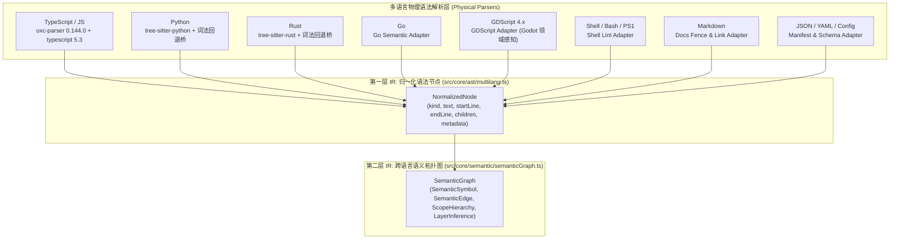

# 01. 统一语法树 `NormalizedNode` 与八语言语义 IR (`SemanticGraph`)

> **所属层级**：L2 跨语言解析与语义图底座 (`docs/02-parsers-and-ast/`)  
> **对应代码真源**：`src/core/ast/multilang.ts`、`src/core/semantic/semanticGraph.ts`、`src/core/semantic/types.ts`、`src/core/semantic/adapters/`

---

## 1. 跨语言双层抽象架构

为了避免每个分析器针对不同编程语言重复编写 AST 遍历代码，`auto-refactor` 构建了「**底层归一化语法树 (`NormalizedNode`) + 顶层统一语义拓扑图 (`SemanticGraph`)**」的双层中间表示（IR）体系：

---

## 2. 八大语言生态适配矩阵

| 语言生态 | 识别扩展名 | 核心解析后端 | 专属现代化与领域分析器 |
| :--- | :--- | :--- | :--- |
| **TypeScript / JavaScript** | `.ts`, `.tsx`, `.js`, `.jsx`, `.mjs`, `.cjs` | `oxc-parser` (Mode A/B) + `typescript` Compiler API | `ts-modern`, `vscode-extension`, 全量通用分析器 |
| **Python** | `.py`, `.pyi` | `tree-sitter-python` + 缩进状态机适配器 | `python-modern`, `data-architecture`, 全量通用分析器 |
| **Rust** | `.rs` | `tree-sitter-rust` + 属性/宏感知适配器 | `rust-modern`, `performance`, 全量通用分析器 |
| **Go** | `.go` | `GoSemanticAdapter` | `go-modern`, `concurrency`, 全量通用分析器 |
| **GDScript (Godot 4)** | `.gd` | `GDScriptSemanticAdapter` | `gdscript-modern`, `gdscript-game`（对象池/帧循环零分配/配置驱动检查） |
| **Shell 脚本** | `.sh`, `.bash`, `.zsh` | `ShellAdapter` | `shell-lint`, `security`, `secrets` |
| **Markdown 文档** | `.md`, `.markdown` | `DocsAdapter` | `docs`（代码围栏闭合 `DOC-FEN-001`、死链检测 `DOC-LNK-001`、重复段落 `DOC-DUP-001`） |
| **结构化配置** | `.json` (`package.json`, `ar.config.json`) | `ConfigAdapter` | `vscode-extension`, `dependency-layout`, `secrets` |

---

## 3. 统一语义图 (`SemanticGraph`) 核心实体

`src/core/semantic/semanticGraph.ts` 将各语言的声明、引用、调用与继承关系抽象为与具体语法无关的拓扑图：

1. **符号节点 (`SemanticSymbol`)**：
   - 统一分类为 `function`、`method`、`class`、`interface`、`struct`、`enum`、`constant`、`variable`、`module`；
   - 记录精确起止行号、可见性修饰符（`exported` / `public` / `private`）、参数签名摘要与圈复杂度初值。
2. **有向语义边 (`SemanticEdge`)**：
   - `imports`（模块导入）、`calls`（函数/方法调用）、`inherits`（类继承/接口实现/Trait 实现）、`reads` / `writes`（状态读写依赖）。
3. **架构层级自动推导 (`inferSemanticLayer`)**：
   - 自动将模块映射至 `ui`（展现层）、`application`（应用编排层）、`domain`（核心领域层）、`infrastructure`（基础设施与持久化层）、`shared`（公共底座层），支撑跨层逆向依赖拦截（`ARC-LAY-001`）。

---

## 4. 闭锁式未知语言守卫 (`LANG-UNSUPPORTED`)

系统遵循**默认闭锁（Fail-Closed）**安全原则：当扫描范围内出现未被任何适配器认领的文件扩展名时，引擎不会静默跳过而造成安全盲区，而是按照 `unsupportedLanguage` 配置（默认 `'error'`）发射 `LANG-UNSUPPORTED` 诊断告警（由 `npm run validate-fail-closed` 门禁验证）。

---

## 5. 关联文档导航

- [02. Rust `oxc-parser` 极速通道与双模补偿](./02-oxc-fastpath.md)
- [03. 控制流图 (CFG)、数据流图 (DFG) 与符号调用图构建](./03-lazy-projection.md)
