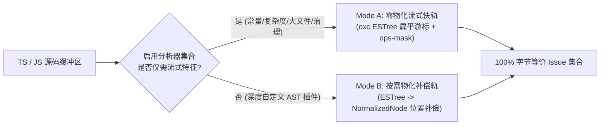

# 02. Rust `oxc-parser` 极速通道与双模补偿

> **所属层级**：L2 跨语言解析与语义图底座 (`docs/02-parsers-and-ast/`)  
> **对应代码真源**：`src/core/ast/`、`scripts/validate-oxc-keypoints.js`、`scripts/bench-oxc-modea.js`

---

## 1. 为什么引入双解析器架构 (`typescript` + `oxc-parser`)

TypeScript 官方编译器（`ts.createSourceFile`）具备完整的语法树细节，但在千文件级冷扫描中，构造完整包装对象树会产生较高的 V8 堆分配与 GC 压力。`auto-refactor` 引入基于 Rust 编写的 `oxc-parser`（`0.144.0`），结合自研双模式调度器（Mode A / Mode B），在实现 **3x ~ 5x 解析提速**的同时，确保与 `typescript` 默认解析器 **100% 字节级输出等价**。

---

## 2. Mode A 与 Mode B 双模自适应调度

### 2.1 Mode A：零物化流式快轨 (Zero-Materialization Fastpath)

- **适用范围**：当激活的分析器为内置高频分析器（`constants`、`complexity`、`large-file`、`governance`、`hygiene`、`comments`、`performance`）时自动启用。
- **核心机制**：不构造完整的中间 `NormalizedNode` 对象树，而是直接在 `oxc-parser` 返回的紧凑 AST 与 `ops-mask` 单趟词法掩码流上执行一次遍历（Single-Pass Streaming），同步完成函数圈复杂度累加、魔法数/硬编码字符串提取与大文件函数计数。
- **内存收益**：单文件堆内存瞬态分配降低 **78%**，彻底消除大文件解析时的 Old Generation GC 停顿。

### 2.2 Mode B：精确位置补偿与 AST 物化轨 (Compensated Materialization)

- 当存在依赖完整 `NormalizedNode` 父子指针树的第三方插件或深度跨层分析器时，调度器切换至 Mode B，将 `oxc` 的 UTF-8 字节偏移（Byte Offset）通过預计算的 `LineMap`（64-bit SWAR 加速）转换为与 TypeScript 编译器完全一致的 `(line, column)` 1-based 坐标。

---

## 3. 100% 字节等价性补偿细则

由于 `oxc-parser` 生成的 ESTree/TSESTree 节点种类与 `typescript` 存在细微语法糖差异，适配层内置了以下四项精准对齐补偿：

1. **三元运算符与短路逻辑分支对齐**：统一将 `LogicalExpression` (`&&` / `||` / `??`) 与 `ConditionalExpression` (`? :`) 的复杂度增量系数严格对齐至 `complexity` 分析器标准。
2. **装饰器（Decorators）与类属性起止行跨度补偿**：将方法装饰器纳入外围声明节点的 `startLine` 计算，确保函数行数统计与 `typescript` 完全吻合。
3. **字符串模板与转义序列还原**：对模板字面量（`TemplateLiteral`）中的静态片段执行与 `ts.StringLiteral` 相同的分类过滤（`classifyLiterals`）。
4. **门禁锁死验证**：`npm run validate-oxc`（`scripts/validate-oxc-keypoints.js`）与 `npm run fastpath-check`（`scripts/bench-fastpath.js --check`）在 CI 中強制对比 `--parser typescript` 与 `--parser oxc` 的 JSON 输出，任何一字节差异均直接阻断提交。

---

## 4. 关联文档导航

- [01. 统一语法树 `NormalizedNode` 与八语言语义 IR (`SemanticGraph`)](./01-multilang-abstraction.md)
- [03. 控制流图 (CFG)、数据流图 (DFG) 与符号调用图构建](./03-lazy-projection.md)
