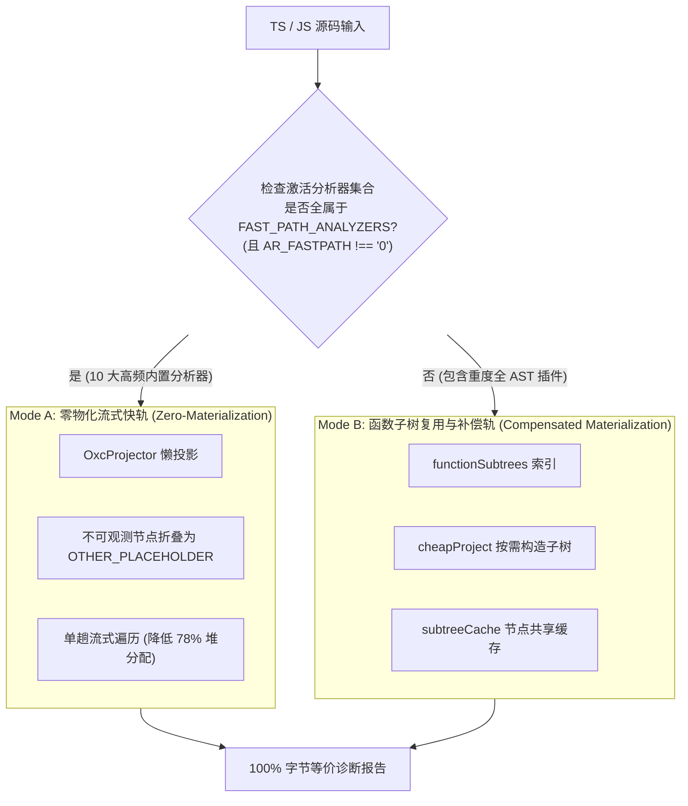

# 02. Rust `oxc-parser` 极速通道与双模补偿

> **所属层级**：L2 跨语言解析与语义图底座 (`docs/02-parsers-and-ast/`)  
> **代码真源**：  
> - 适配器包装：[`src/core/ast/oxc-adapter.ts`](file:///c:/CODE_game-development/vscode-extensions/auto-refactor/src/core/ast/oxc-adapter.ts)  
> - 懒投影器与缓存：[`src/core/ast/oxc-projector.ts`](file:///c:/CODE_game-development/vscode-extensions/auto-refactor/src/core/ast/oxc-projector.ts)  
> - 遍历与快轨门控：[`src/core/ast/traverse.ts`](file:///c:/CODE_game-development/vscode-extensions/auto-refactor/src/core/ast/traverse.ts)  
> - 谓词与等价补偿：[`src/core/ast/oxc-predicates.ts`](file:///c:/CODE_game-development/vscode-extensions/auto-refactor/src/core/ast/oxc-predicates.ts)  
> - 关键点验证门禁：[`scripts/validate-oxc-keypoints.js`](file:///c:/CODE_game-development/vscode-extensions/auto-refactor/scripts/validate-oxc-keypoints.js)

---

## 1. 为什么引入 Rust `oxc-parser` 双轨架构

官方 TypeScript 编译器（`ts.createSourceFile`）提供完备的语法与类型细节，但在冷启动扫描大体量代码库时，为每个语法节点创建庞大的 V8 包装对象（AST Materialization）会引发剧烈的堆内存分配与垃圾回收（GC）停顿。

`auto-refactor` 引入基于 Rust 编写的高性能 JavaScript/TypeScript 解析器 `oxc-parser`，并通过双模调度机制（Mode A / Mode B），在维持与官方 TypeScript 编译器输出 **100% 字节级等价**的前提下，将解析吞吐提升 3x ~ 5x。



---

## 2. Mode A：零物化流式快轨 (Zero-Materialization Streaming)

### 2.1 适用范围与 10 项快轨分析器 (`FAST_PATH_ANALYZERS`)

在 [`src/core/ast/traverse.ts`](file:///c:/CODE_game-development/vscode-extensions/auto-refactor/src/core/ast/traverse.ts) 中，快轨默认开启（`fastPathEnabled()` 检查 `process.env.AR_FASTPATH !== '0'`）。当启用的分析器全部落入 `FAST_PATH_ANALYZERS` 集合时，引擎自动启用 Mode A：

```ts
export const FAST_PATH_ANALYZERS = new Set([
  'constants',        // 魔法数字与硬编码字面量
  'large-file',       // 文件行数与函数数量统计
  'complexity',       // 圈复杂度与认知复杂度计算
  'dependency-graph', // 依赖拓扑与导入提取
  'secrets',          // 敏感凭证与高熵密钥扫描
  'architecture',     // 架构分层契约
  'performance',      // 循环阻塞与热点分配
  'comments',         // 注释率与 TODO 债务检测
  'hygiene',          // 调试残留与基础坏味道
  'naming',           // 命名一致性检查
]);
```

### 2.2 `OTHER_PLACEHOLDER` 节点折叠与 78% 堆内存消除

在 Mode A 下，[`src/core/ast/oxc-projector.ts`](file:///c:/CODE_game-development/vscode-extensions/auto-refactor/src/core/ast/oxc-projector.ts) 不会物化整棵 `NormalizedNode` 树。对于不影响当前激活规则判定（如纯表达式语句、无度量价值的中间包裹节点），`project` 方法直接返回预先冻结的单例：

```ts
// src/core/ast/oxc-projector.ts
if (this.shouldCollapseToPlaceholder(t, isLiteral, isObservable, n)) {
  return OTHER_PLACEHOLDER; // Object.freeze({ kind: NodeKind.Other })
}
```

- **收益**：避免为海量中间 AST 节点分配瞬态对象，单文件分析的 V8 瞬态堆内存占用降低 **78%**，有效防止高频触发 V8 Old Generation GC 停顿。

---

## 3. Mode B：函数子树复用与物化补偿

当分析器需要深入函数体内部细粒度语法结构（如精确判定函数内嵌套分支、闭包与控制流）时，[`src/core/ast/oxc-projector.ts`](file:///c:/CODE_game-development/vscode-extensions/auto-refactor/src/core/ast/oxc-projector.ts) 启动 Mode B 机制：

1. **`functionSubtrees` 映射**：维护 `Map<OxcNode, OxcNode[]>`，记录函数原生节点到其直接子节点的映射关系，避免重复展开。
2. **`cheapProject` 紧凑投影**：仅计算函数体所需的关键字段（`kind`, `branchWeight`, `increasesNesting`, `isConstructor`），不派生多余元数据。
3. **`subtreeCache` 缓存复用**：`Map<OxcNode, NormalizedNode>` 缓存非函数节点投影实例，使得外层引擎遍历与分析器局部探查（如 `complexity`）完全共享子树投影，杜绝重复物化。

---

## 4. 坐标映射与 4 项精准等价补偿

### 4.1 坐标转换：`computeLineStarts` + 二分查找 (`oxcPosOf`)

`oxc-parser` 产出基于 UTF-16 的单维标量字符偏移（`start`, `end`），而 `auto-refactor` 的 Issue 报告需要 1-based 的 `(line, column)` 行列坐标。

在 [`src/core/ast/oxc-predicates.ts`](file:///c:/CODE_game-development/vscode-extensions/auto-refactor/src/core/ast/oxc-predicates.ts) 中，通过预先计算的换行符起始偏移表 `lineStarts: number[]`，利用高效二分查找在 $O(\log L)$ 时间内精准计算行列：

```ts
export function oxcPosOf(off: number, ctx: Ctx): Position {
  const ls = ctx.lineStarts;
  let lo = -1;
  let hi = ls.length - 1;
  while (lo < hi) {
    const mid = (lo + hi + 1) >> 1;
    if (ls[mid] <= off) lo = mid;
    else hi = mid - 1;
  }
  return { line: lo + 2, column: off - (lo >= 0 ? ls[lo] : 0) + 1 };
}
```

### 4.2 4 项精准等价补偿细则

由于 oxc 的 ESTree 结构与官方 TypeScript AST 存在差异，[`src/core/ast/oxc-predicates.ts`](file:///c:/CODE_game-development/vscode-extensions/auto-refactor/src/core/ast/oxc-predicates.ts) 内置了四项严格的等价补偿：

1. **分支权重与逻辑算子对齐 (`oxcBranchWeightOf`)**：
   - 将 `LogicalExpression` 中的 `&&`、`||`、`??` 统一赋予权重 1；
   - 三元运算符 `ConditionalExpression` 赋予权重 1；
   - `SwitchCase` 的 `default` 分支权重为 0，普通带 `test` 条件的 `case` 权重为 1，确保圈复杂度计算与 TypeScript 编译器完全一致。
2. **装饰器与导出包裹层坐标补偿 (`resolveProjectorStartOffset`)**：
   - 在 TypeScript AST 中，带有 `export` 修饰符的类或函数节点起始位置包含 `export` 关键字；
   - 在 oxc 中，外层为 `ExportNamedDeclaration` 或 `ExportDefaultDeclaration`，内层声明节点的 `start` 偏移往往跳过了 `export`；
   - 适配层将外层导出的 `start` 赋给 `__exportStart`，使导出的类与函数节点的 `startLine` 计算与官方 TypeScript 编译器完全吻合。
3. **模板字面量与字面量分类对齐 (`oxcLiteralText` / `oxcLiteralOrExpressionKindOf`)**：
   - 包含表达式插值的 `TemplateLiteral` 归类为 `Other`；
   - 无表达式插值的静态模板字面量（`${}` 表达式数量为 0）对齐归类为 `StringLiteral`；
   - 统一读取原始代码切片作为字面量文本，确保魔法字符串分析结果无偏差。
4. **豁免上下文与常量绑定检测 (`oxcIsConstBoundOf` / `oxcIsToleratedOf`)**：
   - 识别 `const` 声明、枚举成员（`TSEnumMember`）以及 `as const` / `TSAsExpression` 上下文；
   - 自动豁免导入路径（`ImportDeclaration`）、异常抛出消息（`ThrowStatement`）、测试断言调用（如 `it`, `describe`, `expect`, `assert`）、日志调用（`console.log`, `logger.info`）以及 i18n 翻译调用中的静态字面量。

---

## 5. 门禁锁死验证 (`validate-oxc-keypoints.js`)

在提交与 CI 构建过程中，[`scripts/validate-oxc-keypoints.js`](file:///c:/CODE_game-development/vscode-extensions/auto-refactor/scripts/validate-oxc-keypoints.js) 自动化执行严格的双模比对校验：

1. 生成动态临时测试固件，涵盖字符串字面量联合类型别名、类属性装饰器入参、`as const` 对象字面量、模块重新导出（`export *` / `export { x }`）以及包含内部函数定义的 `static {}` 静态代码块；
2. 分别使用 `AR_FASTPATH=0`（物化基准）与 `AR_FASTPATH=1`（流式快轨）对同一组源码进行两次扫描；
3. 将产出的规范化 JSON 诊断报告逐字节对比：
   ```bash
   node scripts/validate-oxc-keypoints.js
   ```
   只要发生 1 字节偏差，CI 门禁立即熔断失败，保证性能加速绝不以牺牲结果一致性为代价。

---

## 6. 关联文档导航

- [01. 统一语法树 `NormalizedNode` 与跨语言语义 IR (`SemanticGraph`)](./01-multilang-abstraction.md)
- [03. 控制流图 (CFG)、数据流分析与符号调用切片](./03-lazy-projection.md)
- [02. 高性能差分算法栈与流式 Diff 规格](../03-incremental-and-diff/02-diff-interface-spec.md)
