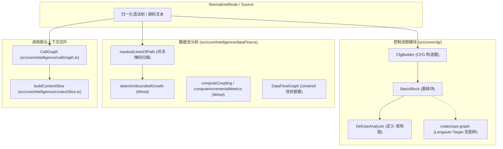

# 03. 控制流图 (CFG)、数据流分析与符号调用切片

> **所属层级**：L2 跨语言解析与语义图底座 (`docs/02-parsers-and-ast/`)  
> **代码真源**：  
> - 控制流图 (CFG)：[`src/core/cfg/`](file:///c:/CODE_game-development/vscode-extensions/auto-refactor/src/core/cfg/) (`basic-block.ts`, `cfg-builder.ts`, `def-use-chain.ts`)  
> - 支配树 Native 内核：[`crates/ops-graph/`](file:///c:/CODE_game-development/vscode-extensions/auto-refactor/crates/ops-graph/)  
> - 数据流与无界增长：[`src/core/intelligence/dataFlow.ts`](file:///c:/CODE_game-development/vscode-extensions/auto-refactor/src/core/intelligence/dataFlow.ts)  
> - 符号调用图：[`src/core/intelligence/callGraph.ts`](file:///c:/CODE_game-development/vscode-extensions/auto-refactor/src/core/intelligence/callGraph.ts)  
> - 上下文切片：[`src/core/intelligence/contextSlice.ts`](file:///c:/CODE_game-development/vscode-extensions/auto-refactor/src/core/intelligence/contextSlice.ts)

---

## 1. 深度图分析体系与物理归属

在工程扫描中，构建全量图结构会消耗显著的计算资源。`auto-refactor` 对深层控制流、数据流与调用拓扑实施按需构建机制：



| 分析结构 | 源码物理路径 | 运行状态 | 核心职责 |
| :--- | :--- | :---: | :--- |
| **控制流图 (CFG)** | [`src/core/cfg/`](file:///c:/CODE_game-development/vscode-extensions/auto-refactor/src/core/cfg/) | **Wired** | 基础块划分、分支跳转、循环回边、异常控制流 |
| **支配树 (Dominator Tree)** | [`crates/ops-graph/`](file:///c:/CODE_game-development/vscode-extensions/auto-refactor/crates/ops-graph/) | **Wired** | Lengauer-Tarjan 算法，计算自然循环头（Natural Loops） |
| **无界增长与增量度量** | [`src/core/intelligence/dataFlow.ts`](file:///c:/CODE_game-development/vscode-extensions/auto-refactor/src/core/intelligence/dataFlow.ts) | **Wired** | 词法掩码下深度栈追踪、耦合度与增量代码维护性 |
| **全量数据流图 (`DataFlowGraph`)** | [`src/core/intelligence/dataFlow.ts`](file:///c:/CODE_game-development/vscode-extensions/auto-refactor/src/core/intelligence/dataFlow.ts) | **Unwired** | 跨阶段端到端生命周期图（仅测试验证套件构造） |
| **符号调用图 (`CallGraph`)** | [`src/core/intelligence/callGraph.ts`](file:///c:/CODE_game-development/vscode-extensions/auto-refactor/src/core/intelligence/callGraph.ts) | **Wired** | 符号级调用者与被调用者拓扑索引、冲击闭包计算 |
| **任务上下文切片 (`ContextSlice`)** | [`src/core/intelligence/contextSlice.ts`](file:///c:/CODE_game-development/vscode-extensions/auto-refactor/src/core/intelligence/contextSlice.ts) | **Wired** | 基于 Intent 分词匹配的高信噪比上下文裁剪 |

---

## 2. 控制流图 (CFG) 与支配树算法

### 2.1 模块结构与控制转移

控制流图的实现位于 [`src/core/cfg/`](file:///c:/CODE_game-development/vscode-extensions/auto-refactor/src/core/cfg/)：
- [`basic-block.ts`](file:///c:/CODE_game-development/vscode-extensions/auto-refactor/src/core/cfg/basic-block.ts)：定义基础块实体 `BasicBlock`，管理有序语句序列与前驱/后继转移边；
- [`cfg-builder.ts`](file:///c:/CODE_game-development/vscode-extensions/auto-refactor/src/core/cfg/cfg-builder.ts)：遍历 AST 并构造函数体内部的条件跳转（`if`/`else`）、循环跳转（`for`/`while`/`do-while`）、多路分支（`switch`/`case`）以及异常分支（`try`/`catch`/`finally`/`throw`）；
- [`def-use-chain.ts`](file:///c:/CODE_game-development/vscode-extensions/auto-refactor/src/core/cfg/def-use-chain.ts)：`DefUseAnalyzer` 在基础块序列上构建变量的定义点（Definition）与使用点（Use）关联链。

### 2.2 Lengauer-Tarjan 支配树加速

通过 [`crates/ops-graph/`](file:///c:/CODE_game-development/vscode-extensions/auto-refactor/crates/ops-graph/) 的 Rust 原生算子，引擎在近线性时间 $O(E \cdot \alpha(E, V))$ 内计算基础块的直接支配节点（Immediate Dominator）：
- **自然循环识别**：根据回边（Back-Edges, $n \to d$ 且 $d$ 支配 $n$）准确定位循环入口；
- **规则支撑**：精准驱动性能规则判断，例如循环内阻塞 I/O（`PRF-IO-001`）与循环体内瞬态内存分配（`PRF-MEM-001`）。

---

## 3. 数据流现状披露 (Provenance Disclosure) 与无界增长检测

> [!IMPORTANT]
> **真实性披露 (Provenance Disclosure)**：  
> 在 [`src/core/intelligence/dataFlow.ts`](file:///c:/CODE_game-development/vscode-extensions/auto-refactor/src/core/intelligence/dataFlow.ts) 中，必须客观区分已接入（Wired）与未接入（Unwired）组件：
> 1. **Unwired 现状**：`DataFlowGraph` 类（及其 `traceLifecycle`、`findPipelines`、`stats` 方法）目前处于 **Unwired** 状态，仅有验证脚本 `scripts/validate-data-flow.js` 手工构造它，主遍历管线尚未将 AST 节点转换为完整的跨文件全量数据流拓扑；
> 2. **Wired 真实算子**：`detectUnboundedGrowth`、`computeCoupling`、`computeEffectiveLoc`、`computeComplexityProxy`、`countDuplicateLines` 以及 `computeIncrementalMetrics` 是真实 **Wired** 的算子，被性能分析器与门禁严格调用。

### 3.1 生命周期模型与枚举定义

在 [`src/core/intelligence/dataFlow.ts`](file:///c:/CODE_game-development/vscode-extensions/auto-refactor/src/core/intelligence/dataFlow.ts) 中，数据流图定义了以下关键枚举：

1. **7 阶段生命周期 (`LifecycleStage`)**：
   ```ts
   export type LifecycleStage =
     | 'Source'          // 数据源头 (入参、请求载荷、配置读取)
     | 'Validation'      // 参数校验与前置断言
     | 'Transformation'  // 数据清洗、映射与加工
     | 'Storage'         // 数据库、缓存或持久化存储
     | 'Bus'             // 事件总线、消息队列与通道
     | 'Consumer'        // 终端消费与业务呈现
     | 'SideEffect';     // 外部系统副作用调用
   ```
2. **4 类存活生命周期 (`LifetimeKind`)**：
   ```ts
   export type LifetimeKind =
     | 'ephemeral'       // 瞬态 (局部变量，函数执行完毕即销毁)
     | 'scoped'          // 作用域绑定 (请求上下文、事务生命周期)
     | 'persistent'      // 持久态 (单例、连接池、常驻缓存)
     | 'unbounded';      // 未界定生命周期 (缺少容量淘汰机制的累加容器)
   ```
3. **传输机制分类 (`TransferType`)**：
   ```ts
   export type TransferType = 'direct' | 'async' | 'event' | 'storage';
   ```

### 3.2 词法掩码扫描无界增长检测 (`detectUnboundedGrowth`)

真实运行的无界增长检测函数 `detectUnboundedGrowth(filePath, content)` 并不依赖庞大的动态数据流图，而是采用高通量**词法掩码流（Lexical Mask Scan）**：
1. **掩码投影 (`maskedLinesOfPath`)**：字符串、模板插值和注释中的文本被等长替换为空格，避免大括号 `{}` 或注释中的符号干扰层级判定，同时保持精确的行列坐标；
2. **容器声明提取**：识别文件内的集合对象（如 `Map`、`Set`、`Array`）；
3. **容量淘汰判定 (`hasCapacityBounding`)**：检查是否存在针对该集合的 `.length` / `.size` 上限比较、`pop()` / `shift()` / `splice()` / `clear()` / `delete()` 调用；
4. **深度栈扫描**：单趟遍历掩码行，维护作用域大括号深度栈，若在长生命周期回调或循环中持续发生追加操作且无边界保护，触发 `PRF-LEAK-001` 诊断。

---

## 4. 符号调用图与任务上下文切片 (`buildContextSlice`)

### 4.1 符号调用图 (`CallGraph`)

位于 [`src/core/intelligence/callGraph.ts`](file:///c:/CODE_game-development/vscode-extensions/auto-refactor/src/core/intelligence/callGraph.ts)：
- 索引全仓函数与方法的调用关系，形成双向邻接表；
- 暴露 `callersOf(symbol)` 与 `calleesOf(symbol)`，为跨文件冲击分析提供毫秒级响应。

### 4.2 任务意图上下文切片 (`buildContextSlice`)

位于 [`src/core/intelligence/contextSlice.ts`](file:///c:/CODE_game-development/vscode-extensions/auto-refactor/src/core/intelligence/contextSlice.ts) 的 `buildContextSlice` 是智能体重构的核心入口：它不是全量加载所有代码，而是基于开发者输入的任务意图（`intent`），在符号索引与调用图中精确检索关联区域：

```ts
export interface ContextSlice {
  intent: string;                     // 原始任务意图
  symbols: string[];                  // 意图解析出的核心符号
  unresolved: string[];               // 无法在索引中匹配的词条
  regions: ContextSliceRegion[];      // 裁剪选中的语义代码区域 (定义点优先)
  dependencies: string[];             // 被依赖的 Callee 符号列表
  impacts: string[];                  // 向上波及的 Caller 符号列表
  constraints: string[];              // 切片构造时的静态约束说明
  truncated: boolean;                 // 是否触碰预算导致截断
}
```

#### 硬预算截断控制 (Hard Budgets)

为避免超大上下文撑爆 LLM 上下文窗口并降低信噪比，切片提取器配置了严格的截断预算：
- **`maxRegions`**：最大总区域数，默认 **12**（`DEFAULT_MAX_REGIONS = 12`）；
- **`maxDependencies`**：最大依赖被调用者数，默认 **20**（`DEFAULT_MAX_DEPENDENCIES = 20`）；
- **`maxImpacts`**：最大上游波及调用者数，默认 **20**（`DEFAULT_MAX_IMPACTS = 20`）。

当候选区域或符号超出预算时，切片器按定义点优先规则收敛结果，并显式设置 `truncated: true`，确保 Agent 明确知晓当前上下文的覆盖边界。

---

## 5. 关联文档导航

- [01. 统一语法树 `NormalizedNode` 与跨语言语义 IR (`SemanticGraph`)](./01-multilang-abstraction.md)
- [02. Rust `oxc-parser` 极速通道与双模补偿](./02-oxc-fastpath.md)
- [01. 行级增量子树复用与 AST 切片提取](../03-incremental-and-diff/01-line-level-incremental.md)
